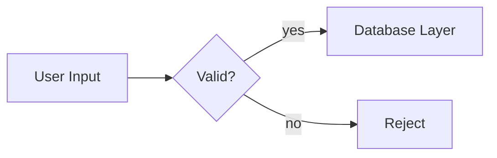

# CLAUDE.md

Guidance for Claude Code when working in this repository.

## Documentation Style

All generated documentation (README, code comments, design notes, PR descriptions) must follow these rules:

| Rule | Requirement |
|---|---|
| Tone | Technical, factual, neutral |
| Length | Short — no filler, no repetition |
| Structure | Lists and tables over paragraphs |
| Diagrams | Mermaid for flows, architecture, state |
| Voice | Imperative / present tense, no marketing language |

### Do

- Use bullet points and tables for facts, options, comparisons
- Use mermaid diagrams (`flowchart`, `sequenceDiagram`, `classDiagram`, `stateDiagram`) to show flow, structure, or relationships
- Keep sentences short and direct
- Use headings to segment content, not transition sentences
- State the "what" and "why" in a line, not a paragraph

### Avoid

- Prose paragraphs where a list or table works
- Filler phrases ("it's worth noting that", "in order to", "this allows us to")
- Adjectives that don't carry technical meaning ("powerful", "seamless", "robust")
- Restating the obvious from the code
- Multi-paragraph explanations for single concepts

### Example

**Avoid:**

> This function is responsible for handling the process of validating user input before it gets passed along to the database layer, which helps ensure that only clean data is persisted.

**Prefer:**

- Validates user input before it reaches the database layer
- Rejects malformed input; does not sanitize

