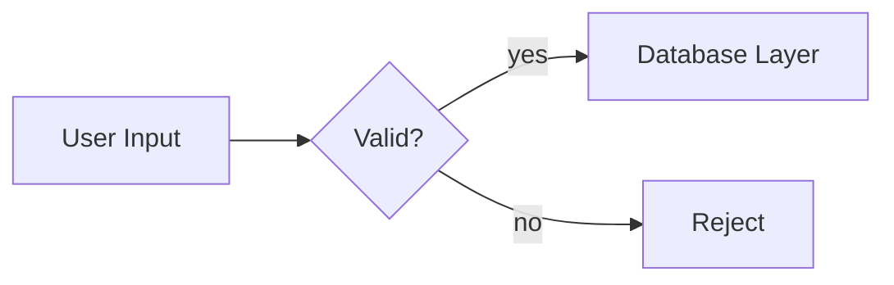
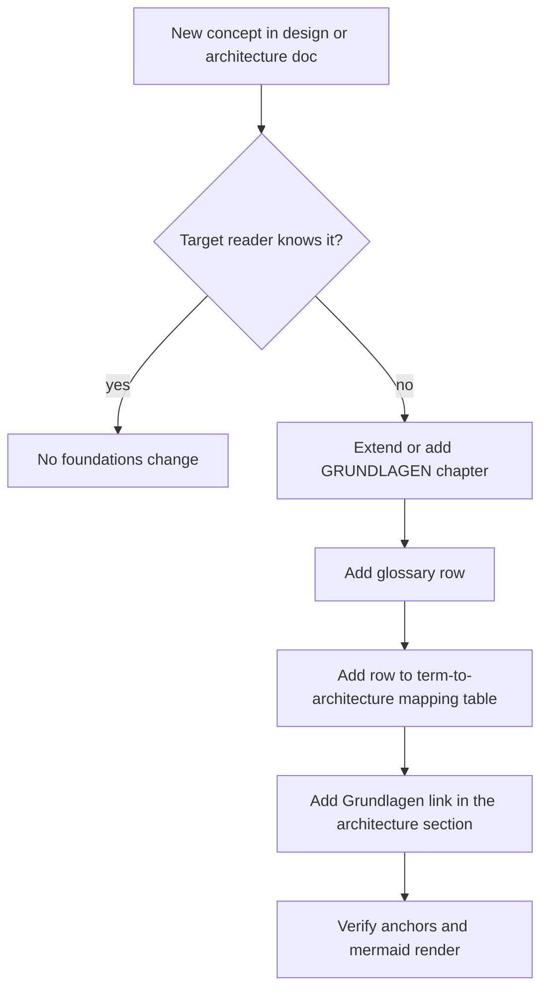

# CLAUDE.md

Guidance for Claude Code when working in this repository.

## Documentation Style

All generated documentation (README, code comments, design notes, PR descriptions) must follow these rules:

| Rule | Requirement |
|---|---|
| Tone | Technical, factual, neutral |
| Length | Short — no filler, no repetition |
| Structure | Lists and tables over paragraphs |
| Diagrams | Mermaid for flows, architecture, state |
| Voice | Imperative / present tense, no marketing language |

### Do

- Use bullet points and tables for facts, options, comparisons
- Use mermaid diagrams (`flowchart`, `sequenceDiagram`, `classDiagram`, `stateDiagram`) to show flow, structure, or relationships
- Keep sentences short and direct
- Use headings to segment content, not transition sentences
- State the "what" and "why" in a line, not a paragraph

### Avoid

- Prose paragraphs where a list or table works
- Filler phrases ("it's worth noting that", "in order to", "this allows us to")
- Adjectives that don't carry technical meaning ("powerful", "seamless", "robust")
- Restating the obvious from the code
- Multi-paragraph explanations for single concepts

### Example

**Avoid:**

> This function is responsible for handling the process of validating user input before it gets passed along to the database layer, which helps ensure that only clean data is persisted.

**Prefer:**

- Validates user input before it reaches the database layer
- Rejects malformed input; does not sanitize

## Documentation Set

| File | Content | Language |
|---|---|---|
| `docs/GAME_DESIGN.md` | Gameplay rules, entities, loops, balance | English |
| `docs/ARCHITECTURE.md` | Technical architecture, frameworks, scaling, cost | English |
| `docs/GRUNDLAGEN.md` | Foundations for developers without geodata / game-server background | **German** |

Target reader of `GRUNDLAGEN.md`: a developer with a business-application background (web, backend, enterprise) and no knowledge of maps, geodata, tiles, spatial indexes, streaming, or authoritative game servers.

## Rule: Extend the Foundations With Every Change

**Every change to `GAME_DESIGN.md` or `ARCHITECTURE.md` that introduces a concept the target reader does not already know must extend `docs/GRUNDLAGEN.md` in the same commit.**

Trigger test — a new term needs a foundations entry if **any** applies:

| Test | Example |
|---|---|
| Domain-specific to geodata, maps, or geometry | Footprint, Web Mercator, visibility polygon |
| Domain-specific to game servers or netcode | Tick, sticky targeting, dead reckoning |
| A named technology, format, or library | PMTiles, Valhalla, H3, MemoryPack |
| Familiar word, different meaning here | "Region", "Delta", "Station" |
| A business-app developer would have to look it up | Any of the above |

No entry needed for concepts a business-app developer already has: REST, SQL, index, cache, CDN, queue, sharding, transaction.

### Required Steps

| Step | Location |
|---|---|
| 1 | Extend the matching chapter in `GRUNDLAGEN.md`, or add a new one — keep the chapter pattern: Problem → Analogie → Fakten → Fallstricke → Im Projekt |
| 2 | Add the term to `§ Glossar` |
| 3 | Add a row to `§ Begriff → Stelle in der Architektur` |
| 4 | Add or update the `*Grundlagen: …*` pointer line in the affected `ARCHITECTURE.md` section |
| 5 | Add a source to `§ Weiterführend` if an authoritative reference exists |

### Rules for Foundations Content

- Write in German; keep English technical terms as-is (`Tile`, `Delta`, `Interest Area`) and explain them once.
- Always give the business-application analogy — that is the point of the document.
- Every chapter carries a `Fallstricke` table: what goes wrong in practice.
- State orders of magnitude, not exact benchmarks; mark estimates as such.
- Explain the concept generically first, then its use in this project — no rule duplication from the other two docs, link instead.

### Verification Before Commit

| Check | Command / method |
|---|---|
| Internal anchors resolve | Script over all three docs; GitHub slug rules (punctuation dropped, `&` leaves a double hyphen) |
| Mermaid diagrams render | `npx @mermaid-js/mermaid-cli -i <file> -o <tmp>` |
| No gameplay or architecture rules duplicated into the foundations | Manual review — foundations explain, they do not decide |
