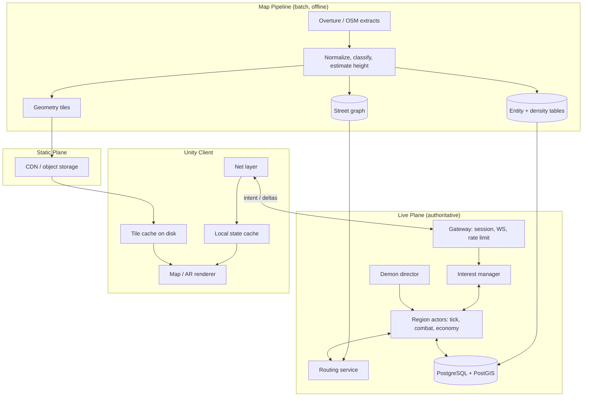
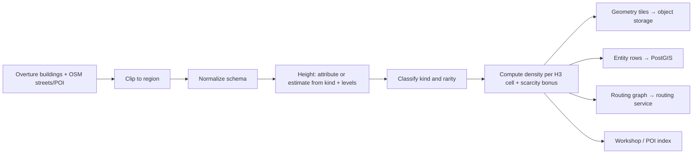
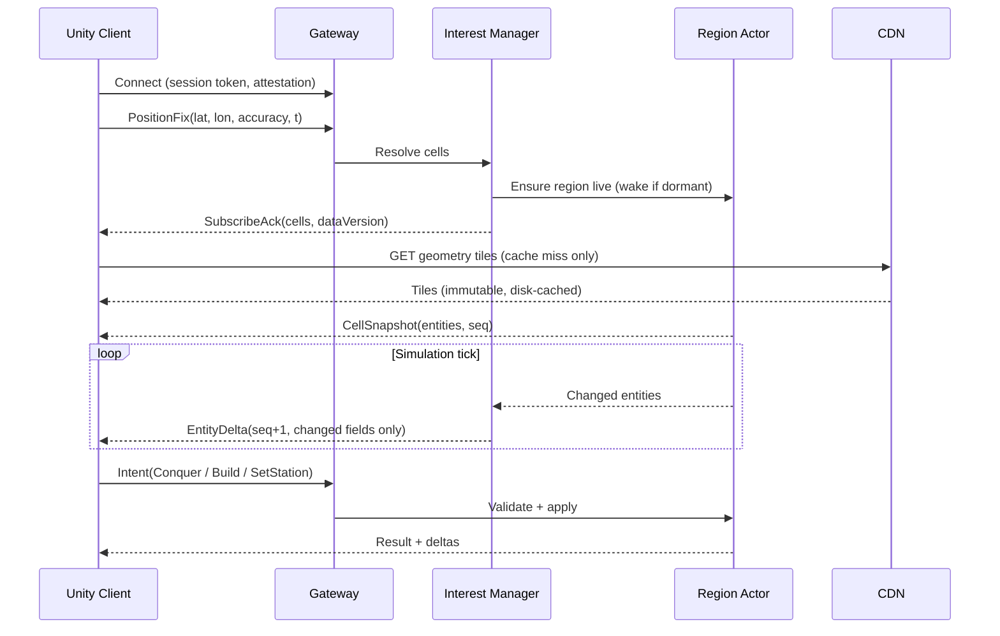
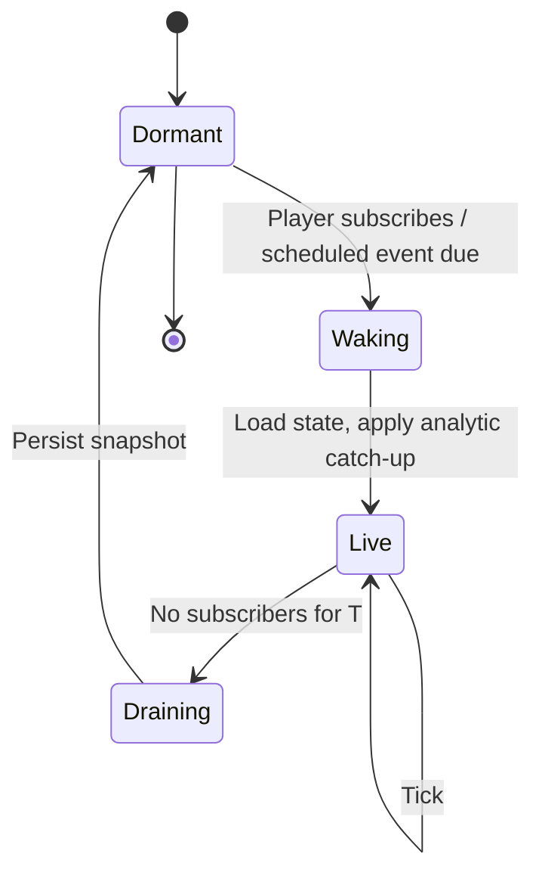

# Hellgate World — Technical Architecture

System architecture for the game described in [GAME_DESIGN.md](GAME_DESIGN.md). Covers client/server split, map data streaming, scaling, framework choices, and cost.

Scope: high-level structure and technology decisions. Not per-loop mechanics, not API schemas.

> Pricing figures: checked 2026-09. Verify before committing — vendor terms change.

## Constraints

| # | Constraint | Consequence |
|---|---|---|
| C1 | World-scale map data | Client streams interest area only; never holds global state |
| C2 | Cheat resistance | Server authoritative for all simulation; client renders and sends intent |
| C3 | Private project, unknown player count | Cost floor must be near zero; cost scales with active players, not world size |
| C4 | Solo/small team | Prefer one language, one deployable, managed-free-tier services over ops surface |
| C5 | Mobile client (Unity, AR) | Battery, intermittent network, background/foreground churn, GPS jitter |
| C6 | Asynchronous persistent world | World advances while players are offline — without ticking the whole planet |

C3 and C6 together are the dominant forces: **the world is planet-sized, the simulation is not.** Only regions with recent player presence are live.

## Decisions

| Area | Decision | Driver |
|---|---|---|
| Client engine | Unity 6 LTS + AR Foundation | Given |
| Map rendering | Custom tile renderer over own geometry tiles | C1, C2, C3 — see [Map Component Evaluation](#map-component-evaluation) |
| Map data source | Overture Maps (buildings) + OSM (streets, POI) | Open license, global, height attributes, no per-user fee |
| Static delivery | Immutable versioned tiles on object storage + CDN | Flat cost, offline cache, no per-MAU fee |
| Dynamic delivery | WebSocket + binary deltas, H3-cell scoped | C1, C5 |
| Server language | C# / .NET (shared model assembly with Unity) | C4 — one language, shared simulation types |
| Backend framework | Custom service; OSS commodity backend (Nakama) optional for auth/social | C3 — managed game backends have a fixed monthly floor |
| Persistence | PostgreSQL + PostGIS (durable), in-process region state (hot), Redis (presence/pubsub, added at scale) | C3, C4 |
| Spatial index | H3 (simulation + interest), XYZ tiles (static geometry) | Hex neighbourhood, uniform k-ring, stable IDs |
| Deployment | Single container on one small VPS → horizontal shards later | C3 |
| Simulation | Region actors, lazy wake, analytic catch-up for accrual | C3, C6 |

## System Overview



### Two Delivery Planes

Separating static geometry from live state is the core of the streaming design.

| | Static plane | Live plane |
|---|---|---|
| Content | Building footprints, heights, kinds, street rendering data | Ownership, HP, points, units, gates, avatars |
| Transport | HTTPS, CDN-cached | WebSocket, binary deltas |
| Mutability | Immutable per version | Per tick |
| Volume | MB per region, cached on device | Bytes per entity per tick |
| Cost driver | Storage + egress (flat) | CPU + connections (per active player) |
| Server load | None (CDN) | Proportional to active players |
| Offline | Works from disk cache | Unavailable |

Consequence: the planet-sized part of the problem is a **file-serving problem**, not a game-server problem.

## Map Component Evaluation

The game does not need a map — it needs **buildings as simulation entities**. Ownership, HP, and points attach to a specific building the server also knows about. That requirement eliminates most map SDKs: a rendering SDK draws its own geometry from its own IDs, which the server cannot reference or validate.

| Option | 3D buildings | Stable IDs shared with server | Cost model | Maintenance risk | Verdict |
|---|---|---|---|---|---|
| **Mapbox Maps SDK for Unity** | Yes (extruded) | No — Mapbox tile features, not game entities | Per MAU; free tier ~25k MAU, then ~$4/1k MAU | Unity SDK trails the mobile SDKs | Prototype only |
| **ArcGIS Maps SDK for Unity** | Yes (3D scene layers) | Partial (Esri feature IDs) | Credits / ArcGIS Location Platform; pay-as-you-go above free tier | Vendor-tied, enterprise-oriented | No |
| **Cesium for Unity + Google Photorealistic 3D Tiles** | Photogrammetry mesh | No — mesh, not per-building objects | Per root-tile request, enterprise SKU | Low | No — cannot address single buildings |
| **Cesium for Unity + own 3D Tiles** | Yes | Yes (own data) | Self-host storage | Low (Apache-2.0) | Viable alternative to custom renderer |
| **Google Maps gaming SDK** | — | — | — | Discontinued 2021 | Not available |
| **Custom: own tiles + own renderer** | Yes | Yes | Storage + egress only | Own code | **Chosen** |

### Chosen: Custom Tile Pipeline

- Server and client consume the **same** building IDs, derived from Overture GERS / OSM IDs.
- Geometry ships as compact binary tiles (footprint polygon, height, kind, entity ID) — not styled basemap tiles.
- Renderer: extrude footprints in Unity, swap in authored 3D models per building kind/faction. Art style is post-apocalyptic; photoreal basemaps are the wrong look anyway.
- Cost decoupled from player count: object storage + CDN, no per-MAU licensing.
- Cloudflare R2 (zero egress fee) or Backblaze B2 preferred over S3/GCS for the tile bucket.

| Risk | Mitigation |
|---|---|
| Renderer work is ours | Scope is narrow: extruded polygons + LOD + instancing, no labels, no basemap styling |
| Data gaps | Coverage cascade already defined in the design doc (footprints → POI → road nodes) |
| ODbL attribution/share-alike on OSM-derived data | Attribution screen; keep derived map data separable from game state; Overture attribution rules per source |

Fallback for a fast prototype: Mapbox Unity SDK for visuals with a server-owned entity overlay, replaced before public release. Keep the renderer behind an interface from day one.

## Map Data Pipeline

Batch job, offline, versioned. Runs per region on ingest and on data refresh — never in the request path.



| Artifact | Format | Consumer | Refresh | Notes |
|---|---|---|---|---|
| Geometry tiles | Binary, z15 XYZ, gzip/br | Client | Per data version | ~10–100 KB per urban tile |
| Entity table | PostGIS rows | Server | Per data version | ID, centroid, footprint, kind, volume, cell |
| Density / scarcity table | Per H3 r8 cell | Server | With entity table | Feeds `scarcity_bonus`, caps, interest radius |
| Street graph | Routing-engine build (Valhalla / GraphHopper / OSRM) | Routing service | Per data version | Never shipped to client |
| Coverage report | Per cell quality score | Ops | Per data version | Flags unplayable / synthetic-only cells |

- Data versions are immutable; tile URLs carry the version (`/v/{dataVersion}/{z}/{x}/{y}.bin`) so CDN caching is unbounded and clients never see torn data.
- Ingest is regional, on demand: ship the cities you have players in first. Planet ingest is a cost decision, not a prerequisite.

## Streaming & Interest Management

### Spatial Index

| Purpose | Index | Resolution | Rationale |
|---|---|---|---|
| Simulation region (sharding, ticking) | H3 | r8 (~0.74 km², edge ~460 m) | Region actor granularity |
| Subscription cell (interest, deltas) | H3 | r9 (~0.10 km², edge ~174 m) | Fine-grained visibility, cheap k-ring math |
| Static geometry tile | XYZ | z15 (~1.2 km) | CDN-friendly, aligns with mapping tooling |

H3 over geohash: uniform neighbour distance, no rectangle distortion, `kRing` gives the interest set directly.

### Subscription Set

```
subscriptions = kRing(playerCell, k(density))
              ∪ cells(owned buildings, units, active gates)
```

| Environment | k | Cells | Covered area |
|---|---|---|---|
| City core | 1 | 7 | ~0.7 km² |
| Suburb | 2 | 19 | ~2 km² |
| Rural | 3–4 | 37–61 | ~4–6 km² |

- `k` derives from the server-side density table — same normalization rule as gameplay constants, so rural players see a useful radius without a client-side setting.
- Hysteresis: a cell is unsubscribed only after the player has been outside it for N seconds, to stop churn at boundaries.
- Hard cap on total subscribed cells per session; owned-asset cells are prioritized over radius cells.
- Owned-asset subscriptions are **notification-scoped** (state changes, attacks), not full detail, when far from the player.

### Message Flow



### Wire Budget

| Item | Size | Frequency |
|---|---|---|
| Entity delta (position/HP/state) | 16–40 B | Per changed entity per tick |
| Cell snapshot (urban) | 5–15 KB | On cell enter |
| Position fix (up) | ~24 B | 0.2–1 Hz |
| Geometry tile | 10–100 KB | Once per tile per data version |

Steady-state estimate, active combat, ~30 moving entities in view at 2 Hz: **~2 KB/s ≈ 7 MB/h**. Idle play with no combat: under 100 B/s. Mobile-data acceptable.

### Reconnect & Offline

| Case | Handling |
|---|---|
| Short gap (< resume window) | Client sends last `seq` per cell; server replays buffered deltas |
| Long gap | Server drops the delta buffer; sends fresh `CellSnapshot` |
| Background / app resume | Treated as long gap; resubscribe from current GPS |
| Offline events (attack while away) | Event journal per player, delivered on reconnect + push notification |
| Client clock | Ignored; all timestamps are server clock |

The client never reconciles simulation state — it discards and re-snapshots. There is no client-side prediction except avatar position, which is GPS-driven and non-authoritative anyway.

## Backend Architecture

### Components

| Component | Responsibility | State | Scales by |
|---|---|---|---|
| Gateway | TLS, session auth, attestation, rate limits, WS fan-out | Connection state | Connections |
| Interest manager | Cell subscription sets, delta filtering | Per-session cell set | Connections |
| Region actor | Authoritative tick for one H3 r8 region: combat, movement, accrual, conquest | Hot entity state | Active regions |
| Routing service | Street-graph routes for unit movement | Preprocessed graph | Requests, cacheable |
| Demon director | Hellgate spawn weighting by player presence, wave scheduling | Schedules | Active players |
| Economy / inventory | Points, Essence, loot rolls, crafting, gear | Durable | Players |
| Persistence | Write-behind snapshots + journal to PostgreSQL | Durable | World size |

Deployment shape at stage 0: **one process, all components as modules.** The boundaries above are module boundaries, not network boundaries, until load requires splitting. Region actors are the only component that must eventually shard.

### Region Actors

One logical actor per live H3 r8 region. Single-threaded per region → no locks, deterministic ordering, natural sharding unit.



| Region state | Ticking | Cost | What still happens |
|---|---|---|---|
| Live | 2–4 Hz units/combat, 1/60 Hz accrual | CPU per region | Everything |
| Draining | Slow tick | Low | Finish in-flight combat, persist |
| Dormant | None | Storage only | Points accrual computed analytically on wake; scheduled events (gate escalation, unit arrival) held in a timer queue |

This is the mechanism that satisfies C3 and C6: **cost is proportional to live regions, which is proportional to active players** — not to how much of the planet is ingested. Five players with five phones wake at most a handful of regions.

Accrual is closed-form (`points = rate × elapsed`), so dormant buildings need no ticks. Anything not closed-form (combat, unit movement) only occurs where an attacker exists, and an attacker is either a player (present → region live) or a demon wave (scheduled → wakes the region on its timer).

### Sharding

| Stage | Shape |
|---|---|
| Single node | All regions in one process |
| Sharded | Consistent-hash H3 r8 cell → shard; gateway routes by cell; shard map in Redis |
| Cross-shard | Rare: unit or player crossing a region boundary. Handoff = serialize entity, transfer, ack. Buildings never move, so most entities are shard-static |

Gateways are stateless with respect to the world and can scale independently of sim shards.

### Loop → Mechanism Mapping

| Game loop | Architectural mechanism |
|---|---|
| Territory (conquest) | Intent validated against server-side position fix; ownership row in PostGIS; delta to subscribers |
| Points economy | Analytic accrual on region wake + periodic materialization; never ticked per building |
| RTS (units, structures) | Region actor tick + routing service; stations are per-unit anchors, engagement is a radius query inside the region |
| Combat | Deterministic region tick; event-driven when no hostiles present |
| RPG (avatar, gear) | Stateless request/response against economy service; RNG server-side, committed before response |
| Demons (PvE) | Demon director schedules gates weighted by player presence; wakes regions via timer queue |
| AR interaction | Client-side presentation; every consequence is an intent message |

## Transport & Protocol

| Option | Fit | Verdict |
|---|---|---|
| WebSocket over TLS | Works everywhere, proxy/CDN friendly, mobile-tested | **Chosen** |
| WebTransport / QUIC | Lower latency, better on lossy mobile | Later, if measurements justify it |
| Raw UDP | Twitch games | No — combat is auto-resolved at 2–4 Hz, no aiming |
| HTTP polling | Simple | No — delta push is the whole design |

- Encoding: binary, schema-versioned. MemoryPack or protobuf; C# on both ends makes a shared contract assembly trivial.
- Intents are idempotent and carry a client-generated ID for safe retry.
- Rule from the design doc holds at protocol level: **the client has no message type that asserts an outcome.**

## Framework Evaluation (Backend)

| Framework | Persistent world | Geospatial interest mgmt | Self-host cost floor | Unity SDK | Verdict |
|---|---|---|---|---|---|
| **Custom .NET service** | Yes | Build it (H3 + own filter) | One VPS | Shared C# assembly | **Chosen** |
| **Nakama (OSS, Apache-2.0)** | Partial — matches are session-oriented | No | One VPS | Yes | Optional: auth, friends, chat, leaderboards, storage |
| Heroic Cloud (managed Nakama) | As above | No | Provisioned resources, monthly floor | Yes | No — fixed cost conflicts with C3 |
| Photon Fusion / Quantum | No — room/session model | No | Per CCU / per plan | Yes | No |
| Colyseus | Rooms; a cell could be a room | Manual | One VPS | Yes | Possible, but Node + room model fights the region-actor design |
| SpacetimeDB | Yes — DB + logic, subscription queries ≈ interest management | Via SQL subscriptions | Free tier, then energy-based | Yes | Strong conceptual fit; note vendor/maturity risk and per-operation billing |
| Unity Gaming Services / Netcode | Session-based | No | Per-usage | Native | No |

Rationale for custom over a game backend framework:

- The hard parts here — H3 interest scoping, region lifecycle, GPS validation, street routing — are **not** provided by any of them. What frameworks do provide (rooms, matchmaking, relay) this game does not use.
- C# on both sides means simulation types, validation rules, and math are written once and referenced by the Unity client.
- Cost floor is a VPS, not a plan.

Use OSS Nakama alongside the sim only if social/commodity features are wanted before they are worth writing. Keep it optional and behind the gateway.

## Scaling Model

| Dimension | Grows with | Mitigation |
|---|---|---|
| Live regions | Active players, geographic spread | Lazy wake/dormancy; region actors |
| Connections | CCU | Stateless gateways behind a load balancer |
| Entity count per region | Player activity (units, structures) | Per-player and per-building caps (design doc) |
| Static data volume | Ingested area | Regional ingest; CDN; immutable versions |
| Durable writes | Active players | Write-behind batching; hot state in memory |
| Routing requests | Unit orders | Cache routes per (origin cell, target cell); precomputed contraction hierarchies |

| Stage | DAU | Peak CCU | Live regions | Shape |
|---|---|---|---|---|
| 0 — Alpha | 5 | ~3 | ≤ 10 | 1 VPS: app + Postgres + tiles for one city |
| 1 — Closed beta | 100 | ~15 | ~50 | 1 larger VPS, Postgres separated, regional tiles |
| 2 — Soft launch | 1 000 | ~150 | ~400 | 2–3 app nodes, managed Postgres, Redis, planet tiles |
| 3 — Launch | 10 000 | ~1 500 | ~3 000 | Sharded sim, gateway tier, read replicas, routing cluster |

Rule of thumb: a region at 2 Hz with ~200 entities costs well under 1 ms of CPU per tick. A single modern core handles hundreds of live regions; players, not the world, set the bill.

### Load Shedding

| Pressure | Response |
|---|---|
| Delta backlog per session | Drop to coarse updates (state-only, no interpolation data) |
| Region overloaded (mass event) | Lower tick rate for that region; cap concurrent participants |
| Gateway saturation | Reject new connections with retry-after; existing sessions unaffected |
| Routing saturation | Queue with deadline; fall back to straight-line ETA with penalty |

## Cost Model

Principle: **no fixed vendor floors.** Every component is either a VPS we size ourselves, or usage-billed with a real free tier.

### Recurring

| Stage | Compute | Database | Tiles / CDN | Other | Est. €/month |
|---|---|---|---|---|---|
| 0 — 5 players | Hetzner CX22 ~€4.5 | On the same box | R2 free tier (10 GB, no egress fee) | Domain ~€1 | **~€6** |
| 1 — 100 DAU | CX32/CPX21 ~€10 | Same box or Neon/Supabase free–paid | R2 region extracts ~€1 | Sentry/Grafana free tiers | **~€15–25** |
| 2 — 1 000 DAU | 2–3 nodes ~€40 | Managed Postgres ~€25–50 | Planet tiles ~120 GB ≈ €2 | Monitoring ~€0–20 | **~€80–150** |
| 3 — 10 000 DAU | Sharded, ~8 nodes ~€200 | HA Postgres ~€150 | ~€5 | Monitoring, push, ops ~€50 | **~€400–600** |

Marginal cost per active player at stage 2–3: roughly **€0.05–0.15/month**. Hetzner-class hosting includes generous traffic; R2 charges no egress — so the two metrics that usually explode (bandwidth, map API calls) are flat here.

### One-Off / Annual

| Item | Cost |
|---|---|
| Unity Personal | €0 (free under $200k revenue/funding; Runtime Fee cancelled) |
| Apple Developer Program | $99/year |
| Google Play Developer | $25 once |
| Map data (Overture/OSM) | €0 + attribution obligations |

### Cost Traps to Avoid

| Trap | Impact | Avoided by |
|---|---|---|
| Per-MAU map SDK (Mapbox and similar) | Cost scales with players forever | Own tiles on object storage |
| Photorealistic 3D Tiles (per root-tile request) | Enterprise SKU, request-billed | Own geometry, stylized art |
| Managed game backend plans (e.g. Heroic Cloud, Satori from ~$600/mo) | Four-figure floor at 5 players | OSS or custom on a VPS |
| Hyperscaler egress ($0.08–0.12/GB) | Scales with tile downloads | R2 / B2 / VPS-included traffic |
| Always-on managed Kubernetes / service mesh | Fixed monthly + ops time | Single container; orchestration only at stage 3 |
| Ticking the whole world | CPU proportional to ingested area | Lazy regions |
| Per-seat editor licences | Not applicable at this revenue | Unity Personal |

## Anti-Cheat

Moved from the design doc; unchanged in substance.

| Vector | Mitigation |
|---|---|
| GPS spoofing | Server-side plausibility: speed between fixes, jump detection, accuracy floor, platform attestation (Play Integrity API, App Attest) |
| Drive-by farming | Speed lock: avatar cannot attack above sustained 30 km/h, derived server-side from the fix sequence |
| Forged placement | Conquest and construct placement checked against the server's own last accepted fix |
| Factory placement abuse | Free-space test run server-side against building footprints |
| Forged orders | Server validates ownership, proximity, and point balance on every order |
| Client-computed paths | Client cannot submit paths; routing is server-only |
| Injected combat results | Combat resolved on the server tick; client-asserted results are rejected by protocol design |
| State scraping | Interest scoping limits visibility; subscription caps and rate limits per session |
| Replay / speed hacks | Server clock authoritative for accrual, build times, movement |
| Loot RNG manipulation | All drop and craft rolls executed server-side |
| Reroll scumming | Roll committed before the client is told the outcome; disconnect does not undo it |
| Automation / botting | Movement-pattern anomaly detection on the fix stream; per-account rate limits |

## Operations

| Concern | Stage 0–1 | Stage 2+ |
|---|---|---|
| Deploy | `docker compose` on one host, image from CI | Rolling deploy, multiple nodes |
| Config | Env vars + server-side game constants table | Same, with hot reload |
| Logs | Structured JSON to disk | Shipped to a log service (free tier first) |
| Metrics | Prometheus + Grafana on box | Grafana Cloud / self-hosted stack |
| Errors | Sentry free tier | Paid tier |
| Backups | `pg_dump` to object storage, nightly | Managed PITR |
| Map data refresh | Manual pipeline run | Scheduled, with coverage diff report |

## Build Phases

| Phase | Deliverable | Stack added |
|---|---|---|
| P0 | Map pipeline for one city; tiles render in Unity; GPS avatar | Pipeline, tile format, renderer |
| P1 | Conquest + points, server-authoritative, one region | Gateway, region actor, Postgres |
| P2 | Interest streaming across cells; multiple players | Interest manager, deltas, reconnect |
| P3 | RTS: units, routing, stations, combat tick | Routing service, combat |
| P4 | Demons, hellgates, Essence, gear | Demon director, economy service |
| P5 | Scale-out: shards, gateways, monitoring | Redis shard map, multi-node |

## Risks

| Risk | Impact | Mitigation |
|---|---|---|
| Custom renderer underestimated | Schedule | Narrow scope (extrusion + instancing); SDK fallback behind an interface |
| Map data quality per region | Playability | Coverage cascade + per-cell quality score; gate region launch on the score |
| ODbL share-alike interpretation | Legal | Keep derived map data as a separable produced work; attribution screen; avoid mixing game state into distributed map data |
| Region actor hot spots (mass events) | Latency | Per-region tick throttling, participant caps |
| GPS accuracy vs. fixed conquest radius | Frustration | Accuracy-aware validation, snap tolerance, server-side smoothing |
| Vendor free tiers change | Cost | No component depends on a single vendor's free tier; tiles and DB are portable |
| Single-node failure at stage 0–1 | Downtime | Nightly backups, infrastructure as code, accepted for a private alpha |

## Open Technical Questions

- Tile format: custom binary vs. glTF vs. 3D Tiles; LOD strategy for dense cores.
- Interest cell resolution: confirm r9 against real subscription sizes in a dense core.
- Region resolution: r8 vs. r7 — trade-off between actor count and cross-boundary handoffs.
- Delta encoding: field-mask deltas vs. full-entity snapshots per changed entity.
- Routing engine: Valhalla vs. GraphHopper vs. OSRM; memory footprint per ingested region.
- Wake latency budget: acceptable delay when a dormant region is first subscribed.
- Timer queue durability: in-process vs. Postgres-backed scheduled events.
- Persistence cadence: write-behind interval vs. acceptable loss window on crash.
- Redis introduction point: which stage actually needs it.
- Shard map and handoff protocol details; behaviour under shard restart.
- Push notifications for offline events: provider, batching, opt-in rules.
- Data refresh: how ownership survives a building disappearing or changing ID between data versions.
- Whether to adopt SpacetimeDB for the live plane instead of a custom actor layer.
- Attestation strictness vs. player friction (rooted devices, emulators, sideloads).
