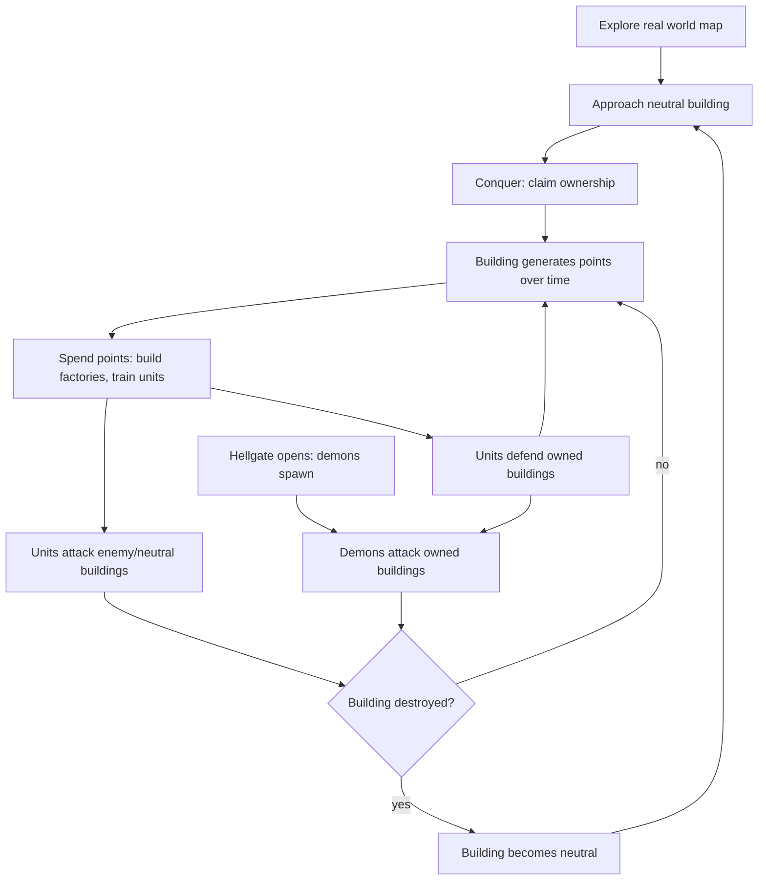
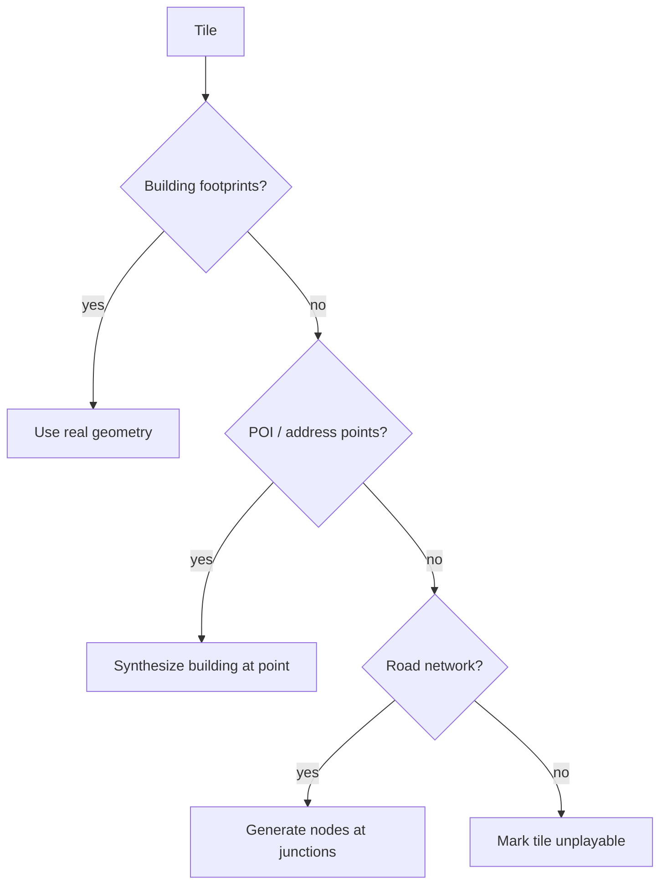
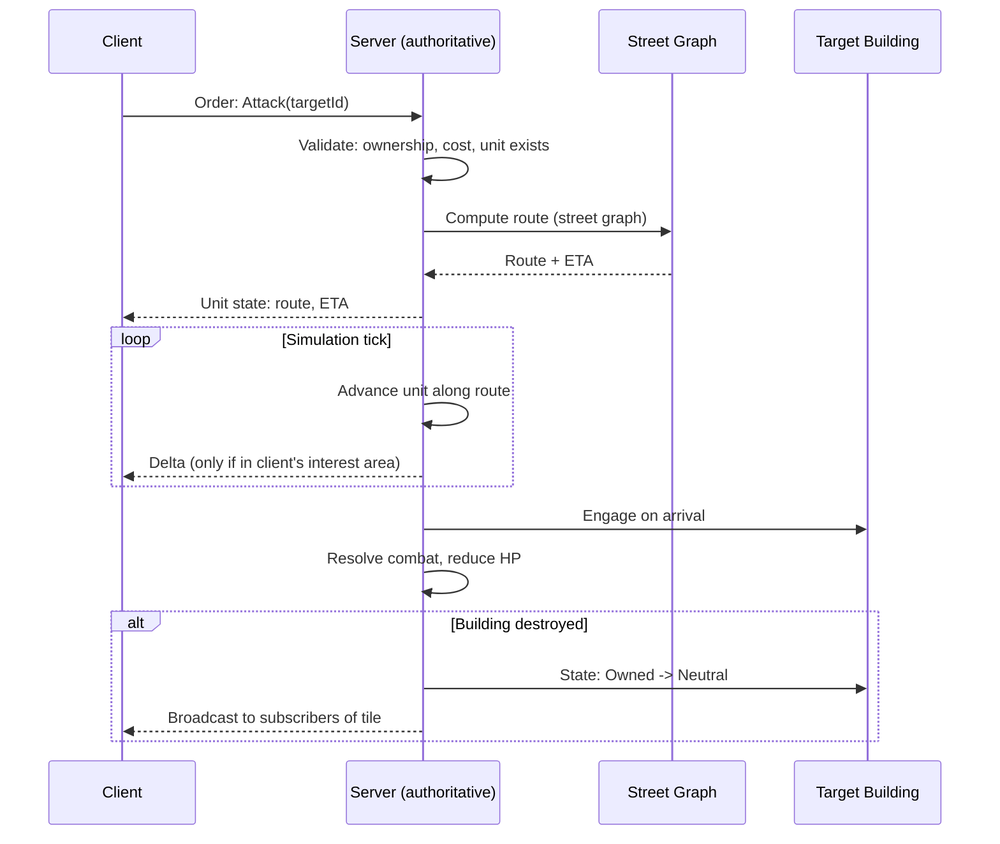
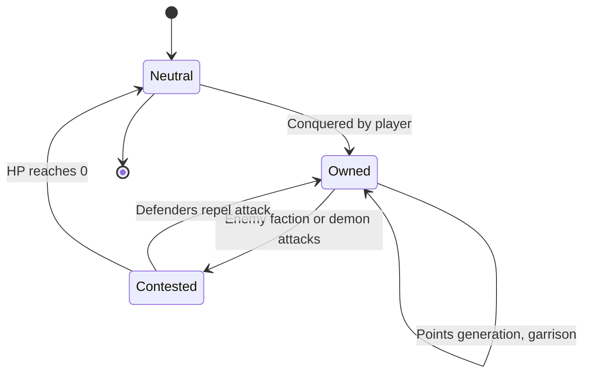
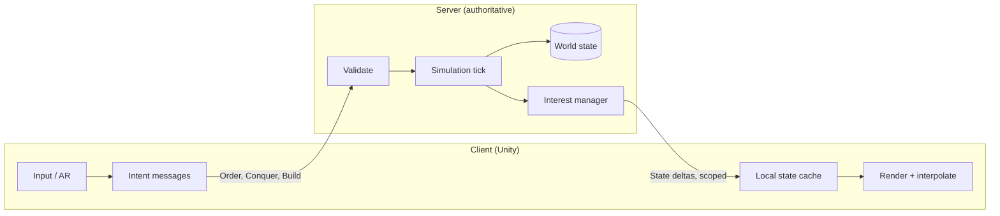
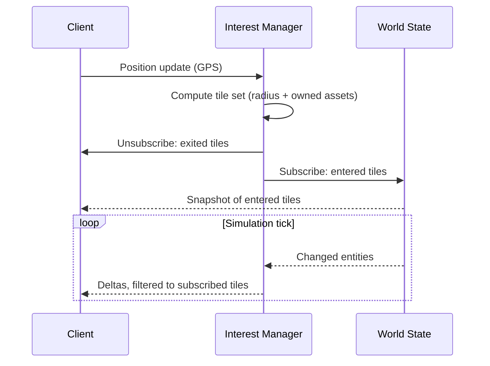
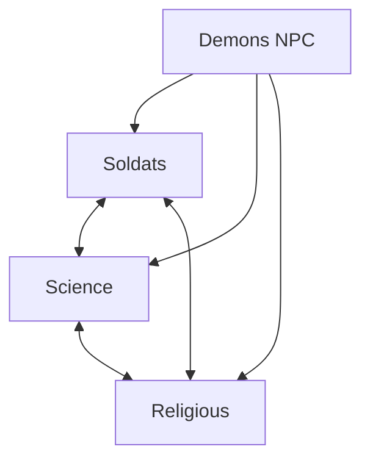
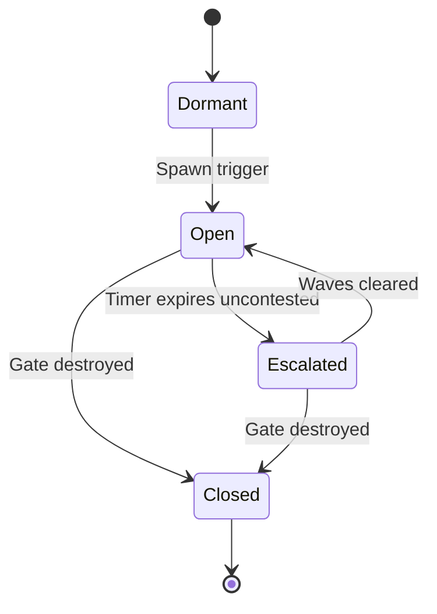

# Hellgate World — Game Design Document

Post-apocalyptic AR mobile territory-conquest game. Unity. Pokémon GO-style world map + RTS base-building loop.

## Setting

- Tone: post-apocalypse. Hellgates have opened across the real world; demons pour through.
- Reference point: *Hellgate: London* (demon invasion of a real city), scaled to the whole inhabited world.
- Three human factions fight each other **and** the demon incursion over the ruins of real places.
- Names, lore, and visual style: **defined later**. Faction labels below are working names.

## Overview

| Property | Value |
|---|---|
| Platform | Mobile (iOS / Android) |
| Engine | Unity, AR Foundation |
| Genre | AR location-based + RTS |
| Theme | Post-apocalyptic demon invasion |
| Session type | Persistent world, asynchronous multiplayer |
| Authority | Server-authoritative simulation; client is renderer + intent |
| Data model | Interest-scoped streaming (client never holds global state) |
| Coverage | Anywhere people live: city, suburb, village, rural |
| Factions | 3 playable + 1 NPC (demons) |
| Core loop | Conquer → Generate points → Build army → Attack/Defend |

## Core Loop



## World & Map

- Real-world map data drives building placement (OSM or equivalent building footprints).
- Where footprints are missing, targets are synthesized from POI or road data (see Coverage & Density).
- Buildings rendered as 3D models on the map, positioned at real GPS coordinates.
- Avatar position = user's live GPS location.
- AR view: camera overlay shows buildings/units when user is physically near them.
- Map view: top-down/3D map for macro strategy, out of AR range.

## Coverage & Density

Target: playable anywhere people live — dense city, suburb, village, rural. Play quality must not depend on where the player lives.

| Environment | Targets in walking range | Risk |
|---|---|---|
| City core | Hundreds | Visual clutter, trivial conquest, streaming load |
| Suburb | Tens | Baseline case |
| Village / rural | Few | Loop stalls, nothing to conquer |
| Uninhabited (ocean, desert, forest) | None | Out of scope — no play expected |

### Density Normalization

Server computes local density per tile; game constants derive from it. Constants are **server-side**, so the client cannot tamper with them.

**Conquest radius is fixed and global.** It does not scale with density — the player must physically stand near a building everywhere, city or countryside. Normalization happens through income and content, not reach.

```
density(tile)   = buildings(tile) / area(tile)
scarcity_bonus  = clamp((d_ref / density)^a, 1.0, bonus_max)
points/tick     = base_rate(kind) × volume_multiplier × scarcity_bonus
```

| Parameter | Dense area | Sparse area | Scales with density? |
|---|---|---|---|
| Conquest radius | Fixed | Fixed | **No** |
| Point rate | Baseline | Scarcity bonus | Yes |
| Ownable buildings per player | Lower cap | Higher cap | Yes |
| Unit travel speed | Real-scale | Boosted (longer street distances) | Yes |
| Interest radius (streaming) | Small | Large | Yes |
| Hellgate spawn rate | Baseline | Baseline (player-driven) | No — see Demons |

Balance target: comparable points-per-session regardless of location. A rural player reaches fewer buildings; income per building and demon events compensate, not a wider reach.

### Data Coverage Fallback

Map data quality varies by country and region. Cascade per tile until a conquerable target exists.



| Source | Provides | Used when |
|---|---|---|
| Building footprints (OSM) | Geometry, volume, kind | Preferred |
| POI / address points | Position, kind; synthetic volume | No footprints |
| Road network nodes | Position only; generic kind | No POI data |
| None | — | Uninhabited; no play |

- Missing height → estimate from kind + regional defaults (level-count heuristic).
- Missing kind → classify from tags / POI category; default to House.
- Synthetic targets are marked as such server-side; they may carry reduced value to discourage farming low-quality regions.

### Regional Play

- Faction balance evaluated **per region**, not globally — a rural region must not be permanently locked by whichever faction arrived first.
- Sparse regions: longer unit travel, proportionally cheaper units, so the RTS loop stays reachable for a solo player.
- Low-population regions have few or no nearby human opponents; **demons (Faction 4) supply the pressure** so the loop runs solo.

## Building Ownership

### Conquest Rules

| Condition | Requirement |
|---|---|
| Proximity | User within conquest radius — **fixed global value**, identical everywhere |
| Target state | Neutral only (not owned by another faction) |
| Action | Player-initiated conquer action, may include a timer/minigame |

### Points Generation

```
points/tick = base_rate(building_kind) × volume_multiplier(building) × scarcity_bonus(tile)
```

| Building kind | Rarity | Relative point rate |
|---|---|---|
| House | Common | 1x |
| Shop | Common | 1.5x |
| School | Uncommon | 2x |
| Hospital | Rare | 4x |
| Landmark | Very rare | 8x |

- Volume multiplier scales with building footprint × estimated height (from map data).
- Points accrue while building is owned, paid out per tick (e.g. every 60s) or on collection.
- `scarcity_bonus` normalizes rural income against city income (see Coverage & Density).

## RTS Sub-Loop

Unlocked by accumulated points. Applies per-building, anchored to that building's real-world location.

### Structures

| Structure | Function | Unlock cost |
|---|---|---|
| Factory | Produces units | Points threshold |
| Wall/Turret (optional) | Passive defense | Points threshold |

### Units

- Trained at factories, cost points per unit.
- Unit types differ by faction (see Factions).
- Two orders: **Defend** (garrison owned building) or **Attack** (move to target building).

### Pathfinding

- Units move along real street routes (road graph from map data).
- Attack orders compute shortest/fastest path via street network to target building.
- Travel time is real-time or scaled; affects tactical timing (reinforcement races).
- **Server-side only.** Client sends intent (`Attack(targetId)`), never a path. See [Architecture](#architecture).



## Combat

- Units vs. units: engage when paths intersect or on arrival at contested building.
- Units vs. building: reduce building HP; building has defenders (garrisoned units) as first line.
- Building destroyed (HP = 0) → ownership reset to **Neutral**, open to reconquest by any faction.
- Destroyed ≠ deleted: building persists, conquerable again.
- Demon units use the same combat and pathfinding rules, server-driven, with no owning player.

## Building State Machine



## Architecture

World-scale persistent simulation. Two hard constraints drive the design:

| Constraint | Consequence |
|---|---|
| World-scale data volume | Client streams only its interest area, never the global state |
| Cheat resistance | Server is authoritative for all simulation; client renders and sends intent |

### Authority Split

| Concern | Owner | Notes |
|---|---|---|
| Ownership / conquest | Server | Validates GPS proximity server-side |
| Points generation | Server | Accrual computed from server clock, not client |
| Unit spawning / cost | Server | Rejects orders exceeding point balance |
| Pathfinding | Server | Street-graph routing; client never submits paths |
| Unit movement | Server | Tick-advanced; client interpolates between deltas |
| Combat resolution | Server | Deterministic, server clock |
| Rendering / AR / input | Client | Presentation and intent only |

Rule: **client sends intent, server sends state.** Any client message asserting an outcome is rejected.



### Spatial Streaming

- World partitioned into a fixed spatial grid (tiles / geohash / H3 cells).
- Client subscribes to tiles covering its **interest area**: current GPS position + radius, plus tiles containing its own assets.
- Server pushes deltas only for subscribed tiles. Unsubscribed world state is never sent.
- Subscription updates on movement: enter/leave tiles as the player moves.

| Layer | Streamed | Source |
|---|---|---|
| Building geometry (3D) | On tile enter, cached locally | Static map data, CDN |
| Street graph | Server-side only | Not shipped to client |
| Ownership / HP / points | Delta per tick | Live, server |
| Units in interest area | Delta per tick | Live, server |
| Units outside interest area | Not sent | — |



### Anti-Cheat

| Vector | Mitigation |
|---|---|
| GPS spoofing | Server-side plausibility: speed between fixes, jump detection, platform attestation |
| Forged orders | Server validates ownership, proximity, and point balance on every order |
| Client-computed paths | Client cannot submit paths; routing is server-only |
| Injected combat results | Combat resolved on server tick; client results ignored |
| State scraping | Interest scoping limits visibility to the player's own area |
| Replay / speed hacks | Server clock authoritative for accrual, build times, movement |

## Factions

Four factions: three playable, one server-controlled. Working names — final names, lore, and visual style **defined later**.

| # | Working name | Type | Concept direction |
|---|---|---|---|
| 1 | Soldats | Playable | Military remnant; conventional force |
| 2 | Science | Playable | Tech / research survivors |
| 3 | Religious | Playable | Faith order; anti-demon zealots |
| 4 | Demons | **NPC / PvE** | Hell incursion; server-controlled |

- Player picks one of the three playable factions on onboarding; permanent or season-locked (TBD).
- Faction determines unit roster, visual theme, factory models.
- Asymmetric balance target: no faction strictly dominant across all building kinds or region densities.
- Demons are never playable and never hold territory.



## Faction 4: Demons (PvE)

Server-controlled threat. Hostile to all three playable factions equally. Primary purpose: guarantee content everywhere, including regions with no nearby human opponents.

| Property | Value |
|---|---|
| Control | Server AI; never playable |
| Spawn source | Hellgates opening at semi-random real-world positions |
| Targets | Any owned building (any faction), player units, gate surroundings |
| Territory | **None.** Demons destroy buildings only; never occupy or own them |
| Reward | Points / loot for killing demons and closing gates |

### Hellgates

- Spawn semi-randomly, weighted by **player presence**, not building density — every active player gets reachable events regardless of where they live.
- Emit demon waves on a timer until closed.
- Closed by destroying the gate: player units, on-site AR action, or both.
- Unclosed gates escalate: larger waves, wider threat radius, higher reward.
- Rare high-tier gates act as regional events, drawing multiple players and factions.
- No shared objective, shared reward, or truce mechanic: players remain hostile to rival factions at a gate.



### Design Effects

| Effect | Consequence |
|---|---|
| Density-independent content | Rural players always have something to fight |
| Incidental convergence | Factions may meet at a gate; cooperation is emergent, never mechanical |
| Territory churn | Demon-destroyed buildings return to Neutral, reopening conquest |
| Defense value | Makes garrisoning owned buildings useful even with no human threat nearby |

**Rules, decided:**

- Demons never occupy buildings. Destruction only → building reverts to Neutral and is reconquerable by any player faction.
- Faction cooperation at gates is **incidental only**. No alliance system, no shared credit, no suspended PvP.

## Open Questions

### Gameplay

- Points payout: passive tick vs. manual collection visit.
- Unit cap per building / per player.
- Fixed conquest radius value.
- Density normalization constants: `d_ref`, `a`, `bonus_max`.
- Whether synthetic (non-footprint) targets carry reduced value, and by how much.
- Faction names, lore, visual style, unit rosters (deferred by decision).
- Hellgate spawn weighting, cadence, escalation curve, and reward scale.

### Technical

- Spatial index choice: geohash vs. H3 vs. fixed grid; tile size vs. interest radius.
- Simulation tick rate, and whether distant regions tick lazily (on-demand catch-up) vs. continuously.
- Transport: WebSocket vs. QUIC; delta encoding format.
- Building data source and licensing (OSM buildings, height estimation).
- Street graph storage and routing engine (prebuilt contraction hierarchies vs. on-demand A*).
- Offline/reconnect behavior: state reconciliation after client gap.
- Server sharding strategy by geography, and cross-shard unit movement.
- Density recomputation cadence: static precompute vs. periodic refresh as map data updates.
- Global map-data ingestion pipeline: coverage auditing, per-region quality scoring.
