# Hellgate World — Game Design Document

Post-apocalyptic AR mobile territory-conquest game. Unity. Pokémon GO-style world map + RTS base-building loop.

## Setting

- Tone: post-apocalypse. Hellgates have opened across the real world; demons pour through.
- Reference point: *Hellgate: London* (demon invasion of a real city), scaled to the whole inhabited world.
- Three human factions fight each other **and** the demon incursion over the ruins of real places.
- Names, lore, and visual style: **defined later**. Faction labels below are working names.

## Overview

| Property | Value |
|---|---|
| Platform | Mobile (iOS / Android) |
| Engine | Unity, AR Foundation |
| Genre | AR location-based + RTS |
| Theme | Post-apocalyptic demon invasion |
| Session type | Persistent world, asynchronous multiplayer |
| Authority | Server-authoritative simulation; client is renderer + intent |
| Data model | Interest-scoped streaming (client never holds global state) |
| Coverage | Anywhere people live: city, suburb, village, rural |
| Factions | 3 playable + 1 NPC (demons) |
| Loops | 3: Territory (AR) + RTS + RPG |
| Currencies | 2, non-convertible: Points (territory), Essence (demons) |
| Combat | Auto-attack, tower-defense style; no twitch input |
| Goal | Occupy and hold territory |

## Core Loop

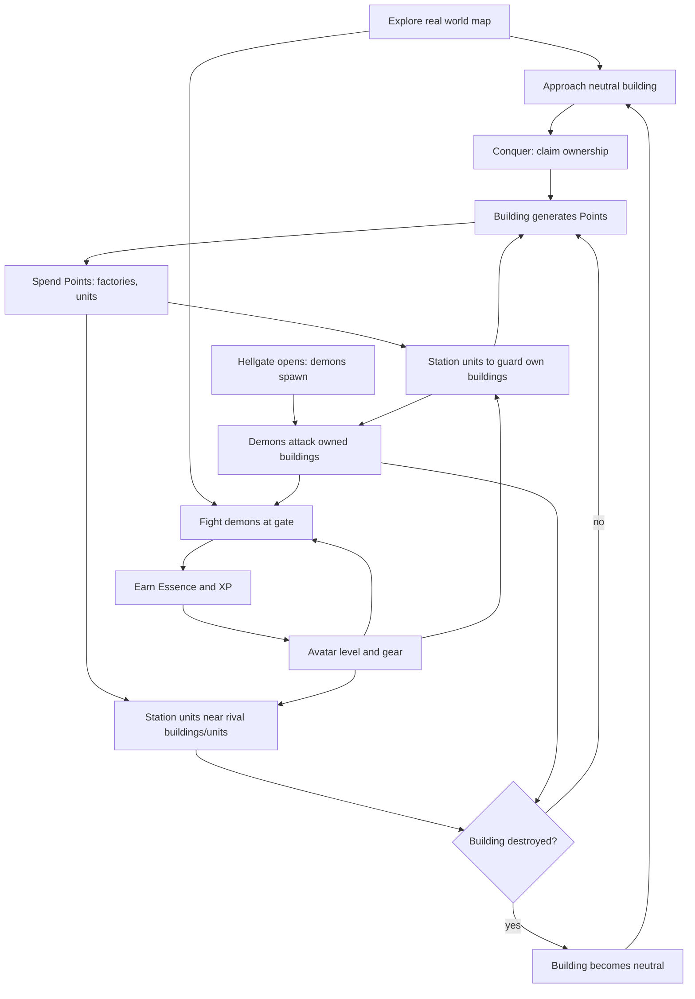

## Entities

Four object types. Everything else in the design is built from these.

| Entity | What it is | Placed / created | Location constraint | Cost | Mobile |
|---|---|---|---|---|---|
| **Building** | A real-world building, conquered by a player | Conquered, not placed | Exists in the real world | — | No |
| **Factory** | Player-placed construct that produces units | Placed by player | **Free space only** | Points | No |
| **Tower** | Player-placed construct, defensive | Placed by player | **On an owned building only** | Points | No |
| **Unit** | Produced fighter, player-directed | Produced at a factory | Spawns at factory, then moves | Points | **Yes** |
| **Workshop** | Neutral crafting site | Not placed — derived from real-world POIs | Fixed at its POI | — | No |

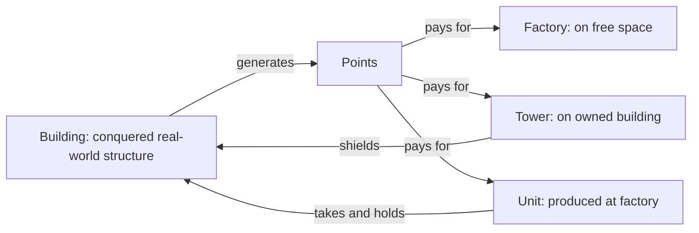

- Factory and Tower are complementary: **factories never sit on buildings, towers only ever do.**
- Buildings are found, not built. Factories and towers are built, not found.
- Units are the only mobile entity a player owns besides the avatar.
- Workshops are **never owned by anyone** — see World Sites.

### World Sites

Neutral locations nobody owns. They exist to pull players out into the real world.

| Site | Anchored to | Lifetime | Ownable | Purpose |
|---|---|---|---|---|
| **Workshop** | A real-world POI | Permanent | **No** | Armor crafting |
| **Hellgate** | A spawned position | Temporary, until closed | **No** | Demon source, Essence |

- Both require the player to **physically travel there**. Neither can be used remotely.
- Both are open to all three factions — shared, never claimed.
- This is the design's main real-world-interaction driver: the RPG loop cannot be played from the couch.

### Presence Rules

Physical presence is required to **place** and to **take**, never to **command**.

| Action | Physical presence required |
|---|---|
| Conquer a building | **Yes** |
| Place a factory | **Yes** |
| Place a tower | **Yes** |
| Craft at a workshop | **Yes** |
| Fight at a hellgate | **Yes** |
| Give orders to units | **No** — fully remote |

- Rationale: the map is claimed on foot, but an army is directed from anywhere.
- Consequence: territory expansion is gated by real travel; tactical response is not. A player under attack can redirect units immediately, from anywhere.

## Game Loops & Currencies

Three loops, two currencies. No loop is self-sufficient; each feeds the others.

| # | Loop | Activity | Currency earned | Serves |
|---|---|---|---|---|
| 1 | Territory (AR) | Walk to buildings, conquer them | Points | Income base |
| 2 | RTS | Build factories, train units, take and hold ground | — (spends Points) | Occupation goal |
| 3 | RPG | Slay demons, close hellgates | Essence + XP | Avatar power |

### Currencies

| Currency | Working name | Source | Spent on |
|---|---|---|---|
| Territory | **Points** | Owned buildings, per tick | Factories, units, defenses |
| Demon | **Essence** | Demon kills, gate closures | Avatar levels, gear, crafting |

**Rule: no conversion between currencies.** Points cannot buy gear; Essence cannot buy units. Each loop must be played for its own reward — this is what keeps all three active.

### Synergy

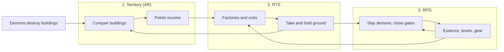

| From | To | Link |
|---|---|---|
| Territory | RTS | Points fund factories, units, defenses |
| RTS | Territory | Units take and hold buildings |
| RTS | RPG | Units escort the avatar and absorb waves at high-tier gates |
| RPG | RPG | Better gear makes higher-tier gates survivable → more Essence |
| RPG | RTS | Avatar level unlocks unit/structure tiers; avatar fights alongside units |
| Demons | Territory | Destroyed buildings revert to Neutral → new conquest targets |

Design rule: **territory is the win condition; the RPG loop is the personal power that makes holding it possible.**

## World & Map

- Real-world map data drives building placement (OSM or equivalent building footprints).
- Where footprints are missing, targets are synthesized from POI or road data (see Coverage & Density).
- Buildings rendered as 3D models on the map, positioned at real GPS coordinates.
- Avatar position = user's live GPS location.
- AR view: camera overlay shows buildings/units when user is physically near them.
- Map view: top-down/3D map for macro strategy, out of AR range.

## Coverage & Density

Target: playable anywhere people live — dense city, suburb, village, rural. Play quality must not depend on where the player lives.

| Environment | Targets in walking range | Risk |
|---|---|---|
| City core | Hundreds | Visual clutter, trivial conquest, streaming load |
| Suburb | Tens | Baseline case |
| Village / rural | Few | Loop stalls, nothing to conquer |
| Uninhabited (ocean, desert, forest) | None | Out of scope — no play expected |

### Density Normalization

Server computes local density per tile; game constants derive from it. Constants are **server-side**, so the client cannot tamper with them.

**Conquest radius is fixed and global.** It does not scale with density — the player must physically stand near a building everywhere, city or countryside. Normalization happens through income and content, not reach.

```
density(tile)   = buildings(tile) / area(tile)
scarcity_bonus  = clamp((d_ref / density)^a, 1.0, bonus_max)
points/tick     = base_rate(kind) × volume_multiplier × scarcity_bonus
```

| Parameter | Dense area | Sparse area | Scales with density? |
|---|---|---|---|
| Conquest radius | Fixed | Fixed | **No** |
| Point rate | Baseline | Scarcity bonus | Yes |
| Ownable buildings per player | Lower cap | Higher cap | Yes |
| Unit travel speed | Real-scale | Boosted (longer street distances) | Yes |
| Interest radius (streaming) | Small | Large | Yes |
| Hellgate spawn rate | Baseline | Baseline (player-driven) | No — see Demons |

Balance target: comparable points-per-session regardless of location. A rural player reaches fewer buildings; income per building and demon events compensate, not a wider reach.

### Data Coverage Fallback

Map data quality varies by country and region. Cascade per tile until a conquerable target exists.

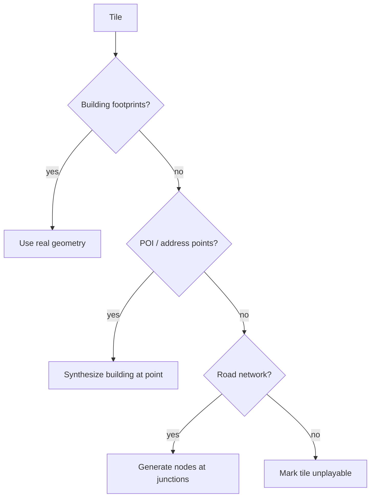

Workshops draw on the same POI data, so workshop availability varies by region too. Sparse regions need a fallback so the crafting half of the RPG loop stays reachable — see Open Questions.

| Source | Provides | Used when |
|---|---|---|
| Building footprints (OSM) | Geometry, volume, kind | Preferred |
| POI / address points | Position, kind; synthetic volume | No footprints |
| Road network nodes | Position only; generic kind | No POI data |
| None | — | Uninhabited; no play |

- Missing height → estimate from kind + regional defaults (level-count heuristic).
- Missing kind → classify from tags / POI category; default to House.
- Synthetic targets are marked as such server-side; they may carry reduced value to discourage farming low-quality regions.

### Regional Play

- Faction balance evaluated **per region**, not globally — a rural region must not be permanently locked by whichever faction arrived first.
- Sparse regions: longer unit travel, proportionally cheaper units, so the RTS loop stays reachable for a solo player.
- Low-population regions have few or no nearby human opponents; **demons (Faction 4) supply the pressure** so the loop runs solo.

## Building Ownership

### Conquest Rules

| Condition | Requirement |
|---|---|
| Proximity | User within conquest radius — **fixed global value**, identical everywhere |
| Target state | Neutral only (not owned by another faction) |
| Action | Player-initiated conquer action, may include a timer/minigame |

### Points Generation

```
points/tick = base_rate(building_kind) × volume_multiplier(building) × scarcity_bonus(tile)
```

| Building kind | Rarity | Relative point rate |
|---|---|---|
| House | Common | 1x |
| Shop | Common | 1.5x |
| School | Uncommon | 2x |
| Hospital | Rare | 4x |
| Landmark | Very rare | 8x |

- Volume multiplier scales with building footprint × estimated height (from map data).
- Points accrue while building is owned, paid out per tick (e.g. every 60s) or on collection.
- `scarcity_bonus` normalizes rural income against city income (see Coverage & Density).

## RTS Sub-Loop

Unlocked by accumulated points. Applies per-building, anchored to that building's real-world location.

### Structures

Constructs are placed by the player and cost Points. **Placement always requires physical presence** — there is no remote construction.

| Construct | Placement | Function | Cost |
|---|---|---|---|
| Factory | **Free space only** — never on a building | Produces units | Points |
| Tower | **On an owned building only** | Auto-defense + damage shield | Points |

- **Free space** = a map position not intersecting any building footprint. Validated server-side.
- Factory and Tower are complementary and never overlap: factories go in the gaps between buildings, towers go on top of them.
- Workshops are **not** constructs — they are neutral world sites (see World Sites).

### Towers

Towers are the building's armour layer. A building cannot be damaged while its towers stand.

| Property | Rule |
|---|---|
| Placement | On top of an **owned building**, and only within player range of it |
| Placement check | Player proximity only — no line-of-sight test (the target building is the anchor) |
| Mobility | Fixed to the building; never moves |
| Targeting | Auto-attacks hostiles in its radius |
| Shield role | **Building takes no damage while any tower on it stands** |
| Order of destruction | All towers first, then building HP |
| On building loss | Towers are destroyed with the building |

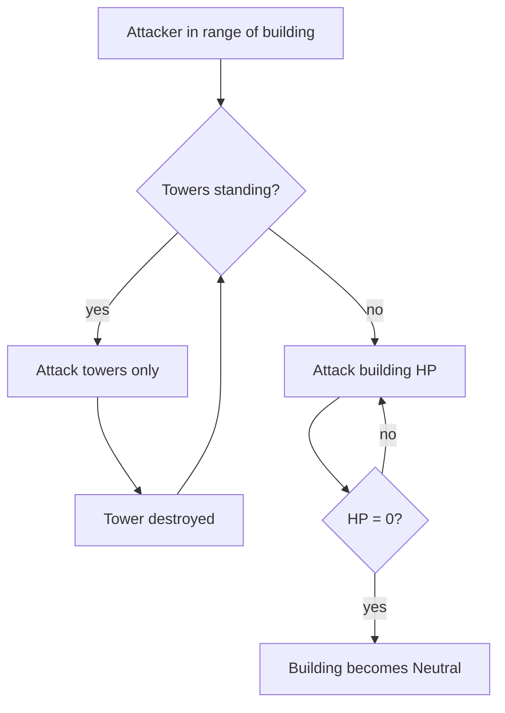

Consequence: taking a defended building is a two-stage job. Stacking towers buys time for the owner to respond or for stationed units to arrive.

### Units

Crafted at factories, paid in Points. A unit spawns at the factory that made it, then paths to its **station** — a fixed map position it guards a radius around. It acts like a creep: auto-engages anything hostile inside the radius, then returns.

**There is exactly one player order: set the station.** Attacking is expressed by stationing a unit near the target, not by issuing an attack command. Orders are given **remotely** — no physical presence required (see Presence Rules).

| Property | Rule |
|---|---|
| Production | Crafted at a factory; costs Points |
| Station | A map position assigned to the unit |
| Engagement radius | Fixed radius around the **station** |
| Targets in radius | Demons, rival units, rival buildings |
| Targeting | Automatic — no player input |
| When radius is clear | Return to station |
| Player control | Set / re-set the station. Nothing else. |
| Movement | Street routes (see Pathfinding) |
| Unit types | Differ by faction (see Factions) |

### Unit Behavior

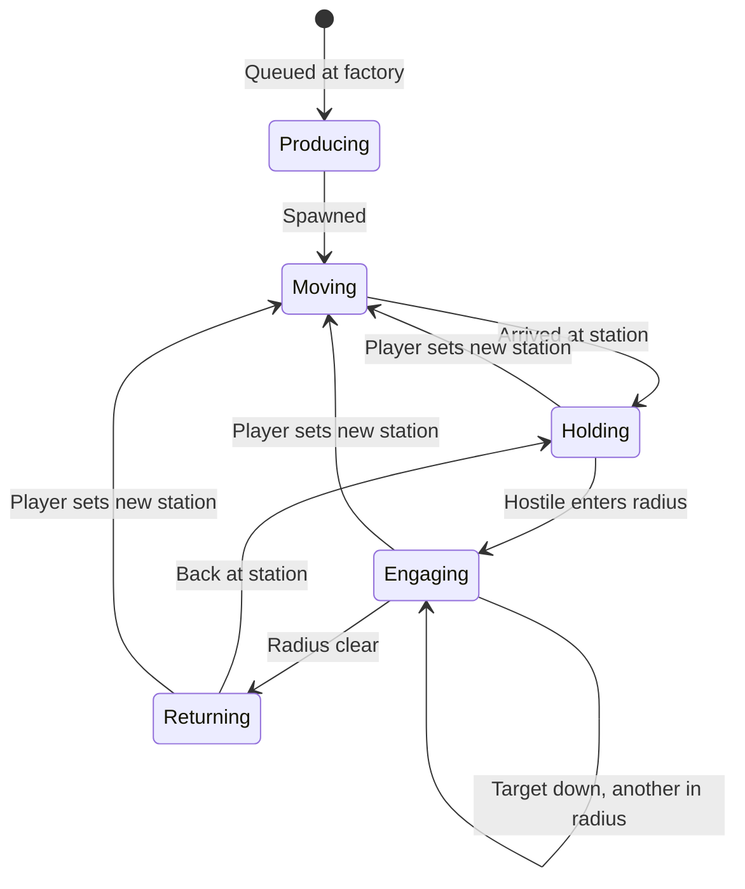

- The radius is measured from the **station**, not from the unit's current position — a fleeing target cannot drag a unit away.
- Hostiles outside the radius are ignored, even if adjacent to the unit.
- Re-stationing is the only way to change what a unit fights.
- Units left on a station keep working while the player is offline.

### Orders

| Order | Effect |
|---|---|
| `SetStation(unitId, position)` | Unit paths to the new station and guards it |

#### Station Placement Rules

| Rule | Requirement |
|---|---|
| Player presence | **Not required** — orders are given remotely, from anywhere |
| Line of sight | Not required |
| Reachability | The station must be reachable by street route from the unit's position |
| Validation | Server-side |

- Commanding units is **not** a physical act. A player can redirect their army from anywhere, at any time.
- What limits reach is **travel time**, not permission: a unit ordered across the city takes as long as the streets take.
- Units keep fighting while the player is offline; they simply hold their last station.

#### Placement Rules Summary

Every placement action requires the player to be physically present. Nothing is placed remotely.

Two distinct kinds of action, with **different presence rules**:

| Kind | What it does | Presence | Cost | Repeatable |
|---|---|---|---|---|
| **Placement** | Puts a construct on the map, or claims a building | **Required** | Points | Once per position |
| **Command** | Moves an existing unit's guard post | **Not required** | Free | Any time |

| Action | Kind | Presence | Anchor |
|---|---|---|---|
| Conquer building | Placement | **Yes** | The building |
| Place factory | Placement | **Yes** | Free space |
| Place tower | Placement | **Yes** | Owned building |
| Set unit station | Command | **No** | Any reachable position |

- The rule in one line: **be there to claim it, not to command it.**
- **Factory vs. station:** a factory is a construct that *produces* units; a station is *where a produced unit stands*. Placing a factory creates nothing by itself — units are produced there for Points, and each is then stationed.

Consequences of a one-order model:

| Intent | How the player expresses it |
|---|---|
| Defend a building | Station units on or near it |
| Attack a rival building | Station units inside its radius |
| Hold a hellgate | Station units within the gate's radius |
| Escort the avatar | Station units where the player is standing |
| Retreat | Re-station further back |

### Pathfinding

- Units move along real street routes (road graph from map data).
- Applies both to reaching a station and to closing on a target inside the radius.
- Travel time is real-time or scaled; affects tactical timing (reinforcement races).
- **Server-side only.** Client sends intent (`SetStation`), never a path. See [Architecture](#architecture).

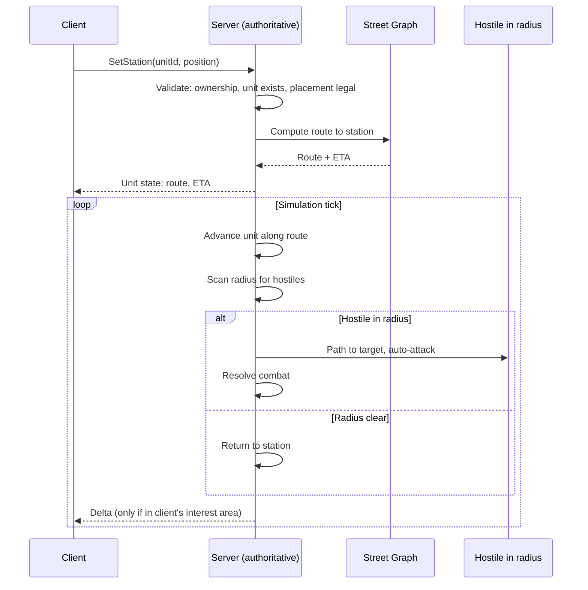

## RPG Sub-Loop (Avatar)

The avatar is the player's body on the map. Progression is **personal**: it travels with the player and is never lost when territory falls.

| Element | Detail |
|---|---|
| Currency | Essence (working name) |
| XP source | Demon kills, gate closures |
| Progression | Avatar level + gear slots |
| Gear slots | 3: ranged weapon, melee weapon, armor set |
| Weapons | Demon drops only |
| Armor | Crafted at a Workshop — requires travelling to a real POI |
| Stats | Randomly rolled on both |
| Persistence | Survives loss of all buildings and units |
| Scope | Single avatar per player; no alts |

### What Avatar Power Buys

| Affects | Effect |
|---|---|
| Demon combat | Higher-tier gates become survivable → more Essence |
| RTS combat | Avatar joins attacks and defense as a hero unit |
| Tech access | Level gates higher unit and structure tiers |
| Survivability | Defeat penalty reduced (see below) |

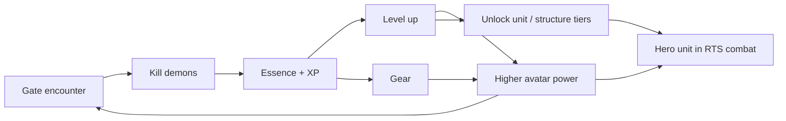

### Gear

Two acquisition paths, both with **randomly rolled stats**. This is the endless-chase layer: no item is terminal, so the demon loop never runs out of reason to run.

#### Slots

**Three slots, fixed.** A full loadout is 2 drops + 1 craft.

| # | Slot | Class | Acquisition | Source | Sink |
|---|---|---|---|---|---|
| 1 | Ranged weapon | Weapon | **Drop only** | Demon kills, gate rewards | — |
| 2 | Melee weapon | Weapon | **Drop only** | Demon kills, gate rewards | — |
| 3 | Armor set | Armor | **Craft only** | Workshop — a neutral real-world POI | Essence + materials |

- Armor is one **set** piece, not separate head/chest/legs — keeps the mobile inventory small and the craft target singular.
- Both weapons are equipped at once. The server picks per attack by target distance — **the player never switches manually** (see Combat).
- Loadout is a build decision, not a combat action: choose which range bands to cover.
- No trinket, consumable, or cosmetic slots in scope.

#### Acquisition

- Crafting happens **only at a workshop**, and the player must be standing there. No remote crafting.
- Materials drop from demons; Essence pays the craft cost.
- Every roll is independent: crafting the same armor set twice yields different stats.
- Higher-tier gates raise base-item tier and rarity odds, not just drop volume.
- **All rolls are server-side.** The client never generates or reveals stats before the server commits them (see Anti-Cheat).

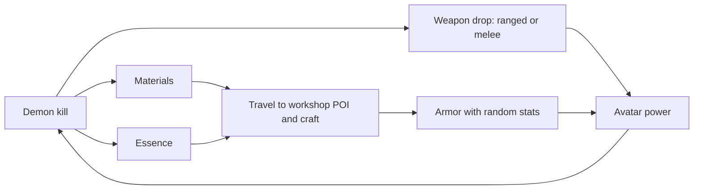

#### Roll Model

```
item = base_template(tier) + rarity(tier) + affixes(rarity) + affix_values(range)
```

| Stage | Driven by |
|---|---|
| Base template | Gate tier / demon tier |
| Rarity | Weighted roll, tier-scaled |
| Affix count | Rarity |
| Affix values | Range roll per affix |

### Why This Sustains the Loop

| Mechanism | Effect |
|---|---|
| No terminal item | A better roll always exists → gates stay worth running |
| Armor crafting | Unbounded Essence sink; late-game avatars never cap out |
| Weapon drop-only | Ties weapon progress directly to gate tier and risk |
| Split paths | Neither pure grinding nor pure crafting covers all 3 slots |
| Two weapon slots | Doubles the drop chase without widening the inventory or adding input |

### Avatar in RTS Combat

- Avatar acts as a hero unit with its own stats and gear, but **cannot be sent anywhere**: it sits at the player's real GPS position and auto-attacks what comes in range.
- Contributing to a battle means physically being near it.
- Presence is optional — the RTS loop runs asynchronously without the player on site.
- Avatar defeat: knocked out, not deleted. Cooldown before re-entry; no gear loss (TBD whether a durability or Essence cost applies).

### Loop Separation

- Essence buys **only** avatar progression. Points buy **only** army and structures.
- A player who ignores demons fields an army but a weak avatar: cannot clear high-tier gates, locked out of upper tech tiers.
- A player who ignores territory has a strong avatar but no income: cannot field or sustain an army, cannot hold ground.
- Holding territory remains the win condition; the avatar is the tool, not the goal.

## Combat

Design target: **simple, glanceable, no twitch input.** Closer to tower defense than to an action game. Nothing in combat requires aiming, dodging, or fast taps — the phone can be in a pocket.

| Property | Rule |
|---|---|
| Input during combat | None — everything auto-attacks |
| Avatar position | **Locked to the player's real GPS position**; not movable in-game |
| Avatar targeting | Auto-attacks any hostile in range |
| Weapon selection | Automatic by target distance — melee close, ranged far |
| Unit position | Player-assigned **station**; unit guards a radius around it |
| Unit targeting | Auto-engage any hostile inside the station radius |
| Unit movement | Along street routes, to the station and to targets within radius |
| Resolution | Server-side simulation tick |

### Tower-Defense Shape

The three actors map onto tower-defense roles:

| Actor | Role | Mobility |
|---|---|---|
| Demon waves | Creeps | Path toward gates and buildings |
| Units | Mobile towers | Guard a radius around a player-set station |
| Towers | Static towers | Fixed to an owned building |
| Avatar | Mobile tower | Moves only when the **player physically moves** |

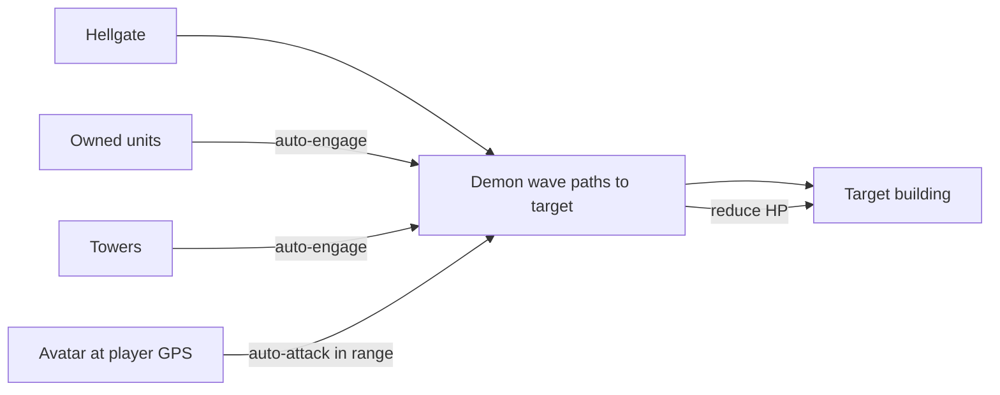

### Engagement Rules

- Units auto-engage any hostile inside their station radius; nothing outside it (see Units).
- Units vs. building: **towers must fall first** — building HP is untouchable while any tower stands (see Towers).
- Units stationed on or near a building engage attackers independently of the tower layer.
- Avatar vs. anything hostile in range: continuous auto-attack, no player action.
- Demon units use the same combat and pathfinding rules, server-driven, with no owning player.
- Building destroyed (HP = 0) → ownership reset to **Neutral**, open to reconquest by any faction.
- Destroyed ≠ deleted: building persists, conquerable again.

### Weapon Range Bands

Both weapons are always equipped. The server picks per attack; the player never switches manually.

| Target distance | Weapon used |
|---|---|
| Within melee band | Melee weapon |
| Beyond melee, within ranged band | Ranged weapon |
| Beyond ranged band | No attack |

Consequence: weapon choice is a **build decision, not a combat action**. A loadout is tuned by which bands the player wants covered and by the rolled stats, not by reaction.

### Speed Lock

| Condition | Effect |
|---|---|
| Sustained speed **> 30 km/h** | Avatar cannot attack |

- Speed derived **server-side** from the GPS fix sequence; the client does not report it.
- Purpose: safety (no play while driving) and anti-cheat (no drive-by farming).
- Units, towers, and buildings are unaffected — only the avatar is disabled.
- Attack re-enables once sustained speed drops below the threshold.

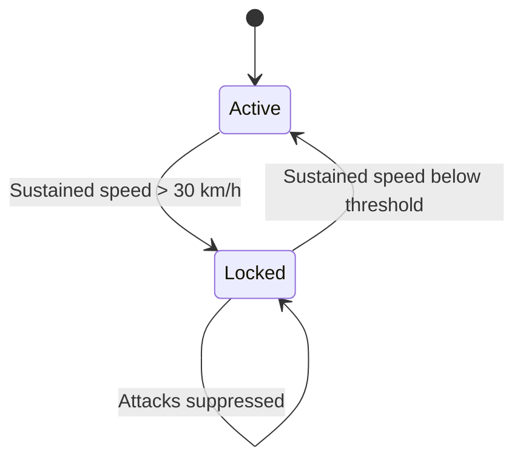

## Building State Machine

**Shielded** = under attack but towers still standing; building HP cannot be reduced.

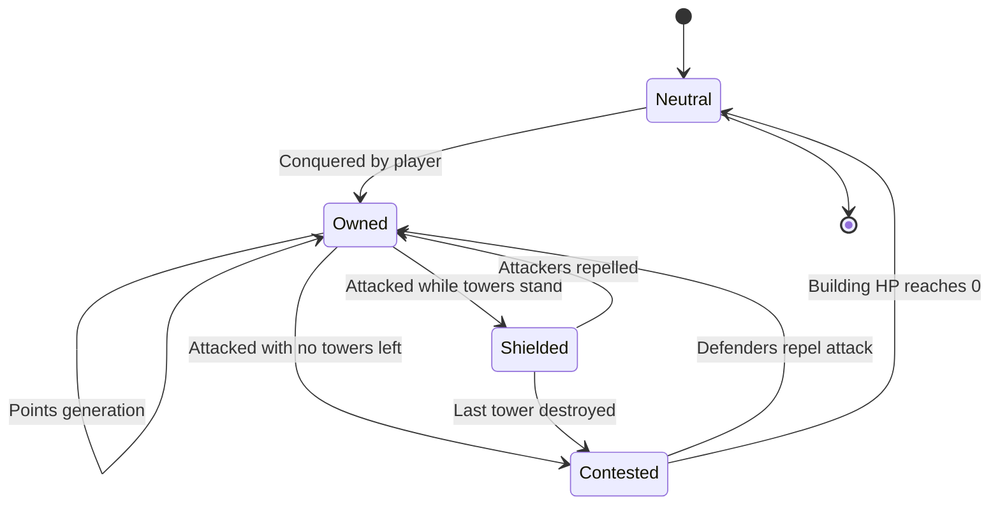

## Architecture

World-scale persistent simulation. Two hard constraints drive the design:

| Constraint | Consequence |
|---|---|
| World-scale data volume | Client streams only its interest area, never the global state |
| Cheat resistance | Server is authoritative for all simulation; client renders and sends intent |

### Authority Split

| Concern | Owner | Notes |
|---|---|---|
| Ownership / conquest | Server | Validates GPS proximity server-side |
| Points generation | Server | Accrual computed from server clock, not client |
| Unit spawning / cost | Server | Rejects orders exceeding point balance |
| Pathfinding | Server | Street-graph routing; client never submits paths |
| Unit movement | Server | Tick-advanced; client interpolates between deltas |
| Construct placement | Server | Validates player presence and free-space / owned-building rules |
| Unit orders | Server | Validates ownership and route reachability; no presence check |
| Combat resolution | Server | Deterministic, server clock |
| Loot and craft rolls | Server | RNG never runs on the client |
| Avatar speed / speed lock | Server | Derived from GPS fix sequence, not client-reported |
| Rendering / AR / input | Client | Presentation and intent only |

Rule: **client sends intent, server sends state.** Any client message asserting an outcome is rejected.

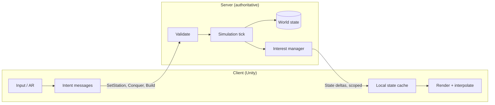

### Spatial Streaming

- World partitioned into a fixed spatial grid (tiles / geohash / H3 cells).
- Client subscribes to tiles covering its **interest area**: current GPS position + radius, plus tiles containing its own assets.
- Server pushes deltas only for subscribed tiles. Unsubscribed world state is never sent.
- Subscription updates on movement: enter/leave tiles as the player moves.

| Layer | Streamed | Source |
|---|---|---|
| Building geometry (3D) | On tile enter, cached locally | Static map data, CDN |
| Street graph | Server-side only | Not shipped to client |
| Ownership / HP / points | Delta per tick | Live, server |
| Units in interest area | Delta per tick | Live, server |
| Units outside interest area | Not sent | — |

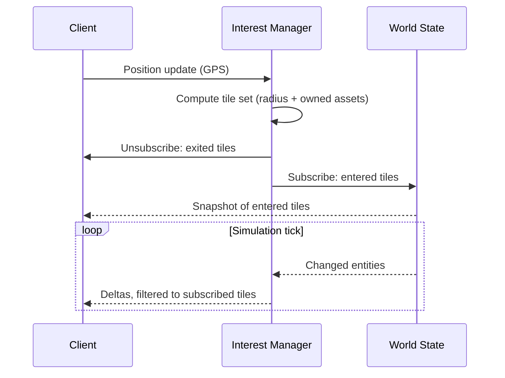

### Anti-Cheat

| Vector | Mitigation |
|---|---|
| GPS spoofing | Server-side plausibility: speed between fixes, jump detection, platform attestation |
| Drive-by farming | Speed lock: avatar cannot attack above 30 km/h sustained |
| Forged placement | Conquest and construct placement checked against the server's own position fix |
| Factory placement abuse | Free-space test run server-side against building footprints |
| Forged orders | Server validates ownership, proximity, and point balance on every order |
| Client-computed paths | Client cannot submit paths; routing is server-only |
| Injected combat results | Combat resolved on server tick; client results ignored |
| State scraping | Interest scoping limits visibility to the player's own area |
| Replay / speed hacks | Server clock authoritative for accrual, build times, movement |
| Loot RNG manipulation | All drop and craft rolls executed server-side; client receives committed results only |
| Reroll scumming | Roll is committed before the client is told the outcome; disconnecting does not undo it |

## Factions

Four factions: three playable, one server-controlled. Working names — final names, lore, and visual style **defined later**.

| # | Working name | Type | Concept direction |
|---|---|---|---|
| 1 | Soldats | Playable | Military remnant; conventional force |
| 2 | Science | Playable | Tech / research survivors |
| 3 | Religious | Playable | Faith order; anti-demon zealots |
| 4 | Demons | **NPC / PvE** | Hell incursion; server-controlled |

- Player picks one of the three playable factions on onboarding; permanent or season-locked (TBD).
- Faction determines unit roster, visual theme, factory models.
- Asymmetric balance target: no faction strictly dominant across all building kinds or region densities.
- Demons are never playable and never hold territory.

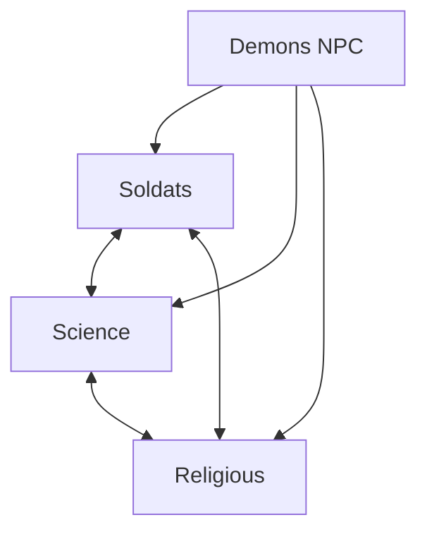

## Faction 4: Demons (PvE)

**The common enemy.** Demons are hostile to all three playable factions and allied with none — the shared threat the setting is built on. Server-controlled. Design purpose: anchor the lore, drive the RPG loop, and guarantee content everywhere, including regions with no nearby human opponents.

| Property | Value |
|---|---|
| Control | Server AI; never playable |
| Spawn source | Hellgates opening at semi-random real-world positions |
| Targets | Any owned building (any faction), player units, gate surroundings |
| Territory | **None.** Demons destroy buildings only; never occupy or own them |
| Reward | **Essence + XP + gear** — never Points (see Game Loops & Currencies) |

### Hellgates

- Spawn semi-randomly, weighted by **player presence**, not building density — every active player gets reachable events regardless of where they live.
- Emit demon waves on a timer until closed.
- Closed by destroying the gate: player units, on-site AR action, or both.
- Unclosed gates escalate: larger waves, wider threat radius, higher reward.
- Rare high-tier gates act as regional events, drawing multiple players and factions against the common enemy.
- Gate and demon rewards pay **Essence**, never Points — the demon loop funds the avatar, not the army.
- Common enemy in lore and targeting, but **no alliance mechanic**: no shared objective, shared credit, or truce. Rival players stay hostile to each other at a gate.

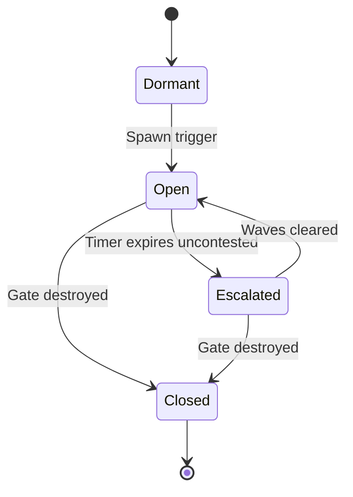

### Design Effects

| Effect | Consequence |
|---|---|
| Density-independent content | Rural players always have something to fight |
| Common enemy | All three factions face the same threat; convergence at gates is emergent, never mechanical |
| Drives the RPG loop | Sole source of Essence, XP, and gear |
| Territory churn | Demon-destroyed buildings return to Neutral, reopening conquest |
| Defense value | Makes garrisoning owned buildings useful even with no human threat nearby |
| Real-world pull | Gates and workshops both require travel — the RPG loop cannot be played remotely |

**Rules, decided:**

- Demons are the **common enemy**: hostile to all three factions, allied with none, never playable.
- Demons never occupy buildings. Destruction only → building reverts to Neutral and is reconquerable by any player faction.
- Faction cooperation at gates is **incidental only**. No alliance system, no shared credit, no suspended PvP.
- Demon rewards are **Essence only**. No Points from demons; no Essence from buildings.

## Open Questions

### Gameplay

- Points payout: passive tick vs. manual collection visit.
- Unit cap per building / per player.
- Station engagement radius: fixed, per unit type, or upgradeable.
- Target priority inside a radius: nearest, weakest, or by type (demons vs. players vs. buildings).
- Whether re-stationing has a cooldown.
- Free-space definition: footprint clearance only, or also minimum spacing from roads and other factories.
- Whether factories can be placed on rival-held ground, or only in neutral / own areas.
- Factory placement range from the player, and whether it equals the conquest radius.
- Whether a factory itself can be attacked and destroyed, and what it drops.
- Which POI categories qualify as workshops, and their density per region.
- Workshop fallback where POI data is thin — synthesize, or widen the qualifying categories.
- Whether rival factions can fight at a workshop, or whether it is a no-combat zone.
- Whether crafting has a per-workshop cooldown, to stop one site being farmed repeatedly.
- Tower count per building, and whether it scales with building volume.
- Whether towers repair or must be rebuilt after an attack.
- Whether towers block conquest of a Neutral building, or only damage to an Owned one.
- Fixed conquest radius value.
- Density normalization constants: `d_ref`, `a`, `bonus_max`.
- Whether synthetic (non-footprint) targets carry reduced value, and by how much.
- Faction names, lore, visual style, unit rosters (deferred by decision).
- Hellgate spawn weighting, cadence, escalation curve, and Essence reward scale.
- Avatar defeat penalty: cooldown length, durability or Essence cost.
- Whether avatar level gating of unit tiers is hard (locked) or soft (cost scaling).
- Whether the avatar can solo low-tier gates without units, and at which level.
- Melee and ranged band distances, and whether they overlap.
- Speed-lock hysteresis: sustain window before locking and before unlocking.
- Whether conquest and crafting are also speed-locked, or only attacking.
- Passenger case: a passenger in a car is locked out identically — accepted, or mitigated.
- Rarity tier count and affix count per tier.
- Affix pool: which stats roll on weapons vs. armor, and whether ranged and melee share a pool.
- Whether crafted armor can be re-rolled, and at what Essence cost.
- Trading: whether gear is bound to the player or tradeable between players.
- Power-gap control: how far random gear may separate two players in RTS hero combat.

### Technical

- Spatial index choice: geohash vs. H3 vs. fixed grid; tile size vs. interest radius.
- Simulation tick rate, and whether distant regions tick lazily (on-demand catch-up) vs. continuously.
- Transport: WebSocket vs. QUIC; delta encoding format.
- Building data source and licensing (OSM buildings, height estimation).
- Street graph storage and routing engine (prebuilt contraction hierarchies vs. on-demand A*).
- Offline/reconnect behavior: state reconciliation after client gap.
- Server sharding strategy by geography, and cross-shard unit movement.
- Density recomputation cadence: static precompute vs. periodic refresh as map data updates.
- Global map-data ingestion pipeline: coverage auditing, per-region quality scoring.
