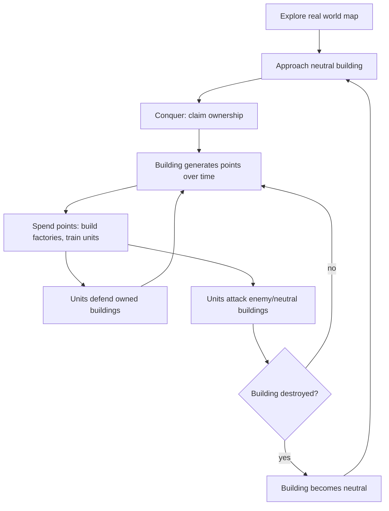
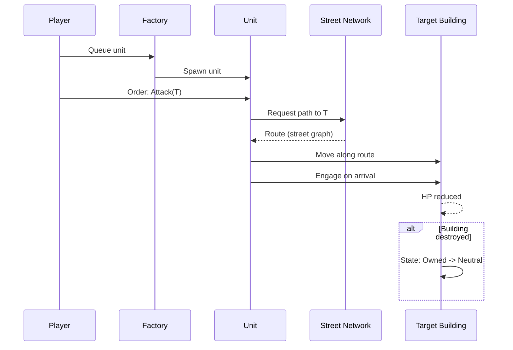
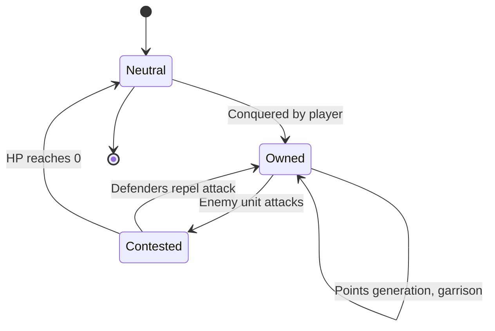

# Game Design Document

AR mobile territory-conquest game. Unity. Pokémon GO-style world map + RTS base-building loop.

## Overview

| Property | Value |
|---|---|
| Platform | Mobile (iOS / Android) |
| Engine | Unity, AR Foundation |
| Genre | AR location-based + RTS |
| Session type | Persistent world, asynchronous multiplayer |
| Factions | 3 |
| Core loop | Conquer → Generate points → Build army → Attack/Defend |

## Core Loop



## World & Map

- Real-world map data drives building placement (OSM or equivalent building footprints).
- Buildings rendered as 3D models on the map, positioned at real GPS coordinates.
- Avatar position = user's live GPS location.
- AR view: camera overlay shows buildings/units when user is physically near them.
- Map view: top-down/3D map for macro strategy, out of AR range.

## Building Ownership

### Conquest Rules

| Condition | Requirement |
|---|---|
| Proximity | User within conquest radius (e.g. 20–50m) of building |
| Target state | Neutral only (not owned by another faction) |
| Action | Player-initiated conquer action, may include a timer/minigame |

### Points Generation

```
points/tick = base_rate(building_kind) × volume_multiplier(building)
```

| Building kind | Rarity | Relative point rate |
|---|---|---|
| House | Common | 1x |
| Shop | Common | 1.5x |
| School | Uncommon | 2x |
| Hospital | Rare | 4x |
| Landmark | Very rare | 8x |

- Volume multiplier scales with building footprint × estimated height (from map data).
- Points accrue while building is owned, paid out per tick (e.g. every 60s) or on collection.

## RTS Sub-Loop

Unlocked by accumulated points. Applies per-building, anchored to that building's real-world location.

### Structures

| Structure | Function | Unlock cost |
|---|---|---|
| Factory | Produces units | Points threshold |
| Wall/Turret (optional) | Passive defense | Points threshold |

### Units

- Trained at factories, cost points per unit.
- Unit types differ by faction (see Factions).
- Two orders: **Defend** (garrison owned building) or **Attack** (move to target building).

### Pathfinding

- Units move along real street routes (road graph from map data).
- Attack orders compute shortest/fastest path via street network to target building.
- Travel time is real-time or scaled; affects tactical timing (reinforcement races).



## Combat

- Units vs. units: engage when paths intersect or on arrival at contested building.
- Units vs. building: reduce building HP; building has defenders (garrisoned units) as first line.
- Building destroyed (HP = 0) → ownership reset to **Neutral**, open to reconquest by any faction.
- Destroyed ≠ deleted: building persists, conquerable again.

## Building State Machine



## Factions

| Faction | Identity | Unit theme (example) |
|---|---|---|
| Faction A | TBD | TBD |
| Faction B | TBD | TBD |
| Faction C | TBD | TBD |

- Player selects faction on onboarding; permanent or season-locked (TBD).
- Faction determines unit roster, visual theme, factory models.
- Asymmetric balance target: no faction strictly dominant across all building types/terrain densities.

## Open Questions

- Conquest radius and anti-spoofing (GPS spoof prevention).
- Points payout: passive tick vs. manual collection visit.
- Unit cap per building / per player.
- PvP unit combat: real-time vs. resolved server-side simulation.
- Faction identity, lore, unit rosters.
- Building data source and licensing (OSM buildings, height estimation).
- Server authority model for ownership/combat resolution.
