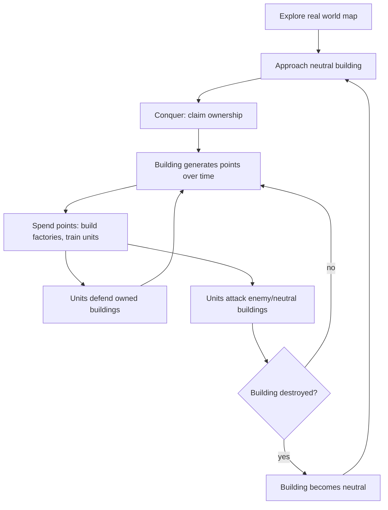
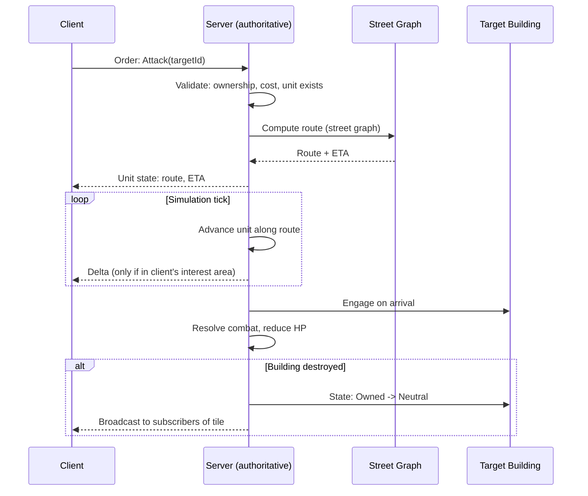
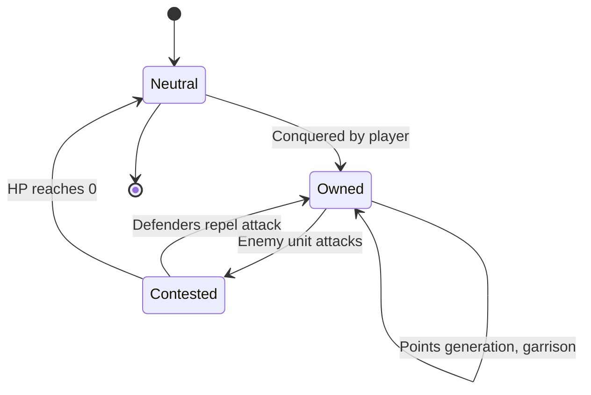
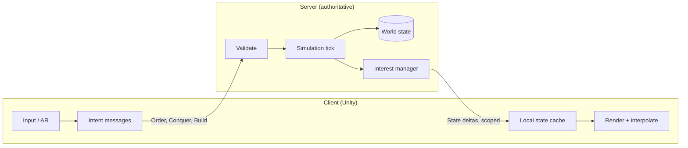
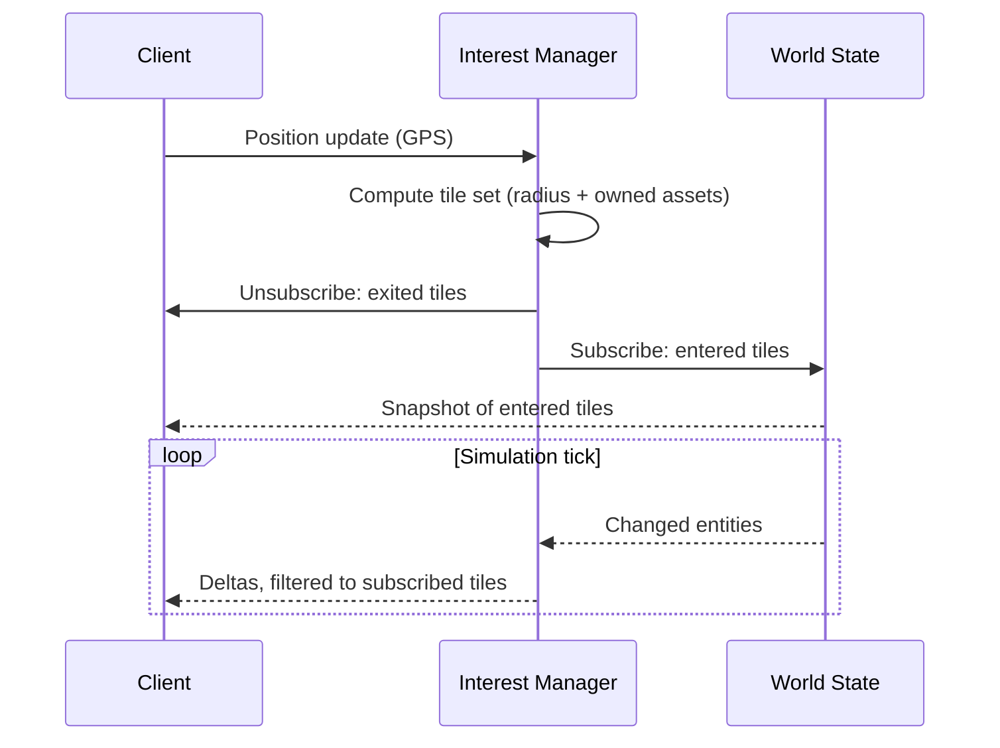

# Game Design Document

AR mobile territory-conquest game. Unity. Pokémon GO-style world map + RTS base-building loop.

## Overview

| Property | Value |
|---|---|
| Platform | Mobile (iOS / Android) |
| Engine | Unity, AR Foundation |
| Genre | AR location-based + RTS |
| Session type | Persistent world, asynchronous multiplayer |
| Authority | Server-authoritative simulation; client is renderer + intent |
| Data model | Interest-scoped streaming (client never holds global state) |
| Factions | 3 |
| Core loop | Conquer → Generate points → Build army → Attack/Defend |

## Core Loop



## World & Map

- Real-world map data drives building placement (OSM or equivalent building footprints).
- Buildings rendered as 3D models on the map, positioned at real GPS coordinates.
- Avatar position = user's live GPS location.
- AR view: camera overlay shows buildings/units when user is physically near them.
- Map view: top-down/3D map for macro strategy, out of AR range.

## Building Ownership

### Conquest Rules

| Condition | Requirement |
|---|---|
| Proximity | User within conquest radius (e.g. 20–50m) of building |
| Target state | Neutral only (not owned by another faction) |
| Action | Player-initiated conquer action, may include a timer/minigame |

### Points Generation

```
points/tick = base_rate(building_kind) × volume_multiplier(building)
```

| Building kind | Rarity | Relative point rate |
|---|---|---|
| House | Common | 1x |
| Shop | Common | 1.5x |
| School | Uncommon | 2x |
| Hospital | Rare | 4x |
| Landmark | Very rare | 8x |

- Volume multiplier scales with building footprint × estimated height (from map data).
- Points accrue while building is owned, paid out per tick (e.g. every 60s) or on collection.

## RTS Sub-Loop

Unlocked by accumulated points. Applies per-building, anchored to that building's real-world location.

### Structures

| Structure | Function | Unlock cost |
|---|---|---|
| Factory | Produces units | Points threshold |
| Wall/Turret (optional) | Passive defense | Points threshold |

### Units

- Trained at factories, cost points per unit.
- Unit types differ by faction (see Factions).
- Two orders: **Defend** (garrison owned building) or **Attack** (move to target building).

### Pathfinding

- Units move along real street routes (road graph from map data).
- Attack orders compute shortest/fastest path via street network to target building.
- Travel time is real-time or scaled; affects tactical timing (reinforcement races).
- **Server-side only.** Client sends intent (`Attack(targetId)`), never a path. See [Architecture](#architecture).



## Combat

- Units vs. units: engage when paths intersect or on arrival at contested building.
- Units vs. building: reduce building HP; building has defenders (garrisoned units) as first line.
- Building destroyed (HP = 0) → ownership reset to **Neutral**, open to reconquest by any faction.
- Destroyed ≠ deleted: building persists, conquerable again.

## Building State Machine



## Architecture

World-scale persistent simulation. Two hard constraints drive the design:

| Constraint | Consequence |
|---|---|
| World-scale data volume | Client streams only its interest area, never the global state |
| Cheat resistance | Server is authoritative for all simulation; client renders and sends intent |

### Authority Split

| Concern | Owner | Notes |
|---|---|---|
| Ownership / conquest | Server | Validates GPS proximity server-side |
| Points generation | Server | Accrual computed from server clock, not client |
| Unit spawning / cost | Server | Rejects orders exceeding point balance |
| Pathfinding | Server | Street-graph routing; client never submits paths |
| Unit movement | Server | Tick-advanced; client interpolates between deltas |
| Combat resolution | Server | Deterministic, server clock |
| Rendering / AR / input | Client | Presentation and intent only |

Rule: **client sends intent, server sends state.** Any client message asserting an outcome is rejected.



### Spatial Streaming

- World partitioned into a fixed spatial grid (tiles / geohash / H3 cells).
- Client subscribes to tiles covering its **interest area**: current GPS position + radius, plus tiles containing its own assets.
- Server pushes deltas only for subscribed tiles. Unsubscribed world state is never sent.
- Subscription updates on movement: enter/leave tiles as the player moves.

| Layer | Streamed | Source |
|---|---|---|
| Building geometry (3D) | On tile enter, cached locally | Static map data, CDN |
| Street graph | Server-side only | Not shipped to client |
| Ownership / HP / points | Delta per tick | Live, server |
| Units in interest area | Delta per tick | Live, server |
| Units outside interest area | Not sent | — |



### Anti-Cheat

| Vector | Mitigation |
|---|---|
| GPS spoofing | Server-side plausibility: speed between fixes, jump detection, platform attestation |
| Forged orders | Server validates ownership, proximity, and point balance on every order |
| Client-computed paths | Client cannot submit paths; routing is server-only |
| Injected combat results | Combat resolved on server tick; client results ignored |
| State scraping | Interest scoping limits visibility to the player's own area |
| Replay / speed hacks | Server clock authoritative for accrual, build times, movement |

## Factions

| Faction | Identity | Unit theme (example) |
|---|---|---|
| Faction A | TBD | TBD |
| Faction B | TBD | TBD |
| Faction C | TBD | TBD |

- Player selects faction on onboarding; permanent or season-locked (TBD).
- Faction determines unit roster, visual theme, factory models.
- Asymmetric balance target: no faction strictly dominant across all building types/terrain densities.

## Open Questions

### Gameplay

- Conquest radius value.
- Points payout: passive tick vs. manual collection visit.
- Unit cap per building / per player.
- Faction identity, lore, unit rosters.

### Technical

- Spatial index choice: geohash vs. H3 vs. fixed grid; tile size vs. interest radius.
- Simulation tick rate, and whether distant regions tick lazily (on-demand catch-up) vs. continuously.
- Transport: WebSocket vs. QUIC; delta encoding format.
- Building data source and licensing (OSM buildings, height estimation).
- Street graph storage and routing engine (prebuilt contraction hierarchies vs. on-demand A*).
- Offline/reconnect behavior: state reconciliation after client gap.
- Server sharding strategy by geography, and cross-shard unit movement.
