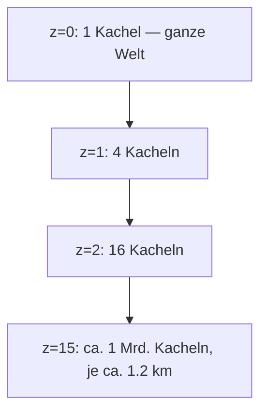
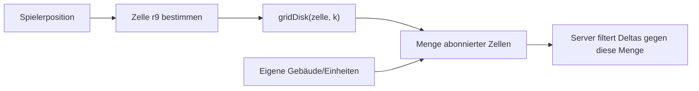
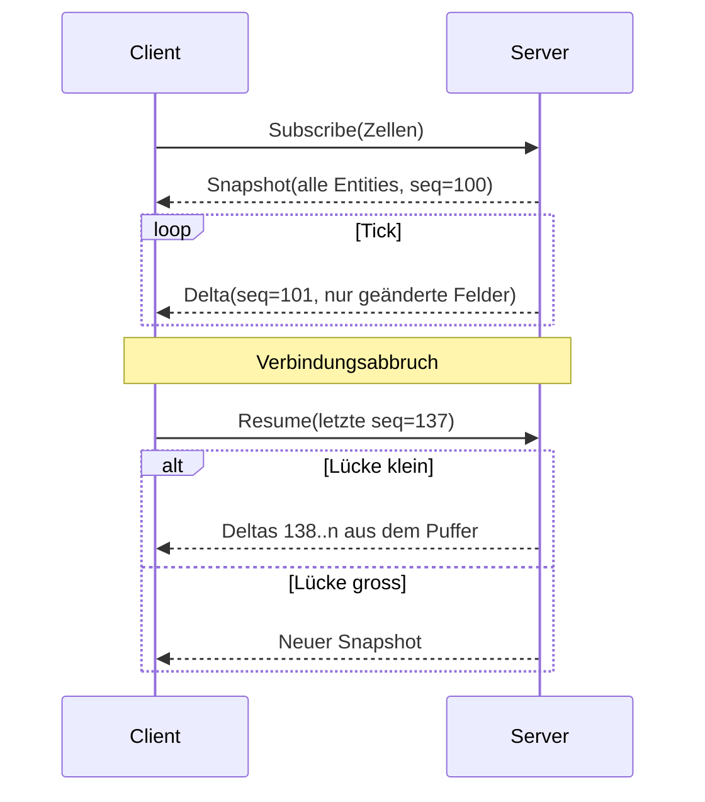
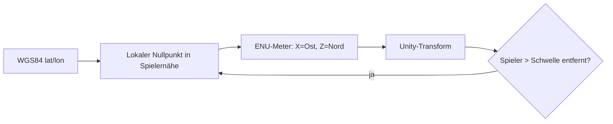

# Grundlagen — Geodaten, Karten und Game-Server

Einstiegsdokument für Entwickler mit Business-Application-Hintergrund (Web, Backend, Enterprise) **ohne** Vorwissen in Karten, Geodaten, Echtzeit-Streaming oder Spielarchitektur.

Ziel: nach diesem Dokument ist [ARCHITECTURE.md](ARCHITECTURE.md) lesbar.

Jedes Kapitel folgt demselben Muster:

| Abschnitt | Inhalt |
|---|---|
| Problem | Was gelöst wird |
| Analogie | Das Gegenstück aus der Business-Welt |
| Fakten | Tabellen, Zahlen, Formeln |
| Fallstricke | Was erfahrungsgemäss schiefgeht |
| Im Projekt | Wo das in unserer Architektur auftaucht |

## Lesepfad

| Ziel | Kapitel |
|---|---|
| Nur die Architektur verstehen | 1, 4, 5, 7, 8 |
| Am Map-Pipeline-Code arbeiten | 1, 3, 4, 5, 6, 10 |
| Am Server arbeiten | 5, 6, 7, 8, 11 |
| Am Unity-Client arbeiten | 1, 2, 4, 7, 9 |
| Kosten beurteilen | 4, 11 |

## Mentales Modell

Die meisten Konzepte haben ein direktes Gegenstück in einer Business-Anwendung. Das Neue ist fast nie die Technik, sondern die **Dimension**: zwei Raumachsen statt einer Sortierreihenfolge, und ein Datenbestand, der grösser ist als jeder Client.

| Business-Anwendung | Dieses Projekt | Unterschied |
|---|---|---|
| Tabelle mit Millionen Zeilen | Welt mit Milliarden Gebäuden | Kein `ORDER BY` — Relevanz ist räumlich |
| Pagination (`LIMIT`/`OFFSET`) | Kacheln (Tiles) | Seite = Rechteck auf der Karte, nicht Zeilenbereich |
| Index auf einer Spalte (B-Tree) | Räumlicher Index (R-Tree, H3) | Zwei Achsen lassen sich nicht linear sortieren |
| `WHERE kunde = 42` | `WHERE distanz < 300 m` | Filterkriterium ist Geometrie |
| REST-Request/Response | Persistente Verbindung + Deltas | Server sendet ungefragt |
| Cronjob / Batch | Simulations-Tick | Zeit ist Teil des Zustands |
| CRUD-Backend vertraut dem Client | Autoritativer Server | Client-Angaben sind Absichtserklärungen |
| Session im Cookie | Interest-Subscription | Session hat eine geografische Ausdehnung |
| CDN für statische Assets | CDN für Kartengeometrie | Gleiches Prinzip, andere Nutzlast |
| Sharding nach Mandant | Sharding nach Weltregion | Shard-Key ist eine Zelle auf der Erde |

Ein Satz, der das ganze Projekt trägt:

> Die Welt ist gross und ändert sich selten. Der Spielzustand ist klein und ändert sich ständig. Beides muss getrennt ausgeliefert werden.

---

## 1. Koordinaten und Projektionen

**Problem:** Die Erde ist rund, Bildschirme und Datenbanken sind flach.

**Analogie:** Wie Zeichensatz-Encoding. Es gibt einen Standard (UTF-8 / WGS84), mehrere Repräsentationen, und Fehler entstehen fast immer beim Umrechnen zwischen ihnen.

### Die drei Systeme, die vorkommen

| System | Code | Einheit | Verwendung |
|---|---|---|---|
| WGS84 (geografisch) | EPSG:4326 | Grad (Länge/Breite) | GPS, Datenaustausch, Datenbank |
| Web Mercator | EPSG:3857 | Meter (projiziert) | Kartenkacheln, alle Slippy Maps |
| Lokales ENU-System | — | Meter (X/Y/Z) | Rendering in Unity |

- **Latitude (Breite)** = Nord/Süd, −90 bis +90. **Longitude (Länge)** = Ost/West, −180 bis +180.
- Reihenfolge ist eine klassische Fehlerquelle: GeoJSON und die meisten APIs nutzen `[lon, lat]`, menschliche Schreibweise und viele Bibliotheken `lat, lon`.
- Zürich ≈ `47.3769, 8.5417`.

### Grad sind keine Meter

| Grössenordnung | Meter (Breite) | Meter (Länge bei 47° N) |
|---|---|---|
| 1° | ≈ 111 320 m | ≈ 75 900 m |
| 0.001° | ≈ 111 m | ≈ 76 m |
| 0.00001° (5 Nachkommastellen) | ≈ 1.1 m | ≈ 0.76 m |

```
meter_pro_grad_laenge = 111320 × cos(breite)
```

Konsequenz: `lat`/`lon`-Differenzen darf man **nie** direkt als Distanz verrechnen. Ein Quadrat in Grad ist auf der Erde ein Rechteck, das Richtung Pol immer schmaler wird.

### Distanzberechnung

| Verfahren | Genauigkeit | Kosten | Einsatz |
|---|---|---|---|
| Euklidisch auf Grad | Falsch | Trivial | Nie |
| Äquirektangulare Näherung | ± 0.5 % auf kurzen Distanzen | Sehr billig | Radiusprüfungen im Tick |
| Haversine | ± 0.5 % (Kugel) | Billig | Standard |
| Vincenty / Geodesic | Zentimeter (Ellipsoid) | Teuer | Vermessung, hier nicht nötig |
| PostGIS `geography` | Ellipsoid, in Metern | Mittel | Datenbankabfragen |

### Web Mercator, kurz

- Zylinderprojektion, winkeltreu, **nicht** flächentreu.
- Abgeschnitten bei ±85.05° — die Welt wird dadurch quadratisch und lässt sich in Vierer-Bäume teilen.
- Verzerrungsfaktor = `1 / cos(breite)`: Grönland erscheint so gross wie Afrika, ist aber 14× kleiner.

**Fallstricke**

| Fehler | Symptom |
|---|---|
| `lat`/`lon` vertauscht | Objekte landen im Meer vor Somalia (0,0) oder gespiegelt |
| Distanz in Grad gerechnet | Radien stimmen am Äquator, schrumpfen Richtung Pol |
| Flächen in Web Mercator gerechnet | Dichtewerte in Skandinavien systematisch falsch |
| `float32` für Koordinaten | ≈ 1 m Auflösung — zu grob für Gebäudegeometrie |

**Im Projekt:** Datenhaltung in WGS84, Kachelschnitt in Web Mercator, Rendering in lokalen Metern → [ARCHITECTURE.md § Map Data Pipeline](ARCHITECTURE.md#map-data-pipeline), Kapitel 9 hier.

---

## 2. GPS in der Praxis

**Problem:** Die Position des Spielers ist eine Messung mit Fehler, keine Tatsache.

**Analogie:** Benutzereingabe aus einem fremden System — plausibilisieren, nie blind übernehmen.

| Umgebung | Typische Genauigkeit | Ursache |
|---|---|---|
| Freies Feld | 3–5 m | Gute Satellitensicht |
| Vorstadt | 5–15 m | Teilabschattung |
| Innenstadt (Urban Canyon) | 15–50 m | Reflexionen an Fassaden (Mehrwegempfang) |
| Innenräume | 30–100 m+ | WLAN-/Mobilfunk-Fallback statt GNSS |

- Jedes Betriebssystem liefert zur Position einen **Genauigkeitsradius**. Der gehört ins Protokoll und in die Validierung.
- Die Position „springt" auch bei stehendem Gerät (Jitter). Ohne Glättung flackert jede radiusbasierte Prüfung.
- „GPS" heisst heute GNSS: GPS, Galileo, GLONASS, BeiDou kombiniert.

**Fallstricke**

| Fehler | Folge |
|---|---|
| Rohe Fixes ohne Genauigkeitsfilter verwenden | Eroberung schlägt scheinbar zufällig fehl |
| Client-gemeldete Geschwindigkeit vertrauen | Trivial manipulierbar |
| Position nur clientseitig prüfen | Spielstand per gefälschter Position generierbar |
| Keine Hysterese an Zonengrenzen | Spieler flackert in/out, Effekte triggern doppelt |

**Im Projekt:** Der Server akzeptiert Fixes, prüft Plausibilität (Sprungdistanz, Geschwindigkeit, Genauigkeit) und rechnet **alle** Präsenzregeln gegen seinen eigenen zuletzt akzeptierten Fix → [ARCHITECTURE.md § Anti-Cheat](ARCHITECTURE.md#anti-cheat).

---

## 3. Geodaten: Quellen, Modell, Lizenz

**Problem:** Woher kommen Gebäude, Strassen und POIs?

**Analogie:** Ein Stammdaten-Import aus einer Fremdquelle — Schema-Mapping, Qualitätsprüfung, Lizenzbedingungen.

### Datenmodell

| Begriff | Bedeutung | Entspricht |
|---|---|---|
| Feature | Ein Objekt mit Geometrie + Attributen | Datensatz / Row |
| Geometry | `Point`, `LineString`, `Polygon`, … | Spaltenwert |
| Footprint | Grundriss eines Gebäudes als Polygon | Geometrie des Gebäudes |
| POI | Point of Interest (Laden, Schule, Werkstatt) | Punkt mit Kategorie |
| Tag | Freies Schlüssel/Wert-Paar (OSM) | JSONB-Spalte |
| Strassengraph | Knoten + Kanten aus dem Strassennetz | Graph-Tabelle |

### Quellen

| Quelle | Inhalt | Lizenz | Bemerkung |
|---|---|---|---|
| OpenStreetMap (OSM) | Alles, community-gepflegt | ODbL | Basis der meisten offenen Daten |
| Overture Maps | Gebäude, Orte, Verkehr, Adressen; > 2 Mrd. Gebäude | Gemischt, quellenabhängig (ODbL-Anteile) | Konsolidiert OSM + Microsoft + Esri, stabile IDs (GERS) |
| Amtliche Daten (z. B. swisstopo) | Sehr präzise, teils mit Höhen | Regional unterschiedlich | Nur regional verfügbar |
| Kommerzielle SDKs (Mapbox, Esri, Google) | Fertige Darstellung | Kostenpflichtig, pro Nutzer/Request | Siehe Kapitel 4 |

### Qualität ist regional sehr unterschiedlich

| Fall | Häufigkeit | Umgang |
|---|---|---|
| Footprint + Höhe vorhanden | Städte, Mitteleuropa | Direkt nutzen |
| Footprint ohne Höhe | Häufig | Schätzen aus Stockwerkzahl/Typ |
| Nur Adress- oder POI-Punkt | Ländlich, viele Länder | Gebäude synthetisieren |
| Nur Strassennetz | Sehr dünn besiedelt | Knoten an Kreuzungen erzeugen |
| Nichts | Unbewohnt | Kachel als unspielbar markieren |

**ODbL in einem Satz:** Nutzung frei, Namensnennung Pflicht, und eine veränderte *Datenbank*, die man veröffentlicht, muss wieder unter ODbL stehen. Ein Spiel, das die Daten nur benutzt, veröffentlicht keine Datenbank — die abgeleiteten Kacheln sollten aber sauber vom Spielzustand getrennt bleiben.

**Im Projekt:** → [ARCHITECTURE.md § Map Data Pipeline](ARCHITECTURE.md#map-data-pipeline) und die Coverage-Kaskade in [GAME_DESIGN.md § Data Coverage Fallback](GAME_DESIGN.md#data-coverage-fallback).

---

## 4. Kacheln (Tiles): Pagination für die Welt

**Problem:** Der Datenbestand ist um Grössenordnungen grösser als jeder Client und jeder Request.

**Analogie:** Pagination plus HTTP-Caching. Eine Kachel ist eine „Seite" mit einer räumlichen statt einer numerischen Seitenzahl — und damit cachebar, vorladbar und offline haltbar.

### Das XYZ-Schema

Die Welt wird rekursiv geviertelt. Jede Zoomstufe `z` hat `2^z × 2^z` Kacheln, adressiert über `/{z}/{x}/{y}`.



| Zoom | Kachelkante am Äquator | Typischer Inhalt |
|---|---|---|
| 10 | ≈ 39 km | Region |
| 14 | ≈ 2.4 km | Stadtteil |
| 15 | ≈ 1.2 km | Quartier |
| 18 | ≈ 150 m | Einzelne Häuserzeile |

Nur Kacheln, die gerade sichtbar oder relevant sind, werden geladen. Das ist die gesamte Idee.

### Raster vs. Vektor

| Typ | Inhalt | Grösse | Eignung |
|---|---|---|---|
| Raster-Tile | Fertiges PNG/JPEG-Bild | 20–100 KB | 2D-Karte, kein Zugriff auf Objekte |
| Vektor-Tile (MVT) | Geometrien + Attribute (Protobuf) | 10–200 KB | Styling clientseitig, Objekte adressierbar |
| Eigenes Binärformat | Nur was das Spiel braucht | Kleiner | 3D-Extrusion mit Entity-IDs |

Für dieses Spiel sind Gebäude **Spielobjekte** mit Besitzer und Trefferpunkten, nicht Bildpixel. Deshalb Vektor bzw. eigenes Format — ein Bild lässt sich nicht erobern.

### Auslieferung

| Variante | Prinzip | Kosten |
|---|---|---|
| Tile-Server | Dienst rendert/liefert pro Request | Rechenzeit, Betrieb |
| Verzeichnis statischer Dateien | Objektspeicher + CDN | Speicher + Egress |
| PMTiles | **Eine** Datei, Client holt Byte-Bereiche per HTTP-Range | Am günstigsten, kein Server |
| MBTiles | SQLite-Datei | Gut für Build/Offline, nicht fürs Web |

Kacheln sind unveränderlich. Ändert sich der Datenstand, ändert sich die Version im Pfad (`/v/{dataVersion}/{z}/{x}/{y}`) — dadurch darf der Cache unbegrenzt behalten und es gibt nie halb aktualisierte Ansichten. Identisches Muster wie Content-Hashing bei JS-Bundles.

**Fallstricke**

| Fehler | Folge |
|---|---|
| Kacheln dynamisch pro Request rendern | Serverlast und Kosten skalieren mit Spielern |
| Zu hohe Zoomstufe vorgenerieren | Kachelzahl vervierfacht sich pro Stufe |
| Objekte an Kachelgrenzen doppelt zählen | Gebäude erscheint zweimal oder gar nicht |
| Cache-Busting per Query-Parameter | Manche CDNs cachen dann gar nicht |

**Im Projekt:** → [ARCHITECTURE.md § Two Delivery Planes](ARCHITECTURE.md#two-delivery-planes) und [§ Chosen: Custom Tile Pipeline](ARCHITECTURE.md#chosen-custom-tile-pipeline).

---

## 5. Räumliche Indizes

**Problem:** „Alles im Umkreis von 300 m" ist mit einem normalen Datenbankindex nicht effizient beantwortbar.

**Analogie:** Ein B-Tree sortiert eindimensional. Zwei Achsen brauchen entweder einen Baum über Rechtecke (R-Tree) oder eine Abbildung der Fläche auf **eine** sortierbare ID (Geohash, S2, H3).

### Die zwei Familien

| Familie | Beispiele | Prinzip | Stärke |
|---|---|---|---|
| Baum über Bounding Boxes | R-Tree, PostGIS GiST | Verschachtelte Rechtecke | Exakte Geometrieabfragen |
| Diskretes Zellraster | Geohash, S2, H3 | Fläche → ID | Schlüssel für Cache, Shard, Pub/Sub-Topic |

Beides wird genutzt: der Baum in der Datenbank, das Zellraster im Laufzeitsystem.

### Warum H3

| System | Zellform | Eigenschaft |
|---|---|---|
| Geohash | Rechteck | String-Präfix = Enthaltensein; Zellen werden Richtung Pol schmal |
| S2 | Quadrat (Würfelprojektion) | Sehr gleichmässige Fläche, Hilbert-Kurve |
| **H3** | **Sechseck** | Alle Nachbarn gleich weit entfernt; `gridDisk(zelle, k)` liefert den Umkreis direkt |

Sechsecke haben genau 6 Nachbarn in gleichem Abstand — bei Quadraten sind die vier diagonalen Nachbarn 1.41× weiter weg. Für „was ist in meiner Nähe" ist das der praktische Unterschied.

| H3-Auflösung | Mittlere Fläche | Kantenlänge | Rolle im Projekt |
|---|---|---|---|
| r7 | ≈ 5.2 km² | ≈ 1.2 km | — |
| **r8** | **≈ 0.74 km²** | **≈ 460 m** | Simulationsregion (Shard-Einheit) |
| **r9** | **≈ 0.10 km²** | **≈ 174 m** | Subscription-Zelle (Sichtbarkeit) |
| r10 | ≈ 0.015 km² | ≈ 65 m | — |



`k` ist der Ring-Radius: `k=1` → 7 Zellen, `k=2` → 19, `k=3` → 37.

**Fallstricke**

| Fehler | Folge |
|---|---|
| Zellauflösung zu fein | Sehr viele Subscriptions, hoher Verwaltungsaufwand |
| Zellauflösung zu grob | Client bekommt Daten, die er nie sieht |
| Zelle als exakter Radius interpretiert | Zellen sind Vorfilter — die genaue Distanzprüfung kommt danach |
| Keine Hysterese beim Zellwechsel | Ständiges Ab-/Anmelden an der Grenze |

**Im Projekt:** → [ARCHITECTURE.md § Spatial Index](ARCHITECTURE.md#spatial-index) und [§ Subscription Set](ARCHITECTURE.md#subscription-set).

---

## 6. Räumliche Abfragen mit PostGIS

**Problem:** Die fachlichen Regeln sind geometrisch („innerhalb des Radius", „auf freier Fläche").

**Analogie:** PostGIS ist eine PostgreSQL-Erweiterung — zusätzliche Spaltentypen, Funktionen und Indextypen. Kein eigenes System, keine eigene Betriebsschiene.

| Typ | Rechnet in | Einsatz |
|---|---|---|
| `geometry` | Karteneinheiten (Grad oder projizierte Meter) | Schnell, für lokale Berechnungen |
| `geography` | Metern auf dem Ellipsoid | Korrekte Distanzen weltweit |

| Funktion | Bedeutung |
|---|---|
| `ST_DWithin(a, b, m)` | Liegt `b` innerhalb `m` Metern um `a`? Nutzt den Index |
| `ST_Contains(poly, pt)` | Punkt im Polygon (z. B. Standort in Gebäude) |
| `ST_Intersects(a, b)` | Überschneiden sich zwei Geometrien (z. B. Bauplatz mit Gebäude) |
| `ST_Area(geog)` | Fläche — Basis der Dichteberechnung |
| `ST_Distance(a, b)` | Abstand in Metern (bei `geography`) |

```sql
-- Eroberbare Gebäude im Umkreis von 30 m
SELECT id, kind FROM buildings
WHERE ST_DWithin(geom::geography, ST_MakePoint(:lon, :lat)::geography, 30)
  AND owner_faction IS NULL;
```

**Fallstricke**

| Fehler | Folge |
|---|---|
| `ST_Distance(...) < x` statt `ST_DWithin` | Index wird nicht genutzt, Full Scan |
| GiST-Index vergessen | Sekunden statt Millisekunden |
| `geometry` mit Gradwerten in Meter-Logik | Radius wird breitenabhängig falsch |
| Alles in der Datenbank rechnen | Für Ticks zu langsam — heisser Zustand gehört in den Speicher |

**Im Projekt:** PostGIS ist der **dauerhafte** Speicher und liefert Abfragen ausserhalb des Ticks. Der laufende Kampf rechnet im Arbeitsspeicher der Region → [ARCHITECTURE.md § Components](ARCHITECTURE.md#components).

---

## 7. Streaming und Interest Management

**Problem:** Der Spielzustand ändert sich laufend, ist weltweit riesig, und jeder Client darf nur einen winzigen Ausschnitt sehen — aus Bandbreiten- **und** Cheat-Gründen.

**Analogie:** Pub/Sub mit dynamischen Topics. Die Zelle ist das Topic, die Position des Spielers bestimmt das Abo. Dazu Change Data Capture: einmal ein voller Snapshot, danach nur noch Änderungen.

### Snapshot + Delta



| Begriff | Bedeutung |
|---|---|
| Snapshot | Vollständiger Zustand eines Ausschnitts |
| Delta | Nur die geänderten Felder, mit laufender Sequenznummer |
| Sequenznummer | Erkennt Lücken; wie eine Offset-Position in einem Log |
| Interpolation | Client zeichnet Zwischenschritte, statt zu springen |
| Interest Area | Ausschnitt, den ein Client abonniert |

Der Client rekonstruiert nie Simulationszustand, den er verpasst hat. Bei einer zu grossen Lücke wird verworfen und neu geladen — das ist billiger und sicherer als Abgleichlogik.

### Warum kein Polling

| Ansatz | Problem |
|---|---|
| REST-Polling alle 2 s | Immer Volllast, auch wenn nichts passiert; Latenz = Intervall |
| Long Polling | Verbindungsaufbau pro Ereignis |
| **WebSocket + Deltas** | Eine Verbindung, Bytes nur bei Änderung |
| UDP | Nötig bei Twitch-Gameplay; hier nicht — Kampf läuft mit 2–4 Hz automatisch ab |

Grössenordnung: ein Delta ist 16–40 Byte. 30 bewegte Objekte bei 2 Hz ≈ **2 KB/s**. Ohne Kampf deutlich unter 100 B/s.

**Fallstricke**

| Fehler | Folge |
|---|---|
| Alles an alle senden und im Client filtern | Bandbreite und offener Cheat-Vektor |
| Kein Rückstau-Schutz (Backpressure) | Langsame Clients füllen Serverpuffer |
| Zustand nach Reconnect „nachrechnen" | Divergenz, schwer reproduzierbare Fehler |
| Zeitstempel vom Client | Manipulierbar; immer Serveruhr |

**Im Projekt:** → [ARCHITECTURE.md § Streaming & Interest Management](ARCHITECTURE.md#streaming--interest-management) und [§ Reconnect & Offline](ARCHITECTURE.md#reconnect--offline).

---

## 8. Autoritativer Server und Tick

**Problem:** In einer Business-App darf der Client sagen „Bestellung angelegt". In einem Spiel darf er das nie.

**Analogie:** Command/Event statt CRUD. Der Client sendet **Absichten** („ich will erobern"), der Server entscheidet und verkündet das Ergebnis. Validierung ist nicht Komfort, sondern das Sicherheitsmodell.

| Aspekt | Business-Backend | Game-Server hier |
|---|---|---|
| Client-Eingabe | Daten | Absichtserklärung |
| Zeitmodell | Request-getrieben | Tick-getrieben + ereignisgesteuert |
| Zustand | In der Datenbank | Im Speicher, periodisch persistiert |
| Konsistenz | Transaktion pro Request | Ein Schreiber pro Region, sequenziell |
| Skalierung | Stateless-Instanzen | Zustandsbehaftete Regionen, nach Zelle geshardet |
| Ausfall | Retry | Snapshot + Journal, Region wird neu geladen |

### Tick

Ein Tick ist ein Simulationsschritt in festem Takt: Bewegungen fortschreiben, Reichweiten prüfen, Schaden anwenden, Änderungen sammeln, Deltas versenden.

| Frequenz | Einsatz |
|---|---|
| 60 Hz | Shooter |
| **2–4 Hz** | **Dieses Spiel** — Auto-Kampf, kein Zielen |
| 1/60 Hz | Punkte-Akkumulation |
| Ereignisgesteuert | Eroberung, Bau, Crafting |

### Region Actors und schlafende Regionen

Eine Region (H3 r8) wird von genau einem Akteur simuliert — ein Schreiber, keine Sperren, deterministische Reihenfolge. Eine Region ohne Spieler **schläft**.

| Zustand | Tick | Was trotzdem passiert |
|---|---|---|
| Live | 2–4 Hz | Alles |
| Schlafend | Keiner | Punkte werden beim Aufwachen per Formel nachgerechnet; geplante Ereignisse liegen in einer Timer-Queue |

Das ist der zentrale Kostenhebel: `Punkte = Rate × verstrichene Zeit` braucht keinen Tick. Nur wo ein Angreifer ist, muss simuliert werden — und ein Angreifer ist entweder ein Spieler (also ist die Region ohnehin wach) oder eine geplante Dämonenwelle (weckt die Region per Timer).

> Rechenkosten skalieren mit **aktiven Spielern**, nicht mit der Grösse der Welt. Genau das macht fünf Spieler für wenige Euro im Monat möglich.

**Im Projekt:** → [ARCHITECTURE.md § Region Actors](ARCHITECTURE.md#region-actors) und [§ Cost Model](ARCHITECTURE.md#cost-model).

---

## 9. Rendering im Unity-Client

**Problem:** Reale Koordinaten sind zu gross für die Zahlengenauigkeit einer Spiel-Engine, und Tausende Gebäude sind zu viele Einzelobjekte.

### Floating Origin

Unity rechnet Positionen in `float32` (≈ 7 signifikante Stellen).

| Abstand vom Nullpunkt | Auflösung |
|---|---|
| 1 km | ≈ 0.06 mm |
| 100 km | ≈ 6 mm |
| 10 000 km | ≈ 0.6 m — sichtbares Zittern |

Weltkoordinaten direkt zu verwenden ist deshalb nicht möglich. Lösung: ein lokaler Nullpunkt in Spielernähe; alles wird relativ dazu in Metern gerendert (**ENU** — East/North/Up). Entfernt sich der Spieler zu weit, wird der Nullpunkt verschoben und die Szene versetzt.



### Darstellungskosten

| Begriff | Bedeutung | Faustregel |
|---|---|---|
| Draw Call | Ein Zeichenbefehl an die GPU | Auf Mobilgeräten wenige hundert pro Bild |
| GPU Instancing | Gleiches Mesh vielfach mit einem Call | Pflicht bei Gebäudemassen |
| LOD | Weniger Details in der Distanz | Ferne Gebäude als Blöcke |
| Culling | Nicht Sichtbares gar nicht zeichnen | Vor allem sonst nichts hilft |
| Extrusion | Grundriss-Polygon × Höhe → Körper | Erzeugt unsere Gebäude-Meshes |

### Kartenansicht statt Kamera-AR

Das Projekt rendert **eine** Ansicht: eine 3D-Karte mit dem eigenen Avatar darauf (Pokémon-GO-Prinzip). Keine Kamera-AR.

**Analogie:** Eine Navigations-App — bewegter Positionsmarker auf einer Karte, Kamera fest über der eigenen Figur. Kein Kamerabild, keine Weltverankerung.

| Kameraeigenschaft | Bedeutung |
|---|---|
| Follow-Kamera | Kamera hängt starr am Avatar und folgt ihm; der Spieler steuert nur Drehung, Neigung, Zoom |
| Neigung (Pitch) | Schräge Draufsicht — erzeugt räumlichen Eindruck, hält aber die Übersicht |
| Zoom | Bestimmt sichtbare Fläche und damit LOD-Stufe und Objektzahl pro Bild |
| Free Pan | Kurzzeitiges Wegschieben der Karte; die Abo-Region folgt weiterhin dem GPS, nicht der Kamera |

Was mit Kamera-AR wegfällt (und warum das den Client vereinfacht):

| AR-Problem | Entfällt, weil |
|---|---|
| Kamerapose relativ zum Session-Start, nicht zur Erde | Es gibt keine Kamerapose — die Karte ist georeferenziert |
| Kompass-/Ausrichtungsfehler versetzen Objekte sichtbar | Objekte stehen auf Kartenkoordinaten |
| Kamera und Tracking sind energieintensiv | Nur GPS mit 0.2–1 Hz plus Rendering |
| Zweite Kamera, zweites Eingabemodell | Ein Renderer, eine Kamera, ein Input-Modell |

### Warum Low-Poly eine Kostenentscheidung ist

Der Kunststil des Projekts ist stilisiertes Low-Poly (*League of Legends* als Referenz). Das ist nicht nur Geschmack — es bestimmt, wie viele Objekte ein Mobilgerät gleichzeitig darstellen kann.

**Analogie:** Wie die Wahl eines schlanken Payloads für eine Liste mit 10 000 Zeilen — nicht der Server ist das Limit, sondern das Budget pro Zeile.

| Begriff | Bedeutung | Wirkung |
|---|---|---|
| Polycount / Triangle Budget | Dreiecke pro Modell | Bestimmt die Vertex-Kosten pro Bild |
| Texture Atlas | Viele Texturen in einer Datei | Gleiches Material → Batching und Instancing greifen überhaupt erst |
| Baked Lighting | Licht und Schattierung in die Textur gerechnet | Spart Echtzeitlichter, die auf Mobilgeräten teuer sind |
| Material Property Block | Pro-Instanz-Parameter (z. B. Fraktionsfarbe) ohne neues Material | Umfärben bricht das Batching nicht |
| Silhouette | Umriss eines Objekts | Bei schräger Draufsicht das verlässlichste Erkennungsmerkmal |

**Fallstricke**

| Fehler | Folge |
|---|---|
| Pro Gebäudetyp ein eigenes Material | Instancing greift nicht, Draw Calls explodieren |
| Fraktionsfarbe über Materialkopien lösen | Jede Eroberung erzeugt ein neues Material |
| Detail investieren, das die Kameradistanz nie zeigt | Kosten ohne sichtbaren Nutzen |
| Fotorealistischer Anspruch auf approximierten Geodaten | Geschätzte Höhen und grobe Grundrisse fallen sofort auf |
| Echtzeitschatten für alle Objekte | Sprengt auf Mobilgeräten als Erstes das Frame-Budget |

### Avatar: GPS in Bewegung übersetzen

**Problem:** GPS liefert alle paar Sekunden einen springenden Punkt, die Darstellung braucht 30 Bilder pro Sekunde ohne Zittern.

**Analogie:** Ein Messwert-Chart, das aus wenigen, verrauschten Samples eine ruhige Linie zeichnet — geglättet und zwischen den Stützstellen interpoliert.

| Begriff | Bedeutung |
|---|---|
| Glättung (Low-Pass, Kalman-Filter) | Rechnet aus verrauschten Messungen einen ruhigen Verlauf; der Kalman-Filter gewichtet dabei die gemeldete Genauigkeit |
| Interpolation | Zwischenpositionen zwischen zwei Fixes, damit die Figur läuft statt springt |
| Dead Reckoning | Fortschreiben der Position aus letzter Position, Richtung und Tempo, wenn kein neuer Fix kommt |
| Heading / Course over Ground | Blickrichtung der Figur; aus der Bewegungsrichtung zweier Fixes, nicht aus dem Kompass |
| Floating Origin | Verschieben des lokalen Nullpunkts, wenn sich der Spieler zu weit davon entfernt (siehe oben) |

**Fallstricke**

| Fehler | Folge |
|---|---|
| Rohe Fixes direkt auf den Avatar legen | Figur springt und zittert im Stand |
| Zu starke Glättung | Avatar „klebt" hinter der realen Position, Radiusaktionen fühlen sich verzögert an |
| Kompass als Blickrichtung beim Gehen | Richtung dreht sich, weil das Gerät in der Hand kippt |
| Geglättete Client-Position für Spielregeln verwenden | Regeln laufen auf einer erfundenen Position — serverseitiger Fix ist die Wahrheit |
| Dead Reckoning ohne Abbruch | Die Figur läuft bei GPS-Ausfall ins Nichts weiter |

**Im Projekt:** → [ARCHITECTURE.md § Client Presentation](ARCHITECTURE.md#client-presentation), [ARCHITECTURE.md § Chosen: Custom Tile Pipeline](ARCHITECTURE.md#chosen-custom-tile-pipeline). Die Darstellung ist Präsentation; jede Präsenzregel rechnet gegen den Server-Fix (Kapitel 2).

---

## 10. Routing auf Strassengraphen

**Problem:** Einheiten sollen Strassen folgen, nicht durch Häuser laufen.

**Analogie:** Ein klassisches Graphenproblem mit einem vorberechneten Index — vergleichbar mit einem Suchindex, der vor der Abfrage gebaut wird.

| Begriff | Bedeutung |
|---|---|
| Knoten | Kreuzung |
| Kante | Strassenabschnitt, gewichtet mit Kosten (Länge, Zeit) |
| Dijkstra / A* | Kürzester Weg; A* mit Luftliniendistanz als Heuristik |
| Contraction Hierarchies | Vorberechnung, macht Anfragen um Grössenordnungen schneller |
| Map Matching | Rohe GPS-Punkte auf Kanten legen |

| Engine | Sprache | Eigenschaft |
|---|---|---|
| OSRM | C++ | Sehr schnell, hoher Speicherbedarf |
| GraphHopper | Java | Flexibel, gute Anpassbarkeit |
| Valhalla | C++ | Gekachelt, sparsam beim Speicher, gut für grosse Gebiete |

Der Graph bleibt **serverseitig**. Der Client sendet nie eine Route, nur „gehe zu dieser Station" — sonst wäre Bewegung manipulierbar. Ausserdem wäre das Strassennetz einer Region ein unnötig grosser Download.

**Im Projekt:** → [ARCHITECTURE.md § Components](ARCHITECTURE.md#components).

---

## 11. Grössenordnungen

Zahlen als grobe Orientierung, nicht als Messwerte.

| Grösse | Grössenordnung |
|---|---|
| Gebäude weltweit (Overture) | > 2 Mrd. |
| Gebäude Schweiz | einige Millionen |
| OSM-Planet, komprimiert (.pbf) | ≈ 80 GB |
| Vektor-Basiskarte Planet (PMTiles, z0–15) | ≈ 120 GB |
| Stadt-Extrakt (Geometrie, eigenes Format) | einige 10 MB |
| Eine z15-Kachel, städtisch | 10–100 KB |
| Entity-Delta | 16–40 Byte |
| Datenrate im Kampf | ≈ 2 KB/s |
| Tick-Kosten einer Region (≈ 200 Entities) | deutlich unter 1 ms |
| Objektspeicher (Cloudflare R2) | ≈ $0.015/GB/Monat, kein Egress-Entgelt |
| Kleiner VPS (Hetzner) | ≈ 4–6 €/Monat |

Daraus folgt die Kostenlogik des Projekts: die grossen Datenmengen sind **statisch** und liegen billig im Objektspeicher; die teure Rechenzeit fällt nur dort an, wo gerade jemand spielt.

---

## 12. Glossar

| Begriff | Kurz |
|---|---|
| Attestation | Plattformprüfung, dass eine echte, unmanipulierte App spricht |
| Backpressure | Rückstau-Schutz bei langsamen Empfängern |
| CDN | Verteiltes Auslieferungsnetz für statische Dateien |
| Dead Reckoning | Position fortschreiben aus Richtung und Tempo, wenn kein Messwert vorliegt |
| Delta | Änderungsnachricht statt Vollzustand |
| ENU | Lokales Meter-Koordinatensystem (East, North, Up) |
| Feature | Geoobjekt: Geometrie + Attribute |
| Floating Origin | Mitwandernder lokaler Nullpunkt gegen Float-Ungenauigkeit |
| Follow-Kamera | Kamera, die starr am Avatar hängt und ihm folgt |
| Footprint | Gebäudegrundriss als Polygon |
| GERS | Stabile Objekt-ID in Overture Maps |
| GNSS | Oberbegriff für Satellitennavigation (GPS, Galileo, …) |
| H3 | Hexagonales Zellsystem von Uber |
| Heading | Blickrichtung des Avatars, aus der Bewegungsrichtung abgeleitet |
| Interest Area | Abonnierter Weltausschnitt eines Clients |
| Kalman-Filter | Glättungsverfahren, das Messungen nach ihrer Genauigkeit gewichtet |
| LOD | Detailstufe abhängig von der Distanz |
| MVT | Mapbox Vector Tile, Protobuf-Kachelformat |
| ODbL | Open Database License (OSM) |
| PMTiles | Einzeldatei-Kachelarchiv mit HTTP-Range-Zugriff |
| POI | Point of Interest |
| Polycount | Anzahl Dreiecke eines Modells |
| PostGIS | Räumliche Erweiterung für PostgreSQL |
| Region Actor | Zuständiger Simulationsprozess für eine Weltregion |
| Slippy Map | Übliche Kachelkarte mit XYZ-Schema |
| Snapshot | Vollständiger Zustand eines Ausschnitts |
| Texture Atlas | Mehrere Texturen in einer Datei, damit ein Material genügt |
| Tick | Simulationsschritt in festem Takt |
| WGS84 | Weltweites geodätisches Bezugssystem (GPS-Koordinaten) |

## 13. Begriff → Stelle in der Architektur

| Grundlage | Architekturabschnitt |
|---|---|
| Kapitel 1, 3 — Koordinaten, Datenquellen | [Map Data Pipeline](ARCHITECTURE.md#map-data-pipeline) |
| Kapitel 2 — GPS | [Anti-Cheat](ARCHITECTURE.md#anti-cheat) |
| Kapitel 4 — Kacheln | [Two Delivery Planes](ARCHITECTURE.md#two-delivery-planes), [Map Component Evaluation](ARCHITECTURE.md#map-component-evaluation) |
| Kapitel 5 — H3 | [Spatial Index](ARCHITECTURE.md#spatial-index), [Subscription Set](ARCHITECTURE.md#subscription-set) |
| Kapitel 6 — PostGIS | [Components](ARCHITECTURE.md#components) |
| Kapitel 7 — Streaming | [Message Flow](ARCHITECTURE.md#message-flow), [Wire Budget](ARCHITECTURE.md#wire-budget) |
| Kapitel 8 — Tick, Autorität | [Region Actors](ARCHITECTURE.md#region-actors), [Transport & Protocol](ARCHITECTURE.md#transport--protocol) |
| Kapitel 9 — Unity, Floating Origin | [Chosen: Custom Tile Pipeline](ARCHITECTURE.md#chosen-custom-tile-pipeline) |
| Kapitel 9 — Kartenansicht, Kamera, Avatar | [Client Presentation](ARCHITECTURE.md#client-presentation) |
| Kapitel 9 — Low-Poly, Darstellungskosten | [Client Presentation](ARCHITECTURE.md#client-presentation), [GAME_DESIGN.md § Art Direction](GAME_DESIGN.md#art-direction) |
| Kapitel 10 — Routing | [Components](ARCHITECTURE.md#components) |
| Kapitel 11 — Grössenordnungen | [Scaling Model](ARCHITECTURE.md#scaling-model), [Cost Model](ARCHITECTURE.md#cost-model) |

## 14. Weiterführend

| Thema | Quelle |
|---|---|
| Kachelschema, Zoomstufen | [OSM Wiki: Slippy map tilenames](https://wiki.openstreetmap.org/wiki/Slippy_map_tilenames) |
| H3, Auflösungstabelle | [h3geo.org — Tables](https://h3geo.org/docs/core-library/restable/) |
| Vektor-Kachelformat | [Mapbox Vector Tile Specification](https://github.com/mapbox/vector-tile-spec) |
| Einzeldatei-Kacheln | [Protomaps / PMTiles](https://docs.protomaps.com/) |
| Offene Gebäudedaten | [Overture Maps — Buildings](https://docs.overturemaps.org/guides/buildings/) |
| Räumliche Abfragen | [PostGIS Reference](https://postgis.net/docs/reference.html) |
| OSM-Lizenz | [ODbL / OSM Copyright](https://www.openstreetmap.org/copyright) |
| Netcode-Grundlagen | [Valve: Source Multiplayer Networking](https://developer.valvesoftware.com/wiki/Source_Multiplayer_Networking) |
| Standortdienste auf Mobilgeräten | [Android: Location strategies](https://developer.android.com/develop/sensors-and-location/location/strategies) |
| Rendering-Kosten auf Mobilgeräten | [Unity: Optimizing graphics performance](https://docs.unity3d.com/Manual/OptimizingGraphicsPerformance.html) |
| Asset-Budget und Modellierung | [Unity: Art asset best practice guide](https://docs.unity3d.com/Manual/HOWTO-ArtAssetBestPracticeGuide.html) |
