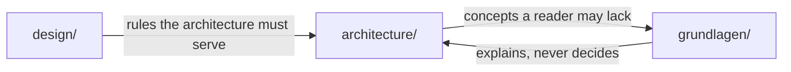

# Hellgate World — Documentation

Post-apocalyptic location-based mobile territory-conquest game. Unity, map view only, server-authoritative.

| Set | Contents | Language |
|---|---|---|
| [design/](design/README.md) | Gameplay rules, entities, loops, balance | English |
| [architecture/](architecture/README.md) | Technical architecture, frameworks, scaling, cost | English |
| [grundlagen/](grundlagen/README.md) | Foundations for developers without geodata / game-server background | **German** |

## Where to start

| Question | Go to |
|---|---|
| What is the game? | [design/README.md](design/README.md) |
| How does a player see the world? | [design/presentation.md](design/presentation.md) |
| What does the client render, and from where? | [architecture/client.md](architecture/client.md), [architecture/map-data.md](architecture/map-data.md) |
| How does live state reach the client? | [architecture/streaming.md](architecture/streaming.md) |
| Which libraries, and how is the code structured? | [architecture/tech-stack.md](architecture/tech-stack.md), [architecture/code-patterns.md](architecture/code-patterns.md) |
| How are 3D assets made? | [architecture/asset-pipeline.md](architecture/asset-pipeline.md) |
| What does it look like before the art exists? | [architecture/placeholder-assets.md](architecture/placeholder-assets.md) |
| Which way does a unit face, and what may it shoot? | [design/facing.md](design/facing.md), [architecture/rotation.md](architecture/rotation.md) |
| What does it cost to run? | [architecture/scaling.md](architecture/scaling.md) |
| No maps / geodata / game-server background? | [grundlagen/README.md](grundlagen/README.md) (German) |
| What was decided, and why? | [design/open-questions.md](design/open-questions.md), [architecture/open-questions.md](architecture/open-questions.md) — decision logs; open items listed at the top of each |

## Layout

| Rule | Detail |
|---|---|
| Decisions | Gameplay in `design/`, technical in `architecture/` |
| Explanation | `grundlagen/` explains concepts; it never holds a rule of its own |
| New concept | Any term a business-application developer would look up needs a `grundlagen/` entry in the same commit — see [CLAUDE.md](../CLAUDE.md) |
