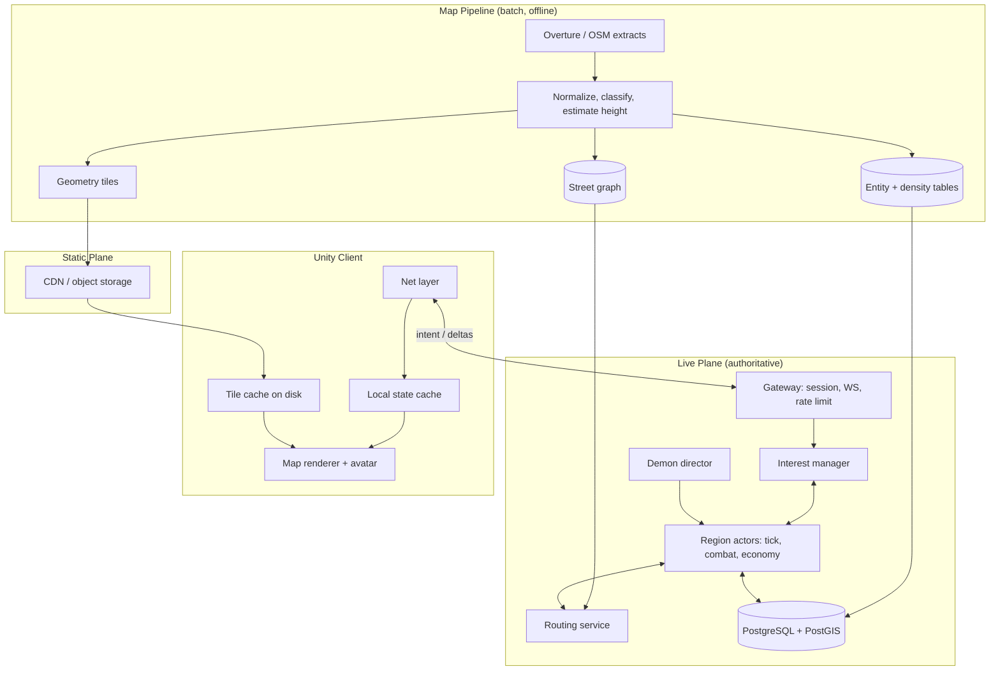

# Hellgate World — Technical Architecture

System architecture for the game described in [Game Design](../design/README.md). Covers client/server split, map data streaming, scaling, framework choices, and cost.

Scope: high-level structure and technology decisions. Not per-loop mechanics, not API schemas.

> **Prerequisite reading.** No background in maps, geodata, tiles, spatial indexes or authoritative game servers? Read [Grundlagen](../grundlagen/README.md) first (German) — it explains every concept used here in terms of business-application equivalents. Chapter pointers appear throughout these files as *Grundlagen:* links.

> Pricing figures: checked 2026-09. Verify before committing — vendor terms change.

## Contents

| File | Contents |
|---|---|
| [map-data.md](map-data.md) | Map Data & Tiles |
| [client.md](client.md) | Client Presentation |
| [streaming.md](streaming.md) | Streaming & Entity State |
| [transport.md](transport.md) | Transport & Protocol |
| [backend.md](backend.md) | Backend & Frameworks |
| [tech-stack.md](tech-stack.md) | Tech Stack: runtimes, libraries, tooling |
| [code-patterns.md](code-patterns.md) | Implementation Patterns: layout, shared code, server and client patterns |
| [asset-pipeline.md](asset-pipeline.md) | Asset Pipeline: sketch → Gemini concept → Blender MCP → Unity prefab |
| [scaling.md](scaling.md) | Scaling & Cost |
| [anti-cheat.md](anti-cheat.md) | Anti-Cheat |
| [live-ops.md](live-ops.md) | Game Config & Metrics |
| [operations.md](operations.md) | Operations, Phases, Risks |
| [open-questions.md](open-questions.md) | Open Technical Questions & Decision Log |

## Constraints

| # | Constraint | Consequence |
|---|---|---|
| C1 | World-scale map data | Client streams interest area only; never holds global state |
| C2 | Cheat resistance | Server authoritative for all simulation; client renders and sends intent |
| C3 | Private project, unknown player count | Cost floor must be near zero; cost scales with active players, not world size |
| C4 | Solo/small team | Prefer one language, one deployable, managed-free-tier services over ops surface |
| C5 | Mobile client (Unity, map view) | Battery, intermittent network, background/foreground churn, GPS jitter |
| C6 | Asynchronous persistent world | World advances while players are offline — without ticking the whole planet |

C3 and C6 together are the dominant forces: **the world is planet-sized, the simulation is not.** Only regions with recent player presence are live.

## Decisions

| Area | Decision | Driver |
|---|---|---|
| Client engine | Unity 6 LTS, no AR Foundation | Given — map view only, camera AR out of scope |
| Client presentation | Single 3D map view, follow camera on the avatar | See [Client Presentation](client.md#client-presentation) |
| Art style | Stylized low-poly, hand-painted, baked lighting | C5 — mobile budget; see [Game Design § Art Direction](../design/presentation.md#art-direction) |
| Map rendering | Custom tile renderer over own geometry tiles | C1, C2, C3 — see [Map Component Evaluation](map-data.md#map-component-evaluation) |
| Map data source | Overture Maps (buildings) + OSM (streets, POI) | Open license, global, height attributes, no per-user fee |
| Static delivery | Immutable versioned tiles on object storage + CDN | Flat cost, offline cache, no per-MAU fee |
| Dynamic delivery | WebSocket + binary deltas, H3-cell scoped | C1, C5 |
| Server language | C# / .NET 10 LTS (shared `netstandard2.1` assembly with Unity) | C4 — one language, shared contracts — see [Tech Stack](tech-stack.md#tech-stack) |
| Client libraries | URP, VContainer, UniTask, R3, Burst/Jobs for mesh build | IL2CPP-safe, no reflection — see [Tech Stack § Client](tech-stack.md#client) |
| Serialization | MemoryPack contracts + hand-written delta bit format | Same generated code on both sides |
| Region actor runtime | Own actor on `System.Threading.Channels`; Orleans re-evaluated on scale-out | Tick-driven single writer — see [Actor Choice](tech-stack.md#actor-choice) |
| Routing engine | Valhalla container, pedestrian costing | Tiled graph, memory follows coverage — see [Routing Engine](backend.md#routing-engine) |
| Scheduled events | PostgreSQL-backed timer queue | Demon loop must survive restarts — see [Timer Queue](backend.md#timer-queue) |
| Code structure | Modular monolith, unidirectional client store | See [Implementation Patterns](code-patterns.md#implementation-patterns) |
| Backend framework | Custom service; OSS commodity backend (Nakama) optional for auth/social | C3 — managed game backends have a fixed monthly floor |
| Persistence | PostgreSQL + PostGIS (durable), in-process region state (hot), Redis (shard map + presence, from the first multi-node deploy) | C3, C4 |
| Spatial index | H3 (simulation + interest), XYZ tiles (static geometry) | Hex neighbourhood, uniform k-ring, stable IDs |
| Deployment | Single container on one small VPS → horizontal shards later | C3 |
| Simulation | Region actors, lazy wake, analytic catch-up for accrual | C3, C6 |
| Asset creation | Paper sketch → Gemini concept → Blender MCP (primitives or Rodin image-to-3D) → manual cleanup → FBX | Solo team throughput; see [Asset Pipeline](asset-pipeline.md#asset-pipeline) |
| Game config | Versioned parameter sets in PostgreSQL, hot reload at tick boundary | Balance tuning without release — see [Game Config & Metrics](live-ops.md#game-config--metrics) |
| Gameplay metrics | Prometheus (aggregates) + event table → ClickHouse later; Grafana dashboards | Measure effect of config changes |

## System Overview

### Two Delivery Planes

Separating static geometry from live state is the core of the streaming design.

| | Static plane | Live plane |
|---|---|---|
| Content | Building footprints, heights, kinds, street rendering data, workshop sites | Ownership, HP, points, units, towers, factories, gates, ground drops, avatars |
| Transport | HTTPS, CDN-cached | WebSocket, binary deltas |
| Mutability | Immutable per version | Per tick |
| Volume | MB per region, cached on device | Bytes per entity per tick |
| Cost driver | Storage + egress (flat) | CPU + connections (per active player) |
| Server load | None (CDN) | Proportional to active players |
| Offline | Works from disk cache | Unavailable |

Consequence: the planet-sized part of the problem is a **file-serving problem**, not a game-server problem.
