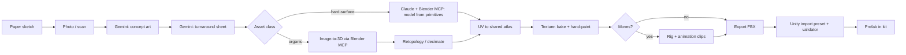

# Asset Pipeline

[← Technical Architecture](README.md)

*Grundlagen: [3D-Assets](../grundlagen/14-3d-assets.md#14-3d-assets-von-der-skizze-zum-prefab).*

How units, structures and props go from a paper sketch to a Unity prefab. Look and feel: [Game Design § Art Direction](../design/presentation.md#art-direction). Render limits: [Render Budget](client.md#render-budget-mobile-target).

> Tools and licence terms: checked 2026-09. AI services change models and terms often — re-check before a production batch.

## Flow

| Step | Tool | Input | Output | Human role |
|---|---|---|---|---|
| 1 Sketch | Paper, phone camera | Idea | Photo, front + side view if possible, notes on the page | Author |
| 2 Concept | Gemini image model (Gemini 3 Pro Image) | Sketch + style bible + faction palette | Coloured concept in art style | Pick, iterate prompt |
| 3 Turnaround | Gemini image model | Chosen concept | Orthographic front / side / back, plain background, neutral light; T-pose for humanoids | Check proportions match |
| 4a Model (hard-surface) | Claude Code + Blender MCP | Turnaround sheet | Low-poly mesh built from primitives and modifiers | Review shape, correct in Blender |
| 4b Model (organic) | Image-to-3D via Blender MCP (Hyper3D Rodin) | Front view or turnaround | High-poly mesh with generated texture | Reject bad generations |
| 5 Retopology | Blender (Decimate, QuadriFlow Remesh, manual) — scripted via MCP | High-poly mesh | Mesh within triangle budget | Fix silhouette, clean artefacts |
| 6 UV + texture | Blender | Low-poly mesh (+ high-poly for baking) | UVs in the kit atlas; albedo with baked AO and light | Hand-paint over the bake |
| 7 Rig + animate | Blender (Rigify); Mixamo for humanoids | Textured mesh | Skeleton, clips: idle, walk, attack, hit, death | Mostly manual |
| 8 Export | Blender FBX export preset | `.blend` | `.fbx` | — |
| 9 Import | Unity `AssetPostprocessor` + validator | `.fbx` | Prefab / prefab variant | Fix validator failures |

## Blender MCP

| Property | Detail |
|---|---|
| Project | `blender-mcp` (MIT): Blender add-on opens a local socket; MCP server forwards tool calls from Claude |
| Client | Claude Code: `claude mcp add blender -- uvx blender-mcp` |
| Tools used | Scene inspection, object create / modify, materials, Python execution, Hyper3D Rodin generation, GLB/FBX export |
| Tools not used | Hunyuan3D (licence, see [Risks](#risks)); Sketchfab / Poly Haven imports only with the licence recorded |
| Safe use | `execute_blender_code` runs arbitrary Python — run on a dev machine, save the `.blend` before each session |

### What to Delegate to Claude

| Good fit | Poor fit |
|---|---|
| Blockout from primitives: towers, factories, barricades, crates, gate frames | Organic faces, hands, creature anatomy |
| Repetitive ops: decimate to a budget, apply modifiers, set pivot, rename, export batches | Artistic UV layout, hand-painting |
| Enforcing budgets: report triangle count, material count, dimensions | Weight painting, animation timing |
| Kit variants: same base mesh with swapped parts per faction | Judging silhouette readability — needs a human at game camera |

### Session Pattern

| Step | Prompt content |
|---|---|
| 1 | Attach turnaround sheet; state asset class, triangle budget, real-world height in metres |
| 2 | Ask for a blockout only — no detail, no materials |
| 3 | Review from the game camera angle (tilted top-down); correct proportions |
| 4 | Ask for detail passes one at a time, triangle count reported after each |
| 5 | Ask for pivot, scale, naming and export per [Model Conventions](#model-conventions) |

## Style Consistency

Many generated assets drift apart in style. Controls:

| Control | Detail |
|---|---|
| Style bible | `art/prompts/style-bible.md`: fixed prompt block (art direction, lighting, outline, palette) prepended to every Gemini request |
| Reference set | 3–5 approved concepts attached as style references to every request |
| Faction palette | One swatch image per faction; kit atlas uses the same swatches |
| Pilot | First three assets (one unit, one tower, one factory) go through the full flow before any batch |
| Camera check | Every concept and model reviewed at game camera distance, in greyscale, for silhouette |

## Budgets

Triangle counts are **estimates**; confirm with device profiling ([Render Budget](client.md#render-budget-mobile-target)).

| Asset class | Triangles (LOD0) | Texture | Rig | LODs |
|---|---|---|---|---|
| Building kit piece | 200–1 500 | Kit atlas | No | 2 |
| Tower | 500–1 500 | Kit atlas | No | 2 |
| Factory | 800–2 000 | Kit atlas | No | 2 |
| Unit | 1 500–4 000 | Faction atlas, 512–1024 px | Yes | 2 |
| Demon | 1 500–5 000 | Demon atlas, 512–1024 px | Yes | 2 |
| Hellgate | 2 000–5 000 | Own texture, 1024 px | Optional | 1 |
| Ground drop / pickup | 50–300 | Props atlas | No | 1 |

## Model Conventions

| Property | Rule |
|---|---|
| Units | 1 Blender unit = 1 m; apply scale before export |
| Axes | Blender default; FBX export with "Apply Transform", Unity Z-forward verified per import preset |
| Pivot | Ground contact point, centred |
| Naming | `<class>_<faction>_<name>_<variant>` e.g. `unit_f1_scout_a` |
| Materials | One material per asset, atlas-based; faction tint via material property, not texture copies |
| Animation clips | `idle`, `walk`, `attack`, `hit`, `death`; in-place, root motion off (movement comes from routes) |
| Damage states | Material / decal parameters, no extra meshes — see [Art Direction](../design/presentation.md#art-direction) |
| Export | FBX; glTF only if a tool needs it |

## Unity Import

| Mechanism | Checks |
|---|---|
| Import preset per folder | Scale, mesh compression, read/write off, animation type (Generic / Humanoid) |
| `AssetPostprocessor` validator | Triangle count vs. class budget, material count = 1, texture size, pivot at ground, clip names |
| Result | Failure → console error + asset excluded from the kit catalogue; CI runs the validator in batch mode |

## Repository

| Path | Content | Storage |
|---|---|---|
| `art/sketches/` | Photos of paper sketches | Git LFS |
| `art/concepts/` | Gemini outputs, chosen and rejected | Git LFS |
| `art/prompts/` | Style bible, per-asset prompts | Git |
| `art/blender/` | `.blend` sources | Git LFS |
| `client/Assets/Game/Art/` | Exported FBX, textures, prefabs | Git LFS |
| `art/provenance.csv` | Per asset: sketch, prompts, model / service used, licence of any imported part | Git |

## Risks

| Risk | Impact | Mitigation |
|---|---|---|
| Image-to-3D output is dense, triangulated, messy topology | Unusable on mobile without cleanup; cleanup can exceed modelling from scratch | Hard-surface assets via primitives (step 4a); image-to-3D only for organic shapes; time-box cleanup |
| Generated textures carry baked perspective lighting and noise | Clash with hand-painted atlas | Rebake onto atlas; paint over; never ship raw generated textures |
| Style drift across batches | Kit looks inconsistent | Style bible, reference set, pilot, camera check |
| Hunyuan3D licence excludes EU, UK and South Korea, including use of outputs | Legal exposure if the team or players are in those territories | Not used; Blender MCP Hunyuan3D integration disabled |
| Rodin and other paid services: commercial rights depend on plan | Outputs from a trial may not be licensed for release | Generate release assets on a plan whose terms allow commercial use; record in provenance |
| AI-only output has weak copyright protection in many jurisdictions | Assets hard to protect against copying | Human sketch, modelling and painting in every asset; provenance file as record |
| Imported library assets (Sketchfab, Poly Haven) | Attribution or licence violations | Import only with licence recorded; prefer CC0 |
| Rigging and animation not automatable | Unit and demon throughput bottleneck | Share one skeleton per body type; reuse clips across variants |
| Service or model discontinued | Pipeline step breaks | Every step's output is a plain file (PNG, FBX, `.blend`); any step can be redone by hand |
