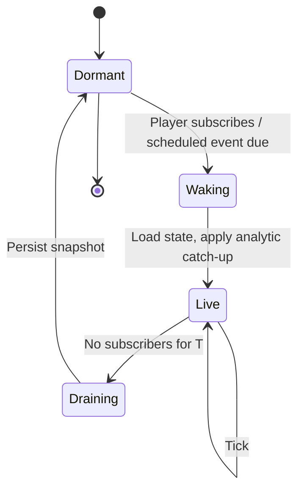

# Backend & Frameworks

[← Technical Architecture](README.md)

## Backend Architecture

*Grundlagen: [Autoritativer Server und Tick](../grundlagen/08-server-tick.md#8-autoritativer-server-und-tick), [PostGIS](../grundlagen/06-postgis.md#6-räumliche-abfragen-mit-postgis), [Routing](../grundlagen/10-routing.md#10-routing-auf-strassengraphen), [Spielbegriffe](../grundlagen/15-spielbegriffe.md#15-spielbegriffe-vokabular-aus-game-design-und-netcode).*

### Components

| Component | Responsibility | State | Scales by |
|---|---|---|---|
| Gateway | TLS, session auth, attestation, rate limits, WS fan-out | Connection state | Connections |
| Interest manager | Cell subscription sets, delta filtering | Per-session cell set | Connections |
| Region actor | Authoritative tick for one H3 r8 region: combat, movement, accrual, conquest | Hot entity state **+ a static footprint index for line of sight** — see [Line of Sight & Impacts](line-of-sight.md#static-geometry-index) | Active regions |
| Routing service | Street-graph routes for unit movement — **Valhalla** in its own container, pedestrian costing, behind `IRouteProvider` | Preprocessed graph | Requests, cacheable |
| Demon director | Hellgate spawn weighting by player presence, wave scheduling | Schedules | Active players |
| Economy / inventory | Points, Essence, loot rolls, crafting, gear | Durable | Players |
| Persistence | Write-behind snapshots + journal to PostgreSQL | Durable | World size |
| Timer queue | Scheduled events (gate spawn, escalation, wave, drop expiry, unit arrival in a dormant region) — **PostgreSQL-backed**, in-memory heap per node | Durable | Scheduled events |
| Notifications | Offline event journal per player → push via FCM (Android) and APNs (iOS) | Durable | Players |

Deployment shape at stage 0: **one process, all components as modules.** The boundaries above are module boundaries, not network boundaries, until load requires splitting. Region actors are the only component that must eventually shard.

### Region Actors

One logical actor per live H3 r8 region. Single-threaded per region → no locks, deterministic ordering, natural sharding unit.

| Region state | Ticking | Cost | What still happens |
|---|---|---|---|
| Live | 2–4 Hz units/combat, 1/60 Hz accrual | CPU per region | Everything |
| Draining | Slow tick | Low | Finish in-flight combat, persist. A region with **pending artillery impacts** does not drain — see [Pending Impacts](line-of-sight.md#pending-impacts) |
| Dormant | None | Storage only | Points accrual computed analytically on wake; scheduled events (gate escalation, unit arrival) held in a timer queue |

This is the mechanism that satisfies C3 and C6: **cost is proportional to live regions, which is proportional to active players** — not to how much of the planet is ingested. Five players with five phones wake at most a handful of regions.

Accrual is closed-form (`points = rate × elapsed`), so dormant buildings need no ticks. Anything not closed-form (combat, unit movement) only occurs where an attacker exists, and an attacker is either a player (present → region live) or a demon wave (scheduled → wakes the region on its timer).

### Routing Engine

| Engine | Verdict | Why |
|---|---|---|
| **Valhalla** | **Chosen** | Tiled graph loads per ingested region, so memory follows coverage; pedestrian costing built in; C++ container with HTTP API; active project |
| OSRM | No | Contraction hierarchies need a full rebuild per data change and hold the whole graph in RAM |
| GraphHopper | No | Java runtime next to .NET; otherwise comparable |
| Itinero (.NET) | No | In-process would be ideal, but maintenance has stalled |

- Route request: unit's nearest street point → street point nearest the goal; the off-road leg is computed by the region actor — see [Game Design § Reachability](../design/rts.md#reachability).
- Cache key `(origin r10 cell, goal r10 cell, costing)`; entries expire with the data version.

### Timer Queue

| Rule | Detail |
|---|---|
| Source of truth | `scheduled_events` table: `due_at`, region, payload, `dedupe_key` |
| Runtime | Per node, an in-memory heap loaded for the node's regions on start and refilled every minute for the next window |
| Wake | A due event for a dormant region wakes it |
| Restart | Nothing is lost; events due during downtime fire on start, in order |
| Reason | Gate escalation, wave timers, drop expiry and unit arrivals must survive a deploy — losing them silently breaks the demon loop |

### Persistence Cadence

| Write | Cadence | Loss window on crash |
|---|---|---|
| Journal (domain events) | Batched `COPY` every 1 s | ≤ 1 s of region events |
| Region snapshot | Every 5 min and on drain | None beyond the journal window |
| Economy, inventory, loot | Durable-first, before the response | None |
| Player position | Last accepted fix, every 30 s | 30 s — only affects the "active player" window |

### Push Notifications

| Rule | Detail |
|---|---|
| Provider | Firebase Cloud Messaging for Android, APNs for iOS, both through one server library (`FirebaseAdmin`) |
| Trigger | Events in the offline journal: building attacked, building lost, tower destroyed, gate opened near own buildings |
| Batching | At most one push per player per 10 min; the push aggregates ("3 buildings under attack") |
| Opt-in | System permission prompt on the first offline attack event, not on install |
| Content | No positions, no rival names — counts and building kinds only |

### Sharding

| Stage | Shape |
|---|---|
| Single node | All regions in one process |
| Sharded | Consistent-hash H3 r8 cell → shard; gateway routes by cell; shard map in Redis |
| Cross-shard | Rare: unit or player crossing a region boundary. Handoff = serialize entity, transfer, ack. Buildings never move, so most entities are shard-static |

| Handoff step | Detail |
|---|---|
| 1 | Source region freezes the entity, serializes it (MemoryPack), sends `Handoff(entity, seq)` to the target node |
| 2 | Target region inserts the entity, journals it, acks with `seq` |
| 3 | Source deletes its copy and journals the removal; until the ack, the entity stays frozen on the source |
| Retry | Source retries with the same `seq`; the target treats a repeated `seq` as idempotent |
| Shard restart | Regions are reloaded from snapshot + journal on whichever node the shard map now assigns; an unacked handoff is re-sent by the source on its next tick |
| Redis | Introduced with the first multi-node deploy (stage 2) — for the shard map and player presence, nothing earlier |

Gateways are stateless with respect to the world and can scale independently of sim shards.

### Loop → Mechanism Mapping

| Game loop | Architectural mechanism |
|---|---|
| Territory (conquest) | Intent validated against server-side position fix; ownership row in PostGIS; delta to subscribers |
| Points economy | Analytic accrual on region wake + periodic materialization; never ticked per building |
| RTS (units, structures) | Region actor tick + routing service; stations are per-unit anchors, engagement is a radius query inside the region; movement streams as route + progress ([Entity Streaming](streaming.md#entity-streaming)) |
| Combat | Deterministic region tick; event-driven when no hostiles present |
| RPG (avatar, gear) | Stateless request/response against economy service; RNG server-side, committed before response |
| Demons (PvE) | Demon director schedules gates weighted by player presence; wakes regions via timer queue |
| Map interaction | Client-side presentation; every consequence is an intent message |

## Framework Evaluation (Backend)

| Framework | Persistent world | Geospatial interest mgmt | Self-host cost floor | Unity SDK | Verdict |
|---|---|---|---|---|---|
| **Custom .NET service** | Yes | Build it (H3 + own filter) | One VPS | Shared C# assembly | **Chosen** |
| **Nakama (OSS, Apache-2.0)** | Partial — matches are session-oriented | No | One VPS | Yes | Optional: auth, friends, chat, leaderboards, storage |
| Heroic Cloud (managed Nakama) | As above | No | Provisioned resources, monthly floor | Yes | No — fixed cost conflicts with C3 |
| Photon Fusion / Quantum | No — room/session model | No | Per CCU / per plan | Yes | No |
| Colyseus | Rooms; a cell could be a room | Manual | One VPS | Yes | Possible, but Node + room model fights the region-actor design |
| SpacetimeDB | Yes — DB + logic, subscription queries ≈ interest management | Via SQL subscriptions | Free tier, then energy-based | Yes | Strong conceptual fit; note vendor/maturity risk and per-operation billing |
| Unity Gaming Services / Netcode | Session-based | No | Per-usage | Native | No |

Rationale for custom over a game backend framework:

- The hard parts here — H3 interest scoping, region lifecycle, GPS validation, street routing — are **not** provided by any of them. What frameworks do provide (rooms, matchmaking, relay) this game does not use.
- C# on both sides means simulation types, validation rules, and math are written once and referenced by the Unity client.
- Cost floor is a VPS, not a plan.

Use OSS Nakama alongside the sim only if social/commodity features are wanted before they are worth writing. Keep it optional and behind the gateway.

Libraries and actor runtime: [Tech Stack § Server](tech-stack.md#server).
