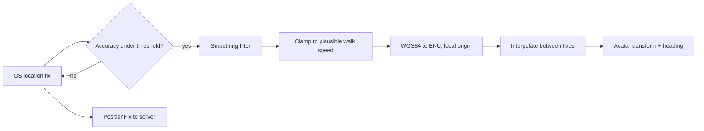

# Client Presentation

[← Technical Architecture](README.md)

*Grundlagen: [Rendering im Unity-Client](../grundlagen/09-rendering.md#9-rendering-im-unity-client), [GPS in der Praxis](../grundlagen/02-gps.md#2-gps-in-der-praxis).*

One view: a 3D world map with the player avatar at the GPS position. **AR Foundation is not a dependency** — no camera feed, no plane detection, no world anchors. Rationale is a design decision, see [Game Design § View & Presentation](../design/presentation.md#view--presentation).

## Client Layers

| Layer | Source | Update |
|---|---|---|
| Tile cache | CDN, immutable per data version | On cell enter, disk-cached |
| Street / ground | Geometry tiles | With tile |
| Buildings | Geometry tiles, extruded + authored models | With tile; material swap on ownership delta |
| Live entities (units, towers, gates, drops, avatars) | WebSocket deltas | Per tick |
| Avatar | Local GPS pipeline | 0.2–1 Hz fix, interpolated per frame |
| Interaction ring | Server-sent radius from active game config | On `ConfigUpdate` |
| HUD | Local state cache | Per state change |

Own-building tint, HP and selection are material/overlay changes on already-loaded meshes — a delta never triggers a tile reload.

## Camera

| Property | Value |
|---|---|
| Type | Follow camera, locked to the avatar |
| Pitch | Tilted top-down, user-adjustable inside a clamped band |
| Yaw | User rotation; snap-to-north control |
| Zoom | Clamped band, limits from device profiling; drives LOD and entity label density |
| Free pan | Temporary, clamped to the subscribed area; recentres on the avatar on release or timeout |

Camera state is client-local and never sent to the server. Interest subscription follows the **GPS position**, not the camera — panning does not widen the subscription set.

## Avatar Position Pipeline

- Client-side smoothing is **presentation only**. Every presence check runs against the server's own accepted fix ([Anti-Cheat](anti-cheat.md#anti-cheat)).
- Heading comes from course over ground; compass fusion only below walking speed, where course is noise.
- Floating origin: the ENU origin follows the player and is shifted past a distance threshold.

## Render Budget (mobile target)

| Item | Target |
|---|---|
| Draw calls | Low hundreds — GPU instancing per building kind |
| Buildings in view | Hundreds in a dense core, LOD-reduced beyond the near band |
| Live entities in view | Tens |
| Frame rate | 30 fps sustained; the loop has no twitch input |
| Battery | No camera, no continuous tracking; GPS at 0.2–1 Hz is the main draw |

The low-poly art direction is a budget decision as much as a look:

| Choice | Consequence |
|---|---|
| Low triangle counts per asset | Vertex cost stays flat as building density rises |
| Shared texture atlas per kit | Same material → instancing and batching actually apply |
| Baked lighting and AO in the albedo | One directional light; no per-pixel light loops on mobile GPUs |
| Ownership colour as material property | Own-building tint toggles per instance, no mesh or atlas swap |
| No mesh destruction | Damage is a material/decal state — no runtime mesh generation |

Background and foreground churn is a streaming case, not a rendering case — see [Reconnect & Offline](streaming.md#reconnect--offline).
