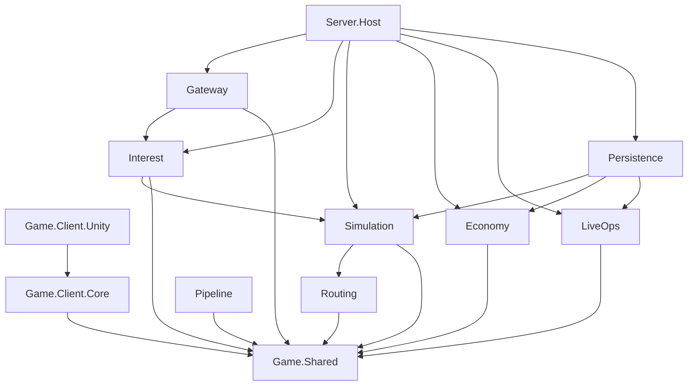
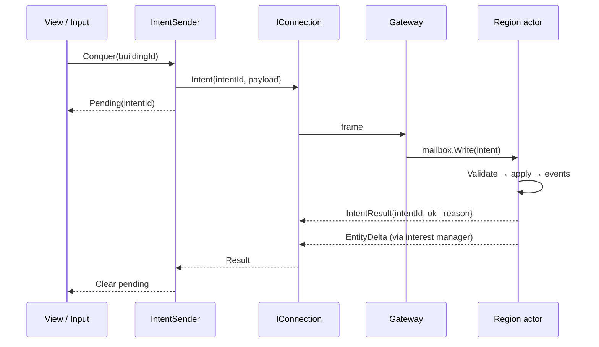
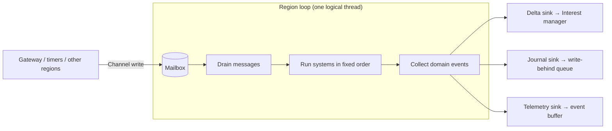
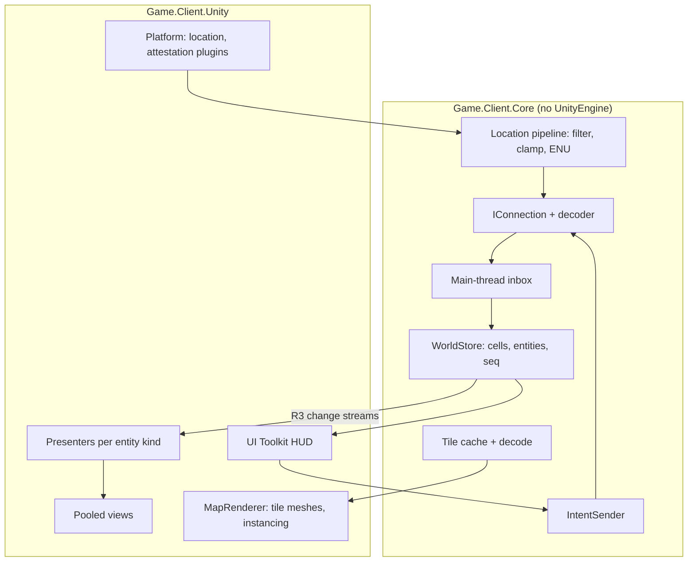
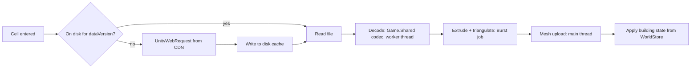

# Implementation Patterns

[← Technical Architecture](README.md)

*Grundlagen: [Unity und .NET](../grundlagen/13-unity-dotnet.md#13-unity-und-net-ein-code-zwei-laufzeiten), [Mailbox und Write-Behind](../grundlagen/08-server-tick.md#mailbox-und-write-behind).*

Code structure and rules that implement the architecture. Libraries: [Tech Stack](tech-stack.md#tech-stack).

## Repository Layout

```
/client/                    Unity project
  Assets/Game/
    Core/                   Game.Client.Core      (asmdef, noEngineReferences)
    Unity/                  Game.Client.Unity     (views, rendering, platform)
    Tests/                  EditMode + PlayMode
  Packages/manifest.json    references ../src/Shared via file:
/src/
  Shared/                   Game.Shared           (.csproj + package.json + .asmdef)
  Server/
    Host/                   Game.Server.Host      (composition root, Program.cs)
    Gateway/                Game.Server.Gateway
    Interest/               Game.Server.Interest
    Simulation/             Game.Server.Simulation
    Economy/                Game.Server.Economy
    Routing/                Game.Server.Routing
    Persistence/            Game.Server.Persistence
    LiveOps/                Game.Server.LiveOps   (config, telemetry)
  Pipeline/                 Game.Pipeline
/tests/                     Server, Shared, Pipeline test projects
/deploy/                    compose files, SQL migrations
/docs/
```



| Rule | Enforcement |
|---|---|
| Dependencies point toward `Game.Shared`, never back | Project references; `Game.Shared` has none |
| Server modules talk through interfaces owned by the consuming module | NetArchTest in CI |
| Persistence implements repository interfaces declared in domain modules | Domain modules do not reference Npgsql |
| Only `Server.Host` knows all modules | Composition root |
| `Game.Client.Core` has no `UnityEngine` reference | `noEngineReferences: true` in asmdef |

## Shared Assembly Rules

`Game.Shared` holds what both sides must interpret **identically**. It holds no rule the server decides.

| Belongs in Shared | Stays on the server |
|---|---|
| Message contracts, `ProtocolVersion` | Intent handlers, validation |
| Entity IDs, kinds, enums | Combat, conquest, accrual |
| Tile codec (writer + reader) | Vision filter, interest sets |
| Delta bit writer / reader | Routing, loot rolls |
| Quantization, WGS84 ↔ ENU | Anti-cheat plausibility |
| Route evaluation `route(speed × Δt)` | Config values (client receives them via `ConfigUpdate`) |
| Config schema types (for admin tooling and `ConfigUpdate`) | Config storage and activation |

- Client-side checks (e.g. greying out a button outside the interaction ring) are UX hints only. The server never skips its own check.
- No cross-platform float determinism required: the client never simulates, so no fixed-point math.

### Language Limits

Shared code compiles under Unity 6 LTS: C# 9, `netstandard2.1`.

| Allowed | Not allowed in Shared |
|---|---|
| `record`, `init` (with an `IsExternalInit` shim) | File-scoped namespaces (C# 10) |
| Pattern matching, switch expressions | `required` members, raw string literals (C# 11) |
| `Span<T>`, `ReadOnlySpan<T>`, `ArrayPool<T>` | Primary constructors on classes (C# 12) |
| Source generators (MemoryPack) | `System.Text.Json` source-gen, `Frozen*` collections, `TimeProvider` |
| Interfaces, generics | Reflection, `dynamic`, `Expression.Compile` |

Server and pipeline projects use the latest C# freely; the limits apply to `Game.Shared` only.

## Protocol Pattern



| Rule | Detail |
|---|---|
| Envelope | `[type u16][length varint][MemoryPack body]`; one frame per WebSocket binary message |
| Union types | `[MemoryPackUnion]` over `IClientMessage` / `IServerMessage`; tag IDs never reused |
| Evolution | `GenerateType.VersionTolerant`; add fields at the end; bump `ProtocolVersion` on removal or retype |
| Handshake | Client sends `ProtocolVersion`; server answers `UpdateRequired` below its minimum |
| Intent ID | Client-generated GUID; server keeps a per-session LRU of recent IDs → duplicate returns the stored result |
| No outcome messages | Client message types are intents and fixes only — reviewed in PR, asserted by a contract test listing all client types |
| Pending state | Client shows "pending", never applies the expected outcome; state changes only via deltas |

## Server Patterns

### Modular Monolith

- One process, one container. Modules are projects with `internal` implementations and public interfaces.
- Cross-module calls are in-process interface calls or `Channel<T>` handoffs — never shared mutable state.
- A module is split into its own service only when [Scaling](scaling.md#scaling-model) demands it; the interface becomes a network client.

### Region Actor



| Rule | Detail |
|---|---|
| Single writer | Only the region loop mutates region state; no locks inside simulation code |
| Mailbox | Bounded `Channel<IRegionMessage>`; full mailbox → intent rejected with `Busy`, never blocks the gateway |
| Tick | `PeriodicTimer` at the region's rate; event-driven wake when no hostiles are present |
| No I/O in the tick | No `await` on database, network or routing inside systems; results come back as mailbox messages |
| Systems | Stateless classes with one method `Run(RegionState, TickContext)`; order fixed in one list: Movement → Engagement → Combat → Conquest → Accrual → Despawn |
| State | Plain classes and arrays per region, indexed by cell-local ID; no ECS library |
| Time | `TickContext.Now` from injected `TimeProvider`; `DateTime.UtcNow` banned in `Game.Server.Simulation` (analyzer rule) |
| Config | `TickContext.Config` read once per tick from a volatile reference; swap happens between ticks |
| Randomness | `IRandomSource` injected; loot seeds from `RandomNumberGenerator`, logged with the roll |
| Faults | Exception in an intent handler → intent rejected, region keeps running. Exception in a system → region faulted, reloaded from snapshot + journal |
| Allocation | Pooled buffers (`ArrayPool`, `IBufferWriter<byte>`) for serialization; no LINQ in systems |

### Intent Handling

```csharp
interface IIntentHandler<TIntent> where TIntent : IIntent
{
    IntentOutcome Handle(RegionState state, TIntent intent, IntentContext ctx);
}
```

| Step | Responsibility |
|---|---|
| Resolve | Gateway maps session → player → region; forwards to mailbox |
| Validate | Handler checks ownership, server-side position fix, balance, config limits |
| Apply | Handler mutates region state and appends domain events to `ctx.Events` |
| Outcome | `Accepted` or `Rejected(reason)`; reason is an enum shared with the client |

One handler per intent type, registered in DI; no switch statements over intent types.

### Domain Events → Sinks

A domain event (`BuildingConquered`, `UnitDamaged`, …) is the single source for three outputs:

| Sink | Output | Blocking the tick |
|---|---|---|
| Delta | Field-mask deltas per cell, after vision filter | No — handed to interest manager |
| Journal | Append to write-behind queue; batched `COPY` to PostgreSQL | No |
| Telemetry | Gameplay event with `configVersion` | No — dropped and counted on overload |

Rule: simulation code never builds a wire message or a SQL statement directly.

### Persistence

| Pattern | Detail |
|---|---|
| Write-behind | Journal and snapshot writes go through a bounded queue drained by a background writer |
| Snapshot | Full region state serialized (MemoryPack) on drain and every N minutes |
| Recovery | Load latest snapshot → replay journal entries after it → apply analytic catch-up |
| Durable-first writes | Economy and inventory changes (Essence, gear, loot) commit to PostgreSQL **before** the result is sent — see reroll rule in [Anti-Cheat](anti-cheat.md#anti-cheat) |
| Repositories | Interfaces in the domain module, Dapper implementations in `Game.Server.Persistence` |
| SQL | Hand-written, parameterized; spatial queries use `ST_DWithin` on `geography` |

### Server Testing

| Level | Tool | Scope |
|---|---|---|
| Simulation unit | NUnit, `FakeTimeProvider`, fixed `IRandomSource` | One system or handler on a hand-built `RegionState` |
| Scenario | NUnit, in-process region loop stepped manually | Sequence of intents + ticks → expected events |
| Contract | NUnit | Round-trip every message; client message types are intents only; union tags stable |
| Persistence | Testcontainers PostGIS | Repositories, migrations, snapshot + journal recovery |
| Architecture | NetArchTest | Module dependency rules, banned APIs |
| Load | Headless bot clients (console, `Game.Shared` contracts) | Connections, tick duration per region |

## Client Patterns

### Layers



| Rule | Detail |
|---|---|
| Unidirectional | Server message → store → presenter → view. Input → intent → server. Views never write the store |
| Store is a mirror | `WorldStore` applies snapshots and deltas only; gap in `seq` → request cell snapshot |
| Thread boundary | Socket receive and decode on worker threads; store mutation on the main thread via inbox drain, capped per frame |
| Views are dumb | `MonoBehaviour` sets transform, material properties, animation; no game rules |
| Facing | `base` and `turret` yaw come from the shared step function in `Game.Shared`, called per frame by the presenter — the same code the region actor calls per tick; see [Rotation & Facing](rotation.md#shared-step-function) |
| Prefab binding | Views resolve `base` / `turret` / `muzzle` by name, so a placeholder primitive and an authored model are interchangeable — see [Prefab Contract](placeholder-assets.md#prefab-contract) |
| Pooling | Units, demons, drops, markers come from pools; no `Instantiate` / `Destroy` per delta |
| Buildings | No GameObject per building; one mesh per tile chunk, ownership tint as per-instance property |
| Replaceable edges | `IConnection`, `ILocationSource`, `ITileSource`, `IMapRenderer` — interfaces in Core, implementations in Unity layer |
| Composition | VContainer `LifetimeScope` per scene; no singletons, no `FindObjectOfType` |
| Async | UniTask with `CancellationToken` tied to scope lifetime; no `async void` |

### Tile Loading



- Cache key: `dataVersion/z/x/y`. Old versions deleted on version change.
- Mesh upload is budgeted per frame to avoid hitches on cell entry.

### Location Sources

| Source | Use |
|---|---|
| Device (native plugin) | Builds on device |
| GPX replay | Editor and automated tests — recorded real walks, including bad-accuracy segments |
| Editor joystick | Manual testing in the editor |

Selected in the `LifetimeScope`; everything downstream is identical.

### Client Testing

| Level | Tool | Scope |
|---|---|---|
| Core logic | EditMode tests (NUnit) | Store apply/gap handling, location filter, intent pending state |
| Codec | Shared test project on .NET | Tile and delta round-trips, golden files from the pipeline |
| Rendering smoke | PlayMode tests | Tile → mesh → visible, no exceptions, frame time under budget on a fixture tile |
| Device | Manual + GPX replay builds | GPS, battery, background/resume |

## Cross-Cutting Rules

| Topic | Rule |
|---|---|
| Nullable | Enabled everywhere; warnings are errors in CI |
| Naming | .NET conventions; `Async` suffix for awaitables; intent types end in `Intent`, events in past tense |
| Logging | Structured, event IDs per module; no player position in logs |
| Configuration | Infrastructure via `IOptions<T>`; gameplay values only via active game config — see [Game Config](live-ops.md#game-config) |
| Magic numbers | Gameplay constants in code are a review blocker |
| Feature work order | Contract in Shared → server handler + scenario test → client store + presenter → view |
