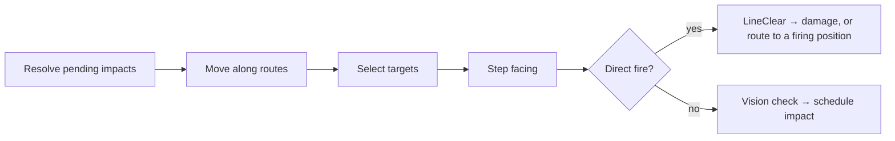

# Line of Sight & Impacts

[← Technical Architecture](README.md)

*Grundlagen: [Räumliche Indizes](../grundlagen/05-indizes.md#5-räumliche-indizes), [Spielbegriffe § Sichtlinie und indirektes Feuer](../grundlagen/15-spielbegriffe.md#sichtlinie-und-indirektes-feuer).*

Rules and values: [Game Design § Line of Sight & Indirect Fire](../design/line-of-sight.md#line-of-sight--indirect-fire). This file covers how the test is computed inside a 2 Hz tick without a physics engine.

## Principle

The world is extruded footprints, not a 3D scene. A sight line is therefore a **segment–polygon test with a height comparison**, not a ray cast against triangles.

| Approach | Cost | Verdict |
|---|---|---|
| **Segment vs. footprints, R-tree pre-filter** | One envelope query, a handful of intersection tests | **Chosen** |
| Ray cast against a 3D collision world (BEPUphysics, Jolt) | Build and hold a mesh world per region | No — a 3D structure to answer a 2D question |
| Navmesh ray cast (DotRecast, the C# port of Recast/Detour — what Unity's NavMesh is) | Navmesh generation per region | No — units walk streets, not free space. Keep in mind only if free movement is ever wanted |
| PostGIS `ST_Intersects` per test | A database round trip inside the tick | No — bulk and precomputation only |

## Static Geometry Index

Buildings do not move, so the index is built once per region and reused for every test.

| Property | Detail |
|---|---|
| Built | On region wake, from the PostGIS entity table |
| Extent | The r8 region **plus its six neighbours** — a 120 m artillery range crosses a 460 m cell edge |
| Contents | Footprint ring and height for **every** building, including `kind = Scenery` — anything the player can see must block, whether or not it is conquerable |
| Structure | `STRtree` of `PreparedGeometry` (NetTopologySuite, already in the stack) |
| Size | ~2 000 footprints per urban region, well under 1 MB |
| Invalidation | Rebuilt on a data version switch, at the same tick boundary as the version change |
| Lifetime | Dropped when the region goes dormant |

## The Test

```
bool LineClear(Point a, double aHeight, Point b, double bHeight)
    segment  = (a, b)
    for each candidate in tree.Query(segment.Envelope)      // O(log n), few hits
        if not candidate.Intersects(segment) continue
        (t0, t1) = crossing interval of the segment through the footprint
        lineHeight = min(lerp(aHeight, bHeight, t0), lerp(aHeight, bHeight, t1))
        if candidate.Height >= lineHeight return false      // blocked
    return true
```

| Property | Value |
|---|---|
| Cost | One envelope query plus a few intersection tests — microseconds |
| Candidates | Typically under 10 at 40 m range, under 30 at 120 m |
| Height source | The `height` column of the entity table, the same value the client extrudes from |
| Determinism | Pure function of replicated state and static geometry; no clock, no random |
| Cadence | At most 1 Hz per attacker–target pair, cached with the one-second grace from the design rule |

The client never runs this test. It receives routes and damage, not permissions — see [Client-Side Handling](streaming.md#client-side-handling).

## Firing Position Search

Runs on target selection, not per tick, and reuses the existing route call.

| Step | Detail |
|---|---|
| 1 | Route from the unit to the target through the existing `IRouteProvider` (Valhalla) |
| 2 | Sample the route polyline every **5 m** |
| 3 | First sample that is in weapon range **and** passes `LineClear` is the firing position |
| 4 | Reject samples outside the station radius |
| 5 | Truncate the route there and stream it as an ordinary `RouteSet` — one record, 40–200 B |
| Cost | 20–50 samples for a 100 m route, once per retarget |
| No hit | Target skipped; the actor takes the next by target order |

This is why the search runs on the route rather than over free space: the answer is a **path the unit can actually walk**, and it costs nothing extra on the wire.

## Pending Impacts

Indirect fire is the only delayed effect in combat. It lives in region state, not in the timer queue — the queue is for durable, long-horizon events, and a shell lands within 6 s.

| Property | Detail |
|---|---|
| Record | `(attackerId, aimPoint, impactTick, damage, ownerId)` — a few bytes, in region state |
| Resolution | At `impactTick`: query hostile entities within the impact radius of `aimPoint`, apply damage |
| Query | The region's existing entity-by-cell index; no geometry involved |
| Region sleep | A region with pending impacts **does not drain**. Shells always land |
| Persistence | Journalled with the rest of region state; a restart replays them |
| Ordering | Impacts resolve before target selection in the tick, so a unit killed by a shell is not also shot at |

### Wire Format

The client draws the arc; the server never simulates a projectile.

| Field | Size | Sent when |
|---|---|---|
| `ShellFired(attackerId, aimPoint, impactTick)` | 10–14 B | On fire only — artillery reloads for 5 s |
| Impact | — | Not sent. It is visible as the HP deltas it causes |

The arc, the smoke and the impact effect are animation between two known endpoints. Nothing about the flight path crosses the wire.

## Tick Order



## Testing

| Level | Check |
|---|---|
| Shared unit test | `LineClear` against fixtures: line grazing a corner, tower shooting over a low building, target inside a courtyard, segment collinear with a wall |
| Golden geometry | A committed fixture region; the test asserts exact blocked/clear pairs so a NetTopologySuite upgrade cannot silently change answers |
| Scenario test | Unit with a blocked target walks the street route and starts dealing damage at the computed firing position |
| Scenario test | Shell fired at a walking unit deals no damage; the same shell against a tower does |
| Benchmark | `LineClear` p99 in a dense fixture region, and the per-tick total at 50 engaged units |

## Risks

| Risk | Impact | Mitigation |
|---|---|---|
| Server and client disagree on geometry | The client shows a clear shot that deals no damage | Both consume the same pipeline output — the entity table and the tile are written from the same simplified rings in the same run |
| Scenery buildings missing from the index | Units shoot through visible houses | The index loads all footprints, not only conquerable ones; a test asserts scenery is present |
| Corner flicker | Units stutter between firing and walking | One-second re-test cadence plus the clear-grace from the design rule |
| Cost spike in a dense fight | Tick budget | Per-pair cadence caps the test count; the benchmark is the gate |
| Pending impacts lost on restart | Shells vanish | Journalled with region state; the drain rule keeps the region alive until they land |
| Index memory across many live regions | Footprint per region adds up | Under 1 MB per region, dropped on dormancy; measured with the region count in the scale-out metrics |
