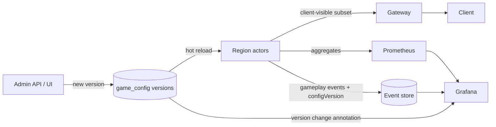
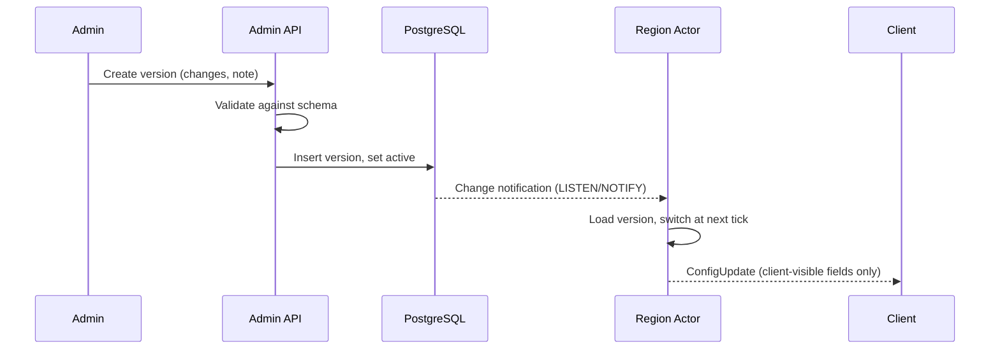

# Game Config & Metrics

[← Technical Architecture](README.md)

*Grundlagen: [Live-Konfiguration und Spielmetriken](../grundlagen/12-live-konfiguration.md#12-live-konfiguration-und-spielmetriken).*

Serves the design rule: every gameplay number is backend configuration — see [Game Design § Balance Parameters](../design/balance.md#balance-parameters). Two parts: change values at runtime, measure the effect.

## Game Config

| Property | Decision |
|---|---|
| Storage | PostgreSQL table of **immutable config versions**; one active pointer |
| Schema | Typed parameter set in the shared C# model assembly; min / max / unit per field |
| Validation | Server rejects a version that fails the schema before activation |
| Audit | Each version stores author, timestamp, change note |
| Rollback | Re-activate an earlier version; no edit-in-place |
| Scope | Global default; per-region override added only when needed (stage 2+) |
| Activation | Region actors switch at a tick boundary — one tick never mixes two versions |
| Client | Receives only values it must display (e.g. interaction ring radius) via a `ConfigUpdate` message |
| Authority | Client never sends a config value; every rule check reads the server's active version |
| Admin access | Admin role only; stage 0–1: admin API + minimal page, later a proper UI |

## Gameplay Metrics

Two data kinds, two stores — they answer different questions.

| Kind | Example | Store | Why |
|---|---|---|---|
| Aggregate metric | Conquests per minute, live regions, tick duration | Prometheus | Cheap counters and histograms; alerting |
| Gameplay event | `ConquestAttempted(distance, gpsAccuracy, result, densityClass, faction, configVersion)` | PostgreSQL table (stage 0–1) → ClickHouse (stage 2+) | Per-event detail, grouping by any field |

- Prometheus labels stay low-cardinality: no player ID, no entity ID, no cell ID.
- Every gameplay event carries `configVersion`, so dashboards split results by version.
- Grafana reads both stores; config activations are written as Grafana annotations.

### Event Pipeline

| Rule | Detail |
|---|---|
| Emission | Region actor appends to an in-process buffer; never blocks the tick |
| Write | Batched insert every few seconds |
| Overload | Drop events and count the drops — simulation wins over telemetry |
| Schema | Versioned event types in the shared model assembly |
| Retention | Raw events time-limited; daily aggregates kept longer |

### Privacy

| Rule | Detail |
|---|---|
| No raw positions | Events store density class or a coarse H3 cell (r7), never a GPS fix |
| Player reference | Pseudonymous ID, not account data |
| Retention | Raw events deleted after the retention window |

### Dashboards

| Dashboard | Content |
|---|---|
| Balance | Metrics from [Metrics per Parameter](../design/balance.md#metrics-per-parameter), split by config version and density class |
| Economy | Points and Essence income and spend per session |
| Factions | Ownership share per region over time |
| Server health | Tick duration, live regions, connections, dropped events |

## Stages

| Stage | Config | Metrics |
|---|---|---|
| 0–1 | Postgres versions, admin API | Prometheus + Grafana OSS on the same host; events in Postgres |
| 2+ | Per-region overrides | Events move to ClickHouse when Postgres queries slow down; Grafana Cloud or self-hosted |
