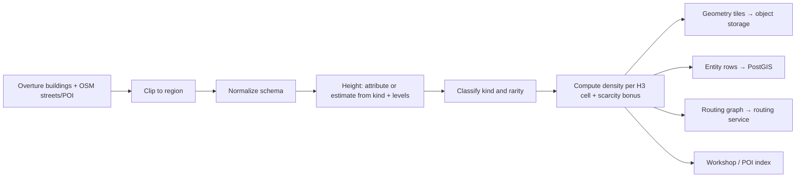

# Map Data & Tiles

[← Technical Architecture](README.md)

## Map Component Evaluation

*Grundlagen: [Kacheln](../grundlagen/04-kacheln.md#4-kacheln-tiles-pagination-für-die-welt), [Geodatenquellen](../grundlagen/03-geodaten.md#3-geodaten-quellen-modell-lizenz), [Rendering](../grundlagen/09-rendering.md#9-rendering-im-unity-client).*

The game does not need a map — it needs **buildings as simulation entities**. Ownership, HP, and points attach to a specific building the server also knows about. That requirement eliminates most map SDKs: a rendering SDK draws its own geometry from its own IDs, which the server cannot reference or validate.

| Option | 3D buildings | Stable IDs shared with server | Cost model | Maintenance risk | Verdict |
|---|---|---|---|---|---|
| **Mapbox Maps SDK for Unity** | Yes (extruded) | No — Mapbox tile features, not game entities | Per MAU; free tier ~25k MAU, then ~$4/1k MAU | Unity SDK trails the mobile SDKs | Prototype only |
| **ArcGIS Maps SDK for Unity** | Yes (3D scene layers) | Partial (Esri feature IDs) | Credits / ArcGIS Location Platform; pay-as-you-go above free tier | Vendor-tied, enterprise-oriented | No |
| **Cesium for Unity + Google Photorealistic 3D Tiles** | Photogrammetry mesh | No — mesh, not per-building objects | Per root-tile request, enterprise SKU | Low | No — cannot address single buildings |
| **Cesium for Unity + own 3D Tiles** | Yes | Yes (own data) | Self-host storage | Low (Apache-2.0) | Viable alternative to custom renderer |
| **Google Maps gaming SDK** | — | — | — | Discontinued 2021 | Not available |
| **Custom: own tiles + own renderer** | Yes | Yes | Storage + egress only | Own code | **Chosen** |

### Chosen: Custom Tile Pipeline

- Server and client consume the **same** building IDs, derived from Overture GERS / OSM IDs.
- Geometry ships as compact binary tiles (footprint polygon, height, kind, entity ID) — not styled basemap tiles.
- Renderer: extrude footprints in Unity, swap in authored low-poly models per building kind/faction. Art style is stylized post-apocalyptic — photoreal basemaps are the wrong look and the wrong cost.
- Cost decoupled from player count: object storage + CDN, no per-MAU licensing.
- Cloudflare R2 (zero egress fee) or Backblaze B2 preferred over S3/GCS for the tile bucket.

| Risk | Mitigation |
|---|---|
| Renderer work is ours | Scope is narrow: extruded polygons + LOD + instancing, no labels, no basemap styling |
| Data gaps | Coverage cascade already defined in the design doc (footprints → POI → road nodes) |
| ODbL attribution/share-alike on OSM-derived data | Attribution screen; keep derived map data separable from game state; Overture attribution rules per source |

Fallback for a fast prototype: Mapbox Unity SDK for visuals with a server-owned entity overlay, replaced before public release. Keep the renderer behind an interface from day one.

## Map Data Pipeline

*Grundlagen: [Koordinaten](../grundlagen/01-koordinaten.md#1-koordinaten-und-projektionen), [Geodaten](../grundlagen/03-geodaten.md#3-geodaten-quellen-modell-lizenz), [Kacheln](../grundlagen/04-kacheln.md#4-kacheln-tiles-pagination-für-die-welt).*

Batch job, offline, versioned. Runs per region on ingest and on data refresh — never in the request path.

| Artifact | Format | Consumer | Refresh | Notes |
|---|---|---|---|---|
| Geometry tiles | Binary, z15 XYZ, gzip/br | Client | Per data version | ~10–100 KB per urban tile |
| Entity table | PostGIS rows | Server | Per data version | ID, centroid, footprint, kind, volume, cell |
| Density / scarcity table | Per H3 r8 cell | Server | With entity table | Feeds `scarcity_bonus`, caps, interest radius |
| Street graph | Routing-engine build (Valhalla / GraphHopper / OSRM) | Routing service | Per data version | Never shipped to client |
| Coverage report | Per cell quality score | Ops | Per data version | Flags unplayable / synthetic-only cells |

- Data versions are immutable; tile URLs carry the version (`/v/{dataVersion}/{z}/{x}/{y}.bin`) so CDN caching is unbounded and clients never see torn data.
- Ingest is regional, on demand: ship the cities you have players in first. Planet ingest is a cost decision, not a prerequisite.

### Tile Payload

What a geometry tile contains — the admission rule is **immutable per data version and identical for every player**.

| Record | Fields | Notes |
|---|---|---|
| Header | `dataVersion`, `tileId`, origin, record counts | Origin anchors all tile-local coordinates |
| Building | `entityId`, footprint ring(s), `height`, `kind`, centroid | `entityId` derived from GERS/OSM — the key the server uses too |
| Street | polyline, `class`, width class | Rendering only; the routing graph stays server-side |
| Ground / landuse | polygon, `class` | Optional per region |
| Workshop site | `siteId`, position, POI category (school, train station) | Static per data version — ships in the tile, not as a live entity |

- Coordinates are tile-local fixed point: `uint16` per axis against the tile origin ≈ 2 cm resolution at z15. No doubles in the payload.
- Heights are `uint16` in decimetres.
- Meshes are **not** shipped. The tile carries footprints and classes; the client builds geometry by extrusion and by picking a model from the local low-poly kit (see [Client Presentation](client.md#client-presentation)).

Explicitly **not** in a tile:

| Excluded | Why | Where it lives |
|---|---|---|
| Ownership, HP, points rate | Changes per tick, differs per player | Entity delta |
| Towers, factories | Player-created | Entity delta |
| Units, demons, avatars | Mobile and player-created | Entity delta |
| Hellgates | Spawned at runtime | Entity delta |
| Workshop occupancy (crafting, duel) | Transient state of a static site | Entity delta, keyed by `siteId` |

Consequence: a building's *shape* comes from the CDN once per data version; its *state* comes from the socket. A conquest changes a material property on an already-loaded mesh — it never invalidates a tile.
