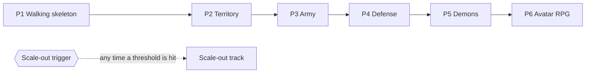

# Operations, Phases, Risks

[← Technical Architecture](README.md)

## Operations

| Concern | Stage 0–1 | Stage 2+ |
|---|---|---|
| Deploy | `docker compose` on one host, image from CI | Rolling deploy, multiple nodes |
| Config | Env vars (infrastructure); versioned game config with hot reload — see [Game Config](live-ops.md#game-config) | Per-region overrides |
| Logs | Structured JSON to disk | Shipped to a log service (free tier first) |
| Metrics | Prometheus + Grafana on box; gameplay events in Postgres — see [Gameplay Metrics](live-ops.md#gameplay-metrics) | Grafana Cloud / self-hosted stack; events in ClickHouse |
| Errors | Sentry free tier | Paid tier |
| Backups | `pg_dump` to object storage, nightly | Managed PITR |
| Map data refresh | Manual pipeline run | Scheduled, with coverage diff report |

## Build Phases

Each phase is a **vertical slice**: a playable increment through client, server, persistence and deployment. No phase delivers one layer alone.

Phases are cut into features in [Feature Backlog](../features/README.md). P1 is [F01–F05](../features/README.md#contents).

| Phase | Slice | Player can | Stack added |
|---|---|---|---|
| P1 | Walking skeleton | Log in, see own avatar walking on the map anywhere; full map detail in ingested regions, plain ground elsewhere | Sign in with Apple / Google + JWT, WebSocket gateway, `PositionFix` with server plausibility check, map pipeline for first regions, tile renderer, follow camera, placeholder primitive kit, CI, container deploy, Sentry, first metric, TestFlight / Play internal track |
| P2 | Territory | Choose a faction, conquer neutral buildings, earn Points, see rival ownership inside sight radius | Region actor, PostGIS entities, interest manager, deltas, vision filter, reconnect, GPS anti-cheat, native location plugin, game config versions, balance dashboard |
| P3 | Army | Place factories, produce units, set stations, attack rival buildings | Routing service, combat tick, route + progress streaming, facing model and fire gate, write-behind persistence |
| P4 | Defense | Place towers, shield buildings, repair; get notified of attacks while offline | Tower shield rules, event journal per player, push notifications |
| P5 | Demons | Face hellgates and demon waves attacking buildings, close gates, pick up Essence | Demon director, timer queue for dormant regions, ground drops |
| P6 | Avatar RPG | Level up, equip and craft gear, use workshops, duel | Economy / inventory service, server-side rolls, workshop sites |

### Slice Rules

| Rule | Detail |
|---|---|
| Done means deployed | A phase ends with a store test build against the deployed server, not a local demo |
| Thin first | Each slice ships the minimum of every layer; depth is added in later slices |
| Map coverage | Regions ingested on demand; uncovered areas render plain ground with a no-data hint — no planet ingest before stage 2 |
| Order change | P4 and P5 may swap if buildings need a threat before towers are useful |
| Art is not a gate | Every entity kind ships as a primitive from its first phase; authored assets replace it later, per asset — see [Placeholder Assets](placeholder-assets.md#phase-mapping) |

### Scale-Out Track

Not a phase. Starts when a measured threshold is reached, independent of the slice in progress. Stages: [Scaling Model](scaling.md#scaling-model).

| Trigger (any) | Action |
|---|---|
| Peak tick duration of busiest region near its budget | Profile first, then split regions across processes |
| Live regions or connections beyond one node's measured capacity | Shard map, stateless gateway tier, Redis |
| Postgres write latency affects the write-behind queue | Separate database host, then managed Postgres |
| Sustained growth toward stage 2 player counts | Planet tile ingest, multi-node deploy |

## Risks

| Risk | Impact | Mitigation |
|---|---|---|
| Custom renderer underestimated | Schedule | Narrow scope (extrusion + instancing); SDK fallback behind an interface |
| Map data quality per region | Playability | Coverage cascade + per-cell quality score; gate region launch on the score |
| ODbL share-alike interpretation | Legal | Keep derived map data as a separable produced work; attribution screen; avoid mixing game state into distributed map data |
| Region actor hot spots (mass events) | Latency | Per-region tick throttling, participant caps |
| GPS accuracy vs. fixed conquest radius | Frustration | Accuracy-aware validation, snap tolerance, server-side smoothing |
| Vendor free tiers change | Cost | No component depends on a single vendor's free tier; tiles and DB are portable |
| Single-node failure at stage 0–1 | Downtime | Nightly backups, infrastructure as code, accepted for a private alpha |
| Render budget measured on primitives only | Frame rate collapses when authored assets land | Stress fixture at worst-case triangle and material counts, profiled from P1 — see [Placeholder Assets § Risks](placeholder-assets.md#risks) |
| Art production never catches up with the slices | Ships as programmer art | Pilot before P3; placeholder count per build reported in CI |
