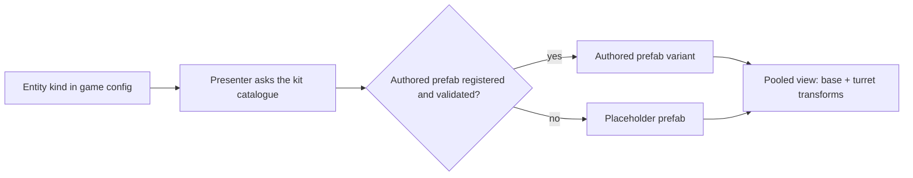

# Placeholder Assets

[← Technical Architecture](README.md)

*Grundlagen: [Platzhalter: Primitive statt Modelle](../grundlagen/14-3d-assets.md#platzhalter-primitive-statt-modelle).*

Build phases run on **primitives**, not on finished models. Every entity kind ships as an untextured box-and-capsule stand-in with the final asset's dimensions, pivot and transform names. Authored models from the [Asset Pipeline](asset-pipeline.md#asset-pipeline) replace them one at a time, without a code change.

Rule: **art is never a phase gate.** A slice is done when it is deployed and playable ([Build Phases](operations.md#build-phases)), whatever it looks like.

## Scope

| Rendered from | Placeholder needed |
|---|---|
| Geometry tiles — buildings, streets, ground | **No** — already procedural extrusion, not authored models ([Client Layers](client.md#client-layers)) |
| Live entities — avatar, units, demons, towers, factories, gates, drops | **Yes** |
| HUD, markers, rings | **Yes** — flat discs and quads |
| Authored kit models (Landmark, Hospital) | Extrusion is the placeholder; the kit model is the upgrade |

## Primitive Catalogue

Unity built-in meshes only — cube, sphere, capsule, cylinder, quad. Nothing is modelled, nothing is imported.

| Entity | Base | Turret | Marker | Size (m) |
|---|---|---|---|---|
| Avatar | Capsule | Capsule (upper half) | Cube muzzle | Ø 0.6 × 1.8 |
| Infantry | Capsule | Capsule | Cube muzzle 0.15 | Ø 0.6 × 1.8 |
| Marksman | Capsule | Capsule | Cube barrel 0.1 × 0.1 × 0.9 | Ø 0.5 × 1.8 |
| Siege | Cube chassis | Cylinder | Cube barrel 0.15 × 0.15 × 1.8 | 3.0 × 2.0 × 1.2 |
| Tower | Cylinder (fixed) | Cylinder | Cube barrel | Ø 2.0 × 3.0 |
| Factory | Cube | — | — | 6.0 × 6.0 × 4.0 |
| Imp | Capsule | Capsule | — | Ø 0.4 × 1.0 |
| Brute | Capsule | Capsule | — | Ø 1.0 × 2.4 |
| Hellgate | Cylinder, emissive | — | — | Ø 4.0 × 6.0 |
| Ground drop | Sphere | — | — | Ø 0.4 |
| Interaction ring, station marker | Flat cylinder / quad | — | — | Radius from config |

| Legibility rule | Detail |
|---|---|
| Archetype | Carried by **shape and height**, never by colour alone |
| Faction | Carried by **colour**, through the same material property the final assets use |
| Demons | Fixed dark red, no faction tint |
| Turret marker | Every rotating entity gets a muzzle cube — otherwise the turn is invisible on a symmetric primitive ([Rotation & Facing](rotation.md#client-rendering)) |
| State tell | Attack = short scale pulse, damage = brief colour flash; no clips, no rig |

## Prefab Contract

The contract is what makes the swap a one-line change. It binds placeholder and authored asset to the same shape of object.

| Property | Rule |
|---|---|
| Transform names | `root` → `base` → `turret` → `muzzle`; bound **by name**, never by hierarchy index |
| Pivot | `root` at the ground contact point, centred |
| Dimensions | Placeholder carries the final asset's real-world height and footprint, to the metre |
| Scale | 1 unit = 1 m, scale applied — same as [Model Conventions](asset-pipeline.md#model-conventions) |
| Material | Exactly one, instanced; faction colour as a material property, not a material copy |
| Animation | None. Views drive transforms and material properties only — see [Client Patterns](code-patterns.md#client-patterns) |
| Pooling | Same pool and presenter as the authored asset; the view never knows which one it holds |
| Naming | `placeholder_<class>_<name>` — e.g. `placeholder_unit_siege` |

## Swap Rule

| Step | Detail |
|---|---|
| Registration | The kit catalogue maps entity kind → prefab; a placeholder entry is a normal entry |
| Exit criterion | An authored prefab replaces its placeholder only after it passes the import validator |
| Validator checks | Triangle budget, one material, pivot at ground, clip names, **transform names present**, height within ± 20 % and footprint radius within ± 20 % of the placeholder |
| Failure | Entry stays on the placeholder; CI reports it, the build still runs |
| Reporting | The catalogue exposes how many kinds are still placeholder; printed in the build log |
| Reversible | Any kind can be forced back to its placeholder by config — used to isolate rendering regressions |

## Phase Mapping

| Phase | Placeholders added | Authored art in parallel |
|---|---|---|
| P1 | Avatar capsule, interaction ring | Pilot: one unit, one tower, one factory through the full pipeline |
| P2 | Ownership tint on extruded buildings; no new primitives | Landmark and Hospital kit models |
| P3 | Infantry, Marksman, Siege, factory, station marker | First unit set |
| P4 | Tower | Tower set |
| P5 | Imp, Brute, Hellgate, ground drop | Demon set |
| P6 | Workshop marker | Gear-visual work, if any |

Art production runs on its own clock; a slice never waits for it, and an asset never waits for a slice.

## Repository

| Path | Content | Storage |
|---|---|---|
| `client/Assets/Game/Art/Placeholder/` | Placeholder prefabs, one shared material | Git (tiny, no LFS) |
| `client/Assets/Game/Art/` | Authored FBX, textures, prefab variants | Git LFS — see [Asset Pipeline § Repository](asset-pipeline.md#repository) |

## Risks

| Risk | Impact | Mitigation |
|---|---|---|
| Primitives too similar at map zoom | Players cannot tell archetypes apart; feedback is about the art, not the design | Distinct base shape and height per kind; review at game camera distance, in greyscale |
| Render budget looks fine on primitives | Frame budget collapses when real assets land | Stress fixture scene with worst-case triangle and material counts from the [Budgets](asset-pipeline.md#budgets) table, profiled from P1 |
| Dimensions drift between placeholder and final asset | Ranges, radii and hit reads change when art lands | Validator enforces ± 20 % on height and footprint |
| Placeholder-only build reaches testers | Wrong impression of the product | Expected before P6; test builds are labelled, feedback on art is not collected |
| Transform names diverge in an authored asset | Rotation silently stops working | Validator rejects the asset; binding is by name |
| Placeholders never replaced | Ships as programmer art | Catalogue reports the placeholder count per build; the pilot proves the pipeline before P3 |
