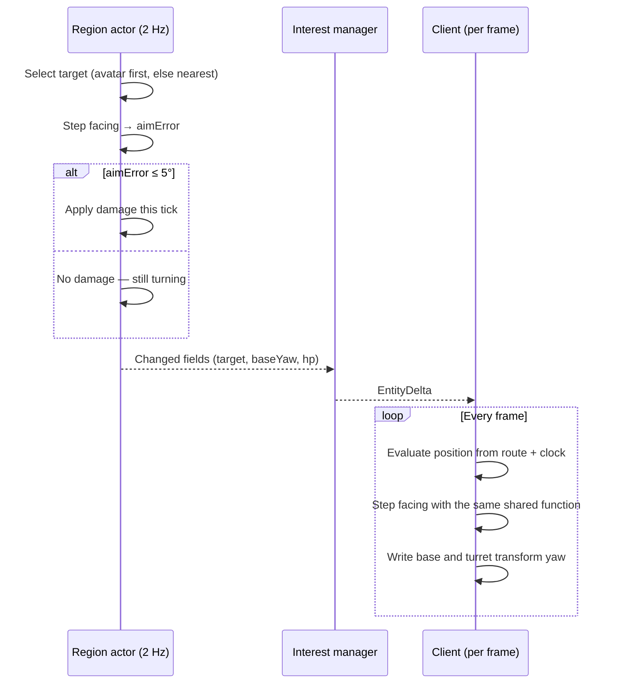

# Rotation & Facing

[← Technical Architecture](README.md)

*Grundlagen: [Ausrichtung und Drehung](../grundlagen/15-spielbegriffe.md#ausrichtung-und-drehung), [Ausrichtung im Client rendern](../grundlagen/09-rendering.md#ausrichtung-im-client-rendern).*

Rules and values: [Game Design § Facing & Rotation](../design/facing.md#facing--rotation). This file covers the representation: how a two-segment orientation stays server-authoritative without costing per-tick bandwidth.

## Principle

Facing is **derived, not streamed** — the same rule that keeps movement off the wire ([Movement: Route + Progress](streaming.md#movement-route--progress)).

| Segment | Derived from | Already on the client |
|---|---|---|
| Base yaw, moving | Tangent of `route` at the evaluated progress | Yes — the route |
| Base yaw, holding | Last sent `baseYaw` | Sent once per stop |
| Turret yaw | Bearing to the target's position, clamped to the arc, rate-limited | Yes — `target` plus that entity's state |

Both sides run the identical step function; neither transmits an angle per tick.

## Shared Step Function

| Property | Detail |
|---|---|
| Location | `Game.Shared` — one implementation, called by the region actor and by the client presenter |
| Signature | `(baseYaw, turretYaw, goalBearing, isMoving, typeConfig, dt) → (baseYaw, turretYaw, aimError)` |
| Inputs | Only replicated state and active game config — no local time, no random, no float accumulation across ticks beyond the two yaw values |
| Server cadence | Once per region tick (2 Hz), `dt` = tick interval |
| Client cadence | Once per frame, `dt` = frame time |
| Divergence | Accepted. The client's angle is presentation; only the server's `aimError` gates damage |
| Correction | None needed — both converge on the same goal bearing within one turn; a resync of position or target pulls the client back in |

Turn rates are per second and integrated by `dt`, so the 2 Hz server and a 30 fps client reach the same angle at the same wall-clock time, in different step sizes.

## Wire Fields

Two additions to the entity delta ([Delta Encoding](streaming.md#delta-encoding)); no third.

| Field | Size | Sent when | Why |
|---|---|---|---|
| `target` | 1–2 B (cell-local id, 0 = none) | On retarget only | The client needs the goal bearing; it already knows every visible entity's position |
| `baseYaw` | 1 B, quantized to 1/256 turn (≈ 1.4°) | On spawn, and on every transition out of a moving state | A holding entity has no route tangent to derive from |
| Turret yaw | **Never sent** | — | Fully derived from `target` + `baseYaw` + type config |

- 1.4° of base-yaw quantization is invisible at map zoom and well inside the 5° fire gate.
- A target the client cannot see is not streamed at all ([Subscription Set](streaming.md#subscription-set)); the turret then tracks nothing and re-centres. Facing therefore leaks no hidden entity.

## Server Evaluation

| Step | Detail |
|---|---|
| Order per tick | Move → select target → step facing → resolve damage |
| Gate | Damage is applied only when `aimError ≤ aimTolerance`; a turning entity simply deals none that tick |
| Granularity | 2 Hz — a 180 °/s turret covers 90° per tick, so turn costs land on half-second boundaries |
| Base lock while moving | The base yaw is the route tangent, rate-limited by the base turn rate; a sharp corner is turned into, not snapped to |
| Holding entities | Base yaw persists in the entity state and is journalled like any other field |
| Static entities | Towers skip the base step; factories, gates and drops skip both |

## Client Rendering

| Concern | Rule |
|---|---|
| View structure | Two nested transforms per entity view: `base` under the root, `turret` under `base` — see [Prefab Contract](placeholder-assets.md#prefab-contract) |
| Applied value | Yaw only; pitch and roll stay zero |
| Interpolation | None on top of the step function — it is already rate-limited. Slerping a rate-limited angle adds lag twice |
| Spawn, re-snapshot, new route | Angles snap to the derived goal, no visible turn |
| LOD | Beyond 200 m (the entity-label threshold) the turret step is skipped and the turret is held centred — see [LOD](client.md#lod) |
| Placeholder assets | Same two transforms on the primitive prefab, so the turn reads before any authored model exists |
| Animation | Turn clips are cosmetic; the authoritative angle comes from the step function, never from root motion — see [Model Conventions](asset-pipeline.md#model-conventions) |

## Testing

| Level | Check |
|---|---|
| Shared unit test | Step function: shortest-path turn across 0°/360°, clamp at the arc edge, no overshoot at large `dt` |
| Determinism test | Same inputs stepped at 2 Hz and at 30 fps end within 1° over 10 s |
| Server scenario test | Siege fires while walking away from its target; infantry does not, and starts dealing damage `angle / rate` after it stops |
| Client PlayMode | Turret tracks a moving target; no jitter at the arc edge |

## Rejected Alternatives

| Option | Why not |
|---|---|
| Stream both yaw values per tick | Two extra bytes per entity per tick, for every mover — the cost movement streaming was designed to avoid |
| Client-only facing, no server rule | Facing would not gate damage; the "cannot shoot backwards" rule would be cosmetic and trivially patched out |
| Full quaternion per entity | Pitch and roll are never used; yaw is one byte |
| Facing as a player order | Aiming is expressed by target selection, not by a rotation order — see [Game Design § Target Selection](../design/combat.md#target-selection) |
| Animation-driven turning (root motion) | Angle would depend on clip timing, which differs per authored asset and breaks the shared step function |
