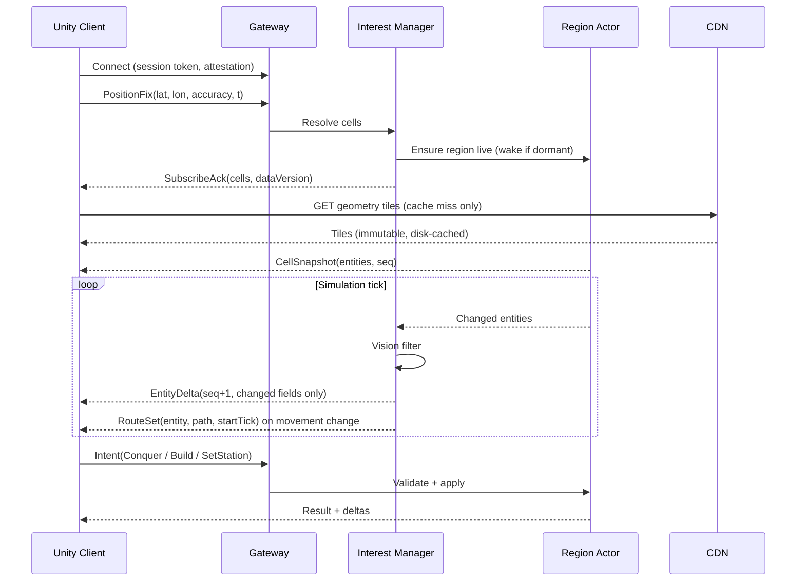

# Streaming & Entity State

[← Technical Architecture](README.md)

## Streaming & Interest Management

*Grundlagen: [Räumliche Indizes](../grundlagen/05-indizes.md#5-räumliche-indizes), [Streaming und Interest Management](../grundlagen/07-streaming.md#7-streaming-und-interest-management).*

### Spatial Index

| Purpose | Index | Resolution | Rationale |
|---|---|---|---|
| Simulation region (sharding, ticking) | H3 | r8 (~0.74 km², edge ~460 m) | Region actor granularity |
| Subscription cell (interest, deltas) | H3 | r9 (~0.10 km², edge ~174 m) | Fine-grained visibility, cheap k-ring math |
| Static geometry tile | XYZ | z15 (~1.2 km) | CDN-friendly, aligns with mapping tooling |

H3 over geohash: uniform neighbour distance, no rectangle distortion, `kRing` gives the interest set directly.

### Subscription Set

```
subscriptions = kRing(playerCell, k(density))
              ∪ cells(owned buildings, units, active gates)
```

| Environment | k | Cells | Covered area |
|---|---|---|---|
| City core | 1 | 7 | ~0.7 km² |
| Suburb | 2 | 19 | ~2 km² |
| Rural | 3–4 | 37–61 | ~4–6 km² |

- `k` derives from the server-side density table — same normalization rule as gameplay constants, so rural players see a useful radius without a client-side setting.
- Hysteresis: a cell is unsubscribed only after the player has been outside it for N seconds, to stop churn at boundaries.
- Hard cap on total subscribed cells per session; owned-asset cells are prioritized over radius cells.
- Owned-asset subscriptions are **notification-scoped** (state changes, attacks), not full detail, when far from the player.

Subscription decides what a client *could* receive; a second filter decides what it *does* receive:

```
visible = subscribed ∩ (always-visible ∪ inside sight radius of an own asset)
```

- Always-visible: buildings, streets, workshop sites, building ownership, hellgates.
- Sight-gated: rival units, factories, towers, demons — see [Game Design § Visibility](../design/presentation.md#visibility).
- Rival avatars are never streamed outside a shared site, at any subscription level.
- The vision set is the union of small radii around a player's own assets; assets are few and mostly static, so it is recomputed only on asset or position change, not per tick.
- Filtering happens **before** the delta is written. An entity a player cannot see produces no bytes, so a modified client cannot reveal it.

### Message Flow



### Wire Budget

| Item | Size | Frequency |
|---|---|---|
| Entity delta (HP, state, ownership) | 8–24 B | Per changed field set, on change |
| Route set (moving entity) | 40–200 B | On station change or retarget only |
| Progress resync | 6–10 B | Per moving entity, every ~5 s |
| Cell snapshot (urban) | 5–15 KB | On cell enter |
| Position fix (up) | ~24 B | 0.2–1 Hz |
| Geometry tile | 10–100 KB | Once per tile per data version |

Movement is **not** a per-tick cost — see [Entity Streaming](#entity-streaming). Estimate for active combat with ~30 visible entities taking damage at 2 Hz: **under 1 KB/s**. Idle play with units holding stations: well under 100 B/s. Both figures are estimates, to be confirmed against a real region.

### Reconnect & Offline

| Case | Handling |
|---|---|
| Short gap (< resume window) | Client sends last `seq` per cell; server replays buffered deltas |
| Long gap | Server drops the delta buffer; sends fresh `CellSnapshot` |
| Background / app resume | Treated as long gap; resubscribe from current GPS |
| Offline events (attack while away) | Event journal per player, delivered on reconnect + push notification |
| Client clock | Ignored; all timestamps are server clock |

The client never reconciles simulation state — it discards and re-snapshots. There is no client-side prediction except avatar position, which is GPS-driven and non-authoritative anyway.

## Entity Streaming

*Grundlagen: [Streaming und Interest Management](../grundlagen/07-streaming.md#7-streaming-und-interest-management), [Autoritativer Server und Tick](../grundlagen/08-server-tick.md#8-autoritativer-server-und-tick).*

How live objects reach the client and how their positions are represented.

### Entity Classes

| Class | Examples | Position | Anchor |
|---|---|---|---|
| Static-anchored | Building state, workshop occupancy | From the tile, by `entityId` / `siteId` | Map data |
| Placed | Factory, tower | Sent once on spawn, never changes | Factory: own position. Tower: `buildingId` + slot |
| Mobile | Unit, demon, own avatar | Route-based, see below | — |
| Event | Hellgate | Sent on spawn | Own position |

Placed and event entities carry no geometry — only a kind, an owner and a transform. The mesh comes from the client's low-poly kit.

### Delta Encoding

Field-mask deltas, not full-entity snapshots:

```
delta = [cellLocalId varint][mask uint16][changed fields…]
```

| Rule | Detail |
|---|---|
| Identity | Cell-local index assigned in the `CellSnapshot`; global IDs only on spawn |
| Mask | One bit per field; only set fields follow |
| Granularity | A unit taking damage costs the HP field, nothing else |
| Ordering | Per-cell sequence number; a gap forces a re-snapshot of that cell |
| Spawn / despawn | Explicit records, never inferred from a missing delta |

### Movement: Route + Progress

A moving entity is streamed as **a path and a clock**, not as a stream of positions.

| Field | Meaning |
|---|---|
| `route` | Polyline of the server-computed street route, quantized like tile coordinates |
| `speed` | Server constant for the unit type |
| `startTick` | Server tick at which the entity entered the route |
| `state` | Moving / Holding / Engaging / Returning |

The client evaluates position locally: `position = route(speed × (now − startTick))`, against the server clock.

| Event | Message |
|---|---|
| New station, retarget, blocked | New `route` record |
| Stop, engage, return | `state` change |
| Drift control | `progress` resync every ~5 s per moving entity |
| Death | Despawn record |

Why not per-tick positions:

| Property | Position stream | Route + progress |
|---|---|---|
| Cost of a unit walking across a city | Bytes every tick, forever | One route, then ~2 B/s of resync |
| Motion between ticks | Needs interpolation guesswork | Exact — the path is known |
| Tick rate visible as stutter | Yes | No |
| Behaviour during a short network gap | Entity freezes | Entity keeps walking its known route |
| Server cost | Serialize every mover per tick | Serialize on state change |

Trade-off accepted: the client knows a unit's *planned* path slightly before the unit walks it. That leaks nothing a player could not see anyway — the route is only sent for entities the vision filter already cleared.

### Client-Side Handling

| Case | Rule |
|---|---|
| Movement | Evaluated from route + server clock, every frame |
| Resync inside tolerance (< ~2 m) | Corrected smoothly over ~0.5 s, never snapped |
| Resync outside tolerance, or new route | Applied immediately |
| HP, ownership, state | Applied on arrival, no smoothing |
| Server clock | Offset estimated on connect and re-estimated periodically; the client clock is never authoritative |
| Missed deltas | Re-snapshot the cell — no reconstruction (see [Reconnect & Offline](#reconnect--offline)) |

This is the only client-side motion logic besides the avatar, and it is **evaluation of server-sent data**, not prediction: the client never advances a state the server did not already commit to.
