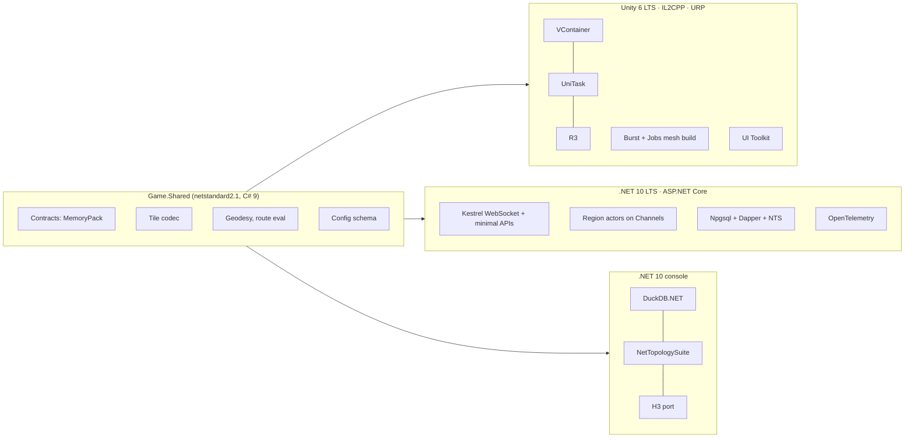

# Tech Stack

[← Technical Architecture](README.md)

*Grundlagen: [Unity und .NET](../grundlagen/13-unity-dotnet.md#13-unity-und-net-ein-code-zwei-laufzeiten).*

Concrete runtimes, libraries and tools per deployable. Fixed constraint: **Unity client, C# / .NET server**. Structure and coding rules: [Implementation Patterns](code-patterns.md#implementation-patterns).

> Versions: checked 2026-09. Pin exact versions in `Directory.Packages.props` and `Packages/manifest.json`; this file names majors only.

## Selection Rules

| Rule | Reason |
|---|---|
| One language (C#) for client, server, pipeline, tools | C4 — shared types, one toolchain |
| A library used on both sides must support Unity IL2CPP **and** .NET | Otherwise the shared assembly cannot use it |
| No reflection-based serialization or DI on the client | IL2CPP stripping and AOT break it silently |
| OSS, permissive licence, self-hostable | C3 — no per-seat or per-MAU fee |
| Framework built into .NET before a third-party package | Fewer dependencies to track |
| Non-C# component only where no C# option is mature | Routing engine, databases |

## Overview

## Shared Code

| Item | Choice | Note |
|---|---|---|
| Target | `netstandard2.1` | Highest API surface Unity 6 LTS consumes |
| Language | C# 9 (`LangVersion 9`) | Unity 6 LTS compiler limit — see [Language Limits](code-patterns.md#language-limits) |
| Distribution to Unity | Local UPM package: same source folder carries `.csproj`, `package.json`, `.asmdef` | Source compiled by both toolchains; no DLL copy step |
| Serialization | MemoryPack (source-generated) | Zero-reflection, IL2CPP-safe, same generator on both sides |
| Delta records | Hand-written bit writer/reader | Field-mask format from [Delta Encoding](streaming.md#delta-encoding) is below MemoryPack's granularity |
| Nullable | Enabled | `#nullable enable` via `csc.rsp` in Unity |

Contents of `Game.Shared`: message contracts, IDs, enums, config schema, tile codec, quantization, WGS84 ↔ ENU, route evaluation. **No simulation logic** — see [Shared Assembly Rules](code-patterns.md#shared-assembly-rules).

## Client

| Concern | Choice | Alternative considered | Why |
|---|---|---|---|
| Engine | Unity 6 LTS | — | Given |
| Scripting backend | IL2CPP, ARM64 | Mono | Required for iOS; faster on Android |
| Render pipeline | URP, Forward+ | Built-in RP | Mobile target; SRP Batcher and GPU Resident Drawer |
| Dependency injection | VContainer | Zenject / Extenject | Source-generated, IL2CPP-safe, maintained |
| Async | UniTask | Unity `Awaitable` | `WhenAll`, cancellation, zero-alloc; `Awaitable` lacks combinators |
| State → view binding | R3 (`ReactiveProperty`, `Observable`) | UniRx | UniRx is archived; R3 is its successor |
| WebSocket | `System.Net.WebSockets.ClientWebSocket` behind `IConnection` | NativeWebSocket | Built into the BCL; no plugin |
| Tile download | `UnityWebRequest` + own disk cache | Addressables | Tiles are own binary format, not Unity assets |
| Mesh generation | `Mesh.MeshDataArray` + Burst + Jobs | Main-thread `Mesh` API | Extrusion off the main thread |
| Polygon triangulation | Earcut port, Burst-compiled | LibTessDotNet | Rings arrive validated from the pipeline; on a failed triangulation the client extrudes the bounding rectangle — never a missing building |
| UI | UI Toolkit (screen HUD, menus) | uGUI | Unity 6 default; world-space markers are scene meshes, not UI |
| Camera | Cinemachine 3 | Own camera rig | Follow, clamped orbit, damping out of the box |
| Input | Input System package | Legacy Input Manager | Touch gestures, testable actions |
| Location | Own thin native plugin per platform (Kotlin Fused Location Provider, Swift CoreLocation) behind `ILocationSource`; **foreground only** — no background location at launch | `Input.location`, asset-store plugins | Needs accuracy, course, update interval control; store review risk of background location not worth it before there is a feature that needs it. `Input.location` only for P1 |
| Attestation | Native plugins: Play Integrity, App Attest | — | See [Anti-Cheat](anti-cheat.md#anti-cheat) |
| Content bundles | Built-in first; Addressables when art kits must update without store release | — | Avoid build complexity before it pays |
| Crash / errors | Sentry Unity SDK | Unity Cloud Diagnostics | Same tool as server |
| Tests | Unity Test Framework (NUnit) — EditMode for logic, PlayMode for rendering smoke tests | — | NUnit shared with server tests |

Not used: DOTS / Entities, Netcode for GameObjects, AR Foundation, Photon. Live entities are tens per view; buildings are batched meshes, not GameObjects.

## Server

| Concern | Choice | Alternative considered | Why |
|---|---|---|---|
| Runtime | .NET 10 LTS | — | LTS until 2028-11 |
| Host | ASP.NET Core Generic Host, Kestrel | — | WebSocket, HTTP admin API, health checks in one process |
| API style | Minimal APIs (admin, auth, health) | Controllers | Small surface |
| Realtime | Raw WebSocket middleware + MemoryPack frames | SignalR, MagicOnion, gRPC | Own binary framing, no RPC abstraction over deltas |
| Region actors | Own actor: `System.Threading.Channels` mailbox + tick loop | Orleans, Akka.NET, Proto.Actor | Tick-driven single writer; see [Actor Choice](#actor-choice) |
| Database access | Npgsql + Dapper | EF Core | Explicit SQL, binary `COPY`, no change tracking on hot paths |
| Geometry types | NetTopologySuite + `Npgsql.NetTopologySuite` | Raw WKB | PostGIS ↔ C# mapping |
| Migrations | Plain SQL files + DbUp | EF migrations | Matches Dapper; PostGIS DDL stays readable |
| Spatial index | H3 .NET port (`pocketken.H3`) | Native H3 via P/Invoke | Pure managed. Gate: a parity test in CI against the H3 v4 reference vectors (cell IDs, `kRing`, `polygonToCells`) — a mismatch switches to P/Invoke before P2 |
| Config change feed | PostgreSQL `LISTEN/NOTIFY` via Npgsql | Polling | See [Game Config](live-ops.md#game-config) |
| Redis (stage 2+) | StackExchange.Redis | — | Presence, shard map |
| Auth | Sign in with Apple / Google ID token → own JWT (`JwtBearer`) | Nakama auth | No extra service at stage 0 |
| Metrics / traces | OpenTelemetry .NET (`System.Diagnostics.Metrics`) → Prometheus endpoint | prometheus-net | Vendor-neutral; built-in meters for Kestrel and runtime |
| Logging | `Microsoft.Extensions.Logging`, JSON console formatter | Serilog | Built in; structured |
| Errors | Sentry .NET SDK | — | Same project as client |
| Routing engine | Valhalla, separate container behind `IRouteProvider` | OSRM, GraphHopper, Itinero | See [Routing Engine](backend.md#routing-engine) |
| Tests | NUnit, Testcontainers (PostgreSQL + PostGIS), NetArchTest for module boundaries | xUnit | One test framework across Unity and .NET |
| Benchmarks | BenchmarkDotNet | — | Tick, codec, vision filter |

### Actor Choice

| Option | Lazy wake | Tick loop | Ops at stage 0 | Verdict |
|---|---|---|---|---|
| **Own actor on Channels** | Own region registry | Native | None | **Chosen** until the [scale-out track](operations.md#scale-out-track) starts |
| Orleans | Virtual actors = built in | Timers on grain turns; tick jitter under load | Silo config, persistence provider | Re-evaluate on scale-out if own shard map becomes the bottleneck |
| Akka.NET | Manual | Scheduler messages | Cluster config | No — larger API than needed |
| Proto.Actor | Manual | Manual | Low | No clear gain over Channels |

Region host sits behind `IRegionHost` so a switch to Orleans during scale-out does not touch simulation code. Decision for scale-out: **own shard map first** ([Sharding](backend.md#sharding)); Orleans only if the handoff protocol proves unreliable in the P2 load test.

## Map Pipeline

| Concern | Choice | Why |
|---|---|---|
| Host | .NET 10 console app, run as container job | Same language; reuses `Game.Shared` tile codec |
| Overture extract | DuckDB.NET + DuckDB `spatial` extension over GeoParquet | Reads Overture releases in place from object storage; clip by bounding box in SQL |
| OSM extract (if needed) | `osmium-tool` pre-clip + OsmSharp | Overture transportation and places cover most needs |
| Geometry ops | NetTopologySuite (clip, simplify, validity) | Same library as server |
| H3 | Same port as server | Identical cell IDs |
| Output | Tiles → object storage (S3 API, `AWSSDK.S3` against R2); entity rows → PostGIS via `COPY` | See [Map Data Pipeline](map-data.md#map-data-pipeline) |

## Tooling & Delivery

| Concern | Choice |
|---|---|
| Repository | Monorepo — see [Repository Layout](code-patterns.md#repository-layout) |
| Solution | `.slnx`, Central Package Management (`Directory.Packages.props`), `Directory.Build.props` |
| Analyzers | .NET analyzers, `TreatWarningsAsErrors` in CI, `.editorconfig` shared with Unity |
| Unity packages | UPM; NuGet-only libraries via NuGetForUnity, pinned |
| CI | GitHub Actions |
| Server build | `dotnet test`, `dotnet publish /t:PublishContainer` → GHCR image |
| Unity build | GameCI (`game-ci/unity-builder`, `unity-test-runner`) on Linux; iOS archive on macOS runner |
| Store upload | fastlane (TestFlight, Play internal track) |
| Deploy stage 0–1 | `docker compose` on the VPS, pulled image — see [Operations](operations.md#operations) |
| Art assets | Blender + Blender MCP (Claude Code), Gemini image model, Hyper3D Rodin on a plan with commercial output rights (local TRELLIS only for experiments); FBX into Unity, glTF not used — see [Asset Pipeline](asset-pipeline.md#asset-pipeline) |
| Binary files | Git LFS for `.blend`, textures, FBX, concept images |
| Local dev | `docker compose` with Postgres/PostGIS, server, Grafana; Unity editor against `localhost` with GPX replay location |

## Version Matrix

| Component | Version | Upgrade trigger |
|---|---|---|
| Unity | 6 LTS | Next LTS. CoreCLR scripting runtime adopted only once it ships in an LTS; `Game.Shared` then moves to the current .NET target in the same change |
| .NET (server, pipeline) | 10 LTS | .NET 12 LTS |
| Shared target | netstandard2.1, C# 9 | Unity CoreCLR |
| PostgreSQL / PostGIS | 18 / 3.6 | Managed provider support |
| Protocol | `ProtocolVersion` constant in `Game.Shared` | Every breaking contract change |
