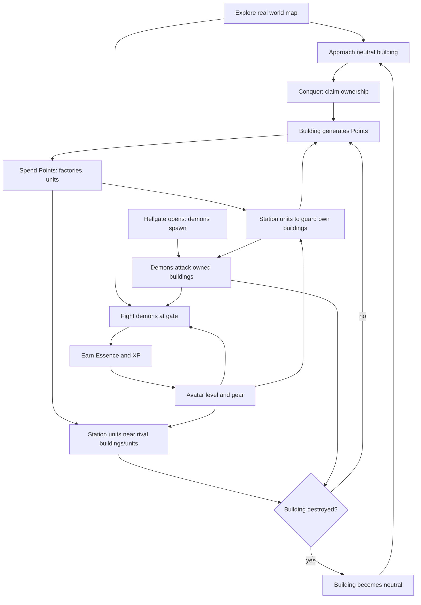

# Hellgate World — Game Design Document

Post-apocalyptic location-based mobile territory-conquest game. Unity. Pokémon GO-style world map + RTS base-building loop. **Map view only — no camera AR.**

## Contents

| File | Contents |
|---|---|
| [entities.md](entities.md) | Entities |
| [economy.md](economy.md) | Game Loops & Currencies |
| [world.md](world.md) | World, Map & Coverage |
| [presentation.md](presentation.md) | View & Presentation |
| [territory.md](territory.md) | Territory & Ownership |
| [rts.md](rts.md) | RTS Sub-Loop |
| [rpg.md](rpg.md) | RPG Sub-Loop (Avatar) |
| [combat.md](combat.md) | Combat |
| [factions.md](factions.md) | Factions & Demons |
| [authority.md](authority.md) | Server Authority |
| [balance.md](balance.md) | Balance Parameters |
| [open-questions.md](open-questions.md) | Open Questions |

## Setting

- Tone: post-apocalypse. Hellgates have opened across the real world; demons pour through.
- Reference point: *Hellgate: London* (demon invasion of a real city), scaled to the whole inhabited world.
- Three human factions fight each other **and** the demon incursion over the ruins of real places.
- Visual style: **stylized low-poly** — see [Art Direction](presentation.md#art-direction).
- Names and lore: **defined later**. Faction labels below are working names.

## Overview

| Property | Value |
|---|---|
| Platform | Mobile (iOS / Android) |
| Engine | Unity (no AR Foundation — see [View & Presentation](presentation.md#view--presentation)) |
| Genre | Location-based map + RTS |
| Theme | Post-apocalyptic demon invasion |
| Art style | Stylized low-poly, *League of Legends*-like — hand-painted, non-photoreal |
| Session type | Persistent world, asynchronous multiplayer |
| Authority | Server-authoritative simulation; client is renderer + intent |
| Balance | All gameplay values are backend configuration, tuned by metrics — see [Balance Parameters](balance.md#balance-parameters) |
| Data model | Interest-scoped streaming (client never holds global state) |
| Coverage | Anywhere people live: city, suburb, village, rural |
| Factions | 3 playable + 1 NPC (demons) |
| Loops | 3: Territory (map) + RTS + RPG |
| Currencies | 2, non-convertible: Points (territory), Essence (demons) |
| Combat | Auto-attack, tower-defense style; no twitch input |
| Goal | Occupy and hold territory |

## Core Loop

