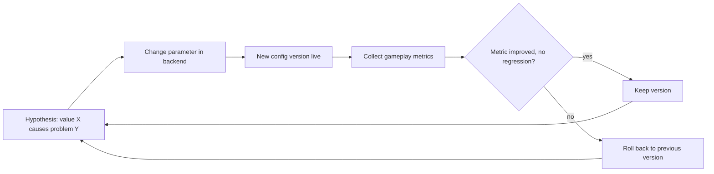

# Balance Parameters

[← Game Design](README.md)

Rule: **every gameplay number is backend configuration, not code.** Changing a value needs no client release and no server deploy.

| Is configuration | Is code |
|---|---|
| Radii, ranges, caps, rates, timers, weights, costs | Rule structure — e.g. "towers shield the building", "no currency conversion" |
| Point rates per building kind | Which entity types exist |
| Drop tables and rarity weights | Presence requirements |

Technical design: [Architecture § Game Config & Metrics](../architecture/live-ops.md#game-config--metrics).

## Parameter Catalogue

Starting values. Every value is a first guess to be tuned by metrics; none is a promise.

### Presence and Map

| Parameter | Value | Defined in |
|---|---|---|
| Conquest radius | 15 m | [Territory](territory.md#conquest-rules) |
| Conquest hold time | 10 s | [Territory](territory.md#conquest-rules) |
| Factory placement range | 15 m (= conquest radius) | [RTS](rts.md#structures) |
| Drop pickup by tap | 15 m (= conquest radius) | [RPG](rpg.md#ground-drops) |
| Drop pickup by walking | 5 m | [RPG](rpg.md#ground-drops) |
| Workshop safe-zone radius | 5 m | [Entities](entities.md#workshops--neutral-ground) |
| Workshop snap tolerance | 5 m | [Entities](entities.md#small-radius-and-snapping) |
| Off-road leg | 30 m | [RTS](rts.md#reachability) |
| Density class boundaries | 300 / 1 500 buildings per km² | [World](world.md#density-classes) |
| Sight radius (city / suburb / rural) | 75 / 100 / 150 m | [World](world.md#density-classes) |
| Unit speed factor (city / suburb / rural) | 1.0 / 1.5 / 2.0 | [World](world.md#density-classes) |
| Ownable buildings per player (city / suburb / rural) | 30 / 50 / 100 | [World](world.md#density-classes) |
| Density constants `d_ref`, `a`, `bonus_max` | 1 000 /km², 0.5, 3.0 | [World](world.md#density-normalization) |
| Synthetic factor (POI / junction) | 0.5 / 0.25 | [World](world.md#data-coverage-fallback) |

### Economy

| Parameter | Value | Defined in |
|---|---|---|
| Points tick interval | 60 s | [Territory](territory.md#points-generation) |
| Base rate (House) | 1 Point per tick | [Territory](territory.md#points-generation) |
| Point rate per building kind | 1x / 1.5x / 2x / 4x / 8x | [Territory](territory.md#points-generation) |
| Volume multiplier | `clamp(area × height / 1 500 m³, 0.5, 3.0)` | [Territory](territory.md#points-generation) |
| Starting Points | 2 000 | [Territory](territory.md#points-generation) |
| Factory cost / HP | 1 500 / 500 | [RTS](rts.md#structures) |
| Tower cost / HP / range / DPS | 1 000 / 600 / 40 m / 15 | [RTS](rts.md#structures) |
| Repair cost | 0.5 × build cost × missing HP fraction | [RTS](rts.md#repair-and-rebuild) |
| Repair lockout after damage | 60 s | [RTS](rts.md#repair-and-rebuild) |
| Factories per player | 5 | [RTS](rts.md#factories) |
| Factory queue | 5 orders | [RTS](rts.md#factories) |
| Towers per building | `min(4, max(1, floor(area / 50 m²)))` | [RTS](rts.md#towers) |
| Unit cap per player | 100 | [RTS](rts.md#units) |
| Unit cost (T1 / T2 / T3) | 250 / 600 / 1 500 | [RTS](rts.md#launch-roster) |
| Unit production time (T1 / T2 / T3) | 60 / 180 / 600 s | [RTS](rts.md#launch-roster) |

### Combat

| Parameter | Value | Defined in |
|---|---|---|
| Combat tick | 2 Hz | [Combat](combat.md#damage-model) |
| Station engagement radius (all types) | 40 m | [RTS](rts.md#units) |
| Target type priority order | Demons, units, aggressor avatar, towers, factories, buildings | [RTS](rts.md#target-order) |
| Unit stats (HP / DPS / range / speed) | Per archetype table | [RTS](rts.md#launch-roster) |
| Siege bonus vs. structures | ×4 | [Combat](combat.md#damage-model) |
| Building base HP per kind | 300 / 400 / 600 / 1 000 / 2 000 | [Territory](territory.md#points-generation) |
| Building regeneration | 1 % per min after 60 s | [Territory](territory.md#building-hp) |
| Out-of-combat delay | 10 s | [Combat](combat.md#damage-model) |
| Aggressor flag duration | 10 s | [Combat](combat.md#aggressor-rule) |
| Melee / ranged range (base) | 8 m / 30 m | [Combat](combat.md#weapon-range-bands) |
| Speed-lock thresholds | Lock > 30 km/h, unlock < 20 km/h | [Combat](combat.md#speed-lock) |
| Speed-lock windows | Lock after 20 s, unlock after 30 s | [Combat](combat.md#speed-lock) |

### Facing and Rotation

| Parameter | Value | Defined in |
|---|---|---|
| Aim tolerance (fire gate) | 5° | [Facing](facing.md#rules) |
| Traverse arc (Infantry / Marksman / Siege) | ± 45° / ± 60° / ± 180° | [Facing](facing.md#traverse-arcs) |
| Turret rate (Infantry / Marksman / Siege) | 180 / 120 / 60 °/s | [Facing](facing.md#traverse-arcs) |
| Base turn rate (Infantry / Marksman / Siege) | 180 / 160 / 45 °/s | [Facing](facing.md#traverse-arcs) |
| Tower traverse arc / rate | ± 180° / 90 °/s | [Facing](facing.md#traverse-arcs) |
| Demon arc / turret rate / base rate (Imp / Brute) | ± 45°, 180, 200 °/s / ± 30°, 90, 90 °/s | [Facing](facing.md#traverse-arcs) |
| Avatar traverse arc / rate | ± 90° / 180 °/s | [Facing](facing.md#avatar-facing) |
| Avatar free-base speed threshold | 1.0 m/s | [Facing](facing.md#avatar-facing) |

### Avatar and Gear

| Parameter | Value | Defined in |
|---|---|---|
| Avatar base stats | HP 200 (+20/level), melee 15 DPS (+1), ranged 10 DPS (+0.7) | [RPG](rpg.md#avatar-stats) |
| Avatar regeneration | 2 HP/s | [RPG](rpg.md#avatar-stats) |
| Level cap | 30 | [RPG](rpg.md#avatar-stats) |
| XP curve | `100 × level^1.5` | [RPG](rpg.md#avatar-stats) |
| Tier unlock level (T1 / T2 / T3) | 1 / 5 / 12 | [RPG](rpg.md#tech-access) |
| Avatar defeat cooldown | 300 s | [RPG](rpg.md#defeat) |
| Inventory size | 20 | [RPG](rpg.md#inventory-and-binding) |
| Rarity weights per tier | Table | [RPG](rpg.md#roll-model) |
| Affix count per rarity | 0 / 1 / 2 / 3 | [RPG](rpg.md#roll-model) |
| Affix ranges | Table | [RPG](rpg.md#roll-model) |
| Affix sum cap per stat | 100 % | [RPG](rpg.md#avatar-stats) |
| Craft cost (T1 / T2 / T3) | 100 / 200 / 300 Essence + 5 materials | [RPG](rpg.md#acquisition) |
| Material drop chance | 30 % per kill | [RPG](rpg.md#acquisition) |
| Drop ownership window | 120 s | [RPG](rpg.md#ground-drops) |
| Drop lifetime | 600 s | [RPG](rpg.md#ground-drops) |
| Drop merge distance | 5 m | [RPG](rpg.md#ground-drops) |

### Demons

| Parameter | Value | Defined in |
|---|---|---|
| Demon stats (Imp / Brute) | Table | [Factions](factions.md#demon-types) |
| Director interval | 5 min | [Factions](factions.md#hellgates) |
| Active player window | 24 h | [Factions](factions.md#hellgates) |
| Gate exclusion distance | 2 km | [Factions](factions.md#hellgates) |
| Spawn rate | 1 gate per active player per 6 h | [Factions](factions.md#hellgates) |
| Spawn distance | 300 – 1 500 m | [Factions](factions.md#hellgates) |
| Tier thresholds | T2 ≥ 3 players, T3 ≥ 6 players at 5 % | [Factions](factions.md#hellgates) |
| Wave interval | 90 s | [Factions](factions.md#hellgates) |
| Escalation interval / max stage | 10 min / 3 | [Factions](factions.md#hellgates) |
| Escalation effect | +50 % wave, +200 m radius, +25 % reward | [Factions](factions.md#hellgates) |
| Gate HP / reward per tier | Table | [Factions](factions.md#hellgates) |
| Gate expiry | 24 h | [Factions](factions.md#hellgates) |

### Social

| Parameter | Value | Defined in |
|---|---|---|
| Faction change grace | 24 h | [Factions](factions.md#factions) |
| Duel leaderboard window | 30 days | [Entities](entities.md#avatar-duels) |
| Counted duels per pair per day | 3 | [Entities](entities.md#avatar-duels) |

- New parameters get a row here in the same change that introduces them.
- Values in the other design files are the starting defaults; the live value is whatever the backend holds.

## Tuning Loop

Every change is judged by gameplay metrics, compared between config versions.

## Metrics per Parameter

| Parameter | Watch |
|---|---|
| Conquest radius, snap tolerance | Conquest attempts rejected for distance; GPS accuracy at attempt; conquests per session |
| Point rates, density constants | Points per session by density class (city / suburb / rural) |
| Unit cap, factory cap | Units per player distribution; share of players at the cap |
| Station radius, target priority | Fight duration; buildings lost per attack; units lost per fight |
| Sight radius | Attacks started outside the defender's sight; defender response time |
| Hellgate parameters | Gates spawned vs. closed vs. expired; time to close; Essence per hour; solo closes by avatar level |
| Drop parameters | Drops collected vs. expired; share collected by non-killer |
| Speed lock | Lock events per session; lock events at walking-range speeds (false positives) |
| Stance, aggressor rule | Share of sessions in All-hostiles stance; avatar knockouts by source |
| Traverse arcs, turn rates | Share of tick time spent turning instead of firing, per archetype; time to first damage after a target enters the radius |
| Tier gates | Level distribution at first T2 / T3 unit |
| All | Session length, sessions per day, D1 / D7 retention, faction share per region |

- Compare by config version, never by calendar date alone.
- Small player counts make metrics noisy; treat early results as direction, not proof.
