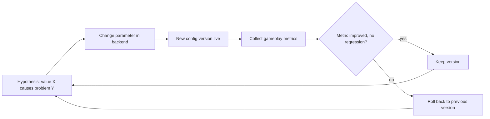

# Balance Parameters

[← Game Design](README.md)

Rule: **every gameplay number is backend configuration, not code.** Changing a value needs no client release and no server deploy.

| Is configuration | Is code |
|---|---|
| Radii, ranges, caps, rates, timers, weights, costs | Rule structure — e.g. "towers shield the building", "no currency conversion" |
| Point rates per building kind | Which entity types exist |
| Drop tables and rarity weights | Presence requirements |

Technical design: [Architecture § Game Config & Metrics](../architecture/live-ops.md#game-config--metrics).

## Parameter Catalogue

Current values. `open` = value not decided yet — see [Open Questions](open-questions.md).

| Parameter | Value | Defined in |
|---|---|---|
| Conquest radius | 15 m | [Territory](territory.md#conquest-rules) |
| Factory placement range | 15 m (= conquest radius) | [RTS](rts.md#structures) |
| Workshop safe-zone radius | 5 m | [Entities](entities.md#workshops--neutral-ground) |
| Workshop snap tolerance | 5 m | [Entities](entities.md#small-radius-and-snapping) |
| Unit cap per player | 100 | [RTS](rts.md#units) |
| Points tick interval | ~60 s | [Territory](territory.md#points-generation) |
| Point rate per building kind | 1x – 8x | [Territory](territory.md#points-generation) |
| Density constants `d_ref`, `a`, `bonus_max` | open | [World](world.md#density-normalization) |
| Station engagement radius | open | [RTS](rts.md#units) |
| Target type priority order | open | [RTS](rts.md#units) |
| Sight radius | open | [Presentation](presentation.md#visibility) |
| Speed-lock threshold | 30 km/h | [Combat](combat.md#speed-lock) |
| Speed-lock hysteresis window | open | [Combat](combat.md#speed-lock) |
| Melee / ranged band distances | open | [Combat](combat.md#weapon-range-bands) |
| Hellgate spawn cadence, escalation, rewards | open | [Factions](factions.md#hellgates) |
| Drop pickup range, drop lifetime | open | [RPG](rpg.md#ground-drops) |
| Rarity weights, affix counts | open | [RPG](rpg.md#roll-model) |
| Avatar defeat cooldown | open | [RPG](rpg.md#avatar-in-rts-combat) |

- New parameters get a row here in the same change that introduces them.
- Values in the other design files are the starting defaults; the live value is whatever the backend holds.

## Tuning Loop

Every change is judged by gameplay metrics, compared between config versions.

## Metrics per Parameter

| Parameter | Watch |
|---|---|
| Conquest radius, snap tolerance | Conquest attempts rejected for distance; GPS accuracy at attempt; conquests per session |
| Point rates, density constants | Points per session by density class (city / suburb / rural) |
| Unit cap | Units per player distribution; share of players at the cap |
| Station radius, target priority | Fight duration; buildings lost per attack; units lost per fight |
| Sight radius | Attacks started outside the defender's sight; defender response time |
| Hellgate parameters | Gates spawned vs. closed; time to close; Essence per hour |
| Drop parameters | Drops collected vs. expired |
| Speed lock | Lock events per session; lock events at walking-range speeds (false positives) |
| All | Session length, sessions per day, D1 / D7 retention, faction share per region |

- Compare by config version, never by calendar date alone.
- Small player counts make metrics noisy; treat early results as direction, not proof.
