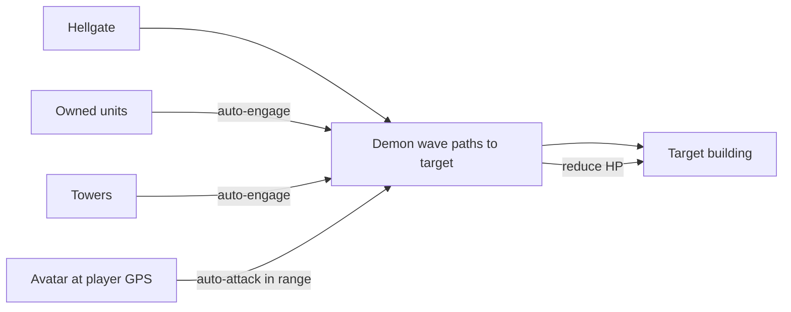
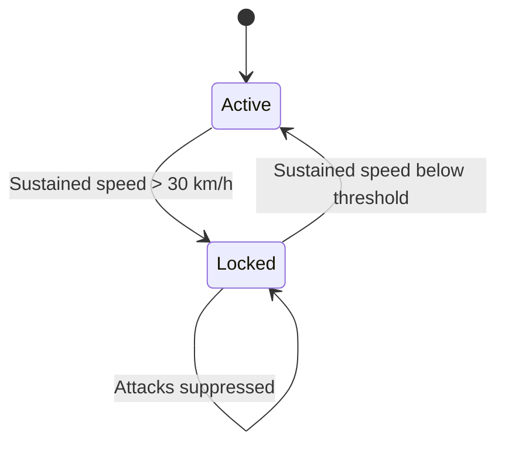

# Combat

[← Game Design](README.md)

Design target: **simple, glanceable, no twitch input.** Closer to tower defense than to an action game. Nothing in combat requires aiming, dodging, or fast taps — the phone can be in a pocket.

| Property | Rule |
|---|---|
| Input during combat | None — everything auto-attacks |
| Avatar position | **Locked to the player's real GPS position**; not movable in-game |
| Avatar targeting | Auto-attacks any hostile in range |
| Weapon selection | Automatic by target distance — melee close, ranged far |
| Unit position | Player-assigned **station**; unit guards a radius around it |
| Unit targeting | Auto-engage any hostile inside the station radius |
| Unit movement | Along street routes, to the station and to targets within radius |
| Resolution | Server-side simulation tick |

## Tower-Defense Shape

The three actors map onto tower-defense roles:

| Actor | Role | Mobility |
|---|---|---|
| Demon waves | Creeps | Path toward gates and buildings |
| Units | Mobile towers | Guard a radius around a player-set station |
| Towers | Static towers | Fixed to an owned building |
| Avatar | Mobile tower | Moves only when the **player physically moves** |

## Combat Types

| Type | Stakes | Where |
|---|---|---|
| Unit / tower / demon combat | Real — buildings and units are lost | Anywhere except workshop safe zones |
| Avatar vs. demons | Real — avatar can be knocked out | Anywhere hostile |
| **Avatar duel** | **None** — no death, no loss, no reward | Workshop safe zones only |

## Engagement Rules

- Units auto-engage any hostile inside their station radius; nothing outside it (see Units).
- No hostile engagement resolves inside a workshop safe zone (see Workshops — Neutral Ground).
- Units vs. building: **towers must fall first** — building HP is untouchable while any tower stands (see Towers).
- Units stationed on or near a building engage attackers independently of the tower layer.
- Avatar vs. anything hostile in range: continuous auto-attack, no player action.
- Demon units use the same combat and pathfinding rules, server-driven, with no owning player.
- Building destroyed (HP = 0) → ownership reset to **Neutral**, open to reconquest by any faction.
- Destroyed ≠ deleted: building persists, conquerable again.

## Weapon Range Bands

Both weapons are always equipped. The server picks per attack; the player never switches manually.

| Target distance | Weapon used |
|---|---|
| Within melee band | Melee weapon |
| Beyond melee, within ranged band | Ranged weapon |
| Beyond ranged band | No attack |

Consequence: weapon choice is a **build decision, not a combat action**. A loadout is tuned by which bands the player wants covered and by the rolled stats, not by reaction.

## Speed Lock

| Condition | Effect |
|---|---|
| Sustained speed **> 30 km/h** | Avatar cannot attack |

- Speed derived **server-side** from the GPS fix sequence; the client does not report it.
- Purpose: safety (no play while driving) and anti-cheat (no drive-by farming).
- Units, towers, and buildings are unaffected — only the avatar is disabled.
- Attack re-enables once sustained speed drops below the threshold.

