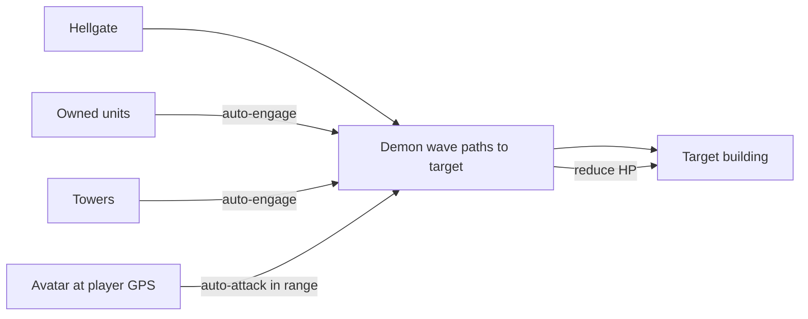
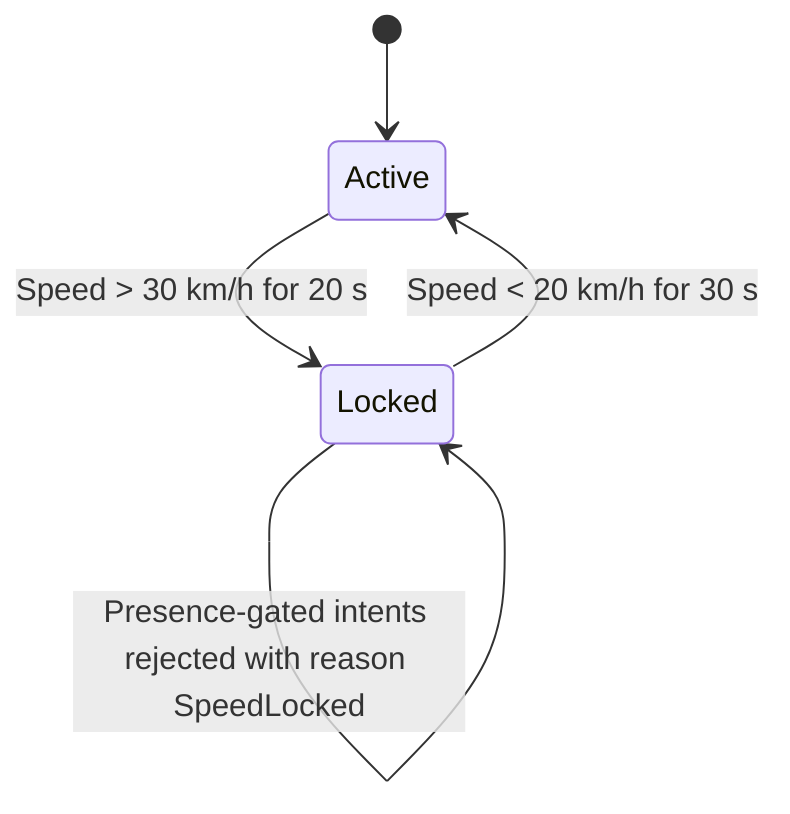

# Combat

[← Game Design](README.md)

Design target: **simple, glanceable, no twitch input.** Closer to tower defense than to an action game. Nothing requires aiming, dodging or fast taps — the phone can be in a pocket. The one input that exists is a tap on the avatar's target, and even that has a fallback.

| Property | Rule |
|---|---|
| Input during combat | One optional tap: the avatar's target. Units, towers and demons attack without input |
| Avatar position | **Locked to the player's real GPS position**; not movable in-game |
| Avatar targeting | **Player picks the target**; the avatar then attacks it automatically, filtered by stance — see [Target Selection](#target-selection) |
| Weapon selection | Automatic by target distance — melee close, ranged far |
| Avatar facing | Base from the direction of travel above 1.0 m/s, free while standing; ± 90° upper-body arc — see [Avatar Facing](facing.md#avatar-facing) |
| Unit position | Player-assigned **station**; unit guards a radius around it |
| Unit targeting | Auto-engage any hostile inside the station radius; a valid avatar first, otherwise the nearest |
| Unit movement | Along street routes, to the station and to targets within radius |
| Resolution | Server-side simulation tick |

## Tower-Defense Shape

The three actors map onto tower-defense roles:

| Actor | Role | Mobility |
|---|---|---|
| Demon waves | Creeps | Path toward gates and buildings |
| Units | Mobile towers | Guard a radius around a player-set station |
| Towers | Static towers | Fixed to an owned building |
| Avatar | Mobile tower | Moves only when the **player physically moves** |

## Combat Types

| Type | Stakes | Where |
|---|---|---|
| Unit / tower / demon combat | Real — buildings and units are lost | Anywhere except workshop safe zones |
| Avatar vs. demons | Real — a defeated avatar becomes a ghost | Anywhere hostile |
| Avatar vs. rival units and towers | Real — a defeated avatar becomes a ghost; only while the avatar is an aggressor | Anywhere except workshop safe zones |
| **Avatar vs. avatar** | **Never outside a duel.** Avatars cannot damage avatars on the open map or at a gate | — |
| **Avatar duel** | **None** — no death, no loss, no reward | Workshop safe zones only |

## Damage Model

| Rule | Value |
|---|---|
| Tick | Combat resolves at the region tick, 2 Hz |
| Damage per tick | `DPS × tick interval`, modified by attack-speed and damage affixes |
| Hit chance | Always hits; no evasion, no miss. **No randomness anywhere** — an artillery shell that lands on empty ground is a vacated position, not a miss roll |
| Firing arc | Attack resolves only while the target is within 5° of the attacker's aim — see [Facing & Rotation](facing.md#facing--rotation) |
| Line of sight | Direct fire resolves only with a clear line to the target; a building in the way blocks it — see [Line of Sight](line-of-sight.md#line-of-sight) |
| Indirect fire | Artillery ignores the line, fires at a **position**, and lands after a flight time — see [Indirect Fire](line-of-sight.md#indirect-fire) |
| Critical | Weapon affix only: chance × 2 damage |
| Damage reduction | Armor affix, flat percentage |
| Siege bonus | ×4 against towers, factories, buildings, gates |
| Out of combat | 10 s without taking or dealing damage |
| Avatar regeneration | 2 HP/s out of combat, plus armor affix |
| Building regeneration | 1 % of max HP per minute after 60 s out of combat — see [Building HP](territory.md#building-hp) |
| Units, towers, factories | No regeneration; towers and factories are repairable |

Every value is backend config — see [Balance Parameters](balance.md#balance-parameters).

## Engagement Rules

- Units auto-engage any hostile inside their station radius; nothing outside it (see Units).
- Target choice: a legally attackable avatar first, then the nearest hostile of any type — see [Target Order](rts.md#target-order).
- Facing gates the attack, never the target choice: an entity holds its target while it turns onto it — see [Turning to Fire](facing.md#turning-to-fire).
- Line of sight gates it too: a blocked target is walked to, not dropped — the unit routes to a firing position inside its station radius, or skips the target if none exists — see [Blocked Targets Move Units](line-of-sight.md#blocked-targets-move-units).
- Sight radius is **not** line-of-sight: a player sees through buildings and shoots around them — see [What Line of Sight Does Not Gate](line-of-sight.md#what-line-of-sight-does-not-gate).
- No hostile engagement resolves inside a workshop safe zone (see Workshops — Neutral Ground).
- Units vs. building: **towers must fall first** — building HP is untouchable while any tower stands (see Towers).
- Units stationed on or near a building engage attackers independently of the tower layer.
- Avatar vs. its selected target, or the nearest valid hostile: continuous auto-attack — subject to stance.
- Everything hostile that may attack an avatar attacks **that avatar before anything else** — see [Target Order](rts.md#target-order).
- Demon units use the same combat and pathfinding rules, server-driven, with no owning player.
- Building destroyed (HP = 0) → ownership reset to **Neutral**, open to reconquest by any faction.
- Destroyed ≠ deleted: building persists, conquerable again.
- Factory destroyed → removed, drops nothing.
- Demon killed → Essence and loot drop on the ground at the kill position (see [Ground Drops](rpg.md#ground-drops)).

## Avatar Targeting

An avatar auto-attacks, and anything that can attack it does so first, so walking past rival territory must not start a war by itself. Two rules handle this.

### Stance

| Stance | Avatar attacks | Default |
|---|---|---|
| **PvE only** | Demons | **Yes** |
| **All hostiles** | Demons, rival units, rival towers, rival factories, rival buildings | No |

- A HUD toggle; changes take effect at the next tick. Stored server-side.
- Stance filters what the player may select, it does not select for them.

### Target Selection

The avatar is the one attacker the player aims. It has **no target order**.

| Rule | Detail |
|---|---|
| Selection | Tap a visible hostile inside weapon range; the avatar attacks it every tick until it dies, leaves range, or the player selects another |
| Valid targets | Whatever the current stance allows, and nothing a workshop safe zone protects |
| No selection | The avatar falls back to the **nearest** valid hostile, so walking into a demon wave still fights back without input |
| Switching | Free, any time, no cooldown; a technical rate limit applies — see [Anti-Cheat](../architecture/anti-cheat.md#anti-cheat) |
| Out of range | Selection is kept while the target stays visible; the avatar resumes when the player walks back into range |
| Target dies | Selection clears; the fallback takes over until the player picks again |
| Facing | Unchanged — the selected target still has to be inside the firing arc — see [Avatar Facing](facing.md#avatar-facing) |

Why the avatar and nothing else: the player is standing there and can see the fight. Choosing what to hit is the one tactical decision that costs a single tap and never needs a second one — everything else on the map keeps running without input.

### Aggressor Rule

Rival units and towers never see a rival avatar on their map. They attack it only when it attacks first.

| Rule | Value |
|---|---|
| Aggressor flag | Set on the avatar when it damages a rival asset; cleared 10 s after its last such attack |
| Targetable by rival units and towers | Only while the flag is set — and while it is set, the avatar is their **first** target |
| Position leak | None — the defender's map shows damage to their asset, not the attacker's position |
| Demons | Attack avatars always, before any other target; no flag needed |

Consequence: a player in PvE stance can never be attacked by another player's assets. A player who chooses to hit rival assets accepts return fire for as long as they keep attacking — and under the new target order that return fire is **everything in range at once**, because a valid avatar outranks every other target. Attacking in person is the most decisive and the most dangerous thing a player can do.

## Weapon Range Bands

Both weapons are always equipped. The server picks per attack; the player never switches manually.

| Target distance `d` | Weapon used |
|---|---|
| `d ≤ melee range` (base 8 m) | Melee weapon |
| `melee range < d ≤ ranged range` (base 30 m) | Ranged weapon |
| `d > ranged range` | No attack |

- Bands do not overlap: melee always wins inside its range.
- Each weapon carries its own range; the range affix extends it. A melee weapon with a large range affix shrinks the ranged band from below — a build choice.
- Distance is measured from the avatar's server-side fix to the nearest point of the target's footprint.

Consequence: weapon choice is a **build decision, not a combat action**. A loadout is tuned by which bands the player wants covered and by the rolled stats, not by reaction.

## Speed Lock

| Condition | Effect |
|---|---|
| Speed **> 30 km/h** sustained for **20 s** | Lock |
| Speed **< 20 km/h** sustained for **30 s** | Unlock |

- Speed derived **server-side** from the GPS fix sequence; the client does not report it.
- The two thresholds and the two windows form a hysteresis: a bus stopping at a light does not unlock; a jitter spike does not lock.
- Purpose: safety (no play while driving) and anti-cheat (no drive-by farming).
- **Scope: every presence-gated action** — avatar attack, conquest, placement, repair, drop pickup, crafting. Remote unit orders stay available.
- Units, towers, and buildings are unaffected — only the player's own actions are disabled.
- Passenger case: a passenger in a car, bus or train is locked out identically. **Accepted** — the safety rule cannot tell driver from passenger, and transport farming is exactly what the anti-cheat side wants to stop.

