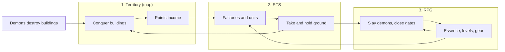

# Game Loops & Currencies

[← Game Design](README.md)

Three loops, two currencies. No loop is self-sufficient; each feeds the others.

| # | Loop | Activity | Currency earned | Serves |
|---|---|---|---|---|
| 1 | Territory (map) | Walk to buildings, conquer them | Points | Income base |
| 2 | RTS | Build factories, train units, take and hold ground | — (spends Points) | Occupation goal |
| 3 | RPG | Slay demons, close hellgates | Essence + XP | Avatar power |

## Currencies

| Currency | Working name | Source | Spent on |
|---|---|---|---|
| Territory | **Points** | Owned buildings, passive per tick | Factories, units, defenses |
| Demon | **Essence** | Demon kills, gate closures — dropped on the ground | Avatar levels, gear, crafting |

| Currency | Payout |
|---|---|
| Points | Credited automatically every tick; no collection visit |
| Essence | Drops on the ground as a pickup, together with loot — see [Ground Drops](rpg.md#ground-drops) |

**Rule: no conversion between currencies.** Points cannot buy gear; Essence cannot buy units. Each loop must be played for its own reward — this is what keeps all three active.

## Synergy

| From | To | Link |
|---|---|---|
| Territory | RTS | Points fund factories, units, defenses |
| RTS | Territory | Units take and hold buildings |
| RTS | RPG | Units escort the avatar and absorb waves at high-tier gates |
| RPG | RPG | Better gear makes higher-tier gates survivable → more Essence |
| RPG | RTS | Avatar level unlocks unit/structure tiers; avatar fights alongside units |
| Demons | Territory | Destroyed buildings revert to Neutral → new conquest targets |

Design rule: **territory is the win condition; the RPG loop is the personal power that makes holding it possible.**
