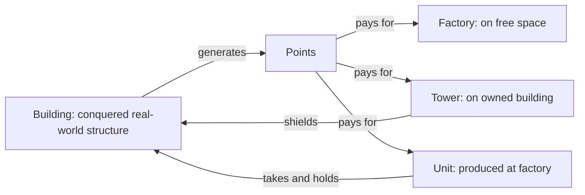

# Entities

[← Game Design](README.md)

Four object types. Everything else in the design is built from these.

| Entity | What it is | Placed / created | Location constraint | Cost | Mobile |
|---|---|---|---|---|---|
| **Building** | A real-world building, conquered by a player | Conquered, not placed | Exists in the real world | — | No |
| **Factory** | Player-placed construct that produces units | Placed by player | **Free land only** — no building, no road | Points | No |
| **Tower** | Player-placed construct, defensive | Placed by player | **On an owned building's roof only** | Points | No |
| **Unit** | Produced fighter, player-directed | Produced at a factory | Spawns at factory, then moves | Points | **Yes** |
| **Workshop** | Neutral crafting site | Not placed — derived from real-world POIs (schools, train stations) | Fixed at its POI | — | No |

- Factory and Tower are complementary: **factories never sit on buildings, towers only ever do.**
- Buildings are found, not built. Factories and towers are built, not found.
- Units are the only mobile entity a player owns besides the avatar.
- Factories, towers, and units are all destructible by hostile units and demons.
- Workshops are **never owned by anyone** — see World Sites.

## World Sites

Neutral locations nobody owns. They exist to pull players out into the real world.

| Site | Anchored to | Lifetime | Ownable | Hostile combat | Purpose |
|---|---|---|---|---|---|
| **Workshop** | A real-world POI | Permanent | **No** | **Suppressed** — safe zone | Armor crafting, duels |
| **Hellgate** | A spawned position | Temporary, until closed | **No** | Full | Demon source, Essence |

- Both require the player to **physically travel there**. Neither can be used remotely.
- Both are open to all three factions — shared, never claimed.
- This is the design's main real-world-interaction driver: the RPG loop cannot be played from the couch.
- Workshops are **neutral ground**; hellgates are not.

## Workshops — Neutral Ground

A workshop and a radius around it are a **safe zone**. Nothing hostile resolves inside it.

| Rule | Value |
|---|---|
| Player vs. player combat | **Suppressed** |
| Unit and tower combat | **Suppressed** inside the radius |
| Demon presence | Hellgates never spawn inside the radius; demons do not enter |
| Faction access | All three factions, simultaneously |
| Claiming | Impossible — a workshop can never be owned |
| Radius | **5 m** around the POI anchor |
| Qualifying POIs | Schools, train stations — the building itself stays conquerable, see [Workshop-Site Buildings](territory.md#workshop-site-buildings) |
| Sparse regions | No synthesized workshops — players travel to the nearest real one |
| Crafting cooldown | None — craft whenever the Essence cost is covered |

Consequence: a rival cannot camp the only workshop in a town to deny it. Access is guaranteed.

### Small Radius, and Snapping

The safe zone is deliberately tight: large enough to stand in, small enough that it rarely swallows a nearby owned building.

| Rule | Value |
|---|---|
| Radius | 5 m — scoped to the POI, not the block |
| Snap tolerance | 5 m outside the radius — a fix up to 10 m from the anchor snaps in |
| Owned building inside the radius | Suppression still applies; kept rare by the small radius, not by an exception |
| GPS jitter at the edge | Handled by snapping, below |

**Snap on entry.** A small radius plus normal GPS noise would otherwise flicker a standing player in and out of the zone.

- On login, a player whose position is inside the radius or the snap tolerance has their avatar placed at the **workshop anchor**, not at the raw GPS fix.
- The same snap applies on arrival, so a player standing at the site stays reliably inside it.
- Snapping never moves a player *to* a workshop they are not at — it only resolves position within a site they already occupy.

### Avatar Duels

The one exception to combat suppression — consensual, and with nothing at stake.

| Property | Rule |
|---|---|
| Initiation | Challenge + accept; both avatars physically present |
| Decline | Manual, or automatic via a player setting; the challenger sees a "declined" message |
| Resolution | **Auto-combat**, same engine as PvE — no input |
| Death | **None.** Loser is never knocked out |
| Gear | No loss, no damage, no durability cost |
| Currency | **No Essence or Points transferred or awarded** |
| Effect on the faction war | None — territory and income are untouched |
| Cross-faction | Allowed; same-faction duels allowed too |
| Tracking | Wins and losses recorded in player stats; no rating |
| Leaderboard | Global, **wins in a rolling 30-day window** |
| Trading protection | At most **3 counted duels per pair of players per day**; further duels run but do not count |

```mermaid
stateDiagram-v2
    [*] --> Idle
    Idle --> Challenged: Player challenges another present avatar
    Challenged --> Idle: Declined, auto-declined, or timed out — challenger notified
    Challenged --> Dueling: Accepted
    Dueling --> Resolved: Auto-combat completes
    Resolved --> Idle: Stats updated; no death, no loss, no reward
```

Why duels pay nothing: any material reward would be farmable by two cooperating players. Duels exist to **test a build against another build**, not to earn. Stats and leaderboard carry no in-game value; the per-pair daily cap keeps the leaderboard from rewarding two players trading wins.

## Presence Rules

Physical presence is required to **place** and to **take**, never to **command**.

| Action | Physical presence required |
|---|---|
| Conquer a building | **Yes** |
| Place a factory | **Yes** |
| Place a tower | **Yes** |
| Craft at a workshop | **Yes** |
| Fight at a hellgate | **Yes** |
| Collect a ground drop (Essence, loot) | **Yes** |
| Repair or rebuild a construct | **Yes** |
| Give orders to units | **No** — fully remote |
| Change avatar stance | **No** |

- Rationale: the map is claimed on foot, but an army is directed from anywhere.
- Consequence: territory expansion is gated by real travel; tactical response is not. A player under attack can redirect units immediately, from anywhere.
