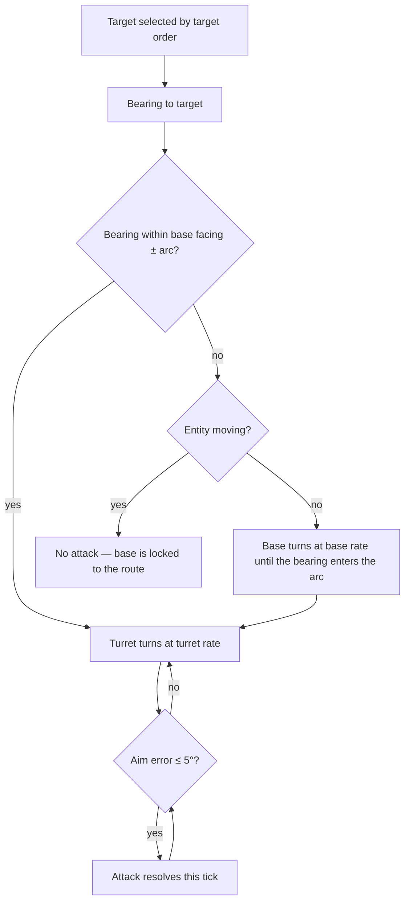

# Facing & Rotation

[← Game Design](README.md)

Every combat entity is built from two independently facing segments: a **base** that follows the path, and a **turret** that follows the target. How far the turret may turn against the base is what separates a tank from a footsoldier.

| Segment | Real-world part | Follows |
|---|---|---|
| **Base** | Lower body, legs, chassis | The route the entity walks |
| **Turret** | Upper body, torso, gun mount | The current target |

An infantry unit cannot run north and shoot south. A siege unit can.

## Rules

| Rule | Detail |
|---|---|
| Base facing while moving | Tangent of the street route at the entity's current progress — see [Pathfinding](rts.md#pathfinding) |
| Base facing while holding | Kept from the last movement; turns only to bring a target into the traverse arc |
| Turret facing | Shortest turn toward the target bearing, clamped to ± traverse arc around the base |
| Traverse arc | Per entity type; measured from the base facing, both directions |
| Turn rates | Per entity type, in degrees per second, for base and turret separately |
| **Fire gate** | An attack resolves only while the aim error is ≤ **5°**. Applies to melee and ranged alike |
| No target | Turret returns to 0° — centred on the base |
| Turn cost | Turning is **time, not a cooldown**: `angle / rate` seconds with no damage output |
| Target choice | Unaffected by angle. Facing never changes *what* a unit attacks, only *when* it can — see [Target Order](rts.md#target-order) |
| Authority | Server-side, at the region tick; the client derives the same values for rendering |

## Traverse Arcs

Starting values, backend config like every other number — see [Balance Parameters](balance.md#facing-and-rotation).

| Entity | Traverse arc | Turret rate | Base rate | Effect |
|---|---|---|---|---|
| Infantry (T1) | ± 45° | 180 °/s | 180 °/s | Must face roughly where it shoots; turns fast |
| Marksman (T2) | ± 60° | 120 °/s | 160 °/s | Slightly wider arc, slower gun |
| **Siege (T3)** | **± 180°** | 60 °/s | 45 °/s | Full traverse — fires in any direction, including backwards while walking; slow to bring around |
| Tower | ± 180° | 90 °/s | — (base fixed) | Static mount, full traverse |
| Avatar | ± 90° | 180 °/s | — (from GPS) | See [Avatar Facing](#avatar-facing) |
| Imp | ± 45° | 180 °/s | 200 °/s | Swarm melee; turns almost instantly |
| Brute | ± 30° | 90 °/s | 90 °/s | Heavy melee; commits to a direction |
| Factory, Hellgate, ground drop | — | — | — | No rotation; fixed orientation from placement |

- Arc and rates are **per entity type**, not upgradable and not a player choice.
- A full-traverse entity never needs to turn its base to fire; a limited-arc entity does.
- Siege trades that freedom for rates: a 180° traverse takes 3 s, a 180° chassis turn 4 s.

## Turning to Fire

| Situation | Outcome |
|---|---|
| Target inside the arc | Turret turns; first damage after `aim error / turret rate` seconds |
| Target outside the arc, entity holding | Base turns first, then the turret — two turns, both cost time |
| Target outside the arc, entity moving | **No attack.** The base is locked to the route; the unit shoots when the route brings the target into the arc, or when it stops |
| Target dies mid-turn | Next target picked by the normal order; the turn continues from the current angle, never resets |
| New station ordered mid-turn | Movement wins: the base returns to the route tangent, the turret keeps tracking within the new arc |
| Melee | Same gate — a melee unit must face its target before it lands a hit |
| Two targets at opposite bearings | Deterministic: the chosen target is the one the target order picks, not the one closest to the current aim |

Consequence: the arc is a **positioning rule expressed as a stat**. Stationing a marksman where its guarded lane runs across its facing costs it the first seconds of every fight; stationing a siege unit anywhere costs nothing but its slow traverse.

## Avatar Facing

The player steers the avatar's base by walking in the real world, so the fire gate must never punish them for a heading they cannot control.

| Rule | Detail |
|---|---|
| Base facing above 1.0 m/s | Course over ground — the direction of travel |
| Base facing at or below 1.0 m/s | **Free**: the base turns toward the target like any holding unit |
| Traverse arc | ± 90° — the avatar can fire to either side while walking, never straight backwards |
| Fire gate while standing | Never blocks: a standing avatar always reaches its target bearing |
| Weapon bands | Unchanged — range decides melee or ranged, facing decides whether the attack resolves — see [Weapon Range Bands](combat.md#weapon-range-bands) |

Rationale: walking past a target and losing a second of damage is a readable cost. Walking *away* from a fight while still winning it is not.

## Not Modelled

| Left out | Why |
|---|---|
| Pitch and roll | Camera is tilted top-down; only yaw is visible |
| Barrel elevation | No ballistics — damage is applied per tick, not by projectile |
| Per-limb aiming | Two segments are the whole model |
| Recoil, lean, terrain slope | Presentation detail below what the map camera shows |
| Facing as a player order | There is exactly one order — see [Orders](rts.md#orders) |
| Backwards movement | An entity always walks the direction its base faces |

Technical representation — how facing reaches the client without per-tick traffic: [Architecture § Rotation & Facing](../architecture/rotation.md#rotation--facing).
