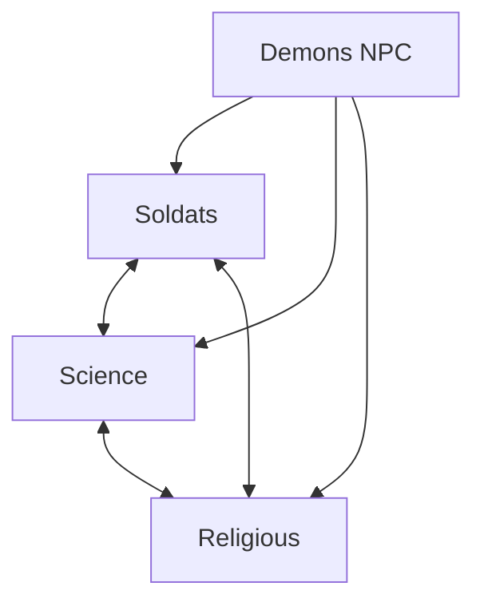
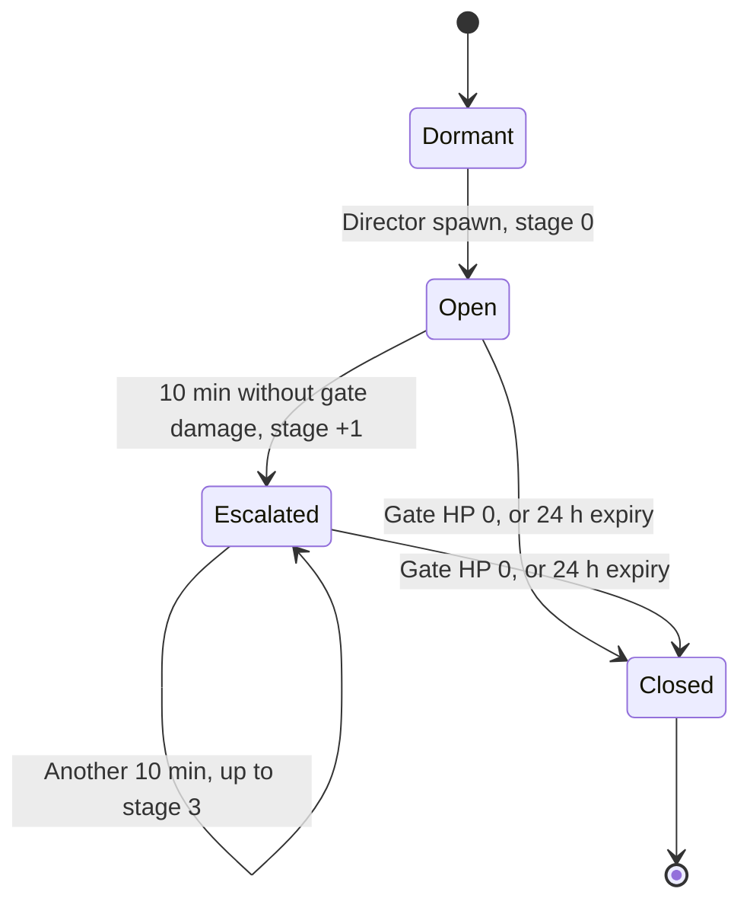
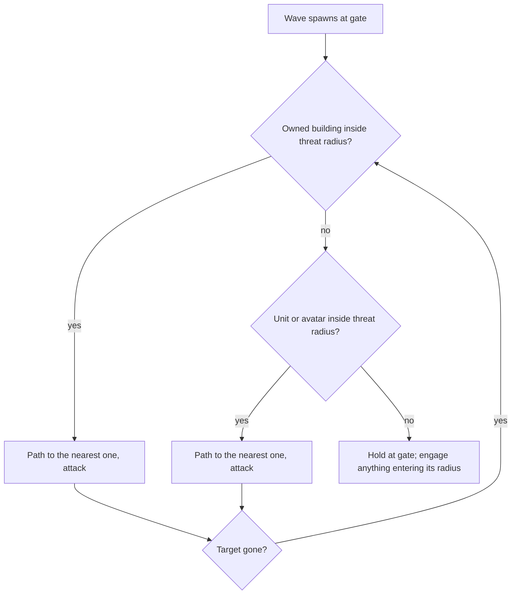

# Factions & Demons

[← Game Design](README.md)

## Factions

Four factions: three playable, one server-controlled. Working names — final names, lore, and visual style **defined later**.

| # | Working name | Type | Concept direction | Working colour |
|---|---|---|---|---|
| 1 | Soldats | Playable | Military remnant; conventional force | Amber `#E0A030` |
| 2 | Science | Playable | Tech / research survivors | Cyan `#30B0E0` |
| 3 | Religious | Playable | Faith order; anti-demon zealots | Violet `#9050E0` |
| 4 | Demons | **NPC / PvE** | Hell incursion; server-controlled | Red `#D02020` |

- Player picks one of the three playable factions on onboarding.
- Choice is **permanent**. One free change within 24 h of the first choice; after that, none.
- Faction determines unit skins, visual theme, factory models. Unit stats are **symmetric at launch** — see [Launch Roster](rts.md#launch-roster). Asymmetry is introduced later by config, never by code.
- Demons are never playable and never hold territory.

## Relations

Every entity belongs to one player or to the demon faction. From a given player's view, each other entity has exactly one relation:

| Relation | Definition |
|---|---|
| **Own** | Owned by this player |
| **Allied** | Owned by another player of the same faction |
| **Rival** | Owned by a player of another faction |
| **Demon** | Owned by faction 4 |

| Action / effect | Own | Allied | Rival | Demon |
|---|---|---|---|---|
| Conquerable | — | **No** (not neutral) | **No** (not neutral) | — |
| Attacked by own units and towers | No | **No** | Yes | Yes |
| Attacked by own avatar | No | No | Only in **All-hostiles stance** — see [Avatar Targeting](combat.md#avatar-targeting) | Yes |
| Gives sight | Yes | **No** | No | No |
| Visible on the map | Always | Sight-gated | Sight-gated | Sight-gated |
| Building tint | Faction colour, full | Faction colour, outline only | Rival faction colour, desaturated | — |
| Duel possible | — | Yes | Yes | — |

- **Hostile** = Rival or Demon. Every combat rule that says "hostile" means exactly these two relations.
- Allies never damage each other and never block each other. There is no alliance mechanic beyond this: no shared sight, no shared income, no shared credit.
- A building owned by any player is out of reach for conquest until it falls to Neutral — allied included.

## Faction 4: Demons (PvE)

**The common enemy.** Demons are hostile to all three playable factions and allied with none — the shared threat the setting is built on. Server-controlled. Design purpose: anchor the lore, drive the RPG loop, and guarantee content everywhere, including regions with no nearby human opponents.

| Property | Value |
|---|---|
| Control | Server AI; never playable |
| Spawn source | Hellgates opening at semi-random real-world positions |
| Targets | Any owned building (any faction), player units, avatars, gate surroundings |
| Territory | **None.** Demons destroy buildings only; never occupy or own them |
| Reward | **Essence + XP + gear** — never Points (see Game Loops & Currencies) |

### Demon Types

Launch roster. Stats are starting values in the backend config — see [Balance Parameters](balance.md#balance-parameters).

| Type | Role | HP | DPS | Range | Speed | Essence | XP | Material drop chance |
|---|---|---|---|---|---|---|---|---|
| Imp | Fast, weak melee swarm | 60 | 6 | 2 m | 1.6 m/s | 1 | 5 | 30 % |
| Brute | Slow, tanky melee | 400 | 20 | 3 m | 1.0 m/s | 8 | 40 | 30 % |
| Hellgate | Structure; the wave source | Per tier | — | — | — | Per tier | Per tier | — |

### Hellgates

| Property | Rule |
|---|---|
| Spawn evaluation | Demon director runs every 5 min |
| Spawn weight | **Per active player** — a player with a position fix in the last 24 h. Not by building density |
| Spawn condition | No open gate within 2 km of the player's last fix or of any of their buildings |
| Spawn rate | Mean one gate per active player per 6 h (per-evaluation probability derived from this) |
| Position | Random point 300–1500 m from the player's last fix, snapped to the nearest street node; never on a building footprint, never inside a workshop safe zone |
| Tier | T1 by default. T2 when ≥ 3 active players within 2 km. T3 with 5 % chance when ≥ 6 |
| Waves | One wave every 90 s while open |
| Escalation | Every 10 min without damage to the gate: stage +1, max stage 3 |
| Per escalation stage | Wave size +50 %, threat radius +200 m, closure reward +25 % |
| Closure | Gate HP reaches 0 — by units, towers in range, on-site avatar, or any mix |
| Closure credit | Player who dealt the killing blow to the gate; no shared credit |
| Remaining demons on closure | Despawn, drop nothing |
| Expiry | 24 h after spawn, if not closed: closes without reward |
| Solo target | A T1 gate at stage 0 is tuned so a level-1 avatar with starting gear closes it alone in ~10 min. T2 needs level ~5 or units. T3 needs units |

| Tier | Gate HP | Base wave | Threat radius | Closure Essence | Closure XP |
|---|---|---|---|---|---|
| T1 | 1 500 | 3 Imps | 300 m | 50 | 100 |
| T2 | 5 000 | 5 Imps + 1 Brute | 300 m | 200 | 400 |
| T3 | 15 000 | 8 Imps + 3 Brutes | 300 m | 600 | 1 200 |

### Wave Behaviour

- Demons use the same routing, engagement radius and combat rules as units; the gate is their station.
- "Nearest" is street distance, ties by lowest entity ID.
- Demon targets are any faction's assets — waves do not prefer one faction.

### Design Effects

| Effect | Consequence |
|---|---|
| Density-independent content | Rural players always have something to fight |
| Common enemy | All three factions face the same threat; convergence at gates is emergent, never mechanical |
| Drives the RPG loop | Sole source of Essence, XP, and gear |
| Territory churn | Demon-destroyed buildings return to Neutral, reopening conquest |
| Defense value | Makes garrisoning owned buildings useful even with no human threat nearby |
| Real-world pull | Gates and workshops both require travel — the RPG loop cannot be played remotely |

**Rules, decided:**

- Demons are the **common enemy**: hostile to all three factions, allied with none, never playable.
- Demons never occupy buildings. Destruction only → building reverts to Neutral and is reconquerable by any player faction.
- Faction cooperation at gates is **incidental only**. No alliance system, no shared credit, no suspended PvP.
- Demon rewards are **Essence only**. No Points from demons; no Essence from buildings.
