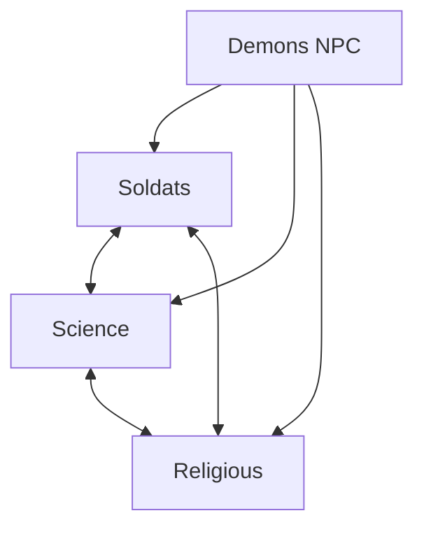
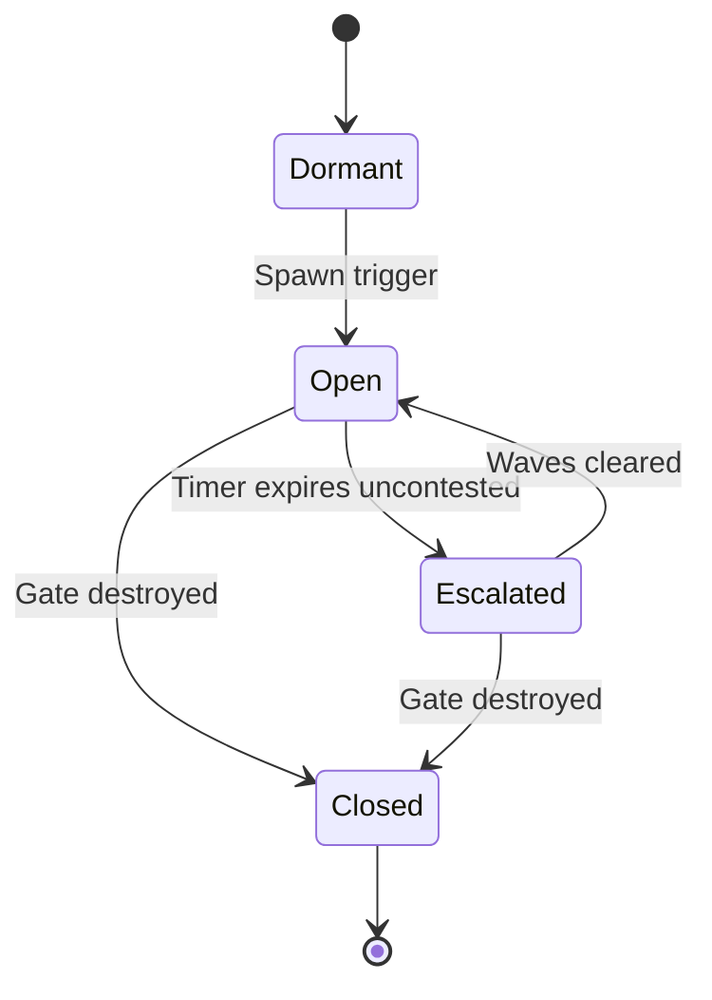

# Factions & Demons

[← Game Design](README.md)

## Factions

Four factions: three playable, one server-controlled. Working names — final names, lore, and visual style **defined later**.

| # | Working name | Type | Concept direction |
|---|---|---|---|
| 1 | Soldats | Playable | Military remnant; conventional force |
| 2 | Science | Playable | Tech / research survivors |
| 3 | Religious | Playable | Faith order; anti-demon zealots |
| 4 | Demons | **NPC / PvE** | Hell incursion; server-controlled |

- Player picks one of the three playable factions on onboarding; permanent or season-locked (TBD).
- Faction determines unit roster, visual theme, factory models.
- Asymmetric balance target: no faction strictly dominant across all building kinds or region densities.
- Demons are never playable and never hold territory.

## Faction 4: Demons (PvE)

**The common enemy.** Demons are hostile to all three playable factions and allied with none — the shared threat the setting is built on. Server-controlled. Design purpose: anchor the lore, drive the RPG loop, and guarantee content everywhere, including regions with no nearby human opponents.

| Property | Value |
|---|---|
| Control | Server AI; never playable |
| Spawn source | Hellgates opening at semi-random real-world positions |
| Targets | Any owned building (any faction), player units, gate surroundings |
| Territory | **None.** Demons destroy buildings only; never occupy or own them |
| Reward | **Essence + XP + gear** — never Points (see Game Loops & Currencies) |

### Hellgates

- Spawn semi-randomly, weighted by **player presence**, not building density — every active player gets reachable events regardless of where they live.
- Emit demon waves on a timer until closed.
- Closed by destroying the gate: player units, on-site avatar action, or both.
- Unclosed gates escalate: larger waves, wider threat radius, higher reward.
- Rare high-tier gates act as regional events, drawing multiple players and factions against the common enemy.
- Gate and demon rewards pay **Essence**, never Points — the demon loop funds the avatar, not the army.
- Common enemy in lore and targeting, but **no alliance mechanic**: no shared objective, shared credit, or truce. Rival players stay hostile to each other at a gate.

### Design Effects

| Effect | Consequence |
|---|---|
| Density-independent content | Rural players always have something to fight |
| Common enemy | All three factions face the same threat; convergence at gates is emergent, never mechanical |
| Drives the RPG loop | Sole source of Essence, XP, and gear |
| Territory churn | Demon-destroyed buildings return to Neutral, reopening conquest |
| Defense value | Makes garrisoning owned buildings useful even with no human threat nearby |
| Real-world pull | Gates and workshops both require travel — the RPG loop cannot be played remotely |

**Rules, decided:**

- Demons are the **common enemy**: hostile to all three factions, allied with none, never playable.
- Demons never occupy buildings. Destruction only → building reverts to Neutral and is reconquerable by any player faction.
- Faction cooperation at gates is **incidental only**. No alliance system, no shared credit, no suspended PvP.
- Demon rewards are **Essence only**. No Points from demons; no Essence from buildings.
