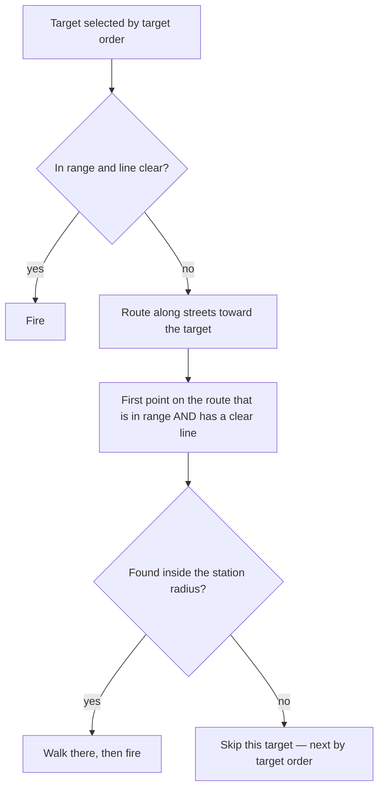
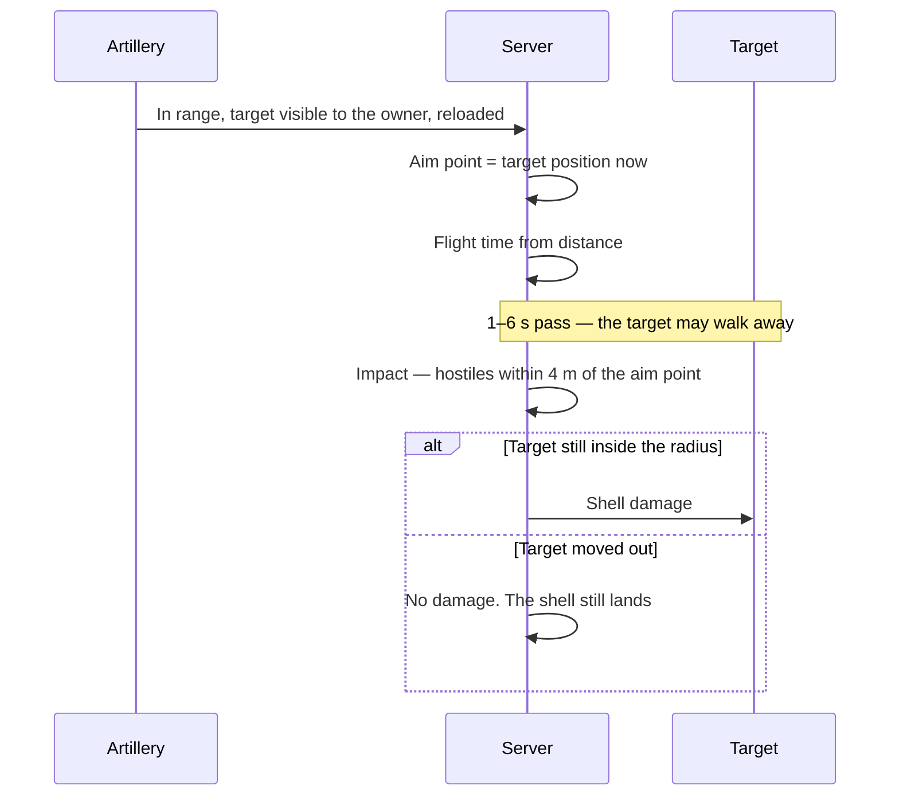

# Line of Sight & Indirect Fire

[← Game Design](README.md)

Two ways a shot reaches its target. **Direct fire** needs a clear line; **indirect fire** arcs over everything but hits a *position*, not a target.

| Weapon class | Needs a clear line | Hits | Used by |
|---|---|---|---|
| **Direct** | Yes | The target, instantly | Infantry, Marksman, Siege, towers, avatar, demons |
| **Indirect** | No | Whatever stands at the aim point when the shell lands | Artillery (post-launch) |

Facing decides *when* a shot may resolve; line of sight decides *whether it can reach* — see [Facing & Rotation](facing.md#facing--rotation).

## Line of Sight

One test for every direct-fire attacker, in 2.5D. There is no separate ground case and no separate tower case.

| Rule | Detail |
|---|---|
| The line | From the attacker's eye height to the target's eye height |
| Blocker | A building footprint the line crosses **whose height is above the line at the crossing** |
| Eye height, ground | **1.7 m** — units, demons, avatar |
| Eye height, tower | Its building's height **+ 3 m** |
| Eye height, target | Same values; a building or factory is measured at its own height |
| Nothing else blocks | Units, demons, drops, gates and factories never block a line |
| Scope | The attack only. Sight, placement, stationing and conquest are untouched |
| Authority | Server-side, at the region tick |

Because the same formula carries height, a tower on a 20 m roof shoots over the 6 m garage next door, and a ground unit does not. No special case, no second rule.

### What Line of Sight Does Not Gate

| Unchanged | Why |
|---|---|
| **Sight radius / fog of war** | Stays a plain circle — 75 / 100 / 150 m by density class. A visibility polygon per asset per tick is the expensive thing this design avoids, and the client would need the same geometry to agree |
| Tower and factory placement | Still proximity only — see [Structures](rts.md#structures) |
| Station placement | Still no line-of-sight requirement — see [Station Placement Rules](rts.md#station-placement-rules) |
| Conquest, repair, pickup | Presence rules, unrelated to geometry |

Consequence, stated plainly: **you can see through a building but not shoot through it.** That is deliberate — vision is cheap and generous, damage is earned by position.

### Blocked Targets Move Units

A blocked target is not skipped — it is walked to.

| Rule | Detail |
|---|---|
| Firing position | The **first** point along the street route that is both in weapon range and has a clear line |
| Search | Computed once when the target is selected, never per tick |
| Bound | The firing position must lie inside the unit's station radius; a unit never leaves its guard zone to get an angle |
| No position exists | The target is skipped and the next one is taken by the normal [Target Order](rts.md#target-order) |
| Re-evaluation | On the existing triggers, plus on arrival at a firing position. A target that moves more than 10 m invalidates the position |
| Flicker control | A line is re-tested at most **once per second** per attacker–target pair, and a line that just became clear stays clear for one second |
| Avatar | Never repositions itself — it sits at the player's GPS position. A player behind a wall walks, in the real world, or picks another target |

Consequence: buildings become cover. A defender who stations units behind a block forces attackers into the open street, and the street network — not the crow-flies distance — decides who shoots first.

## Indirect Fire

Artillery ignores the line entirely. What it pays instead: it cannot shoot close, it takes time to land, and it hits the ground rather than the enemy.

| Rule | Value |
|---|---|
| Line of sight | **Not tested** |
| Minimum range | **20 m** — the cheap expression of "the arc cannot come down that steeply" |
| Maximum range | 120 m |
| Aim point | The target's position **at the moment of firing**. The shell is never re-aimed |
| Flight time | `clamp(distance / 25 m/s, 1 s, 6 s)`, rounded to the tick |
| On impact | Every **hostile** within the impact radius takes the shell's damage |
| Impact radius | 4 m |
| Friendly fire | **None.** Own and allied assets in the radius are unharmed |
| Damage model | Damage **per shell**, plus a reload time — not DPS per tick |
| Reload | 5 s |
| Vision requirement | The target must be inside the **owner's** sight at the moment of firing — see [Spotting](#spotting) |
| Structures | Siege bonus applies, ×4 — see [Damage Model](combat.md#damage-model) |

### Why This Is Not a Miss Chance

The design pillar says *always hits, no evasion, no miss* — and it still holds. There is **no dice roll here.** The shell lands exactly where it was aimed; whether that hurts depends only on whether the target stayed. Deterministic, visible in advance, and answerable by moving.

### What Artillery Is Good At

Units move at 1.0–1.4 m/s. A 4 s flight is roughly 5 m of travel — one impact radius.

| Target | Outcome |
|---|---|
| Buildings, towers, factories, hellgates | Cannot move. Reliably hit |
| Units holding a station | Standing still by definition. Reliably hit |
| Units walking a route | Usually gone by impact |
| Avatars | Hit only if the player stands still |

Artillery is therefore a **siege weapon by arithmetic**, not by a special rule. It breaks defences; it does not chase infantry.

### Spotting

The target must be inside the owner's sight when the shell is fired — the union of the sight radii of all their assets, which the server already maintains.

| Density class | Sight radius | Artillery range | Effect |
|---|---|---|---|
| City | 75 m | 120 m | Needs a forward unit as a spotter for the last 45 m |
| Suburb | 100 m | 120 m | Needs a spotter at the edge |
| Rural | 150 m | 120 m | Sees its own full range |

Consequence: a unit stationed forward becomes an eye for the artillery behind it. **Holding ground extends reach** — territory pays a second time, beyond Points.

## Artillery Archetype

**Not in the launch roster.** It arrives after the P3 metrics, so the launch roster stays three symmetric archetypes — see [Launch Roster](rts.md#launch-roster). Starting values, backend config like every other number.

| Property | Value |
|---|---|
| Tier / avatar level | T3 / 12 — a second T3 archetype, no new tier |
| Cost | 2 500 Points |
| HP | 90 — the most fragile unit in the game |
| Damage per shell | 90, **×4 vs. structures** |
| Range | 20–120 m |
| Station engagement radius | 120 m — the only type above the 40 m default |
| Base speed | 0.8 m/s |
| Production time | 900 s |
| Traverse arc / rate | ± 180° / 30 °/s — see [Traverse Arcs](facing.md#traverse-arcs) |
| Base turn rate | 30 °/s |

Counter-play, by construction: it out-ranges towers (40 m), so it cannot be answered by defence alone — but it dies to a single unit that reaches it, and it cannot defend itself while reloading.

## Not Modelled

| Left out | Why |
|---|---|
| Ballistic arc clearance | Minimum range achieves the same feel for one comparison instead of a curve sample |
| Projectile travel for direct fire | Damage is applied per tick; the flying shot is client presentation only |
| Shell scatter, deviation | Would add randomness the design pillar excludes |
| Friendly fire | Splash onto the building you are trying to capture is frustration, not depth |
| Line of sight for vision | Explicitly rejected above — cost and client agreement |
| Height of anything but buildings | Terrain is flat in this game; only footprints and their heights exist |

Technical representation — the geometry index, the 2.5D test and pending impacts: [Architecture § Line of Sight & Impacts](../architecture/line-of-sight.md#line-of-sight--impacts).
