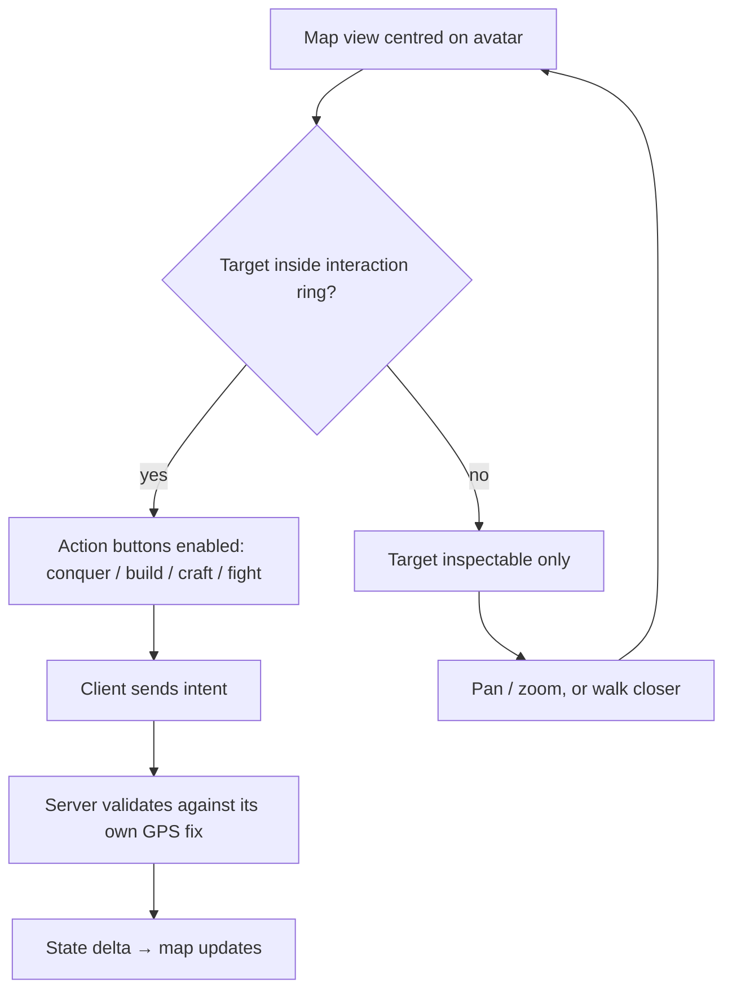

# View & Presentation

[← Game Design](README.md)

One view, always the same: a 3D world map with the player's avatar on it, Pokémon GO-style. **Camera AR is out of scope** — decided, not deferred.

| Element | Rule |
|---|---|
| Camera | Tilted top-down, locked to the avatar; user may rotate, pitch, zoom |
| Zoom band | Set by what the device renders within budget — no fixed design value |
| Avatar | Rendered at the user's live GPS position, facing the direction of travel; upper body turns to the current target — see [Facing & Rotation](facing.md#facing--rotation) |
| Buildings | Stylized low-poly models at real coordinates; one model per building kind at launch |
| Ownership colour | Own buildings in full faction colour. Inside sight: allied buildings outlined in faction colour, rival buildings in the rival faction's colour, desaturated. Neutral and out-of-sight buildings untinted — see [Relations](factions.md#relations) |
| Units, towers, gates, drops | Rendered on the same map from live state; units, towers and demons carry a base and a turret facing — see [Facing & Rotation](facing.md#facing--rotation) |
| Interaction ring | Circle around the avatar showing the current action radius |
| Free pan | The **subscribed area** around the avatar (interest cells), under fog of war — see [Visibility](#visibility) |
| Remote view | Map pans to own assets for orders; conquest-type actions stay radius-gated |
| HUD | Screen-space overlay: currencies, unit orders, alerts, selected target |
| Target selection | Tap a visible hostile to aim the avatar at it — see [Target Selection](combat.md#target-selection) |
| Ghost | A defeated avatar renders translucent; the respawn point shows as a private marker on the owner's map only — see [Defeat](rpg.md#defeat) |

## Why No Camera AR

| Reason | Effect |
|---|---|
| Battery | Camera + tracking drains a phone in a session; play sessions are long and outdoors |
| Georeferencing error | Compass and anchor drift misplace world-anchored objects by meters — conquest targets would look wrong |
| Play posture | Territory, RTS and RPG loops are read-and-tap, not look-around |
| Safety | Holding a camera up while walking is worse than glancing at a map |
| Scope | One renderer, one camera, one input model |

## Art Direction

Reference point: *League of Legends* — stylized low-poly geometry with hand-painted texture work, read from a tilted top-down camera. Post-apocalyptic subject matter, **not** a gritty photoreal one.

| Property | Direction |
|---|---|
| Geometry | Low-poly; shape carries the read, not mesh density |
| Texturing | Hand-painted, baked lighting and AO into the albedo; few real-time lights |
| Colour | Saturated, high-contrast; own-ownership colour is the strongest signal on the map |
| Silhouette | Readable at map zoom — a unit type is identifiable by outline alone |
| Scale | Exaggerated: units and towers read larger than real-world proportion against buildings |
| Damage states | Colour and decal shift, not mesh destruction |
| Basemap | Stylized ground and streets; never photorealistic imagery |

Production of assets in this style: [Architecture § Asset Pipeline](../architecture/asset-pipeline.md#asset-pipeline). Until an asset exists, its entity renders as an untextured primitive of the same size — see [Architecture § Placeholder Assets](../architecture/placeholder-assets.md#placeholder-assets).

Why it fits this game:

| Driver | Effect |
|---|---|
| Camera is far and tilted | Detail below silhouette level is never seen — no reason to pay for it |
| Mobile budget | Low poly counts and shared atlases keep draw calls and memory in range |
| Mass instancing | Hundreds of buildings per view; stylized kits repeat without looking wrong |
| Real-world data gaps | Stylized buildings tolerate approximated footprints and estimated heights; photoreal does not |
| Ownership readability | Own territory must be legible at a glance, at any zoom |

## Map Interaction

- The ring is presentation of a server-side radius, never the rule itself — the server re-checks every intent (see [Presence Rules](entities.md#presence-rules)).
- Unit orders work from the panned-away map; placement and conquest do not.

## Visibility

Not everything inside the streamed area is shown. **Vision comes from what you own.**

| Object | Visible when |
|---|---|
| Buildings, streets, workshops | Always, in the streamed area — this is the map itself |
| Building ownership + HP | Own buildings always; allied and rival only inside the sight radius of an own asset |
| Own avatar, units, factories, towers | Always, at any distance |
| **Rival and allied units, factories, towers** | Only inside the sight radius of an own asset (avatar, unit, building, factory, tower) |
| **Demons** | Same rule as rival units |
| **Hellgates** | Always, in the streamed area, never fogged — gates exist to attract players |
| **Rival and allied avatars** | **Never on the open map.** Only at a shared site (workshop, hellgate), inside that site's radius |

- **Fog of war:** outside own sight, the nearby map shows only static geometry — buildings, streets, workshops. No owners, units, factories, towers, or demons.
- Free panning is limited to the subscribed cells; it never reveals more than fog of war allows.
- Sight radius is one server value for all asset types, set per density class: **75 m city, 100 m suburb, 150 m rural** — see [Density Classes](world.md#density-classes). Per-type ranges are deferred until more unit and tower types exist.
- Only **own** assets give sight. Allied assets do not — see [Relations](factions.md#relations).
- An unseen attacker is a real outcome: a rival can station units outside your sight and close in. Owning more ground buys more warning.
- The server sends only what is visible — invisible entities are not in the stream at all, so the rule cannot be bypassed by a modified client.

Why rival avatars stay hidden:

| Reason | Effect |
|---|---|
| Safety | An avatar marker is a live GPS position of a real person; broadcasting it enables stalking |
| Consent | At workshops and gates the player chose to travel to a shared site — that is the consent boundary |
| Design | The conflict is over territory and units, not over ambushing people |
