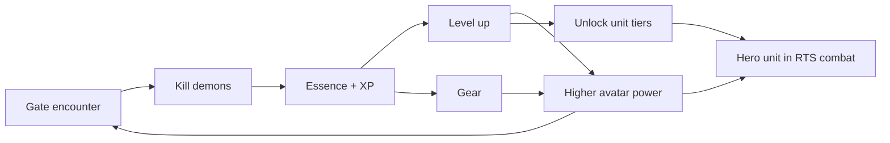
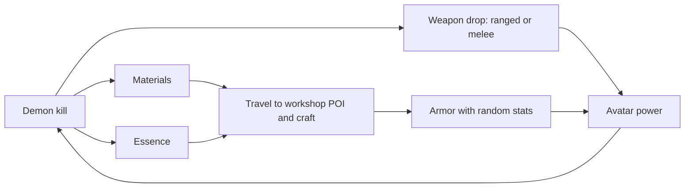
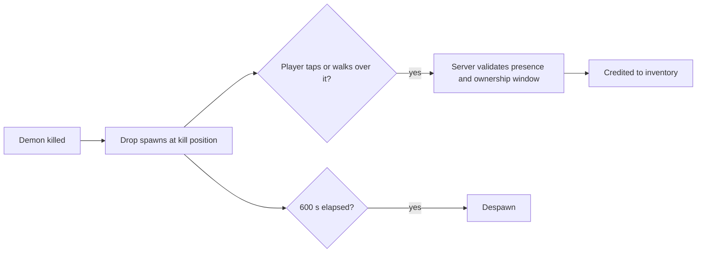

# RPG Sub-Loop (Avatar)

[← Game Design](README.md)

The avatar is the player's body on the map. Progression is **personal**: it travels with the player and is never lost when territory falls.

| Element | Detail |
|---|---|
| Currency | Essence (working name) |
| XP source | Demon kills, gate closures |
| Progression | Avatar level + gear slots |
| Level cap | 30 |
| Gear slots | 3: ranged weapon, melee weapon, armor set |
| Weapons | Demon drops only |
| Armor | Crafted at a Workshop — requires travelling to a real POI |
| Stats | Randomly rolled on both |
| Persistence | Survives loss of all buildings and units |
| Scope | Single avatar per player; no alts |

## Avatar Stats

Starting values in the backend config — see [Balance Parameters](balance.md#balance-parameters).

| Stat | Base at level 1 | Per level | Gear |
|---|---|---|---|
| Max HP | 200 | +20 | Armor affixes |
| Melee DPS | 15 | +1 | Melee weapon base + affixes |
| Ranged DPS | 10 | +0.7 | Ranged weapon base + affixes |
| Melee range | 8 m | — | Weapon affix |
| Ranged range | 30 m | — | Weapon affix |
| Regeneration | 2 HP/s after 10 s out of combat | — | Armor affix |

```
xp_to_next(level) = 100 × level^1.5
stat = base(level) × (1 + Σ affix %)          Σ affix % per stat ≤ 100 %
```

## What Avatar Power Buys

| Affects | Effect |
|---|---|
| Demon combat | Higher-tier gates become survivable → more Essence |
| RTS combat | Avatar joins attacks and defense as a hero unit |
| Tech access | Level gates higher unit tiers — see [Tech Access](#tech-access) |



### Tech Access

**Hard gate.** A factory owned by a player below the level cannot queue that tier. No cost scaling, no soft unlock.

| Unit tier | Avatar level |
|---|---|
| T1 | 1 |
| T2 | 5 |
| T3 | 12 |

Towers and factories have one tier at launch and are never level-gated.

## Gear

Two acquisition paths, both with **randomly rolled stats**. This is the endless-chase layer: no item is terminal, so the demon loop never runs out of reason to run.

### Slots

**Three slots, fixed.** A full loadout is 2 drops + 1 craft.

| # | Slot | Class | Acquisition | Source | Sink |
|---|---|---|---|---|---|
| 1 | Ranged weapon | Weapon | **Drop only** | Demon kills, gate rewards | — |
| 2 | Melee weapon | Weapon | **Drop only** | Demon kills, gate rewards | — |
| 3 | Armor set | Armor | **Craft only** | Workshop — a neutral real-world POI | Essence + materials |

- Armor is one **set** piece, not separate head/chest/legs — keeps the mobile inventory small and the craft target singular.
- Both weapons are equipped at once. The server picks per attack by target distance — **the player never switches manually** (see Combat).
- Loadout is a build decision, not a combat action: choose which range bands to cover.
- No trinket, consumable, or cosmetic slots in scope.
- Starting kit: one Common T1 melee weapon, one Common T1 ranged weapon, one Common T1 armor. Never lost.

### Inventory and Binding

| Rule | Value |
|---|---|
| Inventory size | 20 items, equipped items excluded |
| Full inventory | Pickup is refused with a prompt to discard; the drop stays on the ground |
| Binding | **Bound to the player.** No trading, no gifting, no market |
| Discard | Any time; nothing refunded |

Why no trading: a market would let a strong player gear a weak account for free, and every item would become a farming target for cooperating accounts. Gear is the personal record of gates a player closed.

### Acquisition

- Crafting happens **only at a workshop**, and the player must be standing there. No remote crafting.
- No crafting cooldown: a player at a workshop crafts as often as their Essence and materials allow.
- Materials drop from demons; Essence pays the craft cost.
- Every roll is independent: crafting the same armor set twice yields different stats.
- There is no re-roll of an existing item. Wanting a better armor means crafting a new one — that **is** the Essence sink.
- Higher-tier gates raise base-item tier and rarity odds, not just drop volume.
- **All rolls are server-side.** The client never generates or reveals stats before the server commits them (see Anti-Cheat).

| Craft | Essence | Material | Result |
|---|---|---|---|
| Armor T1 | 100 | 5 × Material T1 | Armor, tier 1, rarity rolled with T1 weights |
| Armor T2 | 200 | 5 × Material T2 | Armor, tier 2, rarity rolled with T2 weights |
| Armor T3 | 300 | 5 × Material T3 | Armor, tier 3, rarity rolled with T3 weights |

- One material kind per tier, working names `Material T1–T3`. A demon drops one material of its gate's tier with 30 % chance per kill.



### Ground Drops

Essence and loot are not credited on kill — they drop on the map and must be picked up.

| Property | Rule |
|---|---|
| Drops | Essence, weapons, materials |
| Position | Kill position on the map |
| Pickup by tap | Within the **interaction radius, 15 m** of the player's server-side fix |
| Pickup by walking | Automatic when the fix is within **5 m** of the drop |
| Presence | Required — a drop is collected in person |
| Ownership | **Exclusive to the killer's owner for 120 s**; afterwards anyone present may collect it |
| Killer | The player whose avatar, unit or tower dealt the killing blow |
| Unit or tower kills with no player nearby | **Dropped anyway** at the kill position — never credited remotely |
| Lifetime | 600 s, then despawn; expired drops are counted, not refunded |
| Merging | A new drop within 5 m of an existing drop with the same owner merges into it; the merged pile keeps the older drop's expiry |
| Roll | Contents rolled server-side at drop time |



Points are the contrast: credited passively per tick, never dropped.

Why unit kills still drop on the ground: the RPG loop is the real-world pull of the design. An army that farms Essence remotely would turn the demon loop into a couch loop. A player who sends units to a gate walks there to collect — or leaves the Essence to whoever does.

### Roll Model

```
item = base_template(tier) + rarity(tier) + affixes(rarity) + affix_values(range)
```

| Stage | Driven by |
|---|---|
| Base template | Gate tier / demon tier; base stat +50 % per tier |
| Rarity | Weighted roll, tier-scaled |
| Affix count | Rarity |
| Affix values | Uniform roll inside the affix range |

| Rarity | Affixes | Weight at T1 | Weight at T2 | Weight at T3 |
|---|---|---|---|---|
| Common | 0 | 70 | 50 | 30 |
| Uncommon | 1 | 25 | 30 | 35 |
| Rare | 2 | 5 | 17 | 25 |
| Epic | 3 | 0 | 3 | 10 |

Affix pool. Weapons share one pool regardless of class; armor has its own. An item never rolls the same affix twice.

| Pool | Affix | Range |
|---|---|---|
| Weapon | Damage | +5 % – +25 % |
| Weapon | Attack speed | +5 % – +20 % |
| Weapon | Range | +1 m – +5 m |
| Weapon | Critical chance (×2 damage) | +2 % – +10 % |
| Armor | Max HP | +5 % – +25 % |
| Armor | Damage reduction | +2 % – +10 % |
| Armor | Regeneration | +1 – +3 HP/s |
| Armor | Demon resistance | +5 % – +15 % |

### Power Gap

Random gear must not decide RTS hero fights on its own.

| Bound | Value |
|---|---|
| Gear multiplier on any stat | ≤ 2.0× base at the same tier (three affixes at maximum roll) |
| Tier step | +50 % base per tier; T3 ≈ 2.25× T1 |
| Level | Linear; level 30 ≈ 3.9× level-1 HP |
| Worst case, same level | ~2× between a Common-geared and an Epic-geared avatar |
| Worst case overall | Level 30 Epic T3 vs. level 1 starter ≈ one order of magnitude — the same gap the level curve already implies |

## Why This Sustains the Loop

| Mechanism | Effect |
|---|---|
| No terminal item | A better roll always exists → gates stay worth running |
| Armor crafting | Unbounded Essence sink; late-game avatars never cap out |
| Weapon drop-only | Ties weapon progress directly to gate tier and risk |
| Split paths | Neither pure grinding nor pure crafting covers all 3 slots |
| Two weapon slots | Doubles the drop chase without widening the inventory or adding input |

## Avatar in RTS Combat

- Avatar acts as a hero unit with its own stats and gear, but **cannot be sent anywhere**: it sits at the player's real GPS position and attacks what the player picks, or the nearest hostile when nothing is picked — see [Target Selection](combat.md#target-selection).
- Contributing to a battle means physically being near it.
- Presence is optional — the RTS loop runs asynchronously without the player on site.
- Whether the avatar engages rival assets at all is a player setting — see [Avatar Targeting](combat.md#avatar-targeting).

### Defeat

A defeated avatar does not wait out a timer. It becomes a **ghost**, and the player walks home.

| Property | Rule |
|---|---|
| Trigger | Avatar HP reaches 0 |
| State | **Ghost**: cannot attack, cannot be attacked, cannot be targeted, cannot be challenged |
| Duration | **No timer.** The ghost state ends only at the respawn point |
| Movement | Unaffected — the ghost still follows the player's GPS position |
| Presence actions | **All blocked**: conquer, place, repair, craft, fight a gate, pick up drops |
| Remote actions | **Unaffected** — unit orders, stance and the map work as always; commanding is not a physical act, see [Presence Rules](entities.md#presence-rules) |
| Sight | Unchanged — the avatar still grants its sight radius |
| Gear, Essence, XP, Points | No loss, no durability, no cost |
| Recovery | Full HP on reaching the respawn point |
| Persistence | Survives logout, app restart and server restart |

```mermaid
stateDiagram-v2
    [*] --> Alive
    Alive --> Ghost: HP reaches 0
    Ghost --> Ghost: Player moves; orders still work, nothing else does
    Ghost --> Alive: Player is within 15 m of the respawn point
    Alive --> Alive: Respawn point moved (at most once per 48 h)
```



| Driver | Effect |
|---|---|
| The game is about being somewhere | The penalty is **distance**, the one currency this genre already has |
| No gear or Essence cost | The players the RPG loop most needs — those attempting gates above their level — are not punished for trying |
| The army keeps running | A ghost still commands; being defeated costs the RPG loop, never the RTS loop |
| Placement is the choice | Where the respawn point sits decides how expensive death is — a frontier point is aggressive, a home point is safe |

Accepted: a player defeated far from home can stay a ghost for days. That is the point of choosing a respawn point, and the army stays under their control the whole time.

### Respawn Point

| Property | Rule |
|---|---|
| Count | **One per player** |
| What it is | A map position the avatar revives at — typically home |
| Setting it | Presence-gated action at the player's current position; any position the player can legally stand at |
| First one | Set automatically at the player's position on the first accepted fix after faction choice; movable from then on |
| Change cooldown | **Once every 48 h**, server-side, per player |
| While a ghost | **Cannot be changed** — the player revives at the point they had when they fell |
| Revival | Automatic within **15 m** of the point, at full HP; no cost, no confirmation |
| Speed lock | Applies: revival is presence-gated, so it does not resolve at driving speed — see [Speed Lock](combat.md#speed-lock) |
| Visibility | **Private.** Never streamed to any other player, at any range, in any state |
| Combat | The point itself is not an entity: nothing spawns there, nothing can attack or destroy it |

Why the 48 h cooldown: without it the respawn point is a free teleport target that is re-placed before every risky fight. With it, placement is a standing decision about where the player actually lives and plays.

Why it is never visible to anyone else: for most players the respawn point will be their home address. It is the single most sensitive position in the game, and the same reasoning that keeps rival avatars off the map applies to it — see [Why rival avatars stay hidden](presentation.md#visibility).

## Loop Separation

- Essence buys **only** avatar progression. Points buy **only** army and structures.
- A player who ignores demons fields an army but a weak avatar: cannot clear high-tier gates, locked out of upper tech tiers.
- A player who ignores territory has a strong avatar but no income: cannot field or sustain an army, cannot hold ground.
- Holding territory remains the win condition; the avatar is the tool, not the goal.
