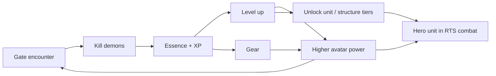
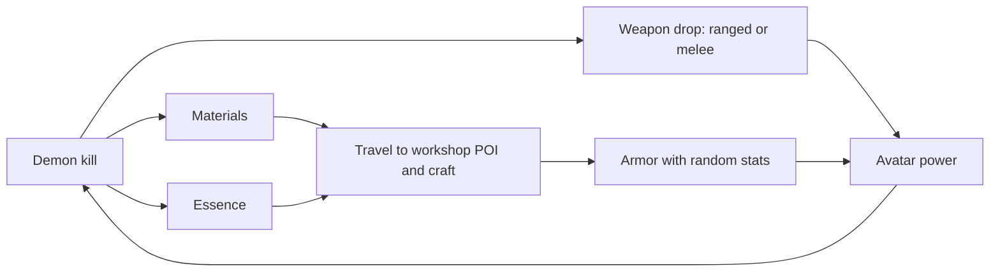

# RPG Sub-Loop (Avatar)

[← Game Design](README.md)

The avatar is the player's body on the map. Progression is **personal**: it travels with the player and is never lost when territory falls.

| Element | Detail |
|---|---|
| Currency | Essence (working name) |
| XP source | Demon kills, gate closures |
| Progression | Avatar level + gear slots |
| Gear slots | 3: ranged weapon, melee weapon, armor set |
| Weapons | Demon drops only |
| Armor | Crafted at a Workshop — requires travelling to a real POI |
| Stats | Randomly rolled on both |
| Persistence | Survives loss of all buildings and units |
| Scope | Single avatar per player; no alts |

## What Avatar Power Buys

| Affects | Effect |
|---|---|
| Demon combat | Higher-tier gates become survivable → more Essence |
| RTS combat | Avatar joins attacks and defense as a hero unit |
| Tech access | Level gates higher unit and structure tiers |
| Survivability | Defeat penalty reduced (see below) |



## Gear

Two acquisition paths, both with **randomly rolled stats**. This is the endless-chase layer: no item is terminal, so the demon loop never runs out of reason to run.

### Slots

**Three slots, fixed.** A full loadout is 2 drops + 1 craft.

| # | Slot | Class | Acquisition | Source | Sink |
|---|---|---|---|---|---|
| 1 | Ranged weapon | Weapon | **Drop only** | Demon kills, gate rewards | — |
| 2 | Melee weapon | Weapon | **Drop only** | Demon kills, gate rewards | — |
| 3 | Armor set | Armor | **Craft only** | Workshop — a neutral real-world POI | Essence + materials |

- Armor is one **set** piece, not separate head/chest/legs — keeps the mobile inventory small and the craft target singular.
- Both weapons are equipped at once. The server picks per attack by target distance — **the player never switches manually** (see Combat).
- Loadout is a build decision, not a combat action: choose which range bands to cover.
- No trinket, consumable, or cosmetic slots in scope.

### Acquisition

- Crafting happens **only at a workshop**, and the player must be standing there. No remote crafting.
- Materials drop from demons; Essence pays the craft cost.
- Every roll is independent: crafting the same armor set twice yields different stats.
- Higher-tier gates raise base-item tier and rarity odds, not just drop volume.
- **All rolls are server-side.** The client never generates or reveals stats before the server commits them (see Anti-Cheat).



### Roll Model

```
item = base_template(tier) + rarity(tier) + affixes(rarity) + affix_values(range)
```

| Stage | Driven by |
|---|---|
| Base template | Gate tier / demon tier |
| Rarity | Weighted roll, tier-scaled |
| Affix count | Rarity |
| Affix values | Range roll per affix |

## Why This Sustains the Loop

| Mechanism | Effect |
|---|---|
| No terminal item | A better roll always exists → gates stay worth running |
| Armor crafting | Unbounded Essence sink; late-game avatars never cap out |
| Weapon drop-only | Ties weapon progress directly to gate tier and risk |
| Split paths | Neither pure grinding nor pure crafting covers all 3 slots |
| Two weapon slots | Doubles the drop chase without widening the inventory or adding input |

## Avatar in RTS Combat

- Avatar acts as a hero unit with its own stats and gear, but **cannot be sent anywhere**: it sits at the player's real GPS position and auto-attacks what comes in range.
- Contributing to a battle means physically being near it.
- Presence is optional — the RTS loop runs asynchronously without the player on site.
- Avatar defeat: knocked out, not deleted. Cooldown before re-entry; no gear loss (TBD whether a durability or Essence cost applies).

## Loop Separation

- Essence buys **only** avatar progression. Points buy **only** army and structures.
- A player who ignores demons fields an army but a weak avatar: cannot clear high-tier gates, locked out of upper tech tiers.
- A player who ignores territory has a strong avatar but no income: cannot field or sustain an army, cannot hold ground.
- Holding territory remains the win condition; the avatar is the tool, not the goal.
