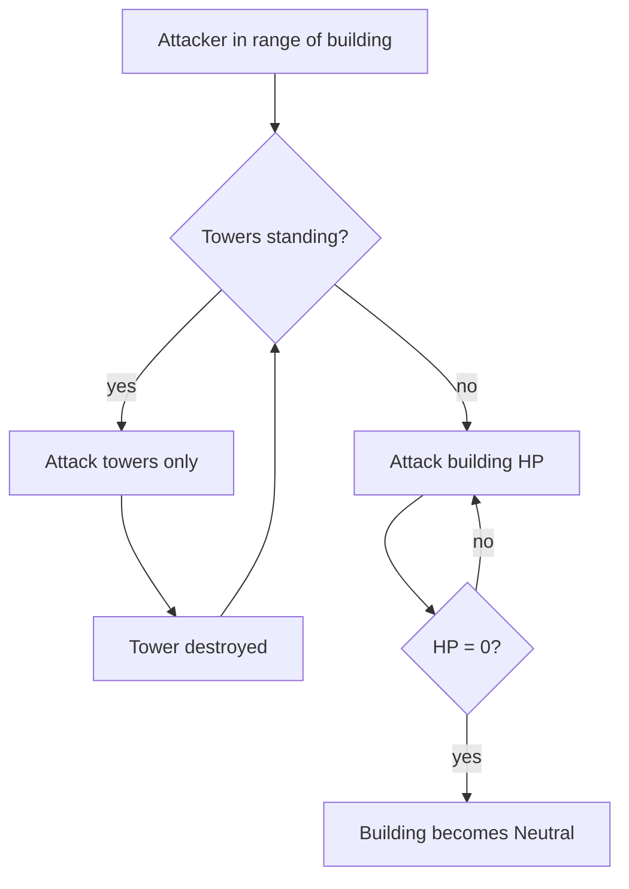
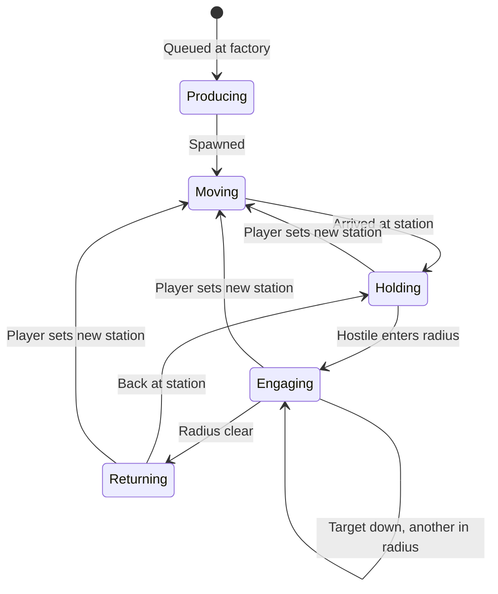
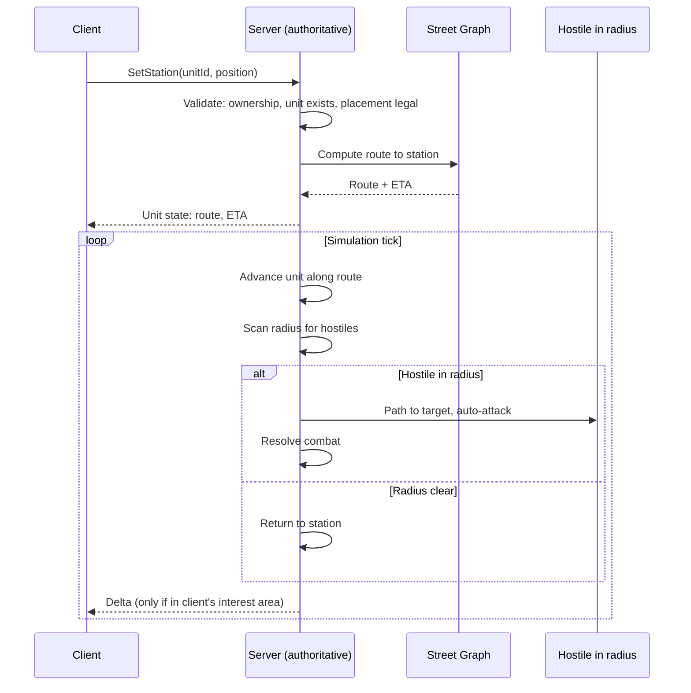

# RTS Sub-Loop

[← Game Design](README.md)

Unlocked by accumulated points. Applies per-building, anchored to that building's real-world location.

## Structures

Constructs are placed by the player and cost Points. **Placement always requires physical presence** — there is no remote construction.

| Construct | Placement | Function | Cost |
|---|---|---|---|
| Factory | **Free land only** — never on a building or road | Produces units | Points |
| Tower | **On an owned building's roof only** | Auto-defense + damage shield | Points |

- **Free space** = a land position whose factory footprint intersects no building footprint and no road. No minimum spacing to roads or other factories. Validated server-side.
- Ownership of nearby buildings is irrelevant — a factory may stand next to rival territory.
- Placement range: within **15 m** of the player — same as the conquest radius.
- Factory and Tower are complementary and never overlap: factories go in the gaps between buildings, towers go on top of them.
- Workshops are **not** constructs — they are neutral world sites (see World Sites).

## Factories

| Property | Rule |
|---|---|
| Placement | Free land within 15 m of the player |
| Destructible | **Yes** — attacked and destroyed like units and towers |
| On destruction | Removed; drops nothing |

## Towers

Towers are the building's armour layer. A building cannot be damaged while its towers stand.

| Property | Rule |
|---|---|
| Placement | On the roof of an **owned building**, and only within player range of it |
| Count per building | Limited by roof space — each tower footprint must fit inside the building footprint |
| Placement check | Player proximity only — no line-of-sight test (the target building is the anchor) |
| Mobility | Fixed to the building; never moves |
| Targeting | Auto-attacks hostiles in its radius |
| Shield role | **Building takes no damage while any tower on it stands** |
| Order of destruction | All towers first, then building HP |
| On building loss | Towers are destroyed with the building |
| Damaged tower | Repairable |
| Destroyed tower | Rebuildable on the same roof |

Consequence: taking a defended building is a two-stage job. Stacking towers buys time for the owner to respond or for stationed units to arrive.

## Units

Crafted at factories, paid in Points. A unit spawns at the factory that made it, then paths to its **station** — a fixed map position it guards a radius around. It acts like a creep: auto-engages anything hostile inside the radius, then returns.

**There is exactly one player order: set the station.** Attacking is expressed by stationing a unit near the target, not by issuing an attack command. Orders are given **remotely** — no physical presence required (see Presence Rules).

| Property | Rule |
|---|---|
| Production | Crafted at a factory; costs Points |
| Unit cap | **Hard cap: 100 units per player** |
| Station | A map position assigned to the unit |
| Engagement radius | Fixed radius around the **station** |
| Targets in radius | Demons, rival units, rival factories, rival towers, rival buildings |
| Targeting | Automatic — no player input |
| Target priority | By target type first, then nearest |
| When radius is clear | Return to station |
| Player control | Set / re-set the station. Nothing else. |
| Movement | Street routes (see Pathfinding) |
| Unit types | Differ by faction (see Factions) |

## Unit Behavior

- The radius is measured from the **station**, not from the unit's current position — a fleeing target cannot drag a unit away.
- Hostiles outside the radius are ignored, even if adjacent to the unit.
- Re-stationing is the only way to change what a unit fights.
- Units left on a station keep working while the player is offline.

## Orders

| Order | Effect |
|---|---|
| `SetStation(unitId, position)` | Unit paths to the new station and guards it |

### Station Placement Rules

| Rule | Requirement |
|---|---|
| Player presence | **Not required** — orders are given remotely, from anywhere |
| Line of sight | Not required |
| Reachability | The station must be reachable by street route from the unit's position |
| Validation | Server-side |

- Commanding units is **not** a physical act. A player can redirect their army from anywhere, at any time.
- What limits reach is **travel time**, not permission: a unit ordered across the city takes as long as the streets take.
- Units keep fighting while the player is offline; they simply hold their last station.

### Placement Rules Summary

Every placement action requires the player to be physically present. Nothing is placed remotely.

Two distinct kinds of action, with **different presence rules**:

| Kind | What it does | Presence | Cost | Repeatable |
|---|---|---|---|---|
| **Placement** | Puts a construct on the map, or claims a building | **Required** | Points | Once per position |
| **Command** | Moves an existing unit's guard post | **Not required** | Free | Any time |

| Action | Kind | Presence | Anchor |
|---|---|---|---|
| Conquer building | Placement | **Yes** | The building |
| Place factory | Placement | **Yes** | Free space |
| Place tower | Placement | **Yes** | Owned building |
| Set unit station | Command | **No** | Any reachable position |

- The rule in one line: **be there to claim it, not to command it.**
- **Factory vs. station:** a factory is a construct that *produces* units; a station is *where a produced unit stands*. Placing a factory creates nothing by itself — units are produced there for Points, and each is then stationed.

Consequences of a one-order model:

| Intent | How the player expresses it |
|---|---|
| Defend a building | Station units on or near it |
| Attack a rival building | Station units inside its radius |
| Hold a hellgate | Station units within the gate's radius |
| Escort the avatar | Station units where the player is standing |
| Retreat | Re-station further back |

## Pathfinding

- Units move along real street routes (road graph from map data).
- Applies both to reaching a station and to closing on a target inside the radius.
- Travel time is real-time or scaled; affects tactical timing (reinforcement races).
- **Server-side only.** Client sends intent (`SetStation`), never a path. See [Architecture](../architecture/README.md).

