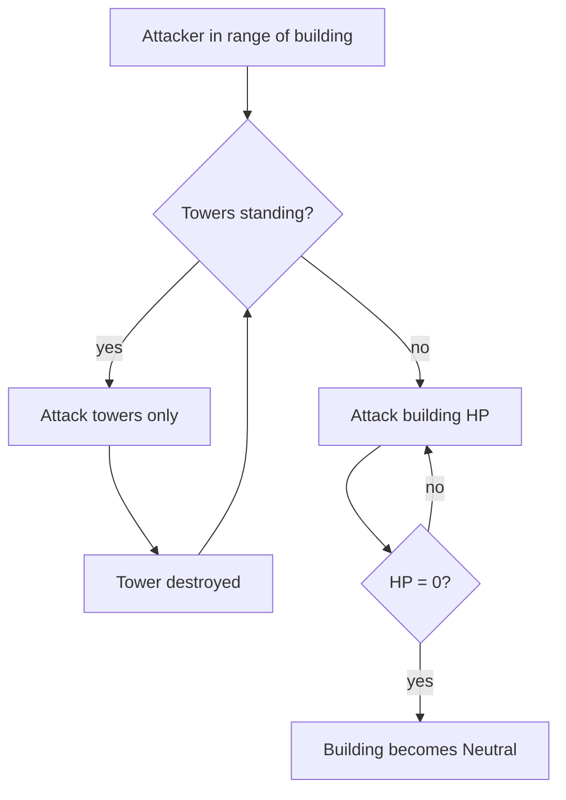
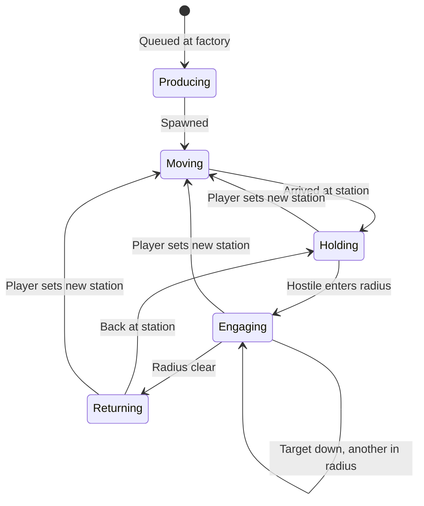
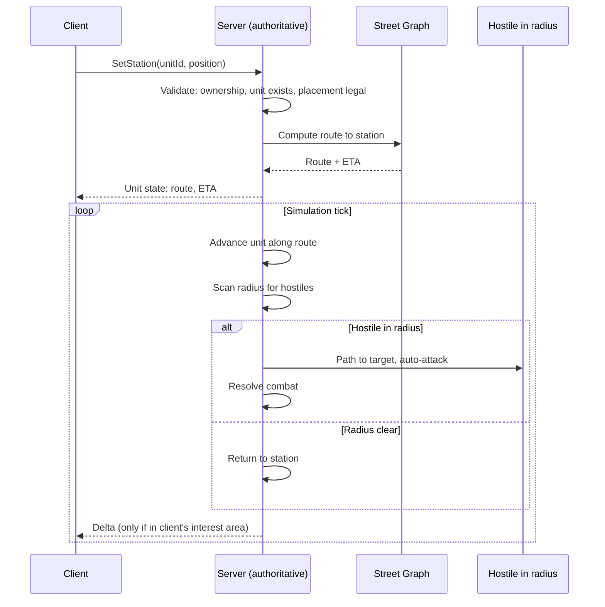

# RTS Sub-Loop

[← Game Design](README.md)

Unlocked by accumulated points. Applies per-building, anchored to that building's real-world location.

## Structures

Constructs are placed by the player and cost Points. **Placement always requires physical presence** — there is no remote construction.

| Construct | Placement | Function | Cost | HP |
|---|---|---|---|---|
| Factory | **Free land only** — never on a building or road | Produces units | 1 500 Points | 500 |
| Tower | **On an owned building's roof only** | Auto-defense + damage shield | 1 000 Points | 600 |

- **Free space** = a land position whose factory footprint intersects no building footprint and no road. No minimum spacing to roads or other factories. Validated server-side.
- Ownership of nearby buildings is irrelevant — a factory may stand next to rival territory.
- Placement range: within **15 m** of the player — same as the conquest radius.
- Factory and Tower are complementary and never overlap: factories go in the gaps between buildings, towers go on top of them.
- Workshops are **not** constructs — they are neutral world sites (see World Sites).
- Costs and HP are starting values in the backend config — see [Balance Parameters](balance.md#balance-parameters).

## Factories

| Property | Rule |
|---|---|
| Placement | Free land within 15 m of the player |
| Cap | **5 factories per player** |
| Production | One unit at a time; queue of up to 5 orders; Points charged when queued, refunded if cancelled before production starts |
| Destructible | **Yes** — attacked and destroyed like units and towers |
| On destruction | Removed; queued orders refunded; drops nothing |
| Damaged | Repairable — same rule as towers, see [Repair and Rebuild](#repair-and-rebuild) |

## Towers

Towers are the building's armour layer. A building cannot be damaged while its towers stand.

| Property | Rule |
|---|---|
| Placement | On the roof of an **owned building**, and only within player range of it |
| Count per building | `min(4, max(1, floor(footprint_area / 50 m²)))` — one slot per 50 m² of roof, at least one, at most four |
| Placement check | Player proximity only — no line-of-sight test (the target building is the anchor) |
| Mobility | Fixed to the building; never moves |
| Targeting | Auto-attacks hostiles within **40 m**, same target order as units |
| Shield role | **Building takes no damage while any tower on it stands** |
| Order of destruction | All towers first, then building HP |
| On building loss | Towers are destroyed with the building |
| Damaged tower | Repairable |
| Destroyed tower | Rebuildable on the same roof |

Consequence: taking a defended building is a two-stage job. Stacking towers buys time for the owner to respond or for stationed units to arrive.

### Repair and Rebuild

| Action | Applies to | Presence | Cost | Allowed when |
|---|---|---|---|---|
| Repair | Tower, factory | **Required** (placement-kind action) | `0.5 × build cost × missing HP fraction`, rounded up | No hostile has damaged the construct in the last 60 s |
| Rebuild | Destroyed tower | **Required** | Full build cost | Building is in state Owned — same rule as a new placement |

- Repair restores full HP in one action; no partial repair.
- Towers and factories do **not** regenerate. Buildings do — see [Building HP](territory.md#building-hp).
- Rationale: repair is a placement-kind act ("be there to claim it"). A player away from home responds with units, not with remote repairs.

## Units

Crafted at factories, paid in Points. A unit spawns at the factory that made it, then paths to its **station** — a fixed map position it guards a radius around. It acts like a creep: auto-engages anything hostile inside the radius, then returns.

**There is exactly one unit order: set the station.** Attacking is expressed by stationing a unit near the target, not by issuing an attack command. Orders are given **remotely** — no physical presence required (see Presence Rules).

| Property | Rule |
|---|---|
| Production | Crafted at a factory; costs Points |
| Unit cap | **Hard cap: 100 units per player** |
| Station | A map position assigned to the unit; defaults to the factory position on spawn |
| Engagement radius | **Per unit type**, fixed around the **station**. Launch value **40 m** for every type; not upgradable by the player |
| Targets in radius | Hostiles only — see [Relations](factions.md#relations) |
| Targeting | Automatic — no player input |
| Target priority | Valid hostile avatar first, then nearest — no type ranking; see [Target Order](#target-order) |
| When radius is clear | Return to station |
| Player control | Set / re-set the station. Nothing else. **No cooldown** between orders; a new order replaces the current route immediately |
| Movement | Street routes (see Pathfinding) |
| Facing | Base follows the route, turret follows the target within a per-type arc — see [Facing & Rotation](facing.md#facing--rotation) |
| Unit types | Three archetypes, identical across factions at launch (see Launch Roster); skins differ by faction |

### Target Order

One rule for every automatic attacker — units, towers and demons alike. **There is no type ranking.**

| Rank | Target | Detail |
|---|---|---|
| 1 | **A hostile avatar it may legally attack** | Demons: any avatar in range, always. Rival units and towers: only while the avatar carries the aggressor flag — see [Aggressor Rule](combat.md#aggressor-rule) |
| 2 | **Everything else, equally** | Demons, buildings, factories, units, towers — **nearest by street distance**, ties by lowest entity ID |

| Rule | Detail |
|---|---|
| Avatar first | An avatar that is a valid target outranks everything, at any distance inside the engagement radius |
| No type ranking below that | A stationed army hits what is closest, not the "correct" layer |
| Shielded buildings are skipped | A building with a standing tower on it is not a valid target at all — the towers are. Shielding stays a rule, not a priority; see [Towers](#towers) |
| Determinism | Distance then entity ID; server and client reach the same answer |
| Re-evaluation | On target death, on the target leaving the radius, and when an avatar becomes a valid target — never per tick, so units do not flip between two equidistant targets |

The **player's own avatar does not use this order at all** — the player picks its target — see [Target Selection](combat.md#target-selection).

Consequence: defenders no longer get a free ordering. A rival army standing next to a factory will chew through the factory while the towers 30 m away shoot at it; whoever positions closer to what matters decides the fight. And an avatar that opens fire becomes the single most dangerous thing on the field to stand near.

### Launch Roster

Faction-symmetric at launch. Values are starting config, tuned by metrics.

| Archetype | Tier | Avatar level | Cost | HP | DPS | Range | Base speed | Production time | Note |
|---|---|---|---|---|---|---|---|---|---|
| Infantry | T1 | 1 | 250 | 120 | 12 | 2 m | 1.4 m/s | 60 s | Melee; the baseline |
| Marksman | T2 | 5 | 600 | 70 | 9 | 25 m | 1.4 m/s | 180 s | Ranged; fragile |
| Siege | T3 | 12 | 1 500 | 200 | 6, **×4 vs. structures** | 15 m | 1.0 m/s | 600 s | Anti-tower, anti-building; full traverse |

- Tier access is **hard-gated** by avatar level: a factory cannot queue a tier the owner has not unlocked — see [Tech Access](rpg.md#tech-access).
- Base speed is multiplied by the density-class speed factor — see [Density Classes](world.md#density-classes).
- Damage is applied per tick with no miss chance; see [Damage Model](combat.md#damage-model).
- Traverse arc and turn rates differ per archetype — Infantry and Marksman must face what they shoot, Siege does not; see [Traverse Arcs](facing.md#traverse-arcs).

## Unit Behavior

- The radius is measured from the **station**, not from the unit's current position — a fleeing target cannot drag a unit away.
- Hostiles outside the radius are ignored, even if adjacent to the unit.
- A unit inside the radius still has to bring its weapon to bear: no damage until the target is inside the firing arc — see [Turning to Fire](facing.md#turning-to-fire).
- Inside the radius the nearest hostile wins, whatever it is — except a valid avatar, which is always taken first.
- Re-stationing is the only way to change what a unit fights.
- Units left on a station keep working while the player is offline.

## Orders

| Order | Effect |
|---|---|
| `SetStation(unitId, position)` | Unit paths to the new station and guards it |

### Station Placement Rules

| Rule | Requirement |
|---|---|
| Player presence | **Not required** — orders are given remotely, from anywhere |
| Line of sight | Not required |
| Reachability | The station must be reachable by street route from the unit's position, plus at most one off-road leg — see [Reachability](#reachability) |
| Cooldown | None per unit. Per-player order rate limit is a technical guard, not a rule — see [Anti-Cheat](../architecture/anti-cheat.md#anti-cheat) |
| Validation | Server-side |

- Commanding units is **not** a physical act. A player can redirect their army from anywhere, at any time.
- What limits reach is **travel time**, not permission: a unit ordered across the city takes as long as the streets take.
- Units keep fighting while the player is offline; they simply hold their last station.

### Placement Rules Summary

Every placement action requires the player to be physically present. Nothing is placed remotely.

Two distinct kinds of action, with **different presence rules**:

| Kind | What it does | Presence | Cost | Repeatable |
|---|---|---|---|---|
| **Placement** | Puts a construct on the map, claims a building, repairs | **Required** | Points | Once per position |
| **Command** | Moves an existing unit's guard post | **Not required** | Free | Any time |

| Action | Kind | Presence | Anchor |
|---|---|---|---|
| Conquer building | Placement | **Yes** | The building |
| Place factory | Placement | **Yes** | Free space |
| Place tower | Placement | **Yes** | Owned building |
| Repair / rebuild | Placement | **Yes** | The construct |
| Set unit station | Command | **No** | Any reachable position |

- The rule in one line: **be there to claim it, not to command it.**
- **Factory vs. station:** a factory is a construct that *produces* units; a station is *where a produced unit stands*. Placing a factory creates nothing by itself — units are produced there for Points, and each is then stationed.

The avatar is the exception, and it is not a unit order: the player aims their own avatar by tapping a target — see [Target Selection](combat.md#target-selection).

Consequences of a one-order model:

| Intent | How the player expresses it |
|---|---|
| Defend a building | Station units on or near it |
| Attack a rival building | Station units inside its radius |
| Hold a hellgate | Station units within the gate's radius |
| Escort the avatar | Station units where the player is standing |
| Retreat | Re-station further back |

## Pathfinding

- Units move along real street routes (road graph from map data).
- Applies both to reaching a station and to closing on a target inside the radius.
- Travel time is real-time, scaled by the density-class speed factor; affects tactical timing (reinforcement races).
- **Server-side only.** Client sends intent (`SetStation`), never a path. See [Architecture](../architecture/README.md).

### Reachability

Stations, buildings and factories are usually off the street network. Every route has an optional **off-road leg** at the end.

| Rule | Value |
|---|---|
| Route | Street graph from the unit's nearest street point to the street point nearest the goal |
| Off-road leg | Straight line from that street point to the goal, **at most 30 m** |
| Goal for an attack | The nearest point of the target's footprint within the unit's weapon range |
| Unreachable | No street route, or off-road leg longer than 30 m → station rejected / target skipped |
| Off-road speed | Same as street speed |

Consequence: a building deep inside a block, more than 30 m from any street, could never be attacked. To avoid invulnerable territory, the map pipeline **excludes such buildings from the conquerable set**; they render as scenery only. The coverage report counts them.

