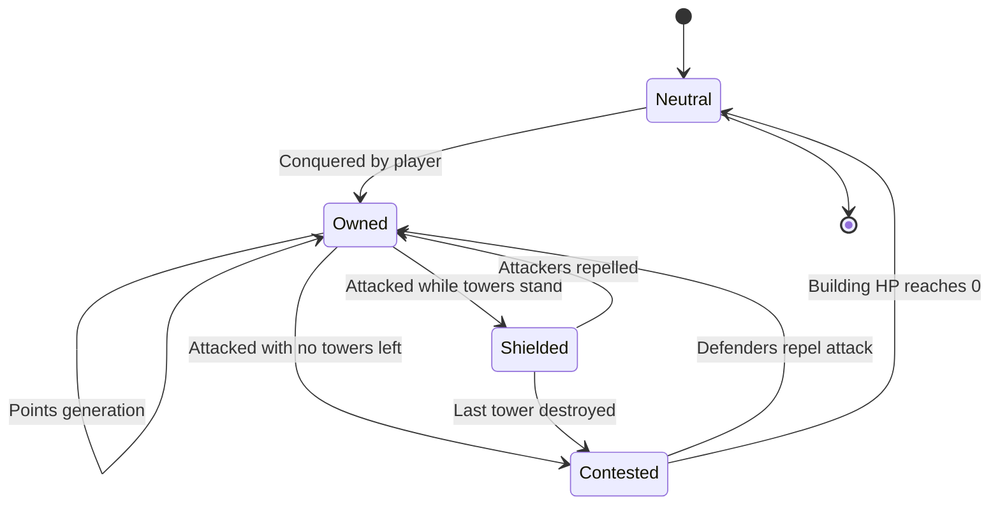

# Territory & Ownership

[← Game Design](README.md)

## Building Ownership

### Conquest Rules

| Condition | Requirement |
|---|---|
| Proximity | User within conquest radius — **15 m, fixed global value**, identical everywhere |
| Target state | Neutral only (not owned by another faction) |
| Action | Player-initiated conquer action, may include a timer/minigame |

### Points Generation

```
points/tick = base_rate(building_kind) × volume_multiplier(building) × scarcity_bonus(tile)
```

| Building kind | Rarity | Relative point rate |
|---|---|---|
| House | Common | 1x |
| Shop | Common | 1.5x |
| School | Uncommon | 2x |
| Hospital | Rare | 4x |
| Landmark | Very rare | 8x |

- Volume multiplier scales with building footprint × estimated height (from map data).
- Points accrue while building is owned, credited passively per tick (e.g. every 60s). No collection visit.
- `scarcity_bonus` normalizes rural income against city income (see Coverage & Density).

## Building State Machine

**Shielded** = under attack but towers still standing; building HP cannot be reduced.


