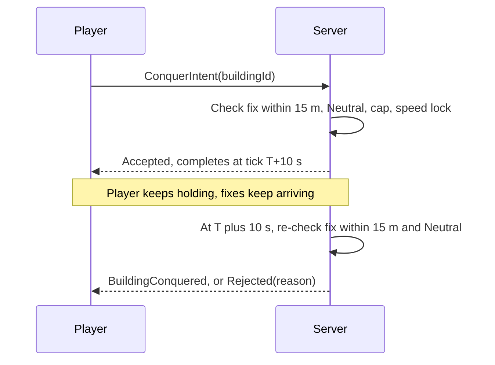
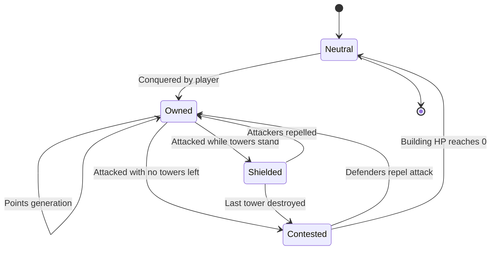

# Territory & Ownership

[← Game Design](README.md)

## Building Ownership

### Conquest Rules

| Condition | Requirement |
|---|---|
| Proximity | User within conquest radius — **15 m, fixed global value**, identical everywhere; measured from the server-side fix to the nearest point of the footprint |
| Target state | Neutral only — not owned by any player, allied included (see [Relations](factions.md#relations)) |
| Ownership cap | Player below the density-class cap — see [Density Classes](world.md#density-classes) |
| Speed lock | Not active — see [Speed Lock](combat.md#speed-lock) |
| Action | **Hold-to-conquer, 10 s.** The player holds a button; the server checks proximity at start and at completion. No minigame |
| Concurrency | One conquest in progress per player. First to complete wins a contested neutral building; the other attempt fails with reason `NotNeutral` |



### Workshop-Site Buildings

Schools and train stations are both conquerable buildings and workshop anchors.

| Rule | Value |
|---|---|
| Conquerable | **Yes**, as ordinary buildings of their kind |
| Safe zone | The 5 m circle around the POI node, not the building |
| Building inside the safe zone | A building counts as inside when its **centroid** is within the radius — rare for a school, since the POI node usually sits at an entrance |
| Combat on the building | Attacks resolve normally as long as attacker and target centroid are outside the circle |

### Points Generation

```
points/tick = base_rate(building_kind) × volume_multiplier(building) × scarcity_bonus(cell) × synthetic_factor
```

| Building kind | Rarity | Relative point rate | Base HP |
|---|---|---|---|
| House | Common | 1x | 300 |
| Shop | Common | 1.5x | 400 |
| School | Uncommon | 2x | 600 |
| Hospital | Rare | 4x | 1 000 |
| Landmark | Very rare | 8x | 2 000 |

- Base rate: **1 Point per tick for a House**; the tick is 60 s. Everything else is relative to that.
- Volume multiplier: `clamp(footprint_area × height / 1 500 m³, 0.5, 3.0)` — a 150 m² house with 10 m height is 1.0.
- Points accrue while building is owned, credited passively per tick. No collection visit.
- `scarcity_bonus` normalizes rural income against city income (see [Density Normalization](world.md#density-normalization)).
- `synthetic_factor` is 1.0 for a real footprint, lower for synthesized targets (see [Data Coverage Fallback](world.md#data-coverage-fallback)).
- Starting balance for a new player: **2 000 Points** — one factory and two Infantry, so the RTS loop opens on day one.

### Building HP

```
max_hp = base_hp(kind) × volume_multiplier(building)
```

| Rule | Value |
|---|---|
| Regeneration | 1 % of max HP per minute, after 60 s without taking damage |
| Repair | None — buildings regenerate; towers and factories are repaired |
| On conquest | Full HP |
| On reverting to Neutral | HP reset to full for the next owner |

## Building State Machine

**Shielded** = under attack but towers still standing; building HP cannot be reduced.



- "Attacked" = a hostile has damaged the building or one of its towers within the last 60 s.
- Points accrue in every owned state, Shielded and Contested included.
