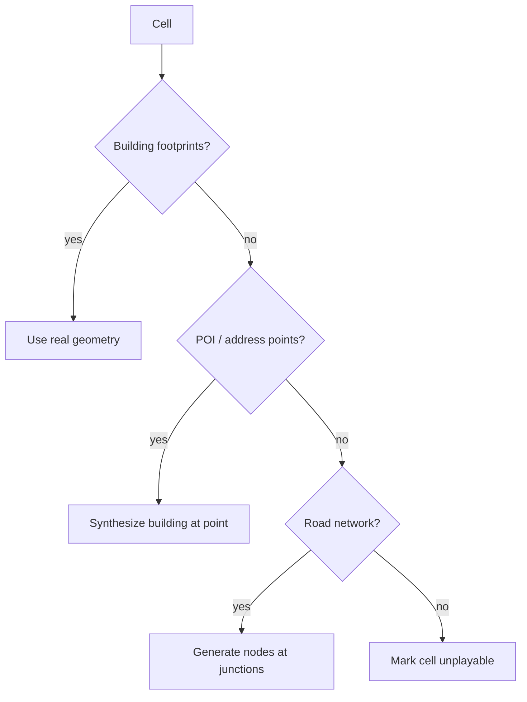

# World, Map & Coverage

[← Game Design](README.md)

## World & Map

- Real-world map data drives building placement (Overture / OSM building footprints).
- Where footprints are missing, targets are synthesized from POI or road data (see Coverage & Density).
- Buildings rendered as 3D models on the map, positioned at real GPS coordinates.
- Avatar position = user's live GPS location.
- One view for everything: the world map (see [View & Presentation](presentation.md#view--presentation)).

## Coverage & Density

Target: playable anywhere people live — dense city, suburb, village, rural. Play quality must not depend on where the player lives.

| Environment | Targets in walking range | Risk |
|---|---|---|
| City core | Hundreds | Visual clutter, trivial conquest, streaming load |
| Suburb | Tens | Baseline case |
| Village / rural | Few | Loop stalls, nothing to conquer |
| Uninhabited (ocean, desert, forest) | None | Out of scope — no play expected |

### Density Classes

Density is computed per **cell** (H3 r8, ~0.74 km²) by the map pipeline and stored server-side. Two uses: a continuous formula for income, and three discrete classes for everything else.

```
density(cell) = conquerable buildings(cell) / area(cell)      [buildings / km²]
```

| Class | Density | Sight radius | Unit speed factor | Ownable buildings per player | Interest k-ring |
|---|---|---|---|---|---|
| City | ≥ 1 500 /km² | 75 m | 1.0 | 30 | 1 |
| Suburb | 300 – 1 500 /km² | 100 m | 1.5 | 50 | 2 |
| Rural | < 300 /km² | 150 m | 2.0 | 100 | 3 |

- Class boundaries and per-class values are backend config.
- The ownership cap uses the class of the **building's** cell, counted per class: a player may own 30 city buildings and 100 rural buildings at once.
- Sight radius and speed factor use the class of the cell the asset stands in.

### Density Normalization

Server computes local density per cell; game constants derive from it. Constants are **server-side**, so the client cannot tamper with them, and backend-configurable (see [Balance Parameters](balance.md#balance-parameters)).

**Conquest radius is fixed and global.** It does not scale with density — the player must physically stand near a building everywhere, city or countryside. Normalization happens through income and content, not reach.

```
scarcity_bonus  = clamp((d_ref / density)^a, 1.0, bonus_max)
points/tick     = base_rate(kind) × volume_multiplier × scarcity_bonus × synthetic_factor
```

| Constant | Value | Meaning |
|---|---|---|
| `d_ref` | 1 000 /km² | Density that counts as normal; at or above it the bonus is 1.0 |
| `a` | 0.5 | Growth of the bonus as density drops — square root, so half the density pays 1.41× |
| `bonus_max` | 3.0 | Upper limit; reached at 111 /km² and below |

| Parameter | Dense area | Sparse area | Scales with density? |
|---|---|---|---|
| Conquest radius | Fixed | Fixed | **No** |
| Point rate | Baseline | Scarcity bonus | Yes, continuous |
| Ownable buildings per player | Lower cap | Higher cap | Yes, by class |
| Unit travel speed | Real-scale | Boosted (longer street distances) | Yes, by class |
| Sight radius | Small | Large | Yes, by class |
| Interest radius (streaming) | Small | Large | Yes, by class |
| Hellgate spawn rate | Baseline | Baseline (player-driven) | No — see Demons |

Balance target: comparable points-per-session regardless of location. A rural player reaches fewer buildings; income per building and demon events compensate, not a wider reach.

### Data Coverage Fallback

Map data quality varies by country and region. Cascade per cell until a conquerable target exists.



Workshops draw on the same POI data (schools, train stations), so workshop availability varies by region too. **Workshops are never synthesized** — where none exist nearby, the player travels to one.

| Source | Provides | Used when | `synthetic_factor` |
|---|---|---|---|
| Building footprints (Overture / OSM) | Geometry, volume, kind | Preferred | 1.0 |
| POI / address points | Position, kind; synthetic 10 × 10 × 6 m footprint | No footprints | 0.5 |
| Road network nodes | Position only; kind House; same synthetic footprint | No POI data | 0.25 |
| None | — | Uninhabited; no play | — |

- Missing height → estimate from kind + regional defaults (level-count heuristic).
- Missing kind → classify from tags / POI category; default to House.
- Synthetic targets are marked as such server-side and pay less, so regions with poor map data are never the better farm. The scarcity bonus still applies on top.
- Buildings more than 30 m from the street network are excluded from the conquerable set — see [Reachability](rts.md#reachability).
- The cascade applies to conquerable targets only, never to workshops.

### Regional Play

- Faction balance evaluated **per region**, not globally — a rural region must not be permanently locked by whichever faction arrived first.
- Sparse regions: longer unit travel, faster units, so the RTS loop stays reachable for a solo player.
- Low-population regions have few or no nearby human opponents; **demons (Faction 4) supply the pressure** so the loop runs solo.
