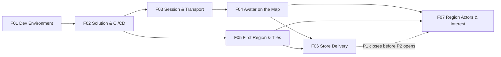

# Hellgate World — Feature Backlog

Delivery scope: what gets built, in which order, and when it counts as done. Rules and reasons live in [design/](../design/README.md) and [architecture/](../architecture/README.md) — a feature never decides anything, it implements decisions already recorded there.

## Contents

| # | Feature | Delivers | Size (est.) | Status |
|---|---|---|---|---|
| [F01](f01-dev-environment.md) | Dev Environment | One command builds, runs and tests the stack on a fresh machine | M | In review |
| [F02](f02-solution-and-ci.md) | Solution Skeleton & CI/CD | The repository layout, the shared package, and a green pipeline to GHCR and the VPS | L | Not started |
| [F03](f03-session-and-transport.md) | Identity, Session & Transport | A signed-in client holding a live binary WebSocket session | M | Not started |
| [F04](f04-avatar-position.md) | Avatar on the Map | The player's avatar moving at their real GPS position, fixes accepted server-side | L | Not started |
| [F05](f05-first-region-tiles.md) | First Region & Tile Renderer | One real district rendered from own geometry tiles | L | Not started |
| [F06](f06-store-delivery.md) | Store Delivery & P1 Release | Testers installing from TestFlight and Play internal; P1 closed | M | Not started |
| [F07](f07-region-actors-interest.md) | Region Actors & Interest Streaming | Live state: ticking regions, subscribed cells, snapshots and deltas | L | Not started |

F01–F06 are phase **P1, the walking skeleton**, and F06 closes it: a phase ends with a store test build against the deployed server, not a local demo. F07 opens **P2** with the live plane. No gameplay rule is implemented in any of the seven — see [Build Phases](../architecture/operations.md#build-phases).

## Implementation Plans

Optional per feature: ordered tasks with exact files, commands and *done when* checks, written for an implementer who follows instructions literally. A plan never changes scope — the spec wins on any conflict.

| Feature | Plan |
|---|---|
| F01 | [f01-dev-environment-plan.md](f01-dev-environment-plan.md) |

## Dependencies

- F04 and F05 can run in parallel once F03 is in: the avatar renders on plain ground without tiles, and tiles render without an avatar.
- F07 needs F04's accepted fix and F05's entity rows and density table, not F06 — but P1 closes before P2 opens, so F06 goes first.
- Nothing after F02 may bypass CI; a feature that cannot be verified by the pipeline is not done.

## Spec Format

Every feature file carries the same sections, in this order:

| Section | Content |
|---|---|
| Goal | One sentence: what exists afterwards that did not before |
| Implements | Links into `design/` and `architecture/` — the decisions this feature realizes |
| Scope | Deliverables as a table; each row is a checkable artifact |
| Out of Scope | What is deliberately left to a later feature, and which one |
| Acceptance | Checks that decide done; every row is observable by someone other than the author |
| Risks | What is likely to go wrong, and the mitigation |

## Rules

| Rule | Detail |
|---|---|
| Done means verified | Acceptance rows are executed, not asserted. From F02 on, that means in CI |
| Thin first | A feature ships the minimum of every layer it touches; depth comes later — see [Slice Rules](../architecture/operations.md#slice-rules) |
| No rules in features | A feature that needs a gameplay or technical decision stops and gets it recorded in the owning doc first |
| Art is never a gate | Entities render as primitives — see [Placeholder Assets](../architecture/placeholder-assets.md#placeholder-assets) |
| Sizes are estimates | S ≈ days, M ≈ 1–2 weeks, L ≈ 2–4 weeks, solo. Order of magnitude only |
| Numbering | `F<nn>`, never reused; a dropped feature keeps its number and a `Dropped` status |
| Index maintenance | A new feature file gets a row in the table above in the same commit |

## Not Yet Scheduled

Known work with no feature number yet. Each gets one when it is next.

| Item | Why not now | Earliest |
|---|---|---|
| Faction choice, conquest, ownership, Points | Needs the live plane F07 delivers | P2, right after F07 |
| Fog of war and the vision cache | Nothing to hide until buildings have owners | P2 |
| Game config versions and the balance dashboard | Nothing to tune until there are gameplay values in play | P2 |
| Native location plugin | `Input.location` is enough to validate the loop — see [Tech Stack § Client](../architecture/tech-stack.md#client) | P2 |
| Platform attestation | Nothing worth cheating at exists yet — see [Attestation Strictness](../architecture/anti-cheat.md#attestation-strictness) | P2 |
| Automatic region ingest | Manual pipeline runs cover P1 — see [Ingest Trigger](../architecture/map-data.md#ingest-trigger) | P2 |
| Routing service, units, combat tick | P3 by the phase plan | P3 |
