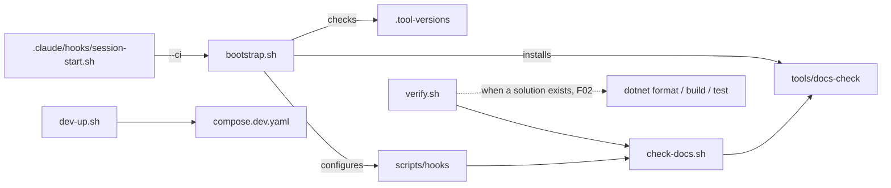

# F01 — Implementation Plan

[← Features](README.md)

Ordered tasks to implement [F01 — Dev Environment](f01-dev-environment.md). Written for an implementer who follows instructions literally: every task names its files, gives their content or exact rules, the commands to run, and a *done when* check. No task requires a decision.

## Rules for the Implementer

| Rule | Detail |
|---|---|
| Read first | [CLAUDE.md](../../CLAUDE.md), [F01 spec](f01-dev-environment.md), [Tech Stack § Tooling & Delivery](../architecture/tech-stack.md#tooling--delivery), [Code Patterns § Cross-Cutting Rules](../architecture/code-patterns.md#cross-cutting-rules) |
| Branch | `feature/f01-dev-environment` from `main` |
| Order | Tasks T1 → T13 in sequence; each task ends with its *done when* check passing before the next starts |
| File contents | Where this plan gives a file body, copy it verbatim. Where it gives rules, follow them exactly. Do not add files the plan does not name |
| Scripts | `#!/usr/bin/env bash`, `set -euo pipefail`, executable bit set (`chmod +x`), run from any directory by `cd "$(git rev-parse --show-toplevel)"` first |
| No projects | No `.csproj`, `.sln`, `.slnx` or Unity project — that is F02. Guards in scripts skip .NET steps when no solution exists |
| No decisions | If a step cannot be completed as written (image tag missing, tool unavailable, ambiguous rule), **stop and report** with the exact error. Do not substitute |
| No secrets | Only `.env.example` is committed; `.env` is git-ignored. Passwords in `.env.example` are local defaults, labelled as such |
| Docs untouched | Do not edit `docs/design/`, `docs/architecture/` or `docs/grundlagen/`. Only the two edits in T12 touch `docs/features/` |
| Commit | One commit per task, subject `f01: <task title>`, body listing the files |

## Target Tree

```
/
├── .claude/
│   ├── hooks/session-start.sh
│   └── settings.json
├── .editorconfig
├── .env.example
├── .gitattributes
├── .gitignore
├── .tool-versions
├── README.md
├── global.json
├── deploy/
│   ├── compose.dev.yaml
│   ├── postgres/init/01-extensions.sql
│   ├── minio/init.sh
│   └── observability/
│       ├── prometheus.yml
│       └── grafana/provisioning/datasources/prometheus.yaml
├── scripts/
│   ├── bootstrap.sh
│   ├── check-docs.sh
│   ├── dev-down.sh
│   ├── dev-reset.sh
│   ├── dev-up.sh
│   ├── verify.sh
│   └── hooks/pre-commit
└── tools/docs-check/
    ├── package.json
    ├── package-lock.json
    ├── check-links.mjs
    └── check-mermaid.mjs
```



## T1 — Branch and Skeleton

| Step | Command |
|---|---|
| 1 | `git checkout main && git pull && git checkout -b feature/f01-dev-environment` |
| 2 | `mkdir -p .claude/hooks deploy/postgres/init deploy/minio deploy/observability/grafana/provisioning/datasources scripts/hooks tools/docs-check` |

**Done when:** the directories exist and `git status` shows no tracked changes.

## T2 — Toolchain Declarations

### `.tool-versions`

Format: `<tool> <required-prefix>`, one per line. A tool passes when its installed version **starts with** the prefix.

```
dotnet 10.0
node 24
docker 29
git-lfs 3
jq 1.8
unity 6000
```

### `global.json`

```json
{
  "sdk": {
    "version": "10.0.100",
    "rollForward": "latestFeature"
  }
}
```

If `dotnet --list-sdks` on the implementer's machine shows a 10.0 SDK with a different band, keep `10.0.100` — `rollForward: latestFeature` accepts any later 10.0 band.

**Done when:** both files exist with exactly this content.

## T3 — `scripts/bootstrap.sh`

```bash
#!/usr/bin/env bash
# Checks the toolchain against .tool-versions, installs git hooks and docs-check deps.
# Usage: scripts/bootstrap.sh [--ci]
#   --ci  skip Docker and Unity checks (CI runners and Claude Code web sessions)
set -euo pipefail
cd "$(git rev-parse --show-toplevel)"

CI_MODE=0
[[ "${1:-}" == "--ci" ]] && CI_MODE=1

installed_version() {
  case "$1" in
    dotnet)  command -v dotnet >/dev/null && dotnet --version 2>/dev/null || true ;;
    node)    command -v node >/dev/null && node --version 2>/dev/null | sed 's/^v//' || true ;;
    docker)  command -v docker >/dev/null && docker version --format '{{.Server.Version}}' 2>/dev/null || true ;;
    git-lfs) command -v git-lfs >/dev/null && git lfs version 2>/dev/null | sed -E 's#^git-lfs/([0-9.]+).*#\1#' || true ;;
    jq)      command -v jq >/dev/null && jq --version 2>/dev/null | sed 's/^jq-//' || true ;;
    unity)   unity_version ;;
    *)       echo "" ;;
  esac
}

# Unity is checked, never installed. Looks at UNITY_EDITOR_PATH, then Unity Hub's default folders.
unity_version() {
  if [[ -n "${UNITY_EDITOR_PATH:-}" ]]; then
    basename "$(dirname "$UNITY_EDITOR_PATH")"; return
  fi
  local d
  for d in "/Applications/Unity/Hub/Editor" "$HOME/Unity/Hub/Editor" "/mnt/c/Program Files/Unity/Hub/Editor"; do
    if [[ -d "$d" ]]; then
      ls "$d" 2>/dev/null | grep -E '^6000' | sort -V | tail -n1; return
    fi
  done
  echo ""
}

status=0
printf '%-8s %-10s %-14s %s\n' TOOL REQUIRED FOUND RESULT
while read -r tool required; do
  [[ -z "$tool" || "$tool" == \#* ]] && continue
  if (( CI_MODE )) && [[ "$tool" == "docker" || "$tool" == "unity" ]]; then
    printf '%-8s %-10s %-14s %s\n' "$tool" "$required" "-" "skipped (--ci)"; continue
  fi
  found="$(installed_version "$tool")"
  if [[ -z "$found" ]]; then
    printf '%-8s %-10s %-14s %s\n' "$tool" "$required" "missing" "FAIL"; status=1
  elif [[ "$found" == "$required"* ]]; then
    printf '%-8s %-10s %-14s %s\n' "$tool" "$required" "$found" "ok"
  else
    printf '%-8s %-10s %-14s %s\n' "$tool" "$required" "$found" "FAIL (version)"; status=1
  fi
done < .tool-versions

if (( status != 0 )); then
  echo
  echo "bootstrap: toolchain incomplete. Install the tools marked FAIL (see README.md) and re-run." >&2
  exit "$status"
fi

git lfs install --local >/dev/null
git config core.hooksPath scripts/hooks
echo "bootstrap: git hooks -> scripts/hooks, git-lfs enabled"

if [[ ! -d tools/docs-check/node_modules ]]; then
  echo "bootstrap: installing docs-check dependencies"
  npm install --prefix tools/docs-check --no-audit --no-fund --silent
fi
echo "bootstrap: ok"
```

`chmod +x scripts/bootstrap.sh`

**Done when:** `scripts/bootstrap.sh` prints the table and exits 0 on the implementer's machine; `scripts/bootstrap.sh --ci` shows docker and unity as skipped. If a tool is missing, the row says `FAIL` and the exit code is 1 — install it before continuing.

## T4 — Repository Hygiene

### `.gitignore`

Concatenate, in this order, the current `Unity.gitignore` and `VisualStudio.gitignore` from [github/gitignore](https://github.com/github/gitignore), each under a comment header naming its source, then append:

```
# --- project ---
.env
tools/docs-check/node_modules/
.claude/settings.local.json
```

### `.gitattributes`

```
* text=auto eol=lf

# Git LFS — binary art and source files
*.blend filter=lfs diff=lfs merge=lfs -text
*.blend1 filter=lfs diff=lfs merge=lfs -text
*.fbx filter=lfs diff=lfs merge=lfs -text
*.png filter=lfs diff=lfs merge=lfs -text
*.jpg filter=lfs diff=lfs merge=lfs -text
*.psd filter=lfs diff=lfs merge=lfs -text
*.tga filter=lfs diff=lfs merge=lfs -text
*.wav filter=lfs diff=lfs merge=lfs -text
*.ogg filter=lfs diff=lfs merge=lfs -text

# Unity YAML merges
*.unity merge=unityyamlmerge eol=lf
*.prefab merge=unityyamlmerge eol=lf
*.asset merge=unityyamlmerge eol=lf
```

### `.editorconfig`

```ini
root = true

[*]
charset = utf-8
end_of_line = lf
insert_final_newline = true
trim_trailing_whitespace = true
indent_style = space
indent_size = 4

[*.{yml,yaml,json,md,mjs,js,sh}]
indent_size = 2

[*.md]
trim_trailing_whitespace = false

[*.cs]
# Warnings are errors in CI (Directory.Build.props, F02); these rules are the shared baseline.
dotnet_sort_system_directives_first = true
dotnet_style_qualification_for_field = false:warning
dotnet_style_predefined_type_for_locals_parameters_members = true:warning
csharp_style_var_for_built_in_types = false:suggestion
csharp_style_var_when_type_is_apparent = true:suggestion
csharp_new_line_before_open_brace = all
csharp_prefer_braces = true:warning
dotnet_diagnostic.CA1062.severity = none
dotnet_diagnostic.IDE0005.severity = warning

[*.{cs,csproj,props,targets,slnx}]
indent_size = 4
```

**Done when:** all three files exist; `git check-attr filter -- art/x.blend` prints `filter: lfs`.

## T5 — Local Services

### `.env.example`

```
# Local development defaults. Copy to .env (git-ignored). Not for any deployed environment.
COMPOSE_PROJECT_NAME=hellgate

POSTGRES_USER=game
POSTGRES_PASSWORD=game
POSTGRES_DB=game
POSTGRES_PORT=5432

MINIO_ROOT_USER=minio
MINIO_ROOT_PASSWORD=minio-local-dev
MINIO_PORT=9000
MINIO_CONSOLE_PORT=9001
S3_ENDPOINT=http://localhost:9000
S3_BUCKET_TILES=tiles

GRAFANA_ADMIN_PASSWORD=admin
GRAFANA_PORT=3000
PROMETHEUS_PORT=9090
```

### `deploy/postgres/init/01-extensions.sql`

```sql
-- Runs once, on first initialization of the data volume.
CREATE EXTENSION IF NOT EXISTS postgis;
CREATE EXTENSION IF NOT EXISTS postgis_topology;
```

### `deploy/minio/init.sh`

```bash
#!/bin/sh
# Runs inside the minio/mc container after MinIO is healthy. Idempotent.
set -eu
mc alias set local "http://minio:9000" "$MINIO_ROOT_USER" "$MINIO_ROOT_PASSWORD"
mc mb --ignore-existing "local/$S3_BUCKET_TILES"
mc anonymous set download "local/$S3_BUCKET_TILES"
echo "minio-init: bucket $S3_BUCKET_TILES ready (public read)"
```

`chmod +x deploy/minio/init.sh`

### `deploy/observability/prometheus.yml`

```yaml
global:
  scrape_interval: 15s
scrape_configs:
  - job_name: server
    # The game server (F02) exposes /metrics on the host; nothing answers until then.
    static_configs:
      - targets: ["host.docker.internal:8080"]
```

### `deploy/observability/grafana/provisioning/datasources/prometheus.yaml`

```yaml
apiVersion: 1
datasources:
  - name: Prometheus
    type: prometheus
    access: proxy
    url: http://prometheus:9090
    isDefault: true
```

### `deploy/compose.dev.yaml`

```yaml
name: ${COMPOSE_PROJECT_NAME:-hellgate}

services:
  postgres:
    image: postgis/postgis:18-3.6
    environment:
      POSTGRES_USER: ${POSTGRES_USER}
      POSTGRES_PASSWORD: ${POSTGRES_PASSWORD}
      POSTGRES_DB: ${POSTGRES_DB}
    ports:
      - "${POSTGRES_PORT}:5432"
    volumes:
      - pgdata:/var/lib/postgresql/data
      - ./postgres/init:/docker-entrypoint-initdb.d:ro
    healthcheck:
      test: ["CMD-SHELL", "pg_isready -U ${POSTGRES_USER} -d ${POSTGRES_DB}"]
      interval: 5s
      timeout: 3s
      retries: 12

  minio:
    image: quay.io/minio/minio:latest
    command: server /data --console-address ":9001"
    environment:
      MINIO_ROOT_USER: ${MINIO_ROOT_USER}
      MINIO_ROOT_PASSWORD: ${MINIO_ROOT_PASSWORD}
    ports:
      - "${MINIO_PORT}:9000"
      - "${MINIO_CONSOLE_PORT}:9001"
    volumes:
      - miniodata:/data
    healthcheck:
      test: ["CMD-SHELL", "curl -sf http://localhost:9000/minio/health/live || exit 1"]
      interval: 5s
      timeout: 3s
      retries: 12

  minio-init:
    image: quay.io/minio/mc:latest
    depends_on:
      minio:
        condition: service_healthy
    environment:
      MINIO_ROOT_USER: ${MINIO_ROOT_USER}
      MINIO_ROOT_PASSWORD: ${MINIO_ROOT_PASSWORD}
      S3_BUCKET_TILES: ${S3_BUCKET_TILES}
    volumes:
      - ./minio/init.sh:/init.sh:ro
    entrypoint: ["/bin/sh", "/init.sh"]

  prometheus:
    profiles: ["observability"]
    image: prom/prometheus:latest
    ports:
      - "${PROMETHEUS_PORT}:9090"
    volumes:
      - ./observability/prometheus.yml:/etc/prometheus/prometheus.yml:ro
    extra_hosts:
      - "host.docker.internal:host-gateway"

  grafana:
    profiles: ["observability"]
    image: grafana/grafana:latest
    depends_on:
      - prometheus
    environment:
      GF_SECURITY_ADMIN_PASSWORD: ${GRAFANA_ADMIN_PASSWORD}
    ports:
      - "${GRAFANA_PORT}:3000"
    volumes:
      - grafanadata:/var/lib/grafana
      - ./observability/grafana/provisioning:/etc/grafana/provisioning:ro

volumes:
  pgdata:
  miniodata:
  grafanadata:
```

### Pin images by digest

After the first successful `dev-up.sh` (T6), replace every `image:` tag with the digest form, e.g. `postgis/postgis:18-3.6@sha256:<digest>`. Get each digest with:

```
docker inspect --format '{{index .RepoDigests 0}}' <image:tag>
```

Keep the tag in front of the `@` for readability. If `postgis/postgis:18-3.6` does not exist, **stop and report** the available `postgis/postgis` tags — do not pick one.

**Done when:** `docker compose -f deploy/compose.dev.yaml --env-file .env.example config` prints a valid resolved file with no warnings about unset variables.

## T6 — Lifecycle Scripts

### `scripts/dev-up.sh`

```bash
#!/usr/bin/env bash
# Starts the local stack. Add --observability for Prometheus + Grafana.
set -euo pipefail
cd "$(git rev-parse --show-toplevel)"

[[ -f .env ]] || { cp .env.example .env; echo "dev-up: created .env from .env.example"; }

profile_args=()
[[ "${1:-}" == "--observability" ]] && profile_args=(--profile observability)

docker compose --env-file .env -f deploy/compose.dev.yaml "${profile_args[@]}" up -d --wait
docker compose --env-file .env -f deploy/compose.dev.yaml ps
echo "dev-up: postgres :${POSTGRES_PORT:-5432}, minio :${MINIO_PORT:-9000} (console :${MINIO_CONSOLE_PORT:-9001})"
```

### `scripts/dev-down.sh`

```bash
#!/usr/bin/env bash
# Stops the local stack; keeps volumes.
set -euo pipefail
cd "$(git rev-parse --show-toplevel)"
docker compose --env-file .env -f deploy/compose.dev.yaml --profile observability down
```

### `scripts/dev-reset.sh`

```bash
#!/usr/bin/env bash
# Stops the local stack and deletes all volumes: a clean database and empty buckets.
set -euo pipefail
cd "$(git rev-parse --show-toplevel)"
docker compose --env-file .env -f deploy/compose.dev.yaml --profile observability down --volumes --remove-orphans
echo "dev-reset: volumes removed"
```

`chmod +x scripts/dev-*.sh`

**Done when:**

| Check | Command | Expect |
|---|---|---|
| Stack healthy | `scripts/dev-up.sh` | `up` exits 0; `ps` shows postgres and minio healthy, minio-init exited 0 |
| PostGIS present | `docker compose --env-file .env -f deploy/compose.dev.yaml exec postgres psql -U game -d game -tAc 'SELECT postgis_version()'` | Starts with `3.6` |
| Bucket present | `curl -sf http://localhost:9000/tiles/ -o /dev/null -w '%{http_code}'` | `200` or `404` (bucket answers; empty listing may 404 without a key) — anything else is a failure |
| Console answers | `curl -sf -o /dev/null -w '%{http_code}' http://localhost:9001` | `200` |
| Reset works | `scripts/dev-reset.sh && scripts/dev-up.sh`, then the PostGIS query again | `3.6…`, and `\dt` in `game` lists no tables |
| Observability | `scripts/dev-up.sh --observability`; `curl -sf localhost:3000/api/health` | JSON with `"database": "ok"` |

Then complete the digest pinning from T5 and re-run `dev-up.sh` once.

## T7 — Docs Check Tool

### `tools/docs-check/package.json`

```json
{
  "name": "docs-check",
  "private": true,
  "type": "module",
  "description": "Link, anchor and mermaid checks for docs/**/*.md",
  "scripts": {
    "links": "node check-links.mjs",
    "mermaid": "node check-mermaid.mjs",
    "check": "node check-links.mjs && node check-mermaid.mjs"
  },
  "dependencies": {
    "jsdom": "30.1.0",
    "mermaid": "11.17.2"
  }
}
```

Run `npm install --prefix tools/docs-check` once and **commit `package-lock.json`**.

### `tools/docs-check/check-links.mjs`

```js
// Resolves every relative link and anchor in docs/**/*.md and root *.md.
// Anchors follow GitHub's slug rules: lowercase, punctuation dropped, spaces to hyphens,
// duplicate headings get -1, -2, ...
import fs from 'node:fs';
import path from 'node:path';
import { execSync } from 'node:child_process';

const root = execSync('git rev-parse --show-toplevel').toString().trim();

function walk(dir) {
  return fs.readdirSync(dir, { withFileTypes: true }).flatMap((e) => {
    const p = path.join(dir, e.name);
    if (e.isDirectory()) return e.name === 'node_modules' ? [] : walk(p);
    return e.name.endsWith('.md') ? [p] : [];
  });
}

const files = [
  ...fs.readdirSync(root).filter((f) => f.endsWith('.md')).map((f) => path.join(root, f)),
  ...walk(path.join(root, 'docs')),
];

// Fenced blocks and inline code spans are not links, even when they quote link syntax.
function stripCode(text) {
  return text.replace(/```[\s\S]*?```/g, '').replace(/`[^`\n]*`/g, '');
}

function slug(heading) {
  let h = heading
    .replace(/`([^`]*)`/g, '$1')
    .replace(/\*\*?([^*]*)\*\*?/g, '$1')
    .replace(/\[([^\]]*)\]\([^)]*\)/g, '$1')
    .trim()
    .toLowerCase();
  let out = '';
  for (const ch of h) {
    if (/[\p{L}\p{N}_-]/u.test(ch)) out += ch;
    else if (ch === ' ' || ch === '\t') out += '-';
  }
  return out;
}

const anchors = new Map();
for (const f of files) {
  const seen = new Map();
  const set = new Set();
  for (const line of stripCode(fs.readFileSync(f, 'utf8')).split('\n')) {
    const m = /^#{1,6}\s+(.*)$/.exec(line);
    if (!m) continue;
    const s = slug(m[1]);
    const n = seen.get(s) ?? 0;
    seen.set(s, n + 1);
    set.add(n === 0 ? s : `${s}-${n}`);
  }
  anchors.set(path.resolve(f), set);
}

const bad = [];
const linkRe = /\[[^\]]*\]\(([^)\s]+)\)/g;
for (const f of files) {
  const text = stripCode(fs.readFileSync(f, 'utf8'));
  for (const m of text.matchAll(linkRe)) {
    const target = m[1];
    if (/^(https?:|mailto:)/.test(target)) continue;
    const [p, anchor] = target.split('#');
    const resolved = p === '' ? path.resolve(f) : path.resolve(path.dirname(f), p);
    if (!fs.existsSync(resolved)) { bad.push([f, target, 'missing file']); continue; }
    if (anchor) {
      const set = anchors.get(resolved);
      if (!set) { bad.push([f, target, 'target not a scanned markdown file']); continue; }
      if (!set.has(anchor)) bad.push([f, target, 'missing anchor']);
    }
  }
}

for (const [f, t, why] of bad) console.log(`BAD ${path.relative(root, f)} -> ${t} | ${why}`);
console.log(`check-links: ${files.length} files, ${bad.length} bad links`);
process.exit(bad.length === 0 ? 0 : 1);
```

### `tools/docs-check/check-mermaid.mjs`

```js
// Parses every ```mermaid block in docs/**/*.md and root *.md with the real mermaid parser.
import fs from 'node:fs';
import path from 'node:path';
import { execSync } from 'node:child_process';
import { JSDOM } from 'jsdom';

const dom = new JSDOM('<!doctype html><html><body></body></html>', { pretendToBeVisual: true });
globalThis.window = dom.window;
globalThis.document = dom.window.document;
globalThis.Element = dom.window.Element;
globalThis.Node = dom.window.Node;
globalThis.DOMParser = dom.window.DOMParser;
globalThis.SVGElement = dom.window.SVGElement;
globalThis.HTMLElement = dom.window.HTMLElement;
globalThis.getComputedStyle = dom.window.getComputedStyle;

const mermaid = (await import('mermaid')).default;
const root = execSync('git rev-parse --show-toplevel').toString().trim();

function walk(dir) {
  return fs.readdirSync(dir, { withFileTypes: true }).flatMap((e) => {
    const p = path.join(dir, e.name);
    if (e.isDirectory()) return e.name === 'node_modules' ? [] : walk(p);
    return e.name.endsWith('.md') ? [p] : [];
  });
}

const files = [
  ...fs.readdirSync(root).filter((f) => f.endsWith('.md')).map((f) => path.join(root, f)),
  ...walk(path.join(root, 'docs')),
];

let total = 0;
let failed = 0;
for (const f of files) {
  const text = fs.readFileSync(f, 'utf8');
  for (const m of text.matchAll(/```mermaid\n([\s\S]*?)```/g)) {
    total++;
    try {
      await mermaid.parse(m[1]);
    } catch (e) {
      failed++;
      console.log(`BAD ${path.relative(root, f)}\n  ${String(e.message ?? e).split('\n').slice(0, 4).join('\n  ')}`);
    }
  }
}
console.log(`check-mermaid: ${total} diagrams, ${failed} failed`);
process.exit(failed === 0 ? 0 : 1);
```

### `scripts/check-docs.sh`

```bash
#!/usr/bin/env bash
# Link, anchor and mermaid checks over docs/**/*.md and root *.md.
set -euo pipefail
cd "$(git rev-parse --show-toplevel)"
if [[ ! -d tools/docs-check/node_modules ]]; then
  npm install --prefix tools/docs-check --no-audit --no-fund --silent
fi
node tools/docs-check/check-links.mjs
node tools/docs-check/check-mermaid.mjs
```

`chmod +x scripts/check-docs.sh`

**Done when:**

| Check | Command | Expect |
|---|---|---|
| Green on the repo | `scripts/check-docs.sh` | `0 bad links`, `0 failed`, exit 0 |
| Catches a broken anchor | Append `[x](README.md#does-not-exist)` to `docs/features/f01-dev-environment.md`, run, then revert | `BAD … missing anchor`, exit 1 |
| Catches bad mermaid | Append a fenced `mermaid` block containing `flowchart LR\n A --> ` to the same file, run, then revert | `BAD …`, exit 1 |

## T8 — `scripts/verify.sh`

```bash
#!/usr/bin/env bash
# The one verification entry point: format -> build -> test -> docs. CI calls this verbatim (F02).
set -uo pipefail
cd "$(git rev-parse --show-toplevel)"

declare -a names results
run_step() {
  local name="$1"; shift
  echo "== $name"
  if "$@"; then results+=("ok"); else results+=("FAIL"); fi
  names+=("$name")
}
skip_step() { names+=("$1"); results+=("skipped: $2"); echo "== $1 (skipped: $2)"; }

has_solution() { compgen -G "*.slnx" >/dev/null || compgen -G "*.sln" >/dev/null; }

if has_solution; then
  run_step format dotnet format --verify-no-changes
  run_step build  dotnet build -warnaserror --nologo
  run_step test   dotnet test --no-build --nologo
else
  skip_step format "no solution yet (F02)"
  skip_step build  "no solution yet (F02)"
  skip_step test   "no solution yet (F02)"
fi

run_step docs scripts/check-docs.sh

if command -v shellcheck >/dev/null; then
  run_step shellcheck shellcheck scripts/*.sh scripts/hooks/* .claude/hooks/*.sh deploy/minio/init.sh
else
  skip_step shellcheck "shellcheck not installed"
fi

echo
printf '%-12s %s\n' STEP RESULT
status=0
for i in "${!names[@]}"; do
  printf '%-12s %s\n' "${names[$i]}" "${results[$i]}"
  [[ "${results[$i]}" == "FAIL" ]] && status=1
done
exit "$status"
```

`chmod +x scripts/verify.sh`

**Done when:** `scripts/verify.sh` prints the summary with `format`, `build`, `test` skipped, `docs` ok, and exits 0. Reintroduce the broken anchor from T7: `docs` shows `FAIL` and the exit code is 1. Revert.

## T9 — Git Hooks

### `scripts/hooks/pre-commit`

```bash
#!/usr/bin/env bash
# Pre-commit: docs check when markdown is staged; dotnet format when C# is staged and a solution exists.
# Bypass once with: git commit --no-verify
set -euo pipefail
cd "$(git rev-parse --show-toplevel)"
staged="$(git diff --cached --name-only --diff-filter=ACMR)"

if grep -qE '\.md$' <<<"$staged"; then
  scripts/check-docs.sh
fi

if grep -qE '\.cs$' <<<"$staged" && { compgen -G "*.slnx" >/dev/null || compgen -G "*.sln" >/dev/null; }; then
  dotnet format --verify-no-changes
fi
```

`chmod +x scripts/hooks/pre-commit`. `bootstrap.sh` already sets `core.hooksPath scripts/hooks`.

**Done when:** `git config core.hooksPath` prints `scripts/hooks`; staging a markdown file with a broken anchor and running `git commit` is blocked with the `BAD …` line; `git commit --no-verify` is not used to get past it — fix the link instead.

## T10 — Claude Code Session Hook

### `.claude/hooks/session-start.sh`

```bash
#!/bin/bash
# Claude Code on the web: make the docs check runnable in a fresh session. No-op locally.
set -euo pipefail
if [ "${CLAUDE_CODE_REMOTE:-}" != "true" ]; then
  exit 0
fi
cd "$CLAUDE_PROJECT_DIR"
bash scripts/bootstrap.sh --ci
```

`chmod +x .claude/hooks/session-start.sh`

### `.claude/settings.json`

```json
{
  "hooks": {
    "SessionStart": [
      {
        "hooks": [
          {
            "type": "command",
            "command": "$CLAUDE_PROJECT_DIR/.claude/hooks/session-start.sh"
          }
        ]
      }
    ]
  }
}
```

The hook is synchronous: the session starts once it completes, so `verify.sh` never races the install.

**Done when:** `CLAUDE_CODE_REMOTE=true CLAUDE_PROJECT_DIR="$(pwd)" ./.claude/hooks/session-start.sh` exits 0 and prints the bootstrap table with docker and unity skipped; without `CLAUDE_CODE_REMOTE` it exits 0 immediately.

## T11 — Root `README.md`

Sections, in order, in the documentation style from [CLAUDE.md](../../CLAUDE.md):

| Section | Content |
|---|---|
| Title + one line | `# Hellgate World` — location-based territory game; Unity client, .NET server. Link to `docs/README.md` |
| Setup | Numbered: 1 install the tools in `.tool-versions` (link rows: .NET SDK, Node, Docker Engine or Colima, Git LFS, jq, Unity Hub) · 2 `scripts/bootstrap.sh` · 3 `scripts/dev-up.sh` · 4 `scripts/verify.sh`. State the target: ten minutes on a clean machine |
| Scripts | Table: script → what it does → when to run it, one row per file in `scripts/` |
| Local services | Table: service → port → credentials source (`.env`) → console URL |
| Windows | One line: WSL2 with Docker Engine inside WSL; run every script from the WSL shell |
| Troubleshooting | Table with at least: `bootstrap: FAIL (version)` · `docker compose … --wait` times out · port already in use · `postgis_version()` missing after reset · `check-docs` fails on an anchor with `&` (double hyphen rule) · Unity not detected (set `UNITY_EDITOR_PATH`) |
| Documentation | Links to the four sets and to `docs/features/README.md` |

**Done when:** a reader can execute Setup top to bottom without opening any other file; `scripts/check-docs.sh` stays green (the README's links are checked too).

## T12 — Acceptance Run

Execute every row of [F01 § Acceptance](f01-dev-environment.md#acceptance) and record the result in the PR description as a table `# | Check | Result | Evidence`.

| # | How to execute | Evidence to paste |
|---|---|---|
| 1 | In a container with no toolchain: `docker run --rm -v "$PWD":/repo -w /repo debian:stable-slim bash scripts/bootstrap.sh` | The table with every row `missing`, exit code 1 |
| 2 | T6 done-when table | The `postgis_version()` output and the two `curl` codes |
| 3 | T6 reset row | `\dt` output showing no tables |
| 4 | T8 done-when | `verify.sh` summary, green; then the red run with the broken anchor |
| 5 | T7 done-when rows 2 and 3 | The two `BAD` lines |
| 6 | Deferred: no C# exists. Record `not testable until F02` | — |
| 7 | A second person, or a fresh VM, follows the root README | Their `verify.sh` summary and the time taken |
| 8 | T10 done-when, then open a Claude Code web session on the branch and run `scripts/verify.sh` in it | The summary from that session |

Then, in `docs/features/README.md`, change the F01 status cell to `In review`, and in `docs/features/f01-dev-environment.md` add under the nav line: `Implementation plan: [f01-dev-environment-plan.md](f01-dev-environment-plan.md).` if it is not already there.

**Done when:** every row has evidence or the recorded deferral; `scripts/check-docs.sh` is green.

## T13 — Pull Request

| Item | Content |
|---|---|
| Title | `f01: dev environment` |
| Body | Summary table of files added; the acceptance table from T12; deviations from this plan, each with the reason (an empty list is the expected outcome) |
| Base | `main` |
| Reviewer checks | `scripts/bootstrap.sh --ci` and `scripts/verify.sh` green on the reviewer's machine; digests pinned in `compose.dev.yaml`; no `.env` committed |

## Stop and Ask When

| Situation | Why it is not yours to resolve |
|---|---|
| `postgis/postgis:18-3.6` or the MinIO images are unavailable | Image choice is a recorded decision — see [Version Matrix](../architecture/tech-stack.md#version-matrix) |
| `mermaid.parse` rejects a diagram that renders on GitHub | The checker, not the diagram, may be wrong; report the block |
| A tool in `.tool-versions` cannot be detected reliably on your platform | Detection rules belong in this plan, not improvised in the script |
| Anything in the spec and this plan disagree | The spec wins; report the conflict so the plan is corrected |
