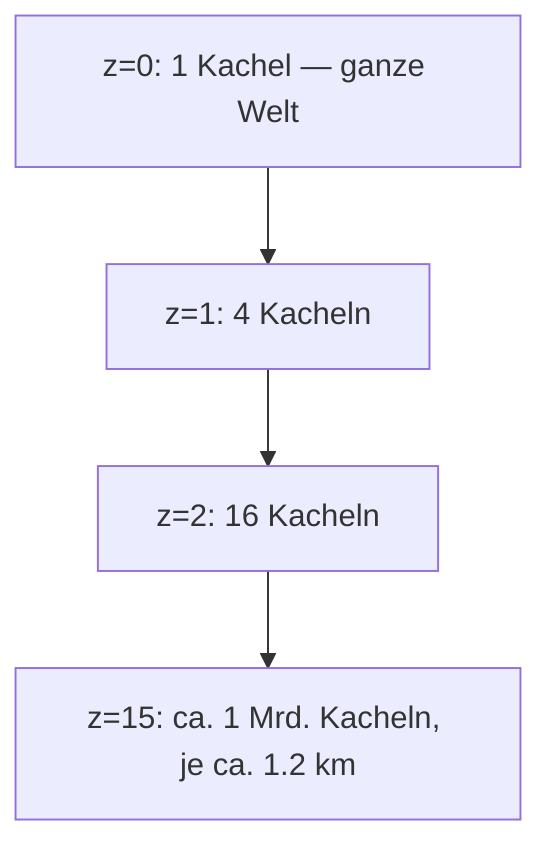

# 4. Kacheln (Tiles): Pagination für die Welt

[← Grundlagen](README.md)

**Problem:** Der Datenbestand ist um Grössenordnungen grösser als jeder Client und jeder Request.

**Analogie:** Pagination plus HTTP-Caching. Eine Kachel ist eine „Seite" mit einer räumlichen statt einer numerischen Seitenzahl — und damit cachebar, vorladbar und offline haltbar.

## Das XYZ-Schema

Die Welt wird rekursiv geviertelt. Jede Zoomstufe `z` hat `2^z × 2^z` Kacheln, adressiert über `/{z}/{x}/{y}`.

| Zoom | Kachelkante am Äquator | Typischer Inhalt |
|---|---|---|
| 10 | ≈ 39 km | Region |
| 14 | ≈ 2.4 km | Stadtteil |
| 15 | ≈ 1.2 km | Quartier |
| 18 | ≈ 150 m | Einzelne Häuserzeile |

Nur Kacheln, die gerade sichtbar oder relevant sind, werden geladen. Das ist die gesamte Idee.

## Raster vs. Vektor

| Typ | Inhalt | Grösse | Eignung |
|---|---|---|---|
| Raster-Tile | Fertiges PNG/JPEG-Bild | 20–100 KB | 2D-Karte, kein Zugriff auf Objekte |
| Vektor-Tile (MVT) | Geometrien + Attribute (Protobuf) | 10–200 KB | Styling clientseitig, Objekte adressierbar |
| Eigenes Binärformat | Nur was das Spiel braucht | Kleiner | 3D-Extrusion mit Entity-IDs |

Für dieses Spiel sind Gebäude **Spielobjekte** mit Besitzer und Trefferpunkten, nicht Bildpixel. Deshalb Vektor bzw. eigenes Format — ein Bild lässt sich nicht erobern.

## Auslieferung

| Variante | Prinzip | Kosten |
|---|---|---|
| Tile-Server | Dienst rendert/liefert pro Request | Rechenzeit, Betrieb |
| Verzeichnis statischer Dateien | Objektspeicher + CDN | Speicher + Egress |
| PMTiles | **Eine** Datei, Client holt Byte-Bereiche per HTTP-Range | Am günstigsten, kein Server |
| MBTiles | SQLite-Datei | Gut für Build/Offline, nicht fürs Web |

Kacheln sind unveränderlich. Ändert sich der Datenstand, ändert sich die Version im Pfad (`/v/{dataVersion}/{z}/{x}/{y}`) — dadurch darf der Cache unbegrenzt behalten und es gibt nie halb aktualisierte Ansichten. Identisches Muster wie Content-Hashing bei JS-Bundles.

**Fallstricke**

| Fehler | Folge |
|---|---|
| Kacheln dynamisch pro Request rendern | Serverlast und Kosten skalieren mit Spielern |
| Zu hohe Zoomstufe vorgenerieren | Kachelzahl vervierfacht sich pro Stufe |
| Objekte an Kachelgrenzen doppelt zählen | Gebäude erscheint zweimal oder gar nicht |
| Cache-Busting per Query-Parameter | Manche CDNs cachen dann gar nicht |

**Im Projekt:** → [Architecture § Two Delivery Planes](../architecture/README.md#two-delivery-planes) und [§ Chosen: Custom Tile Pipeline](../architecture/map-data.md#chosen-custom-tile-pipeline).

---
