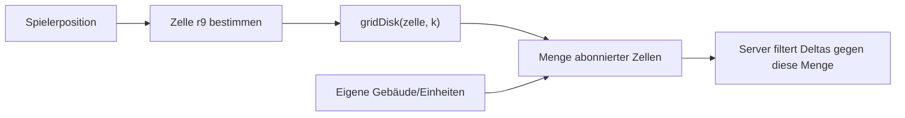

# 5. Räumliche Indizes

[← Grundlagen](README.md)

**Problem:** „Alles im Umkreis von 300 m" ist mit einem normalen Datenbankindex nicht effizient beantwortbar.

**Analogie:** Ein B-Tree sortiert eindimensional. Zwei Achsen brauchen entweder einen Baum über Rechtecke (R-Tree) oder eine Abbildung der Fläche auf **eine** sortierbare ID (Geohash, S2, H3).

## Die zwei Familien

| Familie | Beispiele | Prinzip | Stärke |
|---|---|---|---|
| Baum über Bounding Boxes | R-Tree, PostGIS GiST | Verschachtelte Rechtecke | Exakte Geometrieabfragen |
| Diskretes Zellraster | Geohash, S2, H3 | Fläche → ID | Schlüssel für Cache, Shard, Pub/Sub-Topic |

Beides wird genutzt: der Baum in der Datenbank, das Zellraster im Laufzeitsystem.

## Warum H3

| System | Zellform | Eigenschaft |
|---|---|---|
| Geohash | Rechteck | String-Präfix = Enthaltensein; Zellen werden Richtung Pol schmal |
| S2 | Quadrat (Würfelprojektion) | Sehr gleichmässige Fläche, Hilbert-Kurve |
| **H3** | **Sechseck** | Alle Nachbarn gleich weit entfernt; `gridDisk(zelle, k)` liefert den Umkreis direkt |

Sechsecke haben genau 6 Nachbarn in gleichem Abstand — bei Quadraten sind die vier diagonalen Nachbarn 1.41× weiter weg. Für „was ist in meiner Nähe" ist das der praktische Unterschied.

| H3-Auflösung | Mittlere Fläche | Kantenlänge | Rolle im Projekt |
|---|---|---|---|
| r7 | ≈ 5.2 km² | ≈ 1.2 km | — |
| **r8** | **≈ 0.74 km²** | **≈ 460 m** | Simulationsregion (Shard-Einheit) |
| **r9** | **≈ 0.10 km²** | **≈ 174 m** | Subscription-Zelle (Sichtbarkeit) |
| r10 | ≈ 0.015 km² | ≈ 65 m | — |

`k` ist der Ring-Radius: `k=1` → 7 Zellen, `k=2` → 19, `k=3` → 37.

**Fallstricke**

| Fehler | Folge |
|---|---|
| Zellauflösung zu fein | Sehr viele Subscriptions, hoher Verwaltungsaufwand |
| Zellauflösung zu grob | Client bekommt Daten, die er nie sieht |
| Zelle als exakter Radius interpretiert | Zellen sind Vorfilter — die genaue Distanzprüfung kommt danach |
| Keine Hysterese beim Zellwechsel | Ständiges Ab-/Anmelden an der Grenze |

**Im Projekt:** → [Architecture § Spatial Index](../architecture/streaming.md#spatial-index) und [§ Subscription Set](../architecture/streaming.md#subscription-set).

---
