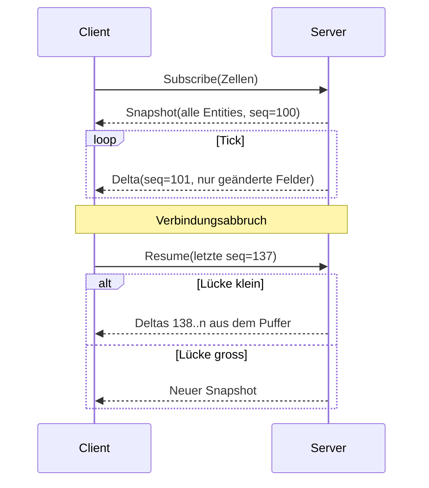

# 7. Streaming und Interest Management

[← Grundlagen](README.md)

**Problem:** Der Spielzustand ändert sich laufend, ist weltweit riesig, und jeder Client darf nur einen winzigen Ausschnitt sehen — aus Bandbreiten- **und** Cheat-Gründen.

**Analogie:** Pub/Sub mit dynamischen Topics. Die Zelle ist das Topic, die Position des Spielers bestimmt das Abo. Dazu Change Data Capture: einmal ein voller Snapshot, danach nur noch Änderungen.

## Snapshot + Delta

| Begriff | Bedeutung |
|---|---|
| Snapshot | Vollständiger Zustand eines Ausschnitts |
| Delta | Nur die geänderten Felder, mit laufender Sequenznummer |
| Sequenznummer | Erkennt Lücken; wie eine Offset-Position in einem Log |
| Interpolation | Client zeichnet Zwischenschritte, statt zu springen |
| Interest Area | Ausschnitt, den ein Client abonniert |

Der Client rekonstruiert nie Simulationszustand, den er verpasst hat. Bei einer zu grossen Lücke wird verworfen und neu geladen — das ist billiger und sicherer als Abgleichlogik.

## Warum kein Polling

| Ansatz | Problem |
|---|---|
| REST-Polling alle 2 s | Immer Volllast, auch wenn nichts passiert; Latenz = Intervall |
| Long Polling | Verbindungsaufbau pro Ereignis |
| **WebSocket + Deltas** | Eine Verbindung, Bytes nur bei Änderung |
| UDP | Nötig bei Twitch-Gameplay; hier nicht — Kampf läuft mit 2–4 Hz automatisch ab |

Grössenordnung: ein Zustands-Delta ist 8–24 Byte. Bewegung wird nicht pro Tick übertragen (siehe unten), darum bleibt aktiver Kampf mit ~30 sichtbaren Objekten unter **1 KB/s**; ohne Kampf deutlich unter 100 B/s. Schätzwerte.

## Bewegung übertragen: Positionsstrom vs. Route + Fortschritt

**Problem:** Eine Einheit läuft zwanzig Minuten durch die Stadt. Ihre Position ändert sich in jedem Tick — ihre *Absicht* nicht.

**Analogie:** Ein Fahrplan statt eines GPS-Livetickers. Wer Abfahrtszeit, Strecke und Tempo kennt, kann jede Zwischenposition selbst ausrechnen und braucht keine Meldung pro Minute.

| Ansatz | Was über die Leitung geht | Kosten pro bewegter Einheit |
|---|---|---|
| Positionsstrom | Koordinaten in jedem Tick | Dauerhaft Bytes, solange sie läuft |
| **Route + Fortschritt** | Einmal Polylinie, Tempo, Startzeit; danach nur Korrekturen | Einmalig, danach fast nichts |

- Der Client rechnet `Position = Route(Tempo × verstrichene Zeit)` selbst — gegen die **Serveruhr**, nicht die eigene.
- Ein gelegentlicher `progress`-Abgleich fängt Abweichungen ab (z. B. weil der Server die Einheit angehalten hat).
- Das ist **keine** Prediction: der Client rät nichts, er wertet eine Kurve aus, die der Server bereits festgelegt hat.

| Eigenschaft | Positionsstrom | Route + Fortschritt |
|---|---|---|
| Ruckeln bei niedriger Tickrate | Sichtbar | Nicht sichtbar |
| Kurzer Netzausbruch | Objekt friert ein | Objekt läuft korrekt weiter |
| Serverkosten | Jeder Mover pro Tick serialisiert | Nur bei Zustandswechsel |
| Preis | — | Der Client kennt den geplanten Weg vorab |

## Ereignis-Objekte: Ground Drops

**Problem:** Beute soll nicht direkt gutgeschrieben werden, sondern als Objekt auf der Karte liegen, bis jemand sie aufhebt.

**Analogie:** Ein Paket, das vor der Tür abgelegt wird. Es hat eine Position und einen Inhalt, existiert nur bis zur Abholung — und die Übergabe quittiert der Zusteller, nicht der Empfänger.

| Eigenschaft | Bedeutung |
|---|---|
| Ground Drop (Loot Drop) | Kurzlebiges Objekt auf der Karte mit Inhalt (z. B. Währung, Ausrüstung) |
| Lebenszyklus | Spawn → Aufheben oder Ablauf → entfernt |
| Streaming | Wie jedes Ereignis-Objekt: einmal beim Spawn senden, einmal beim Entfernen |
| Inhalt | Wird beim Spawn serverseitig ausgewürfelt, nicht beim Aufheben im Client |

**Fallstricke**

| Fehler | Folge |
|---|---|
| Aufheben per Client-Meldung „habe eingesammelt" | Einsammeln aus beliebiger Entfernung |
| Inhalt erst im Client bestimmen | Manipulierbare Beute |
| Kein Ablauf | Karte füllt sich mit liegengebliebenen Objekten |
| Zwei Spieler heben gleichzeitig auf | Doppelte Gutschrift ohne serverseitige Sperre |

## Sichtbarkeit ist nicht dasselbe wie Interest

Zwei Filter, die oft verwechselt werden:

| Filter | Frage | Motiv |
|---|---|---|
| Interest / Subscription | Welcher Weltausschnitt ist für diesen Client überhaupt relevant? | Bandbreite, Serverlast |
| Sichtbarkeit (**Fog of War**) | Was davon darf dieser Spieler wissen? | Spielregel |

- Interest ist eine technische Grenze, Fog of War eine Design-Entscheidung — sie fallen selten zusammen.
- Unter Fog of War bleibt die statische Karte (Gebäude, Strassen) sichtbar; ausgeblendet werden nur Live-Objekte und Zustände wie Besitzer.
- Beide müssen **serverseitig** greifen. Wer ungesehene Objekte mitschickt und den Client ausblenden lässt, hat die Regel nicht implementiert, sondern nur versteckt (Maphack-Klassiker).

**Fallstricke**

| Fehler | Folge |
|---|---|
| Alles an alle senden und im Client filtern | Bandbreite und offener Cheat-Vektor |
| Kein Rückstau-Schutz (Backpressure) | Langsame Clients füllen Serverpuffer |
| Zustand nach Reconnect „nachrechnen" | Divergenz, schwer reproduzierbare Fehler |
| Zeitstempel vom Client | Manipulierbar; immer Serveruhr |
| Unsichtbares mitsenden und im Client ausblenden | Maphack per Paketmitschnitt, ganz ohne Code-Eingriff |
| Bewegung als Positionsstrom bei niedriger Tickrate | Ruckeln, hohe Dauerlast — beides vermeidbar |
| Client-Uhr für die Routenauswertung | Zeitmanipulation beschleunigt Einheiten |

**Im Projekt:** → [Architecture § Streaming & Interest Management](../architecture/streaming.md#streaming--interest-management), [§ Entity Streaming](../architecture/streaming.md#entity-streaming), [§ Reconnect & Offline](../architecture/streaming.md#reconnect--offline). Was statisch in der Kachel liegt und was über den Socket kommt: [§ Tile Payload](../architecture/map-data.md#tile-payload). Die Sichtbarkeitsregel selbst steht in [Game Design § Visibility](../design/presentation.md#visibility).

---
