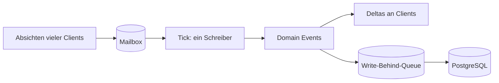

# 8. Autoritativer Server und Tick

[← Grundlagen](README.md)

**Problem:** In einer Business-App darf der Client sagen „Bestellung angelegt". In einem Spiel darf er das nie.

**Analogie:** Command/Event statt CRUD. Der Client sendet **Absichten** („ich will erobern"), der Server entscheidet und verkündet das Ergebnis. Validierung ist nicht Komfort, sondern das Sicherheitsmodell.

| Aspekt | Business-Backend | Game-Server hier |
|---|---|---|
| Client-Eingabe | Daten | Absichtserklärung |
| Zeitmodell | Request-getrieben | Tick-getrieben + ereignisgesteuert |
| Zustand | In der Datenbank | Im Speicher, periodisch persistiert |
| Konsistenz | Transaktion pro Request | Ein Schreiber pro Region, sequenziell |
| Skalierung | Stateless-Instanzen | Zustandsbehaftete Regionen, nach Zelle geshardet |
| Ausfall | Retry | Snapshot + Journal, Region wird neu geladen |

## Tick

Ein Tick ist ein Simulationsschritt in festem Takt: Bewegungen fortschreiben, Reichweiten prüfen, Schaden anwenden, Änderungen sammeln, Deltas versenden.

| Frequenz | Einsatz |
|---|---|
| 60 Hz | Shooter |
| **2–4 Hz** | **Dieses Spiel** — Auto-Kampf, kein Zielen |
| 1/60 Hz | Punkte-Akkumulation |
| Ereignisgesteuert | Eroberung, Bau, Crafting |

## Region Actors und schlafende Regionen

Eine Region (H3 r8) wird von genau einem Akteur simuliert — ein Schreiber, keine Sperren, deterministische Reihenfolge. Eine Region ohne Spieler **schläft**.

| Zustand | Tick | Was trotzdem passiert |
|---|---|---|
| Live | 2–4 Hz | Alles |
| Schlafend | Keiner | Punkte werden beim Aufwachen per Formel nachgerechnet; geplante Ereignisse liegen in einer Timer-Queue |

Die **Timer-Queue** ist eine Tabelle fälliger Ereignisse (Zeitpunkt, Region, Nutzlast) in PostgreSQL — wie geplante Jobs in einer Job-Tabelle — mit einer In-Memory-Kopie pro Knoten für den schnellen Zugriff. Sie ist dauerhaft, weil eine verlorene Dämonenwelle oder ein vergessener Ablauf eines Drops für den Spieler wie ein Bug aussieht.

Das ist der zentrale Kostenhebel: `Punkte = Rate × verstrichene Zeit` braucht keinen Tick. Nur wo ein Angreifer ist, muss simuliert werden — und ein Angreifer ist entweder ein Spieler (also ist die Region ohnehin wach) oder eine geplante Dämonenwelle (weckt die Region per Timer).

> Rechenkosten skalieren mit **aktiven Spielern**, nicht mit der Grösse der Welt. Genau das macht fünf Spieler für wenige Euro im Monat möglich.

## Mailbox und Write-Behind

**Problem:** Viele Verbindungen schicken gleichzeitig Absichten an dieselbe Region, aber nur ein Schreiber darf den Zustand ändern — und die Datenbank darf den Tick nicht bremsen.

**Analogie:** Eine Message-Queue mit genau einem Consumer pro Aggregat (z. B. pro Auftrag). Reihenfolge ist garantiert, Sperren sind unnötig. Datenbank-Schreibzugriffe laufen wie ein Outbox-Worker im Hintergrund.

| Begriff | Bedeutung | Business-Gegenstück |
|---|---|---|
| Actor | Objekt mit privatem Zustand, das nur über Nachrichten angesprochen wird | Aggregat mit eigener Queue |
| Mailbox | Eingangs-Queue eines Actors; wird sequenziell abgearbeitet | Queue mit einem Consumer |
| `Channel<T>` | .NET-Queue im Arbeitsspeicher (`System.Threading.Channels`), begrenzt oder unbegrenzt | In-Memory-Queue |
| System | Zustandslose Funktion, die pro Tick einen Aspekt fortschreibt (Bewegung, Kampf, …) | Verarbeitungsschritt einer Pipeline |
| Domain Event | Fachliches Ereignis („Gebäude erobert"), aus dem Deltas, Journal und Telemetrie entstehen | Domain Event / Outbox-Eintrag |
| Write-Behind | Änderungen erst im Speicher, dann gebündelt und asynchron in die Datenbank | Outbox-Worker, Batch-Insert |
| Journal | Fortlaufende Liste der Änderungen seit dem letzten Snapshot | Event Log / WAL |
| Orleans | Actor-Framework von Microsoft; Actors werden bei Bedarf automatisch aktiviert | Managed Actor-Runtime |

**Fallstricke**

| Fehler | Folge |
|---|---|
| `await` auf die Datenbank mitten im Tick | Tick wartet auf I/O; alle Spieler der Region ruckeln |
| Unbegrenzte Mailbox | Bei Last wächst der Speicher, bis der Prozess stirbt |
| Zustand einer Region aus einem anderen Thread lesen | Race Conditions, die nur unter Last auftreten |
| Write-Behind für Beute und Währung | Absturz nach Mitteilung an den Client → Gegenstand verloren oder doppelt; solche Änderungen zuerst dauerhaft schreiben |
| `DateTime.UtcNow` direkt in der Simulation | Nicht testbar; Uhr injizieren |
| Timer nur im Arbeitsspeicher | Nach einem Deploy fehlen Wellen, Eskalationen und Ablaufzeiten — die Region vergisst ihre Zukunft |

**Im Projekt:** → [Architecture § Region Actors](../architecture/backend.md#region-actors) und [§ Cost Model](../architecture/scaling.md#cost-model). Code-Muster: [§ Region Actor](../architecture/code-patterns.md#region-actor), [§ Persistence](../architecture/code-patterns.md#persistence).

---
