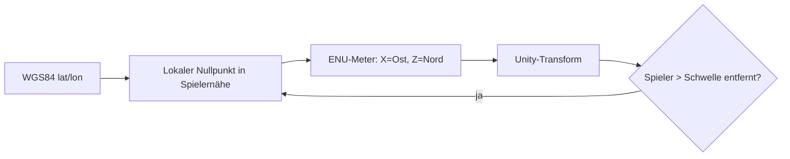

# 9. Rendering im Unity-Client

[← Grundlagen](README.md)

**Problem:** Reale Koordinaten sind zu gross für die Zahlengenauigkeit einer Spiel-Engine, und Tausende Gebäude sind zu viele Einzelobjekte.

## Floating Origin

Unity rechnet Positionen in `float32` (≈ 7 signifikante Stellen).

| Abstand vom Nullpunkt | Auflösung |
|---|---|
| 1 km | ≈ 0.06 mm |
| 100 km | ≈ 6 mm |
| 10 000 km | ≈ 0.6 m — sichtbares Zittern |

Weltkoordinaten direkt zu verwenden ist deshalb nicht möglich. Lösung: ein lokaler Nullpunkt in Spielernähe; alles wird relativ dazu in Metern gerendert (**ENU** — East/North/Up). Entfernt sich der Spieler zu weit, wird der Nullpunkt verschoben und die Szene versetzt.

## Darstellungskosten

| Begriff | Bedeutung | Faustregel |
|---|---|---|
| Draw Call | Ein Zeichenbefehl an die GPU | Auf Mobilgeräten wenige hundert pro Bild |
| GPU Instancing | Gleiches Mesh vielfach mit einem Call | Pflicht bei Gebäudemassen |
| LOD | Weniger Details in der Distanz | Ferne Gebäude als Blöcke |
| Culling | Nicht Sichtbares gar nicht zeichnen | Vor allem sonst nichts hilft |
| Extrusion | Grundriss-Polygon × Höhe → Körper | Erzeugt unsere Gebäude-Meshes |
| Triangulierung (Earcut) | Polygon in Dreiecke zerlegen — GPUs zeichnen nur Dreiecke | Nötig für Dach und Boden jedes Grundrisses; im Hintergrund-Thread |

## Kartenansicht statt Kamera-AR

Das Projekt rendert **eine** Ansicht: eine 3D-Karte mit dem eigenen Avatar darauf (Pokémon-GO-Prinzip). Keine Kamera-AR.

**Analogie:** Eine Navigations-App — bewegter Positionsmarker auf einer Karte, Kamera fest über der eigenen Figur. Kein Kamerabild, keine Weltverankerung.

| Kameraeigenschaft | Bedeutung |
|---|---|
| Follow-Kamera | Kamera hängt starr am Avatar und folgt ihm; der Spieler steuert nur Drehung, Neigung, Zoom |
| Neigung (Pitch) | Schräge Draufsicht — erzeugt räumlichen Eindruck, hält aber die Übersicht |
| Zoom | Bestimmt sichtbare Fläche und damit LOD-Stufe und Objektzahl pro Bild |
| Free Pan | Kurzzeitiges Wegschieben der Karte; die Abo-Region folgt weiterhin dem GPS, nicht der Kamera |

Was mit Kamera-AR wegfällt (und warum das den Client vereinfacht):

| AR-Problem | Entfällt, weil |
|---|---|
| Kamerapose relativ zum Session-Start, nicht zur Erde | Es gibt keine Kamerapose — die Karte ist georeferenziert |
| Kompass-/Ausrichtungsfehler versetzen Objekte sichtbar | Objekte stehen auf Kartenkoordinaten |
| Kamera und Tracking sind energieintensiv | Nur GPS mit 0.2–1 Hz plus Rendering |
| Zweite Kamera, zweites Eingabemodell | Ein Renderer, eine Kamera, ein Input-Modell |

## Warum Low-Poly eine Kostenentscheidung ist

Der Kunststil des Projekts ist stilisiertes Low-Poly (*League of Legends* als Referenz). Das ist nicht nur Geschmack — es bestimmt, wie viele Objekte ein Mobilgerät gleichzeitig darstellen kann.

**Analogie:** Wie die Wahl eines schlanken Payloads für eine Liste mit 10 000 Zeilen — nicht der Server ist das Limit, sondern das Budget pro Zeile.

| Begriff | Bedeutung | Wirkung |
|---|---|---|
| Polycount / Triangle Budget | Dreiecke pro Modell | Bestimmt die Vertex-Kosten pro Bild |
| Texture Atlas | Viele Texturen in einer Datei | Gleiches Material → Batching und Instancing greifen überhaupt erst |
| Baked Lighting | Licht und Schattierung in die Textur gerechnet | Spart Echtzeitlichter, die auf Mobilgeräten teuer sind |
| Material Property Block | Pro-Instanz-Parameter (z. B. Fraktionsfarbe) ohne neues Material | Umfärben bricht das Batching nicht |
| Silhouette | Umriss eines Objekts | Bei schräger Draufsicht das verlässlichste Erkennungsmerkmal |

**Fallstricke**

| Fehler | Folge |
|---|---|
| Pro Gebäudetyp ein eigenes Material | Instancing greift nicht, Draw Calls explodieren |
| Fraktionsfarbe über Materialkopien lösen | Jede Eroberung erzeugt ein neues Material |
| Detail investieren, das die Kameradistanz nie zeigt | Kosten ohne sichtbaren Nutzen |
| Fotorealistischer Anspruch auf approximierten Geodaten | Geschätzte Höhen und grobe Grundrisse fallen sofort auf |
| Echtzeitschatten für alle Objekte | Sprengt auf Mobilgeräten als Erstes das Frame-Budget |

## Avatar: GPS in Bewegung übersetzen

**Problem:** GPS liefert alle paar Sekunden einen springenden Punkt, die Darstellung braucht 30 Bilder pro Sekunde ohne Zittern.

**Analogie:** Ein Messwert-Chart, das aus wenigen, verrauschten Samples eine ruhige Linie zeichnet — geglättet und zwischen den Stützstellen interpoliert.

| Begriff | Bedeutung |
|---|---|
| Glättung (Low-Pass, Kalman-Filter) | Rechnet aus verrauschten Messungen einen ruhigen Verlauf; der Kalman-Filter gewichtet dabei die gemeldete Genauigkeit |
| Interpolation | Zwischenpositionen zwischen zwei Fixes, damit die Figur läuft statt springt |
| Dead Reckoning | Fortschreiben der Position aus letzter Position, Richtung und Tempo, wenn kein neuer Fix kommt |
| Heading / Course over Ground | Blickrichtung der Figur; aus der Bewegungsrichtung zweier Fixes, nicht aus dem Kompass |
| Floating Origin | Verschieben des lokalen Nullpunkts, wenn sich der Spieler zu weit davon entfernt (siehe oben) |

**Fallstricke**

| Fehler | Folge |
|---|---|
| Rohe Fixes direkt auf den Avatar legen | Figur springt und zittert im Stand |
| Zu starke Glättung | Avatar „klebt" hinter der realen Position, Radiusaktionen fühlen sich verzögert an |
| Kompass als Blickrichtung beim Gehen | Richtung dreht sich, weil das Gerät in der Hand kippt |
| Geglättete Client-Position für Spielregeln verwenden | Regeln laufen auf einer erfundenen Position — serverseitiger Fix ist die Wahrheit |
| Dead Reckoning ohne Abbruch | Die Figur läuft bei GPS-Ausfall ins Nichts weiter |

**Im Projekt:** → [Architecture § Client Presentation](../architecture/client.md#client-presentation), [Architecture § Chosen: Custom Tile Pipeline](../architecture/map-data.md#chosen-custom-tile-pipeline). Die Darstellung ist Präsentation; jede Präsenzregel rechnet gegen den Server-Fix (Kapitel 2).

---
