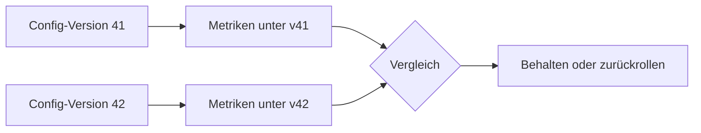

# 12. Live-Konfiguration und Spielmetriken

[← Grundlagen](README.md)

**Problem:** Ob ein Spiel fair und spannend ist, hängt an Zahlen — Radien, Raten, Obergrenzen. Die richtigen Werte kennt vorab niemand. Sie müssen im laufenden Betrieb geändert und ihre Wirkung gemessen werden, ohne neuen App-Release.

**Analogie:** Feature Flags bzw. Remote Config plus BI-Dashboard. Ein Produktteam schaltet eine Preisregel um und prüft im Reporting, ob der Umsatz steigt. Hier ist die „Preisregel" ein Eroberungsradius und der „Umsatz" eine Spielmetrik.

## Balancing

| Begriff | Bedeutung |
|---|---|
| Balancing | Abstimmen der Spielwerte, bis keine Strategie, Fraktion oder Region klar überlegen ist |
| Balance-Parameter | Einzelner einstellbarer Wert (z. B. Radius, Punkterate) |
| Config-Version | Unveränderlicher, vollständiger Satz aller Parameter; Änderung = neue Version |
| Hot Reload | Server übernimmt eine neue Version im Betrieb, ohne Neustart |

- Werte gehören in die Konfiguration, **Regeln** in den Code. „Türme schützen das Gebäude" ist Code; „wie viele Türme" ist Konfiguration.
- In einem Spiel mit Tick wechselt der Server die Version an einer Tick-Grenze — sonst rechnet ein Kampf halb mit alten, halb mit neuen Werten.

## Zwei Arten von Messdaten

| Art | Business-Gegenstück | Beispiel | Werkzeug |
|---|---|---|---|
| Aggregierte Metrik | APM-Kennzahl (Requests/s, Latenz) | Eroberungen pro Minute | **Prometheus** |
| Telemetrie-Event | Zeile im Data Warehouse / Audit-Log | „Eroberung abgelehnt, Distanz 17 m, GPS-Genauigkeit 12 m" | Postgres, später **ClickHouse** |

| Werkzeug | Was es ist |
|---|---|
| Prometheus | Zeitreihen-Datenbank: speichert Zahlenwerte über die Zeit, pro Kombination von Labels |
| Grafana | Dashboard-Werkzeug; liest Prometheus, SQL-Datenbanken und andere Quellen |
| ClickHouse | Spaltenorientierte Datenbank für schnelle Auswertungen über sehr viele Event-Zeilen |
| Annotation | Markierung in einem Grafana-Diagramm, z. B. „Config-Version 42 aktiv" |

**Kardinalität:** Prometheus legt pro Label-Kombination eine eigene Zeitreihe an. Ein Label `playerId` erzeugt eine Zeitreihe pro Spieler — Speicher und Abfragen explodieren. Einzelne Spieler oder Objekte gehören in Events, nicht in Metrik-Labels.

## Wirkung messen

- Jedes Event trägt die Config-Version. Ausgewertet wird **nach Version**, nicht nur nach Datum.
- Vorher/Nachher-Vergleich ist die einfachste Methode; ein echter A/B-Test braucht zwei Gruppen gleichzeitig (z. B. zwei Regionen) und genug Spieler.
- Bei wenigen Spielern schwanken Metriken stark — Ergebnisse als Tendenz lesen (Schätzung, keine Statistik).

**Fallstricke**

| Fehler | Folge |
|---|---|
| Spielwerte als Konstanten im Code | Jede Balance-Änderung braucht Build, Deploy, evtl. App-Store-Review |
| Config-Werte im Client prüfen | Manipulierbar; der Server entscheidet immer mit seiner Version |
| Version mitten im Tick wechseln | Inkonsistente Kampfergebnisse |
| Config in-place überschreiben | Kein Rollback, kein Nachweis, welche Werte galten |
| Spieler-ID als Prometheus-Label | Kardinalitäts-Explosion |
| Telemetrie synchron im Tick schreiben | Datenbank-Latenz bremst die Simulation |
| GPS-Rohpositionen in Events | Bewegungsprofile echter Personen; Datenschutzproblem |
| Events ohne Config-Version | Wirkung einer Änderung nicht zuordenbar |

**Im Projekt:** → [Architecture § Game Config & Metrics](../architecture/live-ops.md#game-config--metrics). Welche Werte konfigurierbar sind und welche Metriken sie bewerten: [Game Design § Balance Parameters](../design/balance.md#balance-parameters).
