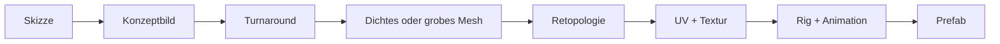

# 14. 3D-Assets: von der Skizze zum Prefab

[← Grundlagen](README.md)

**Problem:** Eine Einheit im Spiel ist kein Bild, sondern ein 3D-Modell mit Geometrie, Textur, Skelett und Animationen — und muss auf einem Mobilgerät hundertfach gleichzeitig darstellbar sein. KI-Werkzeuge liefern schnell Entwürfe, aber selten direkt verwendbare Modelle.

**Analogie:** Figma-Mockup → Frontend-Komponente. Ein Mockup (Konzeptbild) zeigt, wie es aussehen soll; die Komponente (Modell) muss Performance-Budget, Namenskonventionen und Build-Prüfungen erfüllen. KI-generierter Code ist ein Entwurf, der Review braucht — KI-generierte Modelle genauso.

## Vom Bild zum Modell

| Begriff | Bedeutung | Business-Gegenstück |
|---|---|---|
| Konzeptbild (Concept Art) | Gemaltes Zielbild eines Objekts | Design-Mockup |
| Turnaround Sheet | Dasselbe Objekt von vorne, seitlich, hinten, ohne Perspektive | Technische Zeichnung / Spezifikation |
| Image-to-3D | KI erzeugt aus einem Bild ein 3D-Modell | Code-Generator aus Mockup |
| Blender | Freie 3D-Software für Modellierung, Texturierung, Animation; per Python steuerbar | IDE für 3D |
| MCP (Model Context Protocol) | Offenes Protokoll, über das ein KI-Assistent Werkzeuge aufruft | Plugin-API für den Assistenten |
| Blender MCP | MCP-Server, über den Claude Blender fernsteuert (Objekte erzeugen, Python ausführen, exportieren) | Automatisierungs-Skript mit natürlicher Sprache als Eingabe |
| Blockout | Grobform aus einfachen Körpern, ohne Details | Wireframe |

## Aufbau eines Modells

| Begriff | Bedeutung | Business-Gegenstück |
|---|---|---|
| Mesh | Oberfläche aus Punkten (Vertices) und Dreiecken | Datenstruktur des Objekts |
| Topologie | Wie die Dreiecke/Vierecke angeordnet sind; saubere Topologie verformt sich gut und spart Dreiecke | Code-Struktur — funktioniert auch unsauber, ist dann aber teuer zu ändern |
| Retopologie | Neues, schlankes Mesh über ein dichtes legen | Refactoring von generiertem Code |
| Decimate | Dreiecke automatisch reduzieren | Minifier — schnell, aber hässliches Ergebnis |
| UV-Mapping | Abwicklung der 3D-Oberfläche auf eine 2D-Textur | Schnittmuster |
| Texture Baking | Details, Licht und Schatten eines dichten Modells in die Textur des schlanken rechnen | Vorberechneter Cache |
| Rig / Skelett | Knochenhierarchie, die das Mesh bewegt | — |
| Skinning / Weight Painting | Welcher Knochen welchen Vertex wie stark bewegt | — |
| Animation Clip | Benannte Bewegungsfolge (gehen, angreifen) | — |
| Root Motion | Animation verschiebt das Objekt selbst — hier aus, weil die Bewegung vom Server-Routenmodell kommt | — |
| Pivot | Bezugspunkt des Modells für Position und Drehung | Ursprung eines Koordinatensystems |
| FBX / glTF | Austauschformate für Modelle inkl. Skelett und Animation | Dateiformat für Datenaustausch |
| Prefab | Fertig konfiguriertes Objekt im Unity-Projekt | Wiederverwendbare Komponente |
| Git LFS | Git-Erweiterung, die grosse Binärdateien ausserhalb der normalen Historie speichert | Artefakt-Repository |

## Was KI hier kann und was nicht

| Schritt | KI-Tauglichkeit (Einschätzung) |
|---|---|
| Skizze → Konzeptbild | Hoch — Stil, Farbe, Varianten in Minuten |
| Konzept → Turnaround | Mittel — Proportionen zwischen Ansichten weichen oft ab |
| Image-to-3D | Mittel — Form gut, Topologie und Textur für Mobilgeräte unbrauchbar ohne Nacharbeit |
| Einfache harte Formen per Blender MCP | Mittel bis hoch — Türme, Kisten, Tore aus Grundkörpern |
| Retopologie, UV, Handbemalung | Niedrig — automatisierbar nur grob |
| Rigging, Animation | Niedrig — weitgehend Handarbeit |

**Fallstricke**

| Fehler | Folge |
|---|---|
| Image-to-3D-Ergebnis direkt ins Spiel | Zehntausende Dreiecke pro Einheit; Mobilgerät ruckelt ab wenigen Objekten |
| Jedes Konzept mit neuem Prompt | Kein einheitlicher Stil; Kit wirkt zusammengewürfelt |
| Konzept nur in Nahansicht beurteilen | Silhouette aus der schrägen Spielkamera unlesbar |
| Generierte Texturen unverändert übernehmen | Eingebackenes Licht und Perspektive passen nicht zum Atlas |
| Eigene Textur und eigenes Material pro Asset | Instancing greift nicht (Kapitel 9) |
| Pivot in der Modellmitte statt am Boden | Objekte schweben oder versinken |
| Lizenz des KI-Dienstes nicht geprüft | Ausgaben evtl. nicht kommerziell nutzbar oder regional ausgeschlossen |
| `.blend`- und Bilddateien ohne Git LFS | Repository wird in kurzer Zeit gigabytegross |
| KI Python in Blender ausführen lassen, ohne vorher zu speichern | Szene beschädigt, Arbeit verloren |

**Im Projekt:** → [Architecture § Asset Pipeline](../architecture/asset-pipeline.md#asset-pipeline). Kunststil und Lesbarkeitsregeln: [Game Design § Art Direction](../design/presentation.md#art-direction). Warum Dreiecke und Materialien zählen: Kapitel [9](09-rendering.md#warum-low-poly-eine-kostenentscheidung-ist).

---
